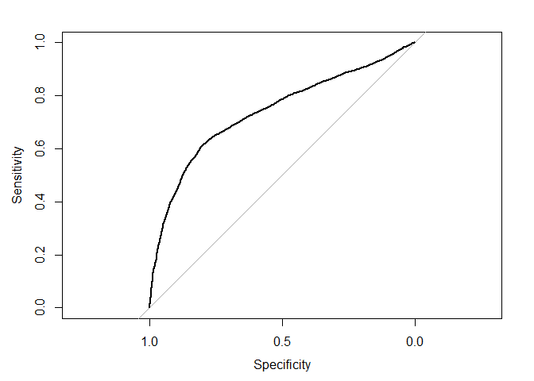

Untitled
================

# Objetivo

Para esta ayudantia tendran que realizar el metodo de analisis bayesiano
para el data set de tarjetas de credito (dentro del bloc de notas podran
encontrar el link que la explicacion de las variables del data set). El
objetivo para ese data set es determinar si la persona fallara o no en
el pago de su credito a partir de las variables del dataset

# Importar Librerías

``` r
library(tidyverse)
library(e1071)
library(caret)
library(rstan)
library(rstanarm)
library(pROC)
library(ROCR)
```

# Cargar Datos

``` r
setwd("C:/Users/Felipe/Documents/GitHub/Entregas_mineria_de_datos/Ayudantias/Actividad Ayudantia 10")
Credit_Card <- read_csv("C:/Users/Felipe/Documents/GitHub/Entregas_mineria_de_datos/Ayudantias/Actividad Ayudantia 10/UCI_Credit_Card.csv")
```

    ## 
    ## -- Column specification --------------------------------------------------------
    ## cols(
    ##   .default = col_double()
    ## )
    ## i Use `spec()` for the full column specifications.

``` r
View(Credit_Card)
attach(Credit_Card)
```

Las variables incluidas son:

-   ID: ID of each client
-   LIMIT\_BAL: Amount of given credit in NT dollars (includes
    individual and family/supplementary credit
-   SEX: Gender (1=male, 2=female)
-   EDUCATION: (1=graduate school, 2=university, 3=high school,
    4=others, 5=unknown, 6=unknown)
-   MARRIAGE: Marital status (1=married, 2=single, 3=others)
-   AGE: Age in years
-   PAY\_0: Repayment status in September, 2005 (-1=pay duly, 1=payment
    delay for one month, 2=payment delay for two months, … 8=payment
    delay for eight months, 9=payment delay for nine - months and above)
-   PAY\_2: Repayment status in August, 2005 (scale same as above)
-   PAY\_3: Repayment status in July, 2005 (scale same as above)
-   PAY\_4: Repayment status in June, 2005 (scale same as above)
-   PAY\_5: Repayment status in May, 2005 (scale same as above)
-   PAY\_6: Repayment status in April, 2005 (scale same as above)
-   BILL\_AMT1: Amount of bill statement in September, 2005 (NT dollar)
-   BILL\_AMT2: Amount of bill statement in August, 2005 (NT dollar)
-   BILL\_AMT3: Amount of bill statement in July, 2005 (NT dollar)
-   BILL\_AMT4: Amount of bill statement in June, 2005 (NT dollar)
-   BILL\_AMT5: Amount of bill statement in May, 2005 (NT dollar)
-   BILL\_AMT6: Amount of bill statement in April, 2005 (NT dollar)
-   PAY\_AMT1: Amount of previous payment in September, 2005 (NT dollar)
-   PAY\_AMT2: Amount of previous payment in August, 2005 (NT dollar)
-   PAY\_AMT3: Amount of previous payment in July, 2005 (NT dollar)
-   PAY\_AMT4: Amount of previous payment in June, 2005 (NT dollar)
-   PAY\_AMT5: Amount of previous payment in May, 2005 (NT dollar)
-   PAY\_AMT6: Amount of previous payment in April, 2005 (NT dollar)
-   default.payment.next.month: Default payment (1=yes, 0=no)

# Limpieza de datos

## Búsqueda de datos faltantes

``` r
Credit_Card[Credit_Card == ""] <- NA
Credit_Card %>%  summarise_all(funs(sum(is.na(.))))
```

    ## Warning: `funs()` was deprecated in dplyr 0.8.0.
    ## Please use a list of either functions or lambdas: 
    ## 
    ##   # Simple named list: 
    ##   list(mean = mean, median = median)
    ## 
    ##   # Auto named with `tibble::lst()`: 
    ##   tibble::lst(mean, median)
    ## 
    ##   # Using lambdas
    ##   list(~ mean(., trim = .2), ~ median(., na.rm = TRUE))

    ## # A tibble: 1 x 25
    ##      ID LIMIT_BAL   SEX EDUCATION MARRIAGE   AGE PAY_0 PAY_2 PAY_3 PAY_4 PAY_5
    ##   <int>     <int> <int>     <int>    <int> <int> <int> <int> <int> <int> <int>
    ## 1     0         0     0         0        0     0     0     0     0     0     0
    ## # ... with 14 more variables: PAY_6 <int>, BILL_AMT1 <int>, BILL_AMT2 <int>,
    ## #   BILL_AMT3 <int>, BILL_AMT4 <int>, BILL_AMT5 <int>, BILL_AMT6 <int>,
    ## #   PAY_AMT1 <int>, PAY_AMT2 <int>, PAY_AMT3 <int>, PAY_AMT4 <int>,
    ## #   PAY_AMT5 <int>, PAY_AMT6 <int>, default.payment.next.month <int>

No hay datos faltantes.

# Modelo Batesiano

## Eliminar filas que no se van a utilizar

Pretendo eliminar todas las variables que no me ayuden a determinar si
la persona fallara o no en el pago de su credito. Variables como
Bill\_AMT1 y Pay\_AMT1 tienen magnitudes que representan la magnitud del
valor y no son variables booleanas por lo cual las borre.Voy a dejar
solo las variables que representen una decisión del tipo “pago” o “no
pago”.

``` r
Credit_Card$LIMIT_BAL = NULL

Credit_Card$BILL_AMT1 = NULL
Credit_Card$BILL_AMT2 = NULL
Credit_Card$BILL_AMT3 = NULL
Credit_Card$BILL_AMT4 = NULL
Credit_Card$BILL_AMT5 = NULL
Credit_Card$BILL_AMT6 = NULL

Credit_Card$PAY_AMT1 = NULL
Credit_Card$PAY_AMT2 = NULL
Credit_Card$PAY_AMT3 = NULL
Credit_Card$PAY_AMT4 = NULL
Credit_Card$PAY_AMT5 = NULL
Credit_Card$PAY_AMT6 = NULL
```

Antes de aplicar algun modelo de ML vamos a separar la data en conjunto
de entrenamiento y conjunto de pruebas. Primero realuizaré el modelo
basandome en lo que se vió en clases.

``` r
set.seed(42)
sample <- sample(1:nrow(Credit_Card), 8000)

trainData <- Credit_Card[sample,]
testData <- Credit_Card[-sample,]

modeloNB_clases <- naiveBayes(default.payment.next.month ~ ., data = trainData)
pred <- predict(modeloNB_clases, testData, type ="raw")

modeloNB_clases
```

    ## 
    ## Naive Bayes Classifier for Discrete Predictors
    ## 
    ## Call:
    ## naiveBayes.default(x = X, y = Y, laplace = laplace)
    ## 
    ## A-priori probabilities:
    ## Y
    ##        0        1 
    ## 0.783375 0.216625 
    ## 
    ## Conditional probabilities:
    ##    ID
    ## Y       [,1]     [,2]
    ##   0 15032.93 8682.073
    ##   1 14786.61 8700.435
    ## 
    ##    SEX
    ## Y       [,1]      [,2]
    ##   0 1.609223 0.4879635
    ##   1 1.548759 0.4977605
    ## 
    ##    EDUCATION
    ## Y       [,1]      [,2]
    ##   0 1.846817 0.8022614
    ##   1 1.882862 0.7395231
    ## 
    ##    MARRIAGE
    ## Y       [,1]      [,2]
    ##   0 1.569331 0.5246289
    ##   1 1.519908 0.5256488
    ## 
    ##    AGE
    ## Y       [,1]     [,2]
    ##   0 35.37035 8.983542
    ##   1 35.59031 9.828880
    ## 
    ##    PAY_0
    ## Y         [,1]      [,2]
    ##   0 -0.2045636 0.9514004
    ##   1  0.6601269 1.3716898
    ## 
    ##    PAY_2
    ## Y         [,1]     [,2]
    ##   0 -0.2966332 1.031700
    ##   1  0.4702827 1.505901
    ## 
    ##    PAY_3
    ## Y         [,1]     [,2]
    ##   0 -0.3041328 1.048027
    ##   1  0.4085401 1.519457
    ## 
    ##    PAY_4
    ## Y         [,1]     [,2]
    ##   0 -0.3390777 1.022135
    ##   1  0.3000577 1.523482
    ## 
    ##    PAY_5
    ## Y         [,1]      [,2]
    ##   0 -0.3890219 0.9623925
    ##   1  0.2042701 1.5131617
    ## 
    ##    PAY_6
    ## Y         [,1]      [,2]
    ##   0 -0.4049785 0.9972964
    ##   1  0.1373341 1.5142347

Ahora, se evaluará realizar lo mismo pero desde el modelo visto en
ayudantia.

``` r
CreditLinear <- stan_glm(default.payment.next.month ~ ., data = Credit_Card, family = gaussian)
```

    ## 
    ## SAMPLING FOR MODEL 'continuous' NOW (CHAIN 1).
    ## Chain 1: 
    ## Chain 1: Gradient evaluation took 0 seconds
    ## Chain 1: 1000 transitions using 10 leapfrog steps per transition would take 0 seconds.
    ## Chain 1: Adjust your expectations accordingly!
    ## Chain 1: 
    ## Chain 1: 
    ## Chain 1: Iteration:    1 / 2000 [  0%]  (Warmup)
    ## Chain 1: Iteration:  200 / 2000 [ 10%]  (Warmup)
    ## Chain 1: Iteration:  400 / 2000 [ 20%]  (Warmup)
    ## Chain 1: Iteration:  600 / 2000 [ 30%]  (Warmup)
    ## Chain 1: Iteration:  800 / 2000 [ 40%]  (Warmup)
    ## Chain 1: Iteration: 1000 / 2000 [ 50%]  (Warmup)
    ## Chain 1: Iteration: 1001 / 2000 [ 50%]  (Sampling)
    ## Chain 1: Iteration: 1200 / 2000 [ 60%]  (Sampling)
    ## Chain 1: Iteration: 1400 / 2000 [ 70%]  (Sampling)
    ## Chain 1: Iteration: 1600 / 2000 [ 80%]  (Sampling)
    ## Chain 1: Iteration: 1800 / 2000 [ 90%]  (Sampling)
    ## Chain 1: Iteration: 2000 / 2000 [100%]  (Sampling)
    ## Chain 1: 
    ## Chain 1:  Elapsed Time: 0.094 seconds (Warm-up)
    ## Chain 1:                1.767 seconds (Sampling)
    ## Chain 1:                1.861 seconds (Total)
    ## Chain 1: 
    ## 
    ## SAMPLING FOR MODEL 'continuous' NOW (CHAIN 2).
    ## Chain 2: 
    ## Chain 2: Gradient evaluation took 0 seconds
    ## Chain 2: 1000 transitions using 10 leapfrog steps per transition would take 0 seconds.
    ## Chain 2: Adjust your expectations accordingly!
    ## Chain 2: 
    ## Chain 2: 
    ## Chain 2: Iteration:    1 / 2000 [  0%]  (Warmup)
    ## Chain 2: Iteration:  200 / 2000 [ 10%]  (Warmup)
    ## Chain 2: Iteration:  400 / 2000 [ 20%]  (Warmup)
    ## Chain 2: Iteration:  600 / 2000 [ 30%]  (Warmup)
    ## Chain 2: Iteration:  800 / 2000 [ 40%]  (Warmup)
    ## Chain 2: Iteration: 1000 / 2000 [ 50%]  (Warmup)
    ## Chain 2: Iteration: 1001 / 2000 [ 50%]  (Sampling)
    ## Chain 2: Iteration: 1200 / 2000 [ 60%]  (Sampling)
    ## Chain 2: Iteration: 1400 / 2000 [ 70%]  (Sampling)
    ## Chain 2: Iteration: 1600 / 2000 [ 80%]  (Sampling)
    ## Chain 2: Iteration: 1800 / 2000 [ 90%]  (Sampling)
    ## Chain 2: Iteration: 2000 / 2000 [100%]  (Sampling)
    ## Chain 2: 
    ## Chain 2:  Elapsed Time: 0.089 seconds (Warm-up)
    ## Chain 2:                1.774 seconds (Sampling)
    ## Chain 2:                1.863 seconds (Total)
    ## Chain 2: 
    ## 
    ## SAMPLING FOR MODEL 'continuous' NOW (CHAIN 3).
    ## Chain 3: 
    ## Chain 3: Gradient evaluation took 0 seconds
    ## Chain 3: 1000 transitions using 10 leapfrog steps per transition would take 0 seconds.
    ## Chain 3: Adjust your expectations accordingly!
    ## Chain 3: 
    ## Chain 3: 
    ## Chain 3: Iteration:    1 / 2000 [  0%]  (Warmup)
    ## Chain 3: Iteration:  200 / 2000 [ 10%]  (Warmup)
    ## Chain 3: Iteration:  400 / 2000 [ 20%]  (Warmup)
    ## Chain 3: Iteration:  600 / 2000 [ 30%]  (Warmup)
    ## Chain 3: Iteration:  800 / 2000 [ 40%]  (Warmup)
    ## Chain 3: Iteration: 1000 / 2000 [ 50%]  (Warmup)
    ## Chain 3: Iteration: 1001 / 2000 [ 50%]  (Sampling)
    ## Chain 3: Iteration: 1200 / 2000 [ 60%]  (Sampling)
    ## Chain 3: Iteration: 1400 / 2000 [ 70%]  (Sampling)
    ## Chain 3: Iteration: 1600 / 2000 [ 80%]  (Sampling)
    ## Chain 3: Iteration: 1800 / 2000 [ 90%]  (Sampling)
    ## Chain 3: Iteration: 2000 / 2000 [100%]  (Sampling)
    ## Chain 3: 
    ## Chain 3:  Elapsed Time: 0.085 seconds (Warm-up)
    ## Chain 3:                1.786 seconds (Sampling)
    ## Chain 3:                1.871 seconds (Total)
    ## Chain 3: 
    ## 
    ## SAMPLING FOR MODEL 'continuous' NOW (CHAIN 4).
    ## Chain 4: 
    ## Chain 4: Gradient evaluation took 0 seconds
    ## Chain 4: 1000 transitions using 10 leapfrog steps per transition would take 0 seconds.
    ## Chain 4: Adjust your expectations accordingly!
    ## Chain 4: 
    ## Chain 4: 
    ## Chain 4: Iteration:    1 / 2000 [  0%]  (Warmup)
    ## Chain 4: Iteration:  200 / 2000 [ 10%]  (Warmup)
    ## Chain 4: Iteration:  400 / 2000 [ 20%]  (Warmup)
    ## Chain 4: Iteration:  600 / 2000 [ 30%]  (Warmup)
    ## Chain 4: Iteration:  800 / 2000 [ 40%]  (Warmup)
    ## Chain 4: Iteration: 1000 / 2000 [ 50%]  (Warmup)
    ## Chain 4: Iteration: 1001 / 2000 [ 50%]  (Sampling)
    ## Chain 4: Iteration: 1200 / 2000 [ 60%]  (Sampling)
    ## Chain 4: Iteration: 1400 / 2000 [ 70%]  (Sampling)
    ## Chain 4: Iteration: 1600 / 2000 [ 80%]  (Sampling)
    ## Chain 4: Iteration: 1800 / 2000 [ 90%]  (Sampling)
    ## Chain 4: Iteration: 2000 / 2000 [100%]  (Sampling)
    ## Chain 4: 
    ## Chain 4:  Elapsed Time: 0.09 seconds (Warm-up)
    ## Chain 4:                1.856 seconds (Sampling)
    ## Chain 4:                1.946 seconds (Total)
    ## Chain 4:

``` r
summary(CreditLinear)
```

    ## 
    ## Model Info:
    ##  function:     stan_glm
    ##  family:       gaussian [identity]
    ##  formula:      default.payment.next.month ~ .
    ##  algorithm:    sampling
    ##  sample:       4000 (posterior sample size)
    ##  priors:       see help('prior_summary')
    ##  observations: 30000
    ##  predictors:   12
    ## 
    ## Estimates:
    ##               mean   sd   10%   50%   90%
    ## (Intercept) 0.3    0.0  0.3   0.3   0.3  
    ## ID          0.0    0.0  0.0   0.0   0.0  
    ## SEX         0.0    0.0  0.0   0.0   0.0  
    ## EDUCATION   0.0    0.0  0.0   0.0   0.0  
    ## MARRIAGE    0.0    0.0  0.0   0.0   0.0  
    ## AGE         0.0    0.0  0.0   0.0   0.0  
    ## PAY_0       0.1    0.0  0.1   0.1   0.1  
    ## PAY_2       0.0    0.0  0.0   0.0   0.0  
    ## PAY_3       0.0    0.0  0.0   0.0   0.0  
    ## PAY_4       0.0    0.0  0.0   0.0   0.0  
    ## PAY_5       0.0    0.0  0.0   0.0   0.0  
    ## PAY_6       0.0    0.0  0.0   0.0   0.0  
    ## sigma       0.4    0.0  0.4   0.4   0.4  
    ## 
    ## Fit Diagnostics:
    ##            mean   sd   10%   50%   90%
    ## mean_PPD 0.2    0.0  0.2   0.2   0.2  
    ## 
    ## The mean_ppd is the sample average posterior predictive distribution of the outcome variable (for details see help('summary.stanreg')).
    ## 
    ## MCMC diagnostics
    ##               mcse Rhat n_eff
    ## (Intercept)   0.0  1.0  5155 
    ## ID            0.0  1.0  7732 
    ## SEX           0.0  1.0  8921 
    ## EDUCATION     0.0  1.0  7359 
    ## MARRIAGE      0.0  1.0  5293 
    ## AGE           0.0  1.0  5198 
    ## PAY_0         0.0  1.0  4062 
    ## PAY_2         0.0  1.0  2695 
    ## PAY_3         0.0  1.0  2641 
    ## PAY_4         0.0  1.0  2435 
    ## PAY_5         0.0  1.0  2206 
    ## PAY_6         0.0  1.0  2716 
    ## sigma         0.0  1.0  3502 
    ## mean_PPD      0.0  1.0  5446 
    ## log-posterior 0.1  1.0  1730 
    ## 
    ## For each parameter, mcse is Monte Carlo standard error, n_eff is a crude measure of effective sample size, and Rhat is the potential scale reduction factor on split chains (at convergence Rhat=1).

``` r
model_nb_ayudantia <- naiveBayes(default.payment.next.month ~ ., Credit_Card, laplace=1)
pred_nb_ayudantia <- predict(model_nb_ayudantia, newdata = testData)
```

## Evaluación del modelo visto en clases

Calculamos el AUC para evaluar la capacidad del modelo de predecir. Este
indice varia entre 0.5 y 1, donde 1 es mejor.

``` r
testData$prob <- pred[,2]
curva_roc <- roc(default.payment.next.month ~ prob, data = testData)
```

    ## Setting levels: control = 0, case = 1

    ## Setting direction: controls < cases

``` r
plot(curva_roc)    
```

<!-- -->

``` r
auc(curva_roc)
```

    ## Area under the curve: 0.7363

Como el AUC es un valor cercano a uno, se determina que el modelo
predice bien utilizando las variables elegidas.
