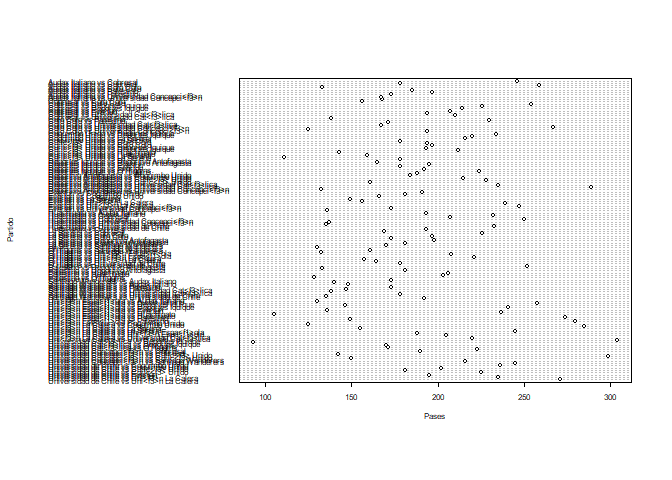

Actividad Ayudantia 2: Analisis Exploratorio de Datos
================

## Importar Data

Se procede a importar la Data utilizada.

``` r
library(readr)
Primer_Tiempo2020 <- read_csv("~/GitHub/Entregas_mineria_de_datos/Ayudantias/Actividad Ayudantia 2/Primer_Tiempo2020.csv")
```

    ## 
    ## -- Column specification --------------------------------------------------------
    ## cols(
    ##   .default = col_double(),
    ##   torneo = col_character(),
    ##   equipo = col_character(),
    ##   id_partido = col_character(),
    ##   partido = col_character(),
    ##   fasepartido = col_character(),
    ##   local = col_logical(),
    ##   tiempo = col_character()
    ## )
    ## i Use `spec()` for the full column specifications.

``` r
View(Primer_Tiempo2020)
summary(Primer_Tiempo2020)
```

    ##     torneo             equipo           id_partido          partido         
    ##  Length:130         Length:130         Length:130         Length:130        
    ##  Class :character   Class :character   Class :character   Class :character  
    ##  Mode  :character   Mode  :character   Mode  :character   Mode  :character  
    ##                                                                             
    ##                                                                             
    ##                                                                             
    ##  fasepartido          local            tiempo           accuratePass  
    ##  Length:130         Mode :logical   Length:130         Min.   : 62.0  
    ##  Class :character   FALSE:65        Class :character   1st Qu.:115.2  
    ##  Mode  :character   TRUE :65        Mode  :character   Median :143.5  
    ##                                                        Mean   :147.5  
    ##                                                        3rd Qu.:181.2  
    ##                                                        Max.   :269.0  
    ##    wonTackle       lostCorners    goalsConceded        saves    
    ##  Min.   : 0.000   Min.   :0.000   Min.   :0.0000   Min.   :0.0  
    ##  1st Qu.: 3.000   1st Qu.:1.000   1st Qu.:0.0000   1st Qu.:1.0  
    ##  Median : 5.000   Median :2.000   Median :0.0000   Median :1.0  
    ##  Mean   : 5.154   Mean   :2.277   Mean   :0.5923   Mean   :1.5  
    ##  3rd Qu.: 7.000   3rd Qu.:3.000   3rd Qu.:1.0000   3rd Qu.:2.0  
    ##  Max.   :14.000   Max.   :7.000   Max.   :3.0000   Max.   :5.0  
    ##  ontargetScoringAtt totalScoringAtt     subsMade       totalThrows   
    ##  Min.   :0.000      Min.   : 0.000   Min.   :0.0000   Min.   : 3.00  
    ##  1st Qu.:1.000      1st Qu.: 4.000   1st Qu.:0.0000   1st Qu.: 8.00  
    ##  Median :2.000      Median : 6.000   Median :0.0000   Median :11.00  
    ##  Mean   :2.108      Mean   : 5.938   Mean   :0.1077   Mean   :10.98  
    ##  3rd Qu.:3.000      3rd Qu.: 7.750   3rd Qu.:0.0000   3rd Qu.:13.00  
    ##  Max.   :5.000      Max.   :14.000   Max.   :1.0000   Max.   :26.00  
    ##  totalYellowCard    goalKicks        totalPass       fkFoulWon     
    ##  Min.   :0.0000   Min.   : 0.000   Min.   : 93.0   Min.   : 2.000  
    ##  1st Qu.:0.0000   1st Qu.: 2.000   1st Qu.:159.5   1st Qu.: 5.000  
    ##  Median :1.0000   Median : 4.000   Median :189.0   Median : 6.000  
    ##  Mean   :0.9077   Mean   : 3.962   Mean   :190.9   Mean   : 6.338  
    ##  3rd Qu.:1.0000   3rd Qu.: 5.000   3rd Qu.:222.5   3rd Qu.: 8.000  
    ##  Max.   :3.0000   Max.   :11.000   Max.   :304.0   Max.   :12.000  
    ##   totalTackle       fkFoulLost     possessionPercentage totalClearance  
    ##  Min.   : 1.000   Min.   : 2.000   Min.   :23.60        Min.   : 0.000  
    ##  1st Qu.: 5.000   1st Qu.: 6.000   1st Qu.:45.62        1st Qu.: 4.000  
    ##  Median : 7.000   Median : 7.000   Median :50.00        Median : 7.000  
    ##  Mean   : 7.192   Mean   : 7.054   Mean   :50.00        Mean   : 7.385  
    ##  3rd Qu.: 9.000   3rd Qu.: 9.000   3rd Qu.:54.38        3rd Qu.:10.000  
    ##  Max.   :15.000   Max.   :13.000   Max.   :76.40        Max.   :16.000  
    ##  formationUsed blockedScoringAtt   goalAssist         goals       
    ##  Min.   :0     Min.   :0.000     Min.   :0.0000   Min.   :0.0000  
    ##  1st Qu.:0     1st Qu.:0.000     1st Qu.:0.0000   1st Qu.:0.0000  
    ##  Median :0     Median :1.000     Median :0.0000   Median :0.0000  
    ##  Mean   :0     Mean   :1.262     Mean   :0.3769   Mean   :0.5923  
    ##  3rd Qu.:0     3rd Qu.:2.000     3rd Qu.:1.0000   3rd Qu.:1.0000  
    ##  Max.   :0     Max.   :6.000     Max.   :2.0000   Max.   :3.0000  
    ##   totalOffside   shotOffTarget     wonCorners     cornerTaken   
    ##  Min.   :0.000   Min.   :0.000   Min.   :0.000   Min.   :0.000  
    ##  1st Qu.:0.000   1st Qu.:1.000   1st Qu.:1.000   1st Qu.:1.000  
    ##  Median :1.000   Median :2.000   Median :2.000   Median :2.000  
    ##  Mean   :1.038   Mean   :2.569   Mean   :2.277   Mean   :2.269  
    ##  3rd Qu.:2.000   3rd Qu.:4.000   3rd Qu.:3.000   3rd Qu.:3.000  
    ##  Max.   :5.000   Max.   :7.000   Max.   :7.000   Max.   :7.000  
    ##  penaltyConceded   penaltyFaced    penGoalsConceded   penaltyWon    
    ##  Min.   :0.0000   Min.   :0.0000   Min.   :0.0000   Min.   :0.0000  
    ##  1st Qu.:0.0000   1st Qu.:0.0000   1st Qu.:0.0000   1st Qu.:0.0000  
    ##  Median :0.0000   Median :0.0000   Median :0.0000   Median :0.0000  
    ##  Mean   :0.1692   Mean   :0.1692   Mean   :0.1308   Mean   :0.1692  
    ##  3rd Qu.:0.0000   3rd Qu.:0.0000   3rd Qu.:0.0000   3rd Qu.:0.0000  
    ##  Max.   :2.0000   Max.   :2.0000   Max.   :1.0000   Max.   :2.0000  
    ##     ownGoals        penaltySave       secondYellow      totalRedCard    
    ##  Min.   :0.00000   Min.   :0.00000   Min.   :0.00000   Min.   :0.00000  
    ##  1st Qu.:0.00000   1st Qu.:0.00000   1st Qu.:0.00000   1st Qu.:0.00000  
    ##  Median :0.00000   Median :0.00000   Median :0.00000   Median :0.00000  
    ##  Mean   :0.02308   Mean   :0.02308   Mean   :0.01538   Mean   :0.04615  
    ##  3rd Qu.:0.00000   3rd Qu.:0.00000   3rd Qu.:0.00000   3rd Qu.:0.00000  
    ##  Max.   :1.00000   Max.   :1.00000   Max.   :1.00000   Max.   :1.00000  
    ##  posesion_Rival  precision_pases precision_tiros  minutos_juego  
    ##  Min.   :23.60   Min.   :50.68   Min.   :  0.00   Min.   :10.62  
    ##  1st Qu.:45.62   1st Qu.:70.71   1st Qu.: 25.00   1st Qu.:20.53  
    ##  Median :50.00   Median :76.40   Median : 40.00   Median :22.50  
    ##  Mean   :50.00   Mean   :75.99   Mean   : 41.20   Mean   :22.50  
    ##  3rd Qu.:54.38   3rd Qu.:82.28   3rd Qu.: 57.14   3rd Qu.:24.47  
    ##  Max.   :76.40   Max.   :89.43   Max.   :100.00   Max.   :34.38  
    ##  minutos_juegorival golesSalvados   foulsInofensivos cortarJuegoContrario
    ##  Min.   :10.62      Min.   :0.000   Min.   : 1.000   Min.   : 4.00       
    ##  1st Qu.:20.53      1st Qu.:1.000   1st Qu.: 5.000   1st Qu.:10.00       
    ##  Median :22.50      Median :1.000   Median : 6.000   Median :12.00       
    ##  Mean   :22.50      Mean   :1.523   Mean   : 6.146   Mean   :12.21       
    ##  3rd Qu.:24.47      3rd Qu.:2.000   3rd Qu.: 8.000   3rd Qu.:15.00       
    ##  Max.   :34.38      Max.   :5.000   Max.   :11.000   Max.   :24.00       
    ##   juegoCortado  
    ##  Min.   : 8.00  
    ##  1st Qu.:17.00  
    ##  Median :20.00  
    ##  Mean   :20.64  
    ##  3rd Qu.:25.00  
    ##  Max.   :40.00

``` r
attach(Primer_Tiempo2020)
```

\#\# Borrar Datos Char

``` r
Primer_Tiempo2020 <- Primer_Tiempo2020[,!(colnames(Primer_Tiempo2020) %in% c("id_partido", "fasepartido", "local", "tiempo","formationUsed", "torneo"))]
Primer_Tiempo2020
```

    ## # A tibble: 130 x 43
    ##    equipo    partido      accuratePass wonTackle lostCorners goalsConceded saves
    ##    <chr>     <chr>               <dbl>     <dbl>       <dbl>         <dbl> <dbl>
    ##  1 Uni<f3>n~ Universidad~          235         2           3             1     4
    ##  2 Universi~ Universidad~          199         2           0             0     1
    ##  3 Everton   Universidad~          157         7           6             0     3
    ##  4 Universi~ Universidad~          192         4           1             0     2
    ##  5 Curic<f3~ Universidad~          142         6           3             2     2
    ##  6 Universi~ Universidad~          168         8           1             1     2
    ##  7 Coquimbo~ Universidad~          190         3           0             0     2
    ##  8 Universi~ Universidad~          200         5           0             0     0
    ##  9 Santiago~ Universidad~          156         4           3             0     0
    ## 10 Universi~ Universidad~           92         4           1             1     1
    ## # ... with 120 more rows, and 36 more variables: ontargetScoringAtt <dbl>,
    ## #   totalScoringAtt <dbl>, subsMade <dbl>, totalThrows <dbl>,
    ## #   totalYellowCard <dbl>, goalKicks <dbl>, totalPass <dbl>, fkFoulWon <dbl>,
    ## #   totalTackle <dbl>, fkFoulLost <dbl>, possessionPercentage <dbl>,
    ## #   totalClearance <dbl>, blockedScoringAtt <dbl>, goalAssist <dbl>,
    ## #   goals <dbl>, totalOffside <dbl>, shotOffTarget <dbl>, wonCorners <dbl>,
    ## #   cornerTaken <dbl>, penaltyConceded <dbl>, penaltyFaced <dbl>,
    ## #   penGoalsConceded <dbl>, penaltyWon <dbl>, ownGoals <dbl>,
    ## #   penaltySave <dbl>, secondYellow <dbl>, totalRedCard <dbl>,
    ## #   posesion_Rival <dbl>, precision_pases <dbl>, precision_tiros <dbl>,
    ## #   minutos_juego <dbl>, minutos_juegorival <dbl>, golesSalvados <dbl>,
    ## #   foulsInofensivos <dbl>, cortarJuegoContrario <dbl>, juegoCortado <dbl>

## Analisis descriptivo

``` r
fh2020 <- Primer_Tiempo2020[order(Primer_Tiempo2020$accuratePass, decreasing = TRUE),]
fh2020
```

    ## # A tibble: 130 x 43
    ##    equipo    partido      accuratePass wonTackle lostCorners goalsConceded saves
    ##    <chr>     <chr>               <dbl>     <dbl>       <dbl>         <dbl> <dbl>
    ##  1 Universi~ Universidad~          269         2           3             0     2
    ##  2 Deportiv~ Deportivo A~          253        11           1             1     1
    ##  3 Uni<f3>n~ Uni<f3>n La~          252         6           3             1     3
    ##  4 Curic<f3~ Universidad~          245         5           2             0     2
    ##  5 Uni<f3>n~ Uni<f3>n La~          237         5           2             0     0
    ##  6 Uni<f3>n~ Universidad~          235         2           3             1     4
    ##  7 Colo Colo Colo Colo v~          231         4           0             0     0
    ##  8 Uni<f3>n~ Uni<f3>n Es~          224         7           0             1     0
    ##  9 Audax It~ Audax Itali~          220         2           1             1     1
    ## 10 Audax It~ Audax Itali~          219         6           1             0     0
    ## # ... with 120 more rows, and 36 more variables: ontargetScoringAtt <dbl>,
    ## #   totalScoringAtt <dbl>, subsMade <dbl>, totalThrows <dbl>,
    ## #   totalYellowCard <dbl>, goalKicks <dbl>, totalPass <dbl>, fkFoulWon <dbl>,
    ## #   totalTackle <dbl>, fkFoulLost <dbl>, possessionPercentage <dbl>,
    ## #   totalClearance <dbl>, blockedScoringAtt <dbl>, goalAssist <dbl>,
    ## #   goals <dbl>, totalOffside <dbl>, shotOffTarget <dbl>, wonCorners <dbl>,
    ## #   cornerTaken <dbl>, penaltyConceded <dbl>, penaltyFaced <dbl>,
    ## #   penGoalsConceded <dbl>, penaltyWon <dbl>, ownGoals <dbl>,
    ## #   penaltySave <dbl>, secondYellow <dbl>, totalRedCard <dbl>,
    ## #   posesion_Rival <dbl>, precision_pases <dbl>, precision_tiros <dbl>,
    ## #   minutos_juego <dbl>, minutos_juegorival <dbl>, golesSalvados <dbl>,
    ## #   foulsInofensivos <dbl>, cortarJuegoContrario <dbl>, juegoCortado <dbl>

## Sub DataFrames

``` r
fh2020_pases = fh2020[,colnames(Primer_Tiempo2020) %in% c("equipo", "partido", "accuratePass", "totalPass", "precision_pases")]
fh2020_pases = fh2020_pases[order(fh2020_pases$precision_pases, decreasing = TRUE),]

fh2020_pases
```

    ## # A tibble: 130 x 5
    ##    equipo        partido                  accuratePass totalPass precision_pases
    ##    <chr>         <chr>                           <dbl>     <dbl>           <dbl>
    ##  1 Audax Italia~ Audax Italiano vs Cobre~          220       246            89.4
    ##  2 Universidad ~ Universidad Cat<f3>lica~          269       304            88.5
    ##  3 Uni<f3>n La ~ Uni<f3>n La Calera vs L~          252       285            88.4
    ##  4 Deportivo An~ Deportivo Antofagasta v~          253       289            87.5
    ##  5 Uni<f3>n La ~ Universidad de Chile vs~          235       271            86.7
    ##  6 Universidad ~ Huachipato vs Universid~          202       233            86.7
    ##  7 Colo Colo     Colo Colo vs Universida~          231       267            86.5
    ##  8 Deportivo An~ Deportivo Antofagasta v~          162       188            86.2
    ##  9 Universidad ~ Deportivo Antofagasta v~          202       235            86.0
    ## 10 Uni<f3>n La ~ Uni<f3>n La Calera vs U~          176       205            85.9
    ## # ... with 120 more rows

## Filtrar Datos

``` r
everton <- filter(Primer_Tiempo2020, equipo == "Everton")
everton_pases <- filter(fh2020_pases, equipo == "Everton")
```

## Graficos

``` r
library(utf8)

lalala = as.data.frame(everton_pases)
attach(lalala)
pases_everton <- lalala$accuratePass
everton2 <- everton[order(accuratePass, decreasing = FALSE),]

dotchart(totalPass, labels = utf8_encode(partido), cex=0.5, xlab = "Pases", ylab = "Partido")
```

<!-- -->
