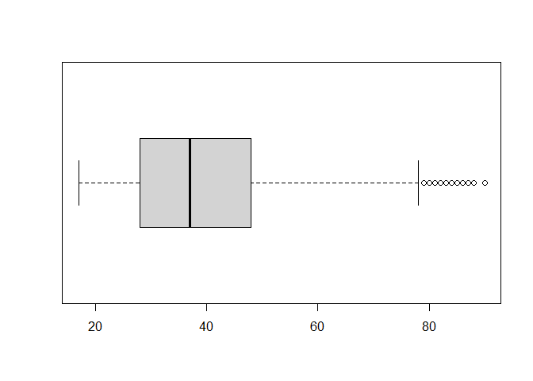
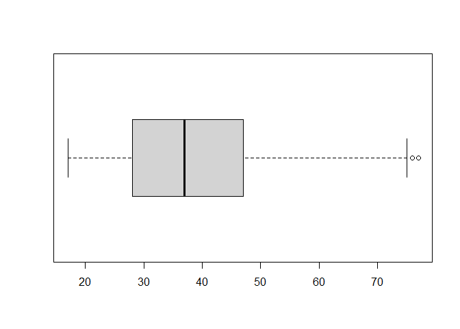
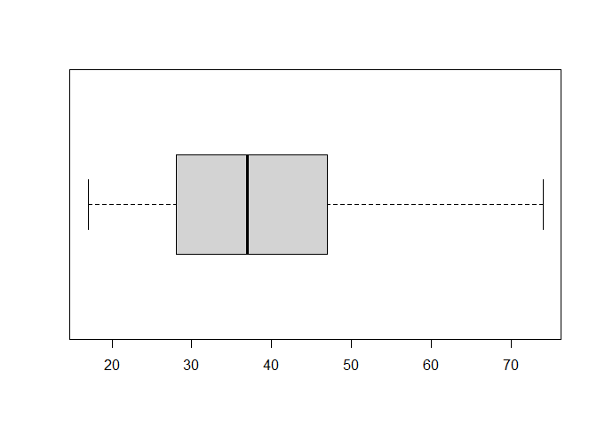

Actividad Ayudantia 3: Outliers
================

## Importar Datos

En primer lugar, se procede a importar los datos. Estos corresponden a
la base de datos del Titanic.

``` r
library(datasets)
library(readr)
titanic <- read_csv("~/GitHub/Entregas_mineria_de_datos/Ayudantias/Actividad Ayudantia 3/titanic.csv")
```

    ## 
    ## -- Column specification --------------------------------------------------------
    ## cols(
    ##   AGE = col_double(),
    ##   WORKCLASS = col_character(),
    ##   FNLWGT = col_double(),
    ##   EDUCATION = col_character(),
    ##   EDUCATION.NUM = col_double(),
    ##   MARITAL.STATUS = col_character(),
    ##   OCCUPATION = col_character(),
    ##   RELATIONSHIP = col_character(),
    ##   RACE = col_character(),
    ##   SEX = col_character(),
    ##   CAPITAL.GAIN = col_double(),
    ##   CAPITAL.LOSS = col_double(),
    ##   HOURS.PER.WEEK = col_double(),
    ##   NATIVE.COUNTRY = col_character(),
    ##   INCOME = col_character()
    ## )

``` r
View(titanic)
```

## Analisisi Visual

Se procede a realizar un boxplot con respecto a la edad.

``` r
boxplot(titanic$AGE, horizontal = TRUE)
```

<!-- -->

``` r
boxplot.stats(titanic$AGE)
```

    ## $stats
    ## [1] 17 28 37 48 78
    ## 
    ## $n
    ## [1] 29286
    ## 
    ## $conf
    ## [1] 36.81535 37.18465
    ## 
    ## $out
    ##   [1] 90 90 90 82 80 84 90 90 90 90 83 80 84 90 84 81 83 90 82 80 82 81 79 84 84
    ##  [26] 84 80 81 79 90 80 85 81 82 90 80 79 79 81 90 81 83 79 80 79 79 90 90 81 82
    ##  [51] 80 84 87 90 82 82 88 80 90 79 90 90 90 90 80 90 80 80 90 81 90 90 80 90 81
    ##  [76] 79 81 79 82 90 90 81 80 86 82 90 79 90 82 80 90 90 90 79 90 88 90 79 80 79
    ## [101] 90 84 80 85 83 81 79 90 80 90 80 84 90 80 82 81 79 82 83 85 90 79 80 79 79
    ## [126] 90

## Limpieza de Datos

Se identificaron multiples outliers, por lo cual se procede a filtrar
estos.

``` r
titanic_clean1 <- titanic$AGE[titanic$AGE < 78]

boxplot(titanic_clean1, horizontal = TRUE)
```

<!-- -->

``` r
boxplot.stats(titanic_clean1)
```

    ## $stats
    ## [1] 17 28 37 47 75
    ## 
    ## $n
    ## [1] 29141
    ## 
    ## $conf
    ## [1] 36.82414 37.17586
    ## 
    ## $out
    ##  [1] 76 76 76 76 76 77 77 77 76 76 77 77 76 77 77 77 76 76 77 76 76 76 76 76 77
    ## [26] 76 76 76 77 76 76 76 77 76 77 77 77 76 76 76 76 77 76 76 77 77 76 77 76 77
    ## [51] 77 77 77 77 76 76 76 76 76 77 76 76 76 76 76 77 76 76 76

Se siguen identificando outliers por lo cual se acota el limite superior
de la edad.

``` r
titanic_clean2 <- titanic$AGE[titanic$AGE < 75]

boxplot(titanic_clean2, horizontal = TRUE)
```

<!-- -->

``` r
boxplot.stats(titanic_clean2)
```

    ## $stats
    ## [1] 17 28 37 47 74
    ## 
    ## $n
    ## [1] 29030
    ## 
    ## $conf
    ## [1] 36.82381 37.17619
    ## 
    ## $out
    ## numeric(0)

Desde este momento, se concluye la limpieza de datos dado que no se
identifican más outliers.
