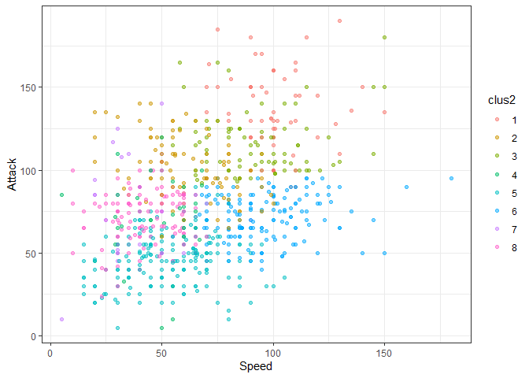

Actividad Ayudantia 5 Clusters
================

# Algoritmo de Clustering base:

## K-Medias

Vamos a analizar data\_pok de ventas de videojuegos

``` r
library(tidyverse)
```

    ## Warning in as.POSIXlt.POSIXct(Sys.time()): unable to identify current timezone 'H':
    ## please set environment variable 'TZ'

``` r
library(readr)
data_pok <- read_csv("~/GitHub/Entregas_mineria_de_datos/Ayudantias/Actividad Ayudantia 5/pokemon.csv")
View(data_pok)

head(data_pok)
```

    ## # A tibble: 6 x 13
    ##     `#` Name    `Type 1` `Type 2` Total    HP Attack Defense `Sp. Atk` `Sp. Def`
    ##   <dbl> <chr>   <chr>    <chr>    <dbl> <dbl>  <dbl>   <dbl>     <dbl>     <dbl>
    ## 1     1 Bulbas~ Grass    Poison     318    45     49      49        65        65
    ## 2     2 Ivysaur Grass    Poison     405    60     62      63        80        80
    ## 3     3 Venusa~ Grass    Poison     525    80     82      83       100       100
    ## 4     3 Venusa~ Grass    Poison     625    80    100     123       122       120
    ## 5     4 Charma~ Fire     <NA>       309    39     52      43        60        50
    ## 6     5 Charme~ Fire     <NA>       405    58     64      58        80        65
    ## # ... with 3 more variables: Speed <dbl>, Generation <dbl>, Legendary <lgl>

``` r
attach(data_pok)

summary(data_pok)
```

    ##        #             Name              Type 1             Type 2         
    ##  Min.   :  1.0   Length:800         Length:800         Length:800        
    ##  1st Qu.:184.8   Class :character   Class :character   Class :character  
    ##  Median :364.5   Mode  :character   Mode  :character   Mode  :character  
    ##  Mean   :362.8                                                           
    ##  3rd Qu.:539.2                                                           
    ##  Max.   :721.0                                                           
    ##      Total             HP             Attack       Defense      
    ##  Min.   :180.0   Min.   :  1.00   Min.   :  5   Min.   :  5.00  
    ##  1st Qu.:330.0   1st Qu.: 50.00   1st Qu.: 55   1st Qu.: 50.00  
    ##  Median :450.0   Median : 65.00   Median : 75   Median : 70.00  
    ##  Mean   :435.1   Mean   : 69.26   Mean   : 79   Mean   : 73.84  
    ##  3rd Qu.:515.0   3rd Qu.: 80.00   3rd Qu.:100   3rd Qu.: 90.00  
    ##  Max.   :780.0   Max.   :255.00   Max.   :190   Max.   :230.00  
    ##     Sp. Atk          Sp. Def          Speed          Generation   
    ##  Min.   : 10.00   Min.   : 20.0   Min.   :  5.00   Min.   :1.000  
    ##  1st Qu.: 49.75   1st Qu.: 50.0   1st Qu.: 45.00   1st Qu.:2.000  
    ##  Median : 65.00   Median : 70.0   Median : 65.00   Median :3.000  
    ##  Mean   : 72.82   Mean   : 71.9   Mean   : 68.28   Mean   :3.324  
    ##  3rd Qu.: 95.00   3rd Qu.: 90.0   3rd Qu.: 90.00   3rd Qu.:5.000  
    ##  Max.   :194.00   Max.   :230.0   Max.   :180.00   Max.   :6.000  
    ##  Legendary      
    ##  Mode :logical  
    ##  FALSE:735      
    ##  TRUE :65       
    ##                 
    ##                 
    ## 

Antes de clusterizar debemos preparar la data\_pok:

-   Eliminando datos faltantes.

-   Pasar Legendary a numerico.

-   Escalar la data\_pok

``` r
#Como no tenemos datos nulos obviamos este paso

levels(data_pok$Legendary) <- c(0,1)
data_pok$Legendary <- as.numeric(data_pok$Legendary)

`Type 1` <- as.numeric(`Type 1`)
```

    ## Warning: NAs introducidos por coerción

``` r
numdata_pok <- data_pok[, colnames(data_pok) %in% c("Type.1","HP", "Attack", "Defense", "Speed", "Generation", "Legendary")]

escal_data_pok = scale(numdata_pok) %>% as_tibble()

escal_data_pok %>% summary()
```

    ##        HP              Attack           Defense            Speed        
    ##  Min.   :-2.6732   Min.   :-2.2800   Min.   :-2.2077   Min.   :-2.1774  
    ##  1st Qu.:-0.7542   1st Qu.:-0.7395   1st Qu.:-0.7646   1st Qu.:-0.8010  
    ##  Median :-0.1668   Median :-0.1233   Median :-0.1232   Median :-0.1128  
    ##  Mean   : 0.0000   Mean   : 0.0000   Mean   : 0.0000   Mean   : 0.0000  
    ##  3rd Qu.: 0.4207   3rd Qu.: 0.6470   3rd Qu.: 0.5181   3rd Qu.: 0.7475  
    ##  Max.   : 7.2741   Max.   : 3.4198   Max.   : 5.0077   Max.   : 3.8445  
    ##    Generation        Legendary      
    ##  Min.   :-1.3988   Min.   :-0.2972  
    ##  1st Qu.:-0.7968   1st Qu.:-0.2972  
    ##  Median :-0.1949   Median :-0.2972  
    ##  Mean   : 0.0000   Mean   : 0.0000  
    ##  3rd Qu.: 1.0090   3rd Qu.:-0.2972  
    ##  Max.   : 1.6109   Max.   : 3.3606

aplicar el algoritmo de kmedias, que viene implementado en R base.
aplicar kmedias con k = 10

``` r
modelo_kmeans <- kmeans(escal_data_pok, centers = 10)
modelo_kmeans2 <- kmeans(numdata_pok, centers = 10)

# creo la variable cluster en la tabla escal_data_pokda
escal_data_pok$clus <- modelo_kmeans$cluster %>% as.factor()
numdata_pok$clus <- modelo_kmeans2$cluster %>% as.factor()

ggplot(escal_data_pok, aes(Speed, Attack, color=clus)) +
  geom_point(alpha=0.5, show.legend = T) +
  theme_bw()
```

<!-- -->

``` r
ggplot(numdata_pok, aes(Speed, Attack, color=clus)) +
  geom_point(alpha=0.5, show.legend = T) +
  theme_bw()
```

<!-- -->

``` r
info_clus <- modelo_kmeans$centers
info_clus2 <- modelo_kmeans2$centers

info_clus
```

    ##             HP     Attack    Defense        Speed Generation  Legendary
    ## 1   0.91952285  1.1607742  0.8279711  1.097955790  0.2681535  3.3605889
    ## 2   0.01789474 -0.2123834 -0.1442866  0.837231470  0.6962312 -0.2971949
    ## 3   0.45608627  1.2814961  1.7688040  0.001101971 -0.8398162 -0.2971949
    ## 4   0.04978997  0.2104322 -0.1236086  1.087871677 -1.1376789 -0.2971949
    ## 5  -0.81886454 -0.8669291 -0.9121888 -0.503559045 -0.8215577 -0.2971949
    ## 6  -0.67362920 -0.7432894 -0.6270381 -0.671320955  1.0488026 -0.2971949
    ## 7   2.16953636 -0.2887689 -0.3880143 -0.696785908 -0.6592337 -0.2971949
    ## 8  -0.47958051 -0.1805514  0.9033726 -0.933793256 -0.4881323 -0.2971949
    ## 9   0.73395312  0.4118628  0.7381801 -0.555889874  1.1201325 -0.2971949
    ## 10  0.47535668  1.4103587  0.0167582  0.650814449  0.3592899 -0.2971949

``` r
info_clus2
```

    ##           HP    Attack   Defense     Speed Generation   Legendary
    ## 1   81.64706  85.01176  99.52941  83.78824   3.364706 0.176470588
    ## 2   82.76667 110.20000 103.81667  48.51667   3.416667 0.016666667
    ## 3  129.48571  68.54286  63.02857  49.40000   3.428571 0.000000000
    ## 4   99.29412 142.45098 103.47059 100.70588   3.352941 0.549019608
    ## 5   60.70000  78.76667 160.10000  41.43333   3.266667 0.133333333
    ## 6   74.71250 116.61250  65.47500  89.15000   3.475000 0.100000000
    ## 7   69.25000  76.18000  66.99000 107.42000   3.320000 0.080000000
    ## 8   61.53968  72.19841  75.40476  46.63492   3.317460 0.007936508
    ## 9   47.17391  51.73043  43.66957  72.39130   3.026087 0.000000000
    ## 10  50.87288  45.27966  47.78814  37.33898   3.415254 0.000000000

Vamos a ver como evoluciona la suma de cuadrados intra-cluster en la
medida que aumentamos el numero de k

``` r
SSinterior <- numeric(30)

for(k in 1:30){
  modelo <- kmeans(escal_data_pok, centers = k)
  SSinterior[k] <- modelo$tot.withinss
}

plot(SSinterior)
```

<!-- -->

## Evaluacion

Inspeccion visual

``` r
escal_data_pok$clus <- as.numeric(escal_data_pok$clus)
numdata_pok$clus <- as.numeric(numdata_pok$clus)

# uso distancia euclidiana
tempDist <- dist(escal_data_pok) %>% as.matrix()

#reordeno filas y columnas en base al cluster obtenido
index <- sort(modelo_kmeans$cluster, index.return=TRUE)
tempDist <- tempDist[index$ix,index$ix]
rownames(tempDist) <- c(1:nrow(escal_data_pok))
colnames(tempDist) <- c(1:nrow(escal_data_pok))

image(tempDist)
```

<!-- -->

Estadistico de Hopkins.

``` r
library(factoextra)
```

    ## Warning: package 'factoextra' was built under R version 4.0.5

    ## Welcome! Want to learn more? See two factoextra-related books at https://goo.gl/ve3WBa

``` r
#Calcula el hopkins statistic 
res <- get_clust_tendency(escal_data_pok, n = 30, graph = FALSE)
res2 <- get_clust_tendency(numdata_pok, n = 30, graph = FALSE)

print(res)
```

    ## $hopkins_stat
    ## [1] 0.8697995
    ## 
    ## $plot
    ## NULL

``` r
print(res2)
```

    ## $hopkins_stat
    ## [1] 0.8723365
    ## 
    ## $plot
    ## NULL

Indice de correlación

``` r
#Correlation
#construyo matriz de correlacion ideal (cada entidad correlaciona 1 con su cluster)
tempMatrix <- matrix(0, nrow = nrow(numdata_pok), ncol = nrow(numdata_pok))
tempMatrix[which(index$x==1), which(index$x==1)]  <- 1
tempMatrix[which(index$x==2), which(index$x==2)]  <- 1
tempMatrix[which(index$x==3), which(index$x==3)]  <- 1
tempMatrix[which(index$x==4), which(index$x==4)]  <- 1
tempMatrix[which(index$x==5), which(index$x==5)]  <- 1
tempMatrix[which(index$x==6), which(index$x==6)]  <- 1
tempMatrix[which(index$x==7), which(index$x==7)]  <- 1
tempMatrix[which(index$x==8), which(index$x==8)]  <- 1
tempMatrix[which(index$x==9), which(index$x==9)]  <- 1
tempMatrix[which(index$x==10), which(index$x==10)] <- 1

#construyo matriz de disimilitud
tempDist2 <- 1/(1+tempDist)

#Calcula correlacion 
cor <- cor(tempMatrix[upper.tri(tempMatrix)],tempDist2[upper.tri(tempDist2)])

print(cor)
```

    ## [1] 0.7127123

Indice de cohesión y el de separación.

``` r
library(flexclust) # usaremos la distancia implementada en flexclus (dist2) que maneja mejor objetos de diferente tamaño
```

    ## Warning: package 'flexclust' was built under R version 4.0.5

    ## Loading required package: grid

    ## Loading required package: lattice

    ## Loading required package: modeltools

    ## Loading required package: stats4

``` r
#escal_data_pok <- apply(escal_data_pok,2,as.numeric)
 
#Cohesion
withinCluster <- numeric(10)
for (i in 1:10){
  tempdata_pok <- escal_data_pok[which(modelo_kmeans$cluster == i),]
  withinCluster[i] <- sum(dist2(tempdata_pok,colMeans(tempdata_pok))^2)
}
cohesion = sum(withinCluster)
#es equivalente a model$tot.withinss en k-means
print(c(cohesion, modelo_kmeans$tot.withinss))
```

    ## [1] 1592.637 1592.637

``` r
#Separation
meandata_pok <- colMeans(escal_data_pok)
SSB <- numeric(10)
for (i in 1:10){
  tempdata_pok <- escal_data_pok[which(modelo_kmeans$cluster==i),]
  SSB[i] <- nrow(tempdata_pok)*sum((meandata_pok-colMeans(tempdata_pok))^2)
}
separation = sum(SSB)

print(separation)
```

    ## [1] 8899.252

Y finalmente aplicamos el coeficiente de silueta

``` r
library(cluster)

coefSil <- silhouette(modelo_kmeans$cluster,dist(escal_data_pok))
summary(coefSil)
```

    ## Silhouette of 800 units in 10 clusters from silhouette.default(x = modelo_kmeans$cluster, dist = dist(escal_data_pok)) :
    ##  Cluster sizes and average silhouette widths:
    ##        65       102        42        83       146       121        35        78 
    ## 0.4625738 0.4925522 0.2667961 0.3934205 0.3200240 0.4434931 0.2486566 0.3334300 
    ##        65        63 
    ## 0.2728735 0.3516172 
    ## Individual silhouette widths:
    ##    Min. 1st Qu.  Median    Mean 3rd Qu.    Max. 
    ## 0.01253 0.27767 0.38484 0.37394 0.47522 0.61404

``` r
#visualizamos el codigo de silueta de cada cluster
fviz_silhouette(coefSil) + coord_flip()
```

    ##    cluster size ave.sil.width
    ## 1        1   65          0.46
    ## 2        2  102          0.49
    ## 3        3   42          0.27
    ## 4        4   83          0.39
    ## 5        5  146          0.32
    ## 6        6  121          0.44
    ## 7        7   35          0.25
    ## 8        8   78          0.33
    ## 9        9   65          0.27
    ## 10      10   63          0.35

<!-- -->

## Utilizamos el coeficiente de silueta para encontrar el mejor valor de K

``` r
coefSil=numeric(30)
for (k in 2:30){
  modelo <- kmeans(escal_data_pok, centers = k)
  temp <- silhouette(modelo$cluster,dist(escal_data_pok))
  coefSil[k] <- mean(temp[,3])
}
tempDF=data.frame(CS=coefSil,K=c(1:30))

ggplot(tempDF, aes(x=K, y=CS)) + 
  geom_line() +
  scale_x_continuous(breaks=c(1:30))
```

<!-- -->
\#Aplicando la correción con un K de 8 dado que es donde el grafico
muestra el mayor valor.

``` r
numdata_pok2 <- data_pok[, colnames(data_pok) %in% c("Type.1","HP", "Attack", "Defense", "Sp..Atk", "Sp..Def", "Speed", "Generation", "Legendary")]
escal_data_pok2 = scale(numdata_pok2) %>% as_tibble()

modelo_kmean <- kmeans(escal_data_pok2, centers = 8)
modelo_kmean2 <- kmeans(numdata_pok2, centers = 8)

# creo la variable cluster en la tabla escal_data_pokda
escal_data_pok2$clus2 <- modelo_kmean$cluster %>% as.factor()
numdata_pok2$clus2 <- modelo_kmean2$cluster %>% as.factor()

ggplot(escal_data_pok2, aes(Speed, Attack, color=clus2)) +
  geom_point(alpha=0.5, show.legend = T) +
  theme_bw()
```

<!-- -->

``` r
ggplot(numdata_pok2, aes(Speed, Attack, color=clus2)) +
  geom_point(alpha=0.5, show.legend = T) +
  theme_bw()
```

<!-- -->

``` r
info_clusters <- modelo_kmean$centers
info_clusters2 <- modelo_kmean2$centers

info_clusters
```

    ##            HP     Attack    Defense      Speed  Generation  Legendary
    ## 1  1.96208731 -0.3525009 -0.2470056 -0.7025866 -0.20691747 -0.2971949
    ## 2 -0.78929374 -0.7927944 -0.7214182 -0.4941391 -0.80343510 -0.2971949
    ## 3 -0.61089602 -0.6857671 -0.5605974 -0.5333610  1.02990556 -0.2971949
    ## 4  1.12837486  1.6292050  0.6120567  1.1915588  0.55038254  3.3605889
    ## 5 -0.02270394  0.3198493  1.6864559 -0.8940392 -0.09083932 -0.2971949
    ## 6  0.53814091  0.3053789  1.2222496  0.9270286 -0.24722139  3.3605889
    ## 7  0.20022498  0.6104326  0.1184349  0.7750218 -0.91290911 -0.2971949
    ## 8  0.34459898  0.5351117  0.1258876  0.6841568  0.91304308 -0.2971949

``` r
info_clusters2
```

    ##          HP    Attack   Defense     Speed Generation   Legendary
    ## 1  98.20635 134.74603 105.06349 100.60317   3.396825 0.555555556
    ## 2  82.56863 100.90196 102.50000  61.43137   3.372549 0.068627451
    ## 3  76.13636 115.64773  67.77273  92.79545   3.465909 0.125000000
    ## 4 127.02632  69.52632  63.78947  50.23684   3.394737 0.000000000
    ## 5  48.01010  46.85859  43.92929  52.83838   3.181818 0.000000000
    ## 6  68.34437  72.08609  67.03311  96.97351   3.231788 0.046357616
    ## 7  61.50000  80.70000 160.53333  41.50000   3.366667 0.133333333
    ## 8  58.46154  69.36154  76.73846  43.02308   3.446154 0.007692308

## Evaluacion del modelo Corregido

Inspeccion visual

``` r
# uso distancia euclidiana
tempDist_2 <- dist(escal_data_pok2) %>% as.matrix()

#reordeno filas y columnas en base al cluster obtenido
index <- sort(modelo_kmean$cluster, index.return=TRUE)
tempDist_2 <- tempDist_2[index$ix,index$ix]
rownames(tempDist_2) <- c(1:nrow(data_pok))
colnames(tempDist_2) <- c(1:nrow(data_pok))

image(tempDist_2)
```

<!-- -->

Indice de correlación

``` r
#Correlation
#construyo matriz de correlacion ideal (cada entidad correlaciona 1 con su cluster)
tempMatrix2 <- matrix(0, nrow = nrow(escal_data_pok2), ncol = nrow(escal_data_pok2))
tempMatrix2[which(index$x==1), which(index$x==1)]  <- 1
tempMatrix2[which(index$x==2), which(index$x==2)]  <- 1
tempMatrix2[which(index$x==3), which(index$x==3)]  <- 1
tempMatrix2[which(index$x==4), which(index$x==4)]  <- 1

#construyo matriz de disimilitud
tempDist_22 <- 1/(1+tempDist_2)

#Calcula correlacion 
cor2 <- cor(tempMatrix2[upper.tri(tempMatrix2)],tempDist_2[upper.tri(tempDist_2)])

print(cor2)
```

    ## [1] -0.4616902

Indice de cohesión y el de separación.

``` r
library(flexclust) # usaremos la distancia implementada en flexclus (dist2) que maneja mejor objetos de diferente tamaño
escal_data_pok2 <- apply(escal_data_pok2,2,as.numeric)
 
#Cohesion
withinCluster <- numeric(4)
for (i in 1:4){
  tempdata_pok2 <- escal_data_pok2[which(modelo_kmean$cluster == i),]
  withinCluster[i] <- sum(dist2(tempdata_pok2,colMeans(tempdata_pok2))^2)
}
cohesion2 = sum(withinCluster)
#es equivalente a model$tot.withinss en k-means
print(c(cohesion2, modelo_kmean$tot.withinss))
```

    ## [1]  853.6082 1801.8504

``` r
#Separation
meandata_pok2 <- colMeans(escal_data_pok2)
SSB <- numeric(4)
for (i in 1:4){
  tempdata_pok2 <- escal_data_pok2[which(modelo_kmean$cluster==i),]
  SSB[i] <- nrow(tempdata_pok2)*sum((meandata_pok2-colMeans(tempdata_pok2))^2)
}
separation2 = sum(SSB)

print(separation2)
```

    ## [1] 4008.463

Coeficiente de silueta

``` r
library(cluster)

coefSil2 <- silhouette(modelo_kmean$cluster,dist(escal_data_pok2))
summary(coefSil2)
```

    ## Silhouette of 800 units in 8 clusters from silhouette.default(x = modelo_kmean$cluster, dist = dist(escal_data_pok2)) :
    ##  Cluster sizes and average silhouette widths:
    ##        50       182       144        42        81        23       140       138 
    ## 0.2712125 0.3201890 0.4168656 0.3556647 0.3309475 0.3522471 0.2992051 0.3283372 
    ## Individual silhouette widths:
    ##     Min.  1st Qu.   Median     Mean  3rd Qu.     Max. 
    ## -0.01618  0.25808  0.34877  0.33614  0.41817  0.56504

``` r
#visualizamos el codigo de silueta de cada cluster
fviz_silhouette(coefSil2) + coord_flip()
```

    ##   cluster size ave.sil.width
    ## 1       1   50          0.27
    ## 2       2  182          0.32
    ## 3       3  144          0.42
    ## 4       4   42          0.36
    ## 5       5   81          0.33
    ## 6       6   23          0.35
    ## 7       7  140          0.30
    ## 8       8  138          0.33

<!-- -->

Estadistico de Hopkins.

``` r
library(factoextra)

#Calcula el hopkins statistic 
res3 <- get_clust_tendency(escal_data_pok2, n = 30, graph = FALSE)
res4 <- get_clust_tendency(numdata_pok, n = 30, graph = FALSE)

print(res3)
```

    ## $hopkins_stat
    ## [1] 0.8649712
    ## 
    ## $plot
    ## NULL

``` r
print(res4)
```

    ## $hopkins_stat
    ## [1] 0.8723365
    ## 
    ## $plot
    ## NULL

Al parecer, resultó peor hacerlo con K=8.
