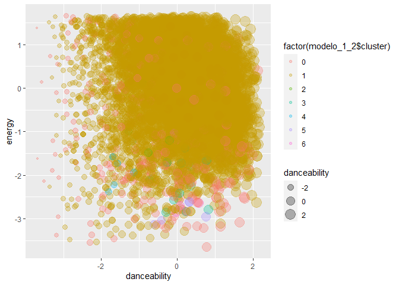

Actividad Ayudantia 8: Clustering Probabilistico
================

## Actividad Ayudantía 8: Entrega 28/05

# Objetivo

Para esta actividad tendrán que utilizar el csv que está subido de
spotify o realizar ustedes un sample de la data del proyecto 2 de al
menos 8000 observaciones.

Para dicho dataset tendrán que realizar los tres modelos de clustering
vistos en la ayudantía y tendrán que ejecutar 3 iteraciones del análisis
mencionando que modificaron en cada iteración en la búsqueda de mejorar
los clúster que se forman.

## Importar Librerías

``` r
library(tidyverse)
library(cluster)
library(factoextra)
library(mclust)
library(readr)
library(dbscan)
library(e1071)
library(mclust)
```

## Cargar Datos

``` r
setwd("C:/Users/Felipe/Documents/GitHub/Entregas_mineria_de_datos/Ayudantias/Actividad Ayudantia 8")
Spotify_Songs <- read_csv("C:/Users/Felipe/Documents/GitHub/Entregas_mineria_de_datos/Ayudantias/Actividad Ayudantia 8/Spotify_Songs.csv")
```

    ## 
    ## -- Column specification --------------------------------------------------------
    ## cols(
    ##   .default = col_double(),
    ##   track_id = col_character(),
    ##   track_name = col_character(),
    ##   track_artist = col_character(),
    ##   track_popularity = col_character(),
    ##   track_album_id = col_character(),
    ##   track_album_name = col_character(),
    ##   track_album_release_date = col_character(),
    ##   playlist_name = col_character(),
    ##   playlist_id = col_character(),
    ##   playlist_genre = col_character(),
    ##   playlist_subgenre = col_character()
    ## )
    ## i Use `spec()` for the full column specifications.

    ## Warning: 752 parsing failures.
    ## row              col           expected actual                                                                                                            file
    ##  89 track_name       delimiter or quote      P 'C:/Users/Felipe/Documents/GitHub/Entregas_mineria_de_datos/Ayudantias/Actividad Ayudantia 8/Spotify_Songs.csv'
    ##  89 track_name       delimiter or quote      ) 'C:/Users/Felipe/Documents/GitHub/Entregas_mineria_de_datos/Ayudantias/Actividad Ayudantia 8/Spotify_Songs.csv'
    ##  89 track_album_name delimiter or quote      P 'C:/Users/Felipe/Documents/GitHub/Entregas_mineria_de_datos/Ayudantias/Actividad Ayudantia 8/Spotify_Songs.csv'
    ##  89 track_album_name delimiter or quote      ) 'C:/Users/Felipe/Documents/GitHub/Entregas_mineria_de_datos/Ayudantias/Actividad Ayudantia 8/Spotify_Songs.csv'
    ## 164 track_name       delimiter or quote      T 'C:/Users/Felipe/Documents/GitHub/Entregas_mineria_de_datos/Ayudantias/Actividad Ayudantia 8/Spotify_Songs.csv'
    ## ... ................ .................. ...... ...............................................................................................................
    ## See problems(...) for more details.

``` r
View(Spotify_Songs)
```

## Seleccionar datos

Se pretenden seleccionar los 8000 datos que especifica el enunciado. Se
realiza de una manera aleatoria.

``` r
set.seed(2000000)
muestra_index <- sample(1:nrow(Spotify_Songs),8500, replace = F)
muestra = Spotify_Songs[muestra_index,]
summary(muestra)
```

    ##    track_id          track_name        track_artist       track_popularity  
    ##  Length:8500        Length:8500        Length:8500        Length:8500       
    ##  Class :character   Class :character   Class :character   Class :character  
    ##  Mode  :character   Mode  :character   Mode  :character   Mode  :character  
    ##                                                                             
    ##                                                                             
    ##                                                                             
    ##                                                                             
    ##  track_album_id     track_album_name   track_album_release_date
    ##  Length:8500        Length:8500        Length:8500             
    ##  Class :character   Class :character   Class :character        
    ##  Mode  :character   Mode  :character   Mode  :character        
    ##                                                                
    ##                                                                
    ##                                                                
    ##                                                                
    ##  playlist_name      playlist_id        playlist_genre     playlist_subgenre 
    ##  Length:8500        Length:8500        Length:8500        Length:8500       
    ##  Class :character   Class :character   Class :character   Class :character  
    ##  Mode  :character   Mode  :character   Mode  :character   Mode  :character  
    ##                                                                             
    ##                                                                             
    ##                                                                             
    ##                                                                             
    ##   danceability         energy              key             loudness      
    ##  Min.   : 0.0000   Min.   :-13.3200   Min.   :-19.846   Min.   :-36.624  
    ##  1st Qu.: 0.5650   1st Qu.:  0.5760   1st Qu.:  2.000   1st Qu.: -8.186  
    ##  Median : 0.6730   Median :  0.7200   Median :  6.000   Median : -6.128  
    ##  Mean   : 0.6688   Mean   :  0.6984   Mean   :  5.356   Mean   : -6.661  
    ##  3rd Qu.: 0.7640   3rd Qu.:  0.8410   3rd Qu.:  9.000   3rd Qu.: -4.594  
    ##  Max.   :11.0000   Max.   : 11.0000   Max.   : 11.000   Max.   :  1.000  
    ##                                                                          
    ##       mode         speechiness      acousticness     instrumentalness   
    ##  Min.   :0.0000   Min.   :0.0000   Min.   :0.00000   Min.   :0.0000000  
    ##  1st Qu.:0.0000   1st Qu.:0.0407   1st Qu.:0.01427   1st Qu.:0.0000000  
    ##  Median :1.0000   Median :0.0625   Median :0.08005   Median :0.0000207  
    ##  Mean   :0.5648   Mean   :0.1066   Mean   :0.17632   Mean   :0.0893172  
    ##  3rd Qu.:1.0000   3rd Qu.:0.1320   3rd Qu.:0.25225   3rd Qu.:0.0060125  
    ##  Max.   :1.0000   Max.   :0.8170   Max.   :0.99400   Max.   :0.9870000  
    ##                                                                         
    ##     liveness            valence              tempo           duration_ms    
    ##  Min.   :  0.00936   Min.   :     0.00   Min.   :    35.5   Min.   : 31875  
    ##  1st Qu.:  0.09370   1st Qu.:     0.34   1st Qu.:   100.0   1st Qu.:188078  
    ##  Median :  0.12900   Median :     0.52   Median :   122.0   Median :215625  
    ##  Mean   :  0.39525   Mean   :   419.22   Mean   :   988.1   Mean   :225359  
    ##  3rd Qu.:  0.25300   3rd Qu.:     0.70   3rd Qu.:   134.9   3rd Qu.:253373  
    ##  Max.   :159.91900   Max.   :242649.00   Max.   :379227.0   Max.   :516893  
    ##                                          NA's   :17         NA's   :49

## Comprobar Datos NA

Hay datos faltantes en algunas columnas, por lo tanto procedo a filtrar
y eliminarlos. Se revisa con el último display.

``` r
muestra[muestra == ""] <- NA
muestra %>% summarise_all(funs(sum(is.na(.))))
```

    ## Warning: `funs()` was deprecated in dplyr 0.8.0.
    ## Please use a list of either functions or lambdas: 
    ## 
    ##   # Simple named list: 
    ##   list(mean = mean, median = median)
    ## 
    ##   # Auto named with `tibble::lst()`: 
    ##   tibble::lst(mean, median)
    ## 
    ##   # Using lambdas
    ##   list(~ mean(., trim = .2), ~ median(., na.rm = TRUE))

    ## # A tibble: 1 x 23
    ##   track_id track_name track_artist track_popularity track_album_id
    ##      <int>      <int>        <int>            <int>          <int>
    ## 1        0          1            1                0              0
    ## # ... with 18 more variables: track_album_name <int>,
    ## #   track_album_release_date <int>, playlist_name <int>, playlist_id <int>,
    ## #   playlist_genre <int>, playlist_subgenre <int>, danceability <int>,
    ## #   energy <int>, key <int>, loudness <int>, mode <int>, speechiness <int>,
    ## #   acousticness <int>, instrumentalness <int>, liveness <int>, valence <int>,
    ## #   tempo <int>, duration_ms <int>

``` r
muestra_filtrada <- muestra %>% filter(!(is.na(track_name)|is.na(track_artist)|is.na(track_album_name)|is.na(duration_ms)|is.na(tempo)|is.na(duration_ms)))
muestra_filtrada %>% summarise_all(funs(sum(is.na(.))))
```

    ## # A tibble: 1 x 23
    ##   track_id track_name track_artist track_popularity track_album_id
    ##      <int>      <int>        <int>            <int>          <int>
    ## 1        0          0            0                0              0
    ## # ... with 18 more variables: track_album_name <int>,
    ## #   track_album_release_date <int>, playlist_name <int>, playlist_id <int>,
    ## #   playlist_genre <int>, playlist_subgenre <int>, danceability <int>,
    ## #   energy <int>, key <int>, loudness <int>, mode <int>, speechiness <int>,
    ## #   acousticness <int>, instrumentalness <int>, liveness <int>, valence <int>,
    ## #   tempo <int>, duration_ms <int>

## Escalar Data

``` r
var_numericas = muestra_filtrada[,c(12:23)]
data_escalada=scale(var_numericas) %>% as_tibble()
summary(data_escalada)
```

    ##   danceability         energy             key             loudness       
    ##  Min.   :-3.6993   Min.   :-3.6480   Min.   :-1.4987   Min.   :-10.0589  
    ##  1st Qu.:-0.6302   1st Qu.:-0.6714   1st Qu.:-0.9454   1st Qu.: -0.5040  
    ##  Median : 0.1080   Median : 0.1187   Median : 0.1614   Median :  0.1850  
    ##  Mean   : 0.0000   Mean   : 0.0000   Mean   : 0.0000   Mean   :  0.0000  
    ##  3rd Qu.: 0.7232   3rd Qu.: 0.7873   3rd Qu.: 0.9914   3rd Qu.:  0.7014  
    ##  Max.   : 2.1723   Max.   : 1.6603   Max.   : 1.5447   Max.   :  2.4686  
    ##       mode          speechiness       acousticness     instrumentalness 
    ##  Min.   :-1.1448   Min.   :-0.8297   Min.   :-0.7936   Min.   :-0.3857  
    ##  1st Qu.:-1.1448   1st Qu.:-0.6560   1st Qu.:-0.7284   1st Qu.:-0.3857  
    ##  Median : 0.8734   Median :-0.4385   Median :-0.4319   Median :-0.3856  
    ##  Mean   : 0.0000   Mean   : 0.0000   Mean   : 0.0000   Mean   : 0.0000  
    ##  3rd Qu.: 0.8734   3rd Qu.: 0.2540   3rd Qu.: 0.3428   3rd Qu.:-0.3623  
    ##  Max.   : 0.8734   Max.   : 7.0894   Max.   : 3.6755   Max.   : 3.9320  
    ##     liveness          valence              tempo           duration_ms     
    ##  Min.   :-1.1719   Min.   :-2.202401   Min.   :-3.17815   Min.   :-3.2312  
    ##  1st Qu.:-0.6319   1st Qu.:-0.770586   1st Qu.:-0.78255   1st Qu.:-0.6225  
    ##  Median :-0.4114   Median : 0.007691   Median : 0.03498   Median :-0.1624  
    ##  Mean   : 0.0000   Mean   : 0.000000   Mean   : 0.00000   Mean   : 0.0000  
    ##  3rd Qu.: 0.3707   3rd Qu.: 0.773068   3rd Qu.: 0.48305   3rd Qu.: 0.4676  
    ##  Max.   : 5.1532   Max.   : 2.054430   Max.   : 3.67374   Max.   : 4.8689

# DBSCAN

Primer método, clustering basado en densidad

``` r
modelo_1 = dbscan(data_escalada, eps = 2, minPts = 5)
modelo_1
```

    ## DBSCAN clustering for 8450 objects.
    ## Parameters: eps = 2, minPts = 5
    ## The clustering contains 3 cluster(s) and 859 noise points.
    ## 
    ##    0    1    2    3 
    ##  859 3252 4334    5 
    ## 
    ## Available fields: cluster, eps, minPts

El modelo genera 3 clúster, basado en los parámetros que le entregamos a
la función dbscan. Al aumentar la cantidad de “eps” se reduce la
cantidad de clúster encontrados, agrupando a todo el conjunto de datos
en un único clúster mientras que ocurre lo contrario al disminuir el
valor. Al reducir el valor de “minPtos” los datos se agrupan de mejor
manera en cada uno de los clúster encontrados, mientras que si ese valor
aumenta los clúster tienden a agruparse en único clúster.

``` r
ggplot(data_escalada, aes(danceability, energy, color = factor(modelo_1$cluster), size = danceability)) + geom_point(alpha = 0.3) 
```

<!-- -->

Existe un exceso de ruido, el cual molesta con la interpretación que se
le puede dar. Además hay diversos puntos que no quedan asignados a
ningún clúster dados los valores escogidos para la distancia mínima.

El clúster 0 de este modelo representa el ruido, hay que buscar una
combinación que lo disminuya. Ese valor bordea los 8000 cuando la
distancia desde el centro es 1.

# Fuzzy C Means

Se le va a pedir la misma cantidad de clúster que el modelo anterior (3)
y un fusificador de 2 tal como se vio en la ayudantía.

``` r
modelo_2 <- cmeans(data_escalada, 3, m=5) 

modelo_2$membership %>% head()
```

    ##              1         2         3
    ## [1,] 0.3333384 0.3333333 0.3333283
    ## [2,] 0.3333389 0.3333334 0.3333278
    ## [3,] 0.3333350 0.3333336 0.3333314
    ## [4,] 0.3333364 0.3333332 0.3333304
    ## [5,] 0.3333326 0.3333331 0.3333342
    ## [6,] 0.3333394 0.3333333 0.3333273

El algoritmo cmeans asigna como clúster al que tenga mayor probabilidad.
El primer parámetro corresponde a la cantidad de clúster deseados. Al
aumentar el fusificador, se observan pequeños cambios en las
probabilidades entregadas, pero no corresponden a cambios
significativos.

Otros algoritmos como el c-means permiten asignarle un clúster a todos
los puntos

``` r
ggplot(data_escalada, aes(danceability, energy, color = factor(modelo_2$cluster), size = danceability)) + geom_point(alpha = 0.3) 
```

<!-- -->

Se pueden observar de manera más concreta los diferentes clúster
obtenidos, pero de igual manera un clúster de baja relevancia queda
oculto entre los otros dos.

Para los modelos de clustering difuso podemos calcular el Coeficiente de
partición difusa (FPC)

``` r
matriz <- modelo_2$membership%*%t(modelo_2$membership) 
(FPC <- sum(matriz*diag(nrow(matriz)))/nrow(matriz))
```

    ## [1] 0.3333333

El valor del FPC es bajo, lo que significa que los grupos tienen alta
variabilidad, y se puede confirmar en la figura, ya que no se ven grupos
definidos.

# GMM

GMM permiten obtener clúster difusos utilizando modelos probabilísticos

``` r
model_3 = Mclust(data_escalada)
model_3 
```

    ## 'Mclust' model object: (VVV,2) 
    ## 
    ## Available components: 
    ##  [1] "call"           "data"           "modelName"      "n"             
    ##  [5] "d"              "G"              "BIC"            "loglik"        
    ##  [9] "df"             "bic"            "icl"            "hypvol"        
    ## [13] "parameters"     "z"              "classification" "uncertainty"

``` r
summary(model_3, parameters = TRUE)
```

    ## ---------------------------------------------------- 
    ## Gaussian finite mixture model fitted by EM algorithm 
    ## ---------------------------------------------------- 
    ## 
    ## Mclust VVV (ellipsoidal, varying volume, shape, and orientation) model with 2
    ## components: 
    ## 
    ##  log-likelihood    n  df       BIC       ICL
    ##       -96410.07 8450 181 -194456.7 -194511.9
    ## 
    ## Clustering table:
    ##    1    2 
    ## 3978 4472 
    ## 
    ## Mixing probabilities:
    ##         1         2 
    ## 0.4711668 0.5288332 
    ## 
    ## Means:
    ##                          [,1]         [,2]
    ## danceability     -0.074699585  0.066554009
    ## energy            0.070654766 -0.062950254
    ## key               0.021198108 -0.018886571
    ## loudness         -0.162021442  0.144353900
    ## mode             -0.009212811  0.008208205
    ## speechiness      -0.215894361  0.192352275
    ## acousticness     -0.075644968  0.067396302
    ## instrumentalness  0.432852254 -0.385652110
    ## liveness          0.007459705 -0.006646266
    ## valence          -0.145429658  0.129571358
    ## tempo             0.040886642 -0.036428180
    ## duration_ms       0.102334147 -0.091175174
    ## 
    ## Variances:
    ## [,,1]
    ##                   danceability      energy           key     loudness
    ## danceability      1.0729687593 -0.09960117  0.0005786303  0.032186360
    ## energy           -0.0996011710  1.18051964  0.0183060750  0.871595651
    ## key               0.0005786303  0.01830607  0.9766566652 -0.009343894
    ## loudness          0.0321863600  0.87159565 -0.0093438941  1.255189549
    ## mode             -0.0587194584 -0.01721273 -0.1890621446 -0.038765392
    ## speechiness       0.1334825309 -0.03046727  0.0114703244  0.013886100
    ## acousticness     -0.0178784095 -0.68431886 -0.0092034814 -0.549771043
    ## instrumentalness  0.0035206389  0.05326921  0.0117141619 -0.158900990
    ## liveness         -0.1684098086  0.17460209  0.0360120946  0.121842786
    ## valence           0.3483241343  0.06267807  0.0477404554 -0.033117780
    ## tempo            -0.1748165183  0.22298027 -0.0056895607  0.171843603
    ## duration_ms      -0.1144531158  0.06263869  0.0162301657 -0.094930770
    ##                          mode speechiness acousticness instrumentalness
    ## danceability     -0.058719458  0.13348253 -0.017878409      0.003520639
    ## energy           -0.017212730 -0.03046727 -0.684318863      0.053269211
    ## key              -0.189062145  0.01147032 -0.009203481      0.011714162
    ## loudness         -0.038765392  0.01388610 -0.549771043     -0.158900990
    ## mode              1.002296427 -0.02331364  0.012914516      0.002965292
    ## speechiness      -0.023313639  0.60777878  0.048906830     -0.075536365
    ## acousticness      0.012914516  0.04890683  1.117398253      0.018946084
    ## instrumentalness  0.002965292 -0.07553636  0.018946084      1.767847842
    ## liveness         -0.027377264  0.06308307 -0.089842012     -0.001421938
    ## valence           0.004699542  0.00559814  0.002613427     -0.254639271
    ## tempo             0.011623017  0.04475716 -0.166874142      0.023616358
    ## duration_ms       0.051189954 -0.11085878 -0.153509438      0.044240368
    ##                      liveness      valence        tempo duration_ms
    ## danceability     -0.168409809  0.348324134 -0.174816518 -0.11445312
    ## energy            0.174602095  0.062678071  0.222980271  0.06263869
    ## key               0.036012095  0.047740455 -0.005689561  0.01623017
    ## loudness          0.121842786 -0.033117780  0.171843603 -0.09493077
    ## mode             -0.027377264  0.004699542  0.011623017  0.05118995
    ## speechiness       0.063083068  0.005598140  0.044757162 -0.11085878
    ## acousticness     -0.089842012  0.002613427 -0.166874142 -0.15350944
    ## instrumentalness -0.001421938 -0.254639271  0.023616358  0.04424037
    ## liveness          1.003129664 -0.059909340  0.051157594 -0.05362465
    ## valence          -0.059909340  1.095386980 -0.028199598 -0.05037036
    ## tempo             0.051157594 -0.028199598  0.814160158  0.03461304
    ## duration_ms      -0.053624646 -0.050370358  0.034613044  1.34850788
    ## [,,2]
    ##                   danceability        energy           key      loudness
    ## danceability      9.253633e-01 -7.418848e-02  1.908272e-02  0.0070784588
    ## energy           -7.418848e-02  8.305308e-01 -1.189183e-03  0.5300654941
    ## key               1.908272e-02 -1.189183e-03  1.019817e+00 -0.0032008631
    ## loudness          7.078459e-03  5.300655e-01 -3.200863e-03  0.7281872020
    ## mode             -6.090630e-02 -4.360474e-03 -1.657046e-01 -0.0201710055
    ## speechiness       1.912435e-01 -2.363822e-03  4.601777e-02 -0.0571829027
    ## acousticness     -4.596885e-02 -3.872053e-01  2.268030e-02 -0.2202660456
    ## instrumentalness  4.890171e-07 -3.717162e-07 -3.291020e-07 -0.0000022404
    ## liveness         -7.656438e-02  1.313083e-01  7.873873e-03  0.0370559178
    ## valence           3.055564e-01  2.161473e-01  8.949304e-03  0.0674039204
    ## tempo            -1.790075e-01  1.184959e-01 -5.183880e-02  0.0802002155
    ## duration_ms      -7.066515e-02 -5.886249e-02  2.781628e-02 -0.0822590463
    ##                           mode   speechiness  acousticness instrumentalness
    ## danceability     -6.090630e-02  1.912435e-01 -4.596885e-02     4.890171e-07
    ## energy           -4.360474e-03 -2.363822e-03 -3.872053e-01    -3.717162e-07
    ## key              -1.657046e-01  4.601777e-02  2.268030e-02    -3.291020e-07
    ## loudness         -2.017101e-02 -5.718290e-02 -2.202660e-01    -2.240400e-06
    ## mode              9.975872e-01 -1.035160e-01 -9.481318e-03    -2.660780e-07
    ## speechiness      -1.035160e-01  1.270701e+00 -2.398842e-02    -2.478122e-06
    ## acousticness     -9.481318e-03 -2.398842e-02  8.855391e-01    -1.167935e-06
    ## instrumentalness -2.660780e-07 -2.478122e-06 -1.167935e-06     9.383427e-10
    ## liveness          8.700272e-03  8.433048e-02 -5.477906e-02    -8.919176e-07
    ## valence          -2.253175e-02  7.724816e-02 -2.996677e-02     3.819601e-07
    ## tempo             2.402767e-02  4.159843e-02 -6.703828e-02    -1.179973e-07
    ## duration_ms      -9.284028e-03 -2.645770e-03  3.830587e-03     3.231966e-07
    ##                       liveness       valence         tempo   duration_ms
    ## danceability     -7.656438e-02  3.055564e-01 -1.790075e-01 -7.066515e-02
    ## energy            1.313083e-01  2.161473e-01  1.184959e-01 -5.886249e-02
    ## key               7.873873e-03  8.949304e-03 -5.183880e-02  2.781628e-02
    ## loudness          3.705592e-02  6.740392e-02  8.020022e-02 -8.225905e-02
    ## mode              8.700272e-03 -2.253175e-02  2.402767e-02 -9.284028e-03
    ## speechiness       8.433048e-02  7.724816e-02  4.159843e-02 -2.645770e-03
    ## acousticness     -5.477906e-02 -2.996677e-02 -6.703828e-02  3.830587e-03
    ## instrumentalness -8.919176e-07  3.819601e-07 -1.179973e-07  3.231966e-07
    ## liveness          9.968941e-01  2.147723e-02 -1.173047e-02  1.257919e-02
    ## valence           2.147723e-02  8.791584e-01 -5.418601e-03 -1.522056e-02
    ## tempo            -1.173047e-02 -5.418601e-03  1.162535e+00 -4.511903e-02
    ## duration_ms       1.257919e-02 -1.522056e-02 -4.511903e-02  6.716280e-01

El modelo género clúster los que se pueden visualizar igual que los
ejemplos anteriores

``` r
ggplot(data_escalada) + aes(x=danceability, y=energy, color=factor(model_3$classification)) +geom_point(alpha=1)
```

<!-- -->

``` r
fviz_cluster(model_3, data_escalada, stand = FALSE, frame = FALSE,geom = "point")
```

    ## Warning: argument frame is deprecated; please use ellipse instead.

<!-- -->

El modelo aplicó todas las formas posibles de la matriz de covarianzas,
y permite visualizar como evoluciona el BIC a medida que aumentamos el
número de clúster. Esta visualización permite ver que la mayoría de los
modelos deja de mejorar sobre clúster

# BIC

``` r
plot(model_3, what = "BIC")
```

<!-- -->

# Segundo Intento: Eliminar columnas del dataset

Saque la duración y el mode porque las sentí como variables poco
relevantes.

``` r
data_escalada_2= data_escalada[,c(1:4,6:11 )]
```

# DBSCAN

Primer método, clustering basado en densidad

``` r
modelo_1_2 = dbscan(data_escalada_2, eps = 2, minPts = 6)
modelo_1_2
```

    ## DBSCAN clustering for 8450 objects.
    ## Parameters: eps = 2, minPts = 6
    ## The clustering contains 6 cluster(s) and 293 noise points.
    ## 
    ##    0    1    2    3    4    5    6 
    ##  293 8124    6   11    7    5    4 
    ## 
    ## Available fields: cluster, eps, minPts

El modelo genera 6 clusters, basado en los parámetros que le entregamos
a la función dbscan. Diminuyó el ruido, pero la mayoría de los datos se
agruparon en el clúster 1.

``` r
ggplot(data_escalada_2, aes(danceability, energy, color = factor(modelo_1_2$cluster), size = danceability)) + geom_point(alpha = 0.3) 
```

<!-- -->

Se puede ver que hay diversos puntos que no quedan asignados a ningún
clúster dados los valores escogidos para la distancia mínima y además, a
pesar de que no hay ruido, el clúster 1 concentra casi la totalidad de
los datos.

Otros algoritmos como el c-means permiten asignarle un clúster a todos
los puntos

# Fuzzy C Means

``` r
modelo_2_2 <- cmeans(data_escalada_2,  4,m=1.5) 
modelo_2_2$membership %>% head()
```

    ##              1         2         3          4
    ## [1,] 0.2159138 0.2076227 0.5065292 0.06993427
    ## [2,] 0.2381635 0.2324477 0.4494995 0.07988939
    ## [3,] 0.3052576 0.3016565 0.2493004 0.14378555
    ## [4,] 0.2831897 0.2755819 0.3618245 0.07940383
    ## [5,] 0.3389579 0.3441269 0.1946771 0.12223811
    ## [6,] 0.1900976 0.1823898 0.5959049 0.03160771

El algoritmo cmeans asigna como clúster al que tenga mayor probabilidad

``` r
ggplot(data_escalada_2, aes(danceability, energy, color = factor(modelo_2_2$cluster), size = danceability)) + geom_point(alpha = 0.3) 
```

<!-- -->

Para los modelos de clustering difuso podemos calcular el Coeficiente de
partición difusa (FPC)

``` r
matriz_2 <- modelo_2_2$membership%*%t(modelo_2_2$membership) 
(FPC <- sum(matriz*diag(nrow(matriz)))/nrow(matriz))
```

    ## [1] 0.3333333

No se evidencia mejora con respecto a la iteración que mantenía todas
las variables.

# GMM

GMM permiten obtener clúster difusos pero utilizando modelos
probabilísticos

``` r
model_3_2 = Mclust(data_escalada_2)
model_3_2
```

    ## 'Mclust' model object: (EVI,9) 
    ## 
    ## Available components: 
    ##  [1] "call"           "data"           "modelName"      "n"             
    ##  [5] "d"              "G"              "BIC"            "loglik"        
    ##  [9] "df"             "bic"            "icl"            "hypvol"        
    ## [13] "parameters"     "z"              "classification" "uncertainty"

``` r
summary(model_3_2, parameters = TRUE)
```

    ## ---------------------------------------------------- 
    ## Gaussian finite mixture model fitted by EM algorithm 
    ## ---------------------------------------------------- 
    ## 
    ## Mclust EVI (diagonal, equal volume, varying shape) model with 9 components: 
    ## 
    ##  log-likelihood    n  df       BIC       ICL
    ##       -72690.75 8450 180 -147009.1 -148299.3
    ## 
    ## Clustering table:
    ##    1    2    3    4    5    6    7    8    9 
    ## 1251  457  258  942 4100  149  736  193  364 
    ## 
    ## Mixing probabilities:
    ##          1          2          3          4          5          6          7 
    ## 0.16238153 0.05653299 0.03106867 0.11184319 0.46392759 0.01761180 0.08878451 
    ##          8          9 
    ## 0.02358364 0.04426608 
    ## 
    ## Means:
    ##                         [,1]         [,2]        [,3]       [,4]        [,5]
    ## danceability      0.26015579  0.109716130 -0.24788573 -0.4709305  0.05773454
    ## energy           -0.24991505  0.009544352 -1.60643752  0.6412900 -0.07065628
    ## key              -0.03386766  0.095225926 -0.15974941  0.0598591 -0.01668851
    ## loudness         -0.18465721 -0.261855748 -1.48083536  0.4148145  0.15513322
    ## speechiness      -0.04176274 -0.546862878 -0.04955384 -0.2727898  0.24043179
    ## acousticness      0.11302496  0.017510953  1.67729832 -0.7229555  0.09736801
    ## instrumentalness -0.38426023 -0.282914054 -0.26094928 -0.3729934 -0.38566010
    ## liveness         -0.14961294 -0.106121768 -0.52288472  0.2803887  0.01165276
    ## valence           0.19755416  0.407619997 -0.64969605 -0.2128233  0.13160581
    ## tempo            -0.12716961 -0.102377523 -0.31542797  0.2534138 -0.02637166
    ##                         [,6]         [,7]        [,8]        [,9]
    ## danceability     -0.48225712 -0.236681181  0.40321299  0.11606935
    ## energy           -1.90893936  0.997983693  0.25432970 -0.22537084
    ## key               0.22138500 -0.002000237  0.08170656  0.01080666
    ## loudness         -2.19182140  0.501392153 -0.01869249 -0.74643779
    ## speechiness      -0.16441983 -0.282691336  0.56114301 -0.61075784
    ## acousticness      2.23143984 -0.767833875 -0.09114427 -0.10723770
    ## instrumentalness  2.81393950  1.639498366  1.29657325  1.83966425
    ## liveness          0.04116688  0.239439210  0.49642213 -0.54031148
    ## valence          -0.54405347 -0.589538930  0.03932272 -0.25288775
    ## tempo            -0.48579178  0.292430016  0.03657822  0.04200334
    ## 
    ## Variances:
    ## [,,1]
    ##                  danceability    energy       key  loudness speechiness
    ## danceability        0.8150375 0.0000000 0.0000000 0.0000000   0.0000000
    ## energy              0.0000000 0.7300081 0.0000000 0.0000000   0.0000000
    ## key                 0.0000000 0.0000000 0.9561639 0.0000000   0.0000000
    ## loudness            0.0000000 0.0000000 0.0000000 0.8878688   0.0000000
    ## speechiness         0.0000000 0.0000000 0.0000000 0.0000000   0.8802613
    ## acousticness        0.0000000 0.0000000 0.0000000 0.0000000   0.0000000
    ## instrumentalness    0.0000000 0.0000000 0.0000000 0.0000000   0.0000000
    ## liveness            0.0000000 0.0000000 0.0000000 0.0000000   0.0000000
    ## valence             0.0000000 0.0000000 0.0000000 0.0000000   0.0000000
    ## tempo               0.0000000 0.0000000 0.0000000 0.0000000   0.0000000
    ##                  acousticness instrumentalness  liveness   valence     tempo
    ## danceability        0.0000000     0.000000e+00 0.0000000 0.0000000 0.0000000
    ## energy              0.0000000     0.000000e+00 0.0000000 0.0000000 0.0000000
    ## key                 0.0000000     0.000000e+00 0.0000000 0.0000000 0.0000000
    ## loudness            0.0000000     0.000000e+00 0.0000000 0.0000000 0.0000000
    ## speechiness         0.0000000     0.000000e+00 0.0000000 0.0000000 0.0000000
    ## acousticness        0.7880673     0.000000e+00 0.0000000 0.0000000 0.0000000
    ## instrumentalness    0.0000000     4.298782e-06 0.0000000 0.0000000 0.0000000
    ## liveness            0.0000000     0.000000e+00 0.6194456 0.0000000 0.0000000
    ## valence             0.0000000     0.000000e+00 0.0000000 0.8972085 0.0000000
    ## tempo               0.0000000     0.000000e+00 0.0000000 0.0000000 0.8612541
    ## [,,2]
    ##                  danceability    energy       key  loudness speechiness
    ## danceability        0.5281299 0.0000000 0.0000000 0.0000000  0.00000000
    ## energy              0.0000000 0.4165379 0.0000000 0.0000000  0.00000000
    ## key                 0.0000000 0.0000000 0.5495152 0.0000000  0.00000000
    ## loudness            0.0000000 0.0000000 0.0000000 0.4879495  0.00000000
    ## speechiness         0.0000000 0.0000000 0.0000000 0.0000000  0.03172119
    ## acousticness        0.0000000 0.0000000 0.0000000 0.0000000  0.00000000
    ## instrumentalness    0.0000000 0.0000000 0.0000000 0.0000000  0.00000000
    ## liveness            0.0000000 0.0000000 0.0000000 0.0000000  0.00000000
    ## valence             0.0000000 0.0000000 0.0000000 0.0000000  0.00000000
    ## tempo               0.0000000 0.0000000 0.0000000 0.0000000  0.00000000
    ##                  acousticness instrumentalness  liveness   valence     tempo
    ## danceability        0.0000000      0.000000000 0.0000000 0.0000000 0.0000000
    ## energy              0.0000000      0.000000000 0.0000000 0.0000000 0.0000000
    ## key                 0.0000000      0.000000000 0.0000000 0.0000000 0.0000000
    ## loudness            0.0000000      0.000000000 0.0000000 0.0000000 0.0000000
    ## speechiness         0.0000000      0.000000000 0.0000000 0.0000000 0.0000000
    ## acousticness        0.4725958      0.000000000 0.0000000 0.0000000 0.0000000
    ## instrumentalness    0.0000000      0.006945893 0.0000000 0.0000000 0.0000000
    ## liveness            0.0000000      0.000000000 0.4346232 0.0000000 0.0000000
    ## valence             0.0000000      0.000000000 0.0000000 0.6709155 0.0000000
    ## tempo               0.0000000      0.000000000 0.0000000 0.0000000 0.4025656
    ## [,,3]
    ##                  danceability    energy       key  loudness speechiness
    ## danceability        0.6249432 0.0000000 0.0000000 0.0000000   0.0000000
    ## energy              0.0000000 0.2537573 0.0000000 0.0000000   0.0000000
    ## key                 0.0000000 0.0000000 0.4559221 0.0000000   0.0000000
    ## loudness            0.0000000 0.0000000 0.0000000 0.6631765   0.0000000
    ## speechiness         0.0000000 0.0000000 0.0000000 0.0000000   0.4411512
    ## acousticness        0.0000000 0.0000000 0.0000000 0.0000000   0.0000000
    ## instrumentalness    0.0000000 0.0000000 0.0000000 0.0000000   0.0000000
    ## liveness            0.0000000 0.0000000 0.0000000 0.0000000   0.0000000
    ## valence             0.0000000 0.0000000 0.0000000 0.0000000   0.0000000
    ## tempo               0.0000000 0.0000000 0.0000000 0.0000000   0.0000000
    ##                  acousticness instrumentalness   liveness   valence     tempo
    ## danceability        0.0000000       0.00000000 0.00000000 0.0000000 0.0000000
    ## energy              0.0000000       0.00000000 0.00000000 0.0000000 0.0000000
    ## key                 0.0000000       0.00000000 0.00000000 0.0000000 0.0000000
    ## loudness            0.0000000       0.00000000 0.00000000 0.0000000 0.0000000
    ## speechiness         0.0000000       0.00000000 0.00000000 0.0000000 0.0000000
    ## acousticness        0.7625411       0.00000000 0.00000000 0.0000000 0.0000000
    ## instrumentalness    0.0000000       0.01660779 0.00000000 0.0000000 0.0000000
    ## liveness            0.0000000       0.00000000 0.01310559 0.0000000 0.0000000
    ## valence             0.0000000       0.00000000 0.00000000 0.3683371 0.0000000
    ## tempo               0.0000000       0.00000000 0.00000000 0.0000000 0.5575592
    ## [,,4]
    ##                  danceability    energy      key  loudness speechiness
    ## danceability         1.245786 0.0000000 0.000000 0.0000000   0.0000000
    ## energy               0.000000 0.5073403 0.000000 0.0000000   0.0000000
    ## key                  0.000000 0.0000000 1.132986 0.0000000   0.0000000
    ## loudness             0.000000 0.0000000 0.000000 0.5455674   0.0000000
    ## speechiness          0.000000 0.0000000 0.000000 0.0000000   0.4861567
    ## acousticness         0.000000 0.0000000 0.000000 0.0000000   0.0000000
    ## instrumentalness     0.000000 0.0000000 0.000000 0.0000000   0.0000000
    ## liveness             0.000000 0.0000000 0.000000 0.0000000   0.0000000
    ## valence              0.000000 0.0000000 0.000000 0.0000000   0.0000000
    ## tempo                0.000000 0.0000000 0.000000 0.0000000   0.0000000
    ##                  acousticness instrumentalness liveness   valence     tempo
    ## danceability      0.000000000     0.0000000000 0.000000 0.0000000 0.0000000
    ## energy            0.000000000     0.0000000000 0.000000 0.0000000 0.0000000
    ## key               0.000000000     0.0000000000 0.000000 0.0000000 0.0000000
    ## loudness          0.000000000     0.0000000000 0.000000 0.0000000 0.0000000
    ## speechiness       0.000000000     0.0000000000 0.000000 0.0000000 0.0000000
    ## acousticness      0.007431719     0.0000000000 0.000000 0.0000000 0.0000000
    ## instrumentalness  0.000000000     0.0003975271 0.000000 0.0000000 0.0000000
    ## liveness          0.000000000     0.0000000000 1.499987 0.0000000 0.0000000
    ## valence           0.000000000     0.0000000000 0.000000 0.8976611 0.0000000
    ## tempo             0.000000000     0.0000000000 0.000000 0.0000000 0.9543033
    ## [,,5]
    ##                  danceability   energy      key loudness speechiness
    ## danceability         2.234862 0.000000 0.000000 0.000000    0.000000
    ## energy               0.000000 1.960702 0.000000 0.000000    0.000000
    ## key                  0.000000 0.000000 2.426682 0.000000    0.000000
    ## loudness             0.000000 0.000000 0.000000 1.713523    0.000000
    ## speechiness          0.000000 0.000000 0.000000 0.000000    3.127197
    ## acousticness         0.000000 0.000000 0.000000 0.000000    0.000000
    ## instrumentalness     0.000000 0.000000 0.000000 0.000000    0.000000
    ## liveness             0.000000 0.000000 0.000000 0.000000    0.000000
    ## valence              0.000000 0.000000 0.000000 0.000000    0.000000
    ## tempo                0.000000 0.000000 0.000000 0.000000    0.000000
    ##                  acousticness instrumentalness liveness  valence    tempo
    ## danceability         0.000000     0.000000e+00 0.000000 0.000000 0.000000
    ## energy               0.000000     0.000000e+00 0.000000 0.000000 0.000000
    ## key                  0.000000     0.000000e+00 0.000000 0.000000 0.000000
    ## loudness             0.000000     0.000000e+00 0.000000 0.000000 0.000000
    ## speechiness          0.000000     0.000000e+00 0.000000 0.000000 0.000000
    ## acousticness         2.135258     0.000000e+00 0.000000 0.000000 0.000000
    ## instrumentalness     0.000000     3.996801e-10 0.000000 0.000000 0.000000
    ## liveness             0.000000     0.000000e+00 2.486178 0.000000 0.000000
    ## valence              0.000000     0.000000e+00 0.000000 2.078194 0.000000
    ## tempo                0.000000     0.000000e+00 0.000000 0.000000 2.869675
    ## [,,6]
    ##                  danceability    energy       key  loudness speechiness
    ## danceability        0.3358227 0.0000000 0.0000000 0.0000000   0.0000000
    ## energy              0.0000000 0.1815524 0.0000000 0.0000000   0.0000000
    ## key                 0.0000000 0.0000000 0.2071085 0.0000000   0.0000000
    ## loudness            0.0000000 0.0000000 0.0000000 0.3591747   0.0000000
    ## speechiness         0.0000000 0.0000000 0.0000000 0.0000000   0.1521416
    ## acousticness        0.0000000 0.0000000 0.0000000 0.0000000   0.0000000
    ## instrumentalness    0.0000000 0.0000000 0.0000000 0.0000000   0.0000000
    ## liveness            0.0000000 0.0000000 0.0000000 0.0000000   0.0000000
    ## valence             0.0000000 0.0000000 0.0000000 0.0000000   0.0000000
    ## tempo               0.0000000 0.0000000 0.0000000 0.0000000   0.0000000
    ##                  acousticness instrumentalness  liveness   valence     tempo
    ## danceability        0.0000000        0.0000000 0.0000000 0.0000000 0.0000000
    ## energy              0.0000000        0.0000000 0.0000000 0.0000000 0.0000000
    ## key                 0.0000000        0.0000000 0.0000000 0.0000000 0.0000000
    ## loudness            0.0000000        0.0000000 0.0000000 0.0000000 0.0000000
    ## speechiness         0.0000000        0.0000000 0.0000000 0.0000000 0.0000000
    ## acousticness        0.2608907        0.0000000 0.0000000 0.0000000 0.0000000
    ## instrumentalness    0.0000000        0.2063221 0.0000000 0.0000000 0.0000000
    ## liveness            0.0000000        0.0000000 0.2520471 0.0000000 0.0000000
    ## valence             0.0000000        0.0000000 0.0000000 0.2473698 0.0000000
    ## tempo               0.0000000        0.0000000 0.0000000 0.0000000 0.3113425
    ## [,,7]
    ##                  danceability    energy       key  loudness speechiness
    ## danceability        0.6387237 0.0000000 0.0000000 0.0000000   0.0000000
    ## energy              0.0000000 0.1974926 0.0000000 0.0000000   0.0000000
    ## key                 0.0000000 0.0000000 0.6516387 0.0000000   0.0000000
    ## loudness            0.0000000 0.0000000 0.0000000 0.3414815   0.0000000
    ## speechiness         0.0000000 0.0000000 0.0000000 0.0000000   0.2095975
    ## acousticness        0.0000000 0.0000000 0.0000000 0.0000000   0.0000000
    ## instrumentalness    0.0000000 0.0000000 0.0000000 0.0000000   0.0000000
    ## liveness            0.0000000 0.0000000 0.0000000 0.0000000   0.0000000
    ## valence             0.0000000 0.0000000 0.0000000 0.0000000   0.0000000
    ## tempo               0.0000000 0.0000000 0.0000000 0.0000000   0.0000000
    ##                  acousticness instrumentalness  liveness   valence     tempo
    ## danceability     0.0000000000         0.000000 0.0000000 0.0000000 0.0000000
    ## energy           0.0000000000         0.000000 0.0000000 0.0000000 0.0000000
    ## key              0.0000000000         0.000000 0.0000000 0.0000000 0.0000000
    ## loudness         0.0000000000         0.000000 0.0000000 0.0000000 0.0000000
    ## speechiness      0.0000000000         0.000000 0.0000000 0.0000000 0.0000000
    ## acousticness     0.0007056217         0.000000 0.0000000 0.0000000 0.0000000
    ## instrumentalness 0.0000000000         1.335339 0.0000000 0.0000000 0.0000000
    ## liveness         0.0000000000         0.000000 0.9557744 0.0000000 0.0000000
    ## valence          0.0000000000         0.000000 0.0000000 0.6738494 0.0000000
    ## tempo            0.0000000000         0.000000 0.0000000 0.0000000 0.2019431
    ## [,,8]
    ##                  danceability    energy       key  loudness speechiness
    ## danceability         0.216036 0.0000000 0.0000000 0.0000000   0.0000000
    ## energy               0.000000 0.2182035 0.0000000 0.0000000   0.0000000
    ## key                  0.000000 0.0000000 0.2753212 0.0000000   0.0000000
    ## loudness             0.000000 0.0000000 0.0000000 0.1959077   0.0000000
    ## speechiness          0.000000 0.0000000 0.0000000 0.0000000   0.3621652
    ## acousticness         0.000000 0.0000000 0.0000000 0.0000000   0.0000000
    ## instrumentalness     0.000000 0.0000000 0.0000000 0.0000000   0.0000000
    ## liveness             0.000000 0.0000000 0.0000000 0.0000000   0.0000000
    ## valence              0.000000 0.0000000 0.0000000 0.0000000   0.0000000
    ## tempo                0.000000 0.0000000 0.0000000 0.0000000   0.0000000
    ##                  acousticness instrumentalness  liveness   valence     tempo
    ## danceability        0.0000000        0.0000000 0.0000000 0.0000000 0.0000000
    ## energy              0.0000000        0.0000000 0.0000000 0.0000000 0.0000000
    ## key                 0.0000000        0.0000000 0.0000000 0.0000000 0.0000000
    ## loudness            0.0000000        0.0000000 0.0000000 0.0000000 0.0000000
    ## speechiness         0.0000000        0.0000000 0.0000000 0.0000000 0.0000000
    ## acousticness        0.1062381        0.0000000 0.0000000 0.0000000 0.0000000
    ## instrumentalness    0.0000000        0.5043385 0.0000000 0.0000000 0.0000000
    ## liveness            0.0000000        0.0000000 0.3244506 0.0000000 0.0000000
    ## valence             0.0000000        0.0000000 0.0000000 0.2162665 0.0000000
    ## tempo               0.0000000        0.0000000 0.0000000 0.0000000 0.2082613
    ## [,,9]
    ##                  danceability    energy       key  loudness speechiness
    ## danceability        0.3470886 0.0000000 0.0000000 0.0000000  0.00000000
    ## energy              0.0000000 0.3848679 0.0000000 0.0000000  0.00000000
    ## key                 0.0000000 0.0000000 0.4949071 0.0000000  0.00000000
    ## loudness            0.0000000 0.0000000 0.0000000 0.4960413  0.00000000
    ## speechiness         0.0000000 0.0000000 0.0000000 0.0000000  0.01087777
    ## acousticness        0.0000000 0.0000000 0.0000000 0.0000000  0.00000000
    ## instrumentalness    0.0000000 0.0000000 0.0000000 0.0000000  0.00000000
    ## liveness            0.0000000 0.0000000 0.0000000 0.0000000  0.00000000
    ## valence             0.0000000 0.0000000 0.0000000 0.0000000  0.00000000
    ## tempo               0.0000000 0.0000000 0.0000000 0.0000000  0.00000000
    ##                  acousticness instrumentalness   liveness   valence     tempo
    ## danceability        0.0000000        0.0000000 0.00000000 0.0000000 0.0000000
    ## energy              0.0000000        0.0000000 0.00000000 0.0000000 0.0000000
    ## key                 0.0000000        0.0000000 0.00000000 0.0000000 0.0000000
    ## loudness            0.0000000        0.0000000 0.00000000 0.0000000 0.0000000
    ## speechiness         0.0000000        0.0000000 0.00000000 0.0000000 0.0000000
    ## acousticness        0.3377075        0.0000000 0.00000000 0.0000000 0.0000000
    ## instrumentalness    0.0000000        0.9702476 0.00000000 0.0000000 0.0000000
    ## liveness            0.0000000        0.0000000 0.02664736 0.0000000 0.0000000
    ## valence             0.0000000        0.0000000 0.00000000 0.7073153 0.0000000
    ## tempo               0.0000000        0.0000000 0.00000000 0.0000000 0.3272734

El modelo generó clusters los que se pueden visualizar igual que los
ejemplos anteriores

``` r
ggplot(data_escalada_2) + aes(x=danceability, y=energy, color=factor(model_3_2$classification)) +geom_point(alpha=1)
```

<!-- -->

``` r
fviz_cluster(model_3_2, data_escalada_2, stand = FALSE, frame = FALSE,geom = "point")
```

    ## Warning: argument frame is deprecated; please use ellipse instead.

<!-- -->

El modelo aplicó todas las formas posibles de la matriz de covarianzas,
y permite visualizar como evoluciona el BIC a medida que aumentamos el
número de clúster. Esta visualización permite ver que la mayoría de los
modelos deja de mejorar sobre clúster

# BIC

``` r
plot(model_3_2, what = "BIC")
```

<!-- -->

Se evidencia de mejor manera una mejora en el algoritmo de
clusterización debido a la eliminación de 2 variables.
