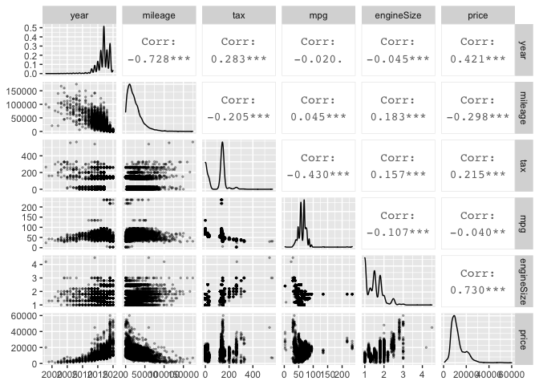
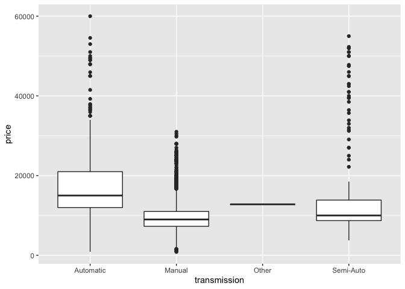
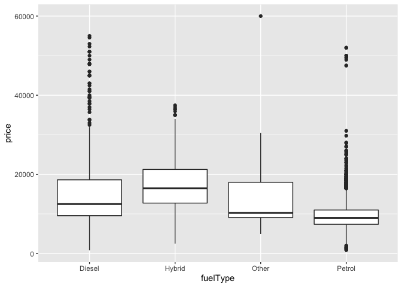
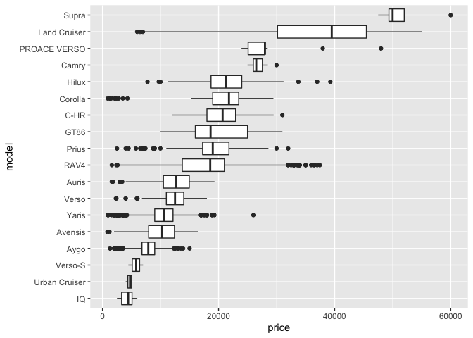
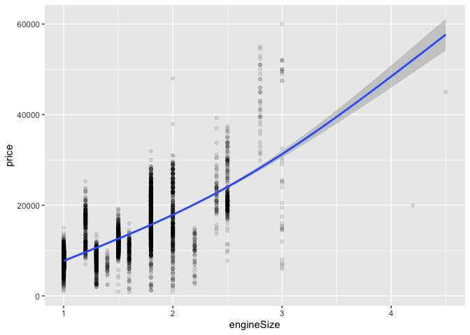
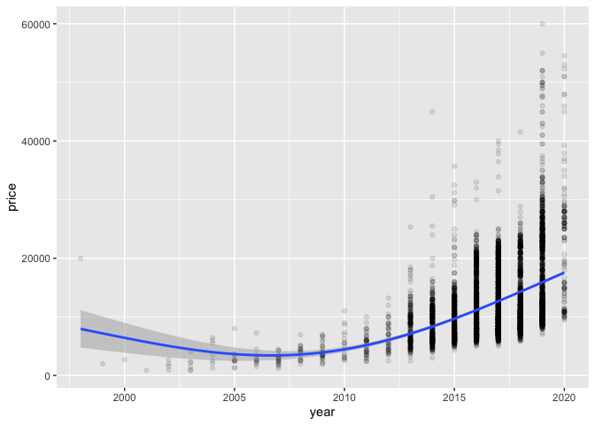
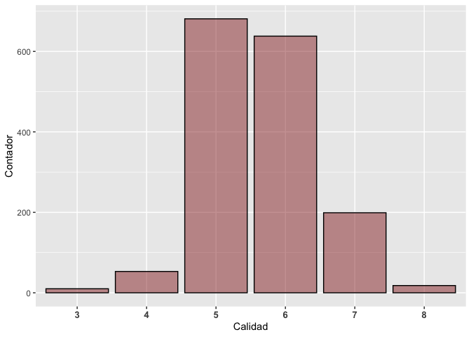
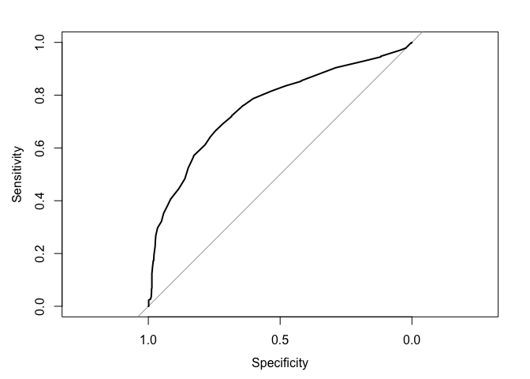
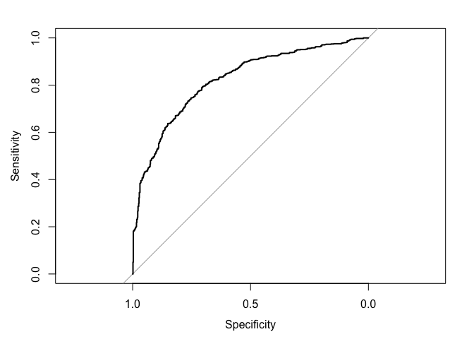

Actividad Ayudantia 9: Regresion Lineal y Regresion Logistica
================

# Objetivo

Para la actividad de esta ayudantía tendrá que utilizar dos datasets, el
primer dataset que utilizar para la regresión lineal será la data de los
autos usados del fabricante toyota. El segundo dataset para la regresión
logística será el dataset de los vinos que hemos utilizado antes, donde
se busca clasificar según la calidad del vino. (Entrega límite:
6/06/2021 23:59)

## Cargar Librerias

``` r
library(tidyverse)
library(GGally)
library(regclass)
library(pROC)
library(rsample)
```

## Cargar Datos

``` r
#setwd("C:/Users/Felipe/Documents/GitHub/Entregas_mineria_de_datos/Ayudantias/Actividad Ayudantia 9")

toyota <- read.csv("toyota.csv")
wine <- read.csv("winequality-red.csv")
```

# Limpieza de datos

## Búsqueda de datos faltantes

``` r
toyota[toyota == ""] <- NA
toyota %>%  summarise_all(funs(sum(is.na(.))))
```

    ## Warning: `funs()` was deprecated in dplyr 0.8.0.
    ## Please use a list of either functions or lambdas: 
    ## 
    ##   # Simple named list: 
    ##   list(mean = mean, median = median)
    ## 
    ##   # Auto named with `tibble::lst()`: 
    ##   tibble::lst(mean, median)
    ## 
    ##   # Using lambdas
    ##   list(~ mean(., trim = .2), ~ median(., na.rm = TRUE))

    ##   model year price transmission mileage fuelType tax mpg engineSize
    ## 1     0    0     0            0       0        0   0   0          0

``` r
wine[wine == ""] <- NA
wine %>%  summarise_all(funs(sum(is.na(.))))
```

    ##   fixed.acidity volatile.acidity citric.acid residual.sugar chlorides
    ## 1             0                0           0              0         0
    ##   free.sulfur.dioxide total.sulfur.dioxide density pH sulphates alcohol quality
    ## 1                   0                    0       0  0         0       0       0

Ninguna Base de Datos tiene datos faltantes

# Regresion Lineal con database Toyota

En este analisis lo que buscaremos es predecir el precio al que
podriamos vender un auto en caso de tener un Toyota. Para esto
transformamos las variables del modelo, transmision y tipo de
combustible, a factores para trabajar con dichos valores como
“etiquetas”

``` r
toyota$model <- as.factor(toyota$model)
toyota$transmission <- as.factor(toyota$transmission)
toyota$fuelType <- as.factor(toyota$fuelType)

summary(toyota)
```

    ##       model           year          price          transmission 
    ##   Yaris  :2122   Min.   :1998   Min.   :  850   Automatic:2657  
    ##   Aygo   :1961   1st Qu.:2016   1st Qu.: 8290   Manual   :3826  
    ##   Auris  : 712   Median :2017   Median :10795   Other    :   1  
    ##   C-HR   : 479   Mean   :2017   Mean   :12522   Semi-Auto: 254  
    ##   RAV4   : 473   3rd Qu.:2018   3rd Qu.:14995                   
    ##   Corolla: 267   Max.   :2020   Max.   :59995                   
    ##  (Other) : 724                                                  
    ##     mileage         fuelType         tax             mpg        
    ##  Min.   :     2   Diesel: 503   Min.   :  0.0   Min.   :  2.80  
    ##  1st Qu.:  9446   Hybrid:2043   1st Qu.:  0.0   1st Qu.: 55.40  
    ##  Median : 18513   Other : 105   Median :135.0   Median : 62.80  
    ##  Mean   : 22857   Petrol:4087   Mean   : 94.7   Mean   : 63.04  
    ##  3rd Qu.: 31064                 3rd Qu.:145.0   3rd Qu.: 69.00  
    ##  Max.   :174419                 Max.   :565.0   Max.   :235.00  
    ##                                                                 
    ##    engineSize   
    ##  Min.   :0.000  
    ##  1st Qu.:1.000  
    ##  Median :1.500  
    ##  Mean   :1.471  
    ##  3rd Qu.:1.800  
    ##  Max.   :4.500  
    ## 

Podemos ver que un valor en el tamaño del motor de 0 no tiene mucho
sentido por lo que revisaremos cuantas observaciones presentan este este
valor, y en caso de haber datos con valor 0 los eliminamos de nuestro
dataset

``` r
toyota %>% filter(engineSize == 0) %>% nrow()
```

    ## [1] 6

``` r
toyota <- toyota %>%  filter(engineSize != 0)

summary(toyota)
```

    ##       model           year          price          transmission 
    ##   Yaris  :2120   Min.   :1998   Min.   :  850   Automatic:2656  
    ##   Aygo   :1958   1st Qu.:2016   1st Qu.: 8290   Manual   :3821  
    ##   Auris  : 712   Median :2017   Median :10795   Other    :   1  
    ##   C-HR   : 478   Mean   :2017   Mean   :12524   Semi-Auto: 254  
    ##   RAV4   : 473   3rd Qu.:2018   3rd Qu.:14995                   
    ##   Corolla: 267   Max.   :2020   Max.   :59995                   
    ##  (Other) : 724                                                  
    ##     mileage         fuelType         tax              mpg        
    ##  Min.   :     2   Diesel: 503   Min.   :  0.00   Min.   :  2.80  
    ##  1st Qu.:  9448   Hybrid:2041   1st Qu.:  0.00   1st Qu.: 55.40  
    ##  Median : 18516   Other : 105   Median :135.00   Median : 62.80  
    ##  Mean   : 22861   Petrol:4083   Mean   : 94.69   Mean   : 63.04  
    ##  3rd Qu.: 31061                 3rd Qu.:145.00   3rd Qu.: 69.00  
    ##  Max.   :174419                 Max.   :565.00   Max.   :235.00  
    ##                                                                  
    ##    engineSize   
    ##  Min.   :1.000  
    ##  1st Qu.:1.000  
    ##  Median :1.500  
    ##  Mean   :1.473  
    ##  3rd Qu.:1.800  
    ##  Max.   :4.500  
    ## 

Una vez ya listo nuestro datos, realizamos una visualizacion de nuestro
datos numericos, para ver la correlacion que pueda existir entre las
variables y la distribucion de los datos.

``` r
toyota %>% select(year, mileage, tax, mpg, engineSize, price) %>% 
  ggpairs(lower = list(continuous = wrap("points", alpha = 0.3, size = 0.5)))
```

<!-- -->

Se pretenden elegir los valores que tengan una mayor asociación entre
alguna variables y el precio, es decir, que tengan una alta correlación
con el precio sin importar si es positiva o negativa.

Revisamos como se distribuyen los datos que pasamos a factor en relacion
al precio, para esto utilizamos los boxplot lo que tambien nos ayudara a
ver si existen valores atipicos que puedan alterar nuestro modelo

``` r
toyota %>% ggplot(aes(transmission, price)) +geom_boxplot()
```

<!-- -->

``` r
toyota %>% ggplot(aes(fuelType, price)) + geom_boxplot()
```

<!-- -->

``` r
toyota %>% mutate(model = reorder(model, price)) %>% ggplot(aes(price, model)) + geom_boxplot()
```

<!-- -->

Existen varios valores atipicos, los cuales son representados por los
puntos negros fuera del rectangulo. Graficamos las cuatro variables con
mayores valores, en donde enginesize es la mas relevante al tener la
mayor magnitud, seguido por el año.

``` r
toyota %>% ggplot(aes(engineSize, price)) +
  geom_point(alpha = .1) +
  stat_smooth(method = "gam", formula = y ~ s(x, k=3))
```

<!-- -->

``` r
toyota %>% ggplot(aes(year, price)) +
  geom_point(alpha = .1) +
  stat_smooth(method = "gam", formula = y ~ s(x, k=3))
```

<!-- -->

Escalamos los datos antes de ralizar el analisis de regresion

``` r
toyota_sca <- toyota
toyota_sca[,c(2,3,5,7,8,9)] <- scale(toyota_sca[,c(2,3,5,7,8,9)])

toyota_sca %>%  head()
```

    ##   model       year     price transmission     mileage fuelType       tax
    ## 1  GT86 -0.3390016 0.5476207       Manual  0.06418306   Petrol 2.3050056
    ## 2  GT86  0.1146177 0.5468329       Manual -0.22202169   Petrol 0.6808592
    ## 3  GT86 -0.7926209 0.2322067       Manual  0.24090429   Petrol 2.3050056
    ## 4  GT86  0.1146177 1.0199538       Manual -0.42483283   Petrol 0.7485320
    ## 5  GT86  0.1146177 0.7836297       Manual  0.70179118   Petrol 0.6808592
    ## 6  GT86  0.1146177 0.5473056       Manual  0.21214788   Petrol 2.2373329
    ##         mpg engineSize
    ## 1 -1.694806   1.214812
    ## 2 -1.694806   1.214812
    ## 3 -1.694806   1.214812
    ## 4 -1.694806   1.214812
    ## 5 -1.694806   1.214812
    ## 6 -1.694806   1.214812

## Regresion simple con el tamaño del motor para predecir el precio

``` r
reg_simp <- lm(price ~ engineSize, data = toyota)
summary(reg_simp)
```

    ## 
    ## Call:
    ## lm(formula = price ~ engineSize, data = toyota)
    ## 
    ## Residuals:
    ##      Min       1Q   Median       3Q      Max 
    ## -22860.9  -2245.0   -476.9   1733.1  31159.1 
    ## 
    ## Coefficients:
    ##             Estimate Std. Error t value Pr(>|t|)    
    ## (Intercept)  -3202.6      186.9  -17.14   <2e-16 ***
    ## engineSize   10679.5      121.7   87.74   <2e-16 ***
    ## ---
    ## Signif. codes:  0 '***' 0.001 '**' 0.01 '*' 0.05 '.' 0.1 ' ' 1
    ## 
    ## Residual standard error: 4335 on 6730 degrees of freedom
    ## Multiple R-squared:  0.5336, Adjusted R-squared:  0.5335 
    ## F-statistic:  7698 on 1 and 6730 DF,  p-value: < 2.2e-16

Solo se explica el 53% del modelo. Los resultados de la regresion nos
indican que los valores de los parametros son -3202.6 para el intercepto
y 10679.5 para el coeficiente asociado a la variable del tamaño del
motor.

## Regresion multiple con el tamaño del motor y el año para predecir el precio

``` r
reg_mult <- lm(price ~ engineSize + year*mileage, data = toyota_sca)
summary(reg_mult)
```

    ## 
    ## Call:
    ## lm(formula = price ~ engineSize + year * mileage, data = toyota_sca)
    ## 
    ## Residuals:
    ##     Min      1Q  Median      3Q     Max 
    ## -1.8963 -0.2812 -0.0483  0.2135  4.2299 
    ## 
    ## Coefficients:
    ##               Estimate Std. Error t value Pr(>|t|)    
    ## (Intercept)  -0.025365   0.006268  -4.047 5.25e-05 ***
    ## engineSize    0.782020   0.006023 129.831  < 2e-16 ***
    ## year          0.318898   0.009085  35.103  < 2e-16 ***
    ## mileage      -0.255628   0.008967 -28.507  < 2e-16 ***
    ## year:mileage -0.034854   0.003055 -11.409  < 2e-16 ***
    ## ---
    ## Signif. codes:  0 '***' 0.001 '**' 0.01 '*' 0.05 '.' 0.1 ' ' 1
    ## 
    ## Residual standard error: 0.4808 on 6727 degrees of freedom
    ## Multiple R-squared:  0.7689, Adjusted R-squared:  0.7688 
    ## F-statistic:  5597 on 4 and 6727 DF,  p-value: < 2.2e-16

Se evdiencia una mejora al incluir una nueva variable para explicar el
modelo dado que ahora se explica un 76,8% de la varianza. Ademas, todas
las variables resultan ser significativas para el modelo.

## VIF

Revisamos el valor del factor de inflacion de la varianza, este factor
nos permite entender la colinealidad de los datos. Un VIF por encima de
4 o una tolerancia por debajo de 0,25 indica que podría existir
multicolinealidad y se requiere más investigación.

``` r
VIF(reg_mult)
```

    ##   engineSize         year      mileage year:mileage 
    ##     1.056272     2.402696     2.341074     1.590928

Los valores referentes al estudio del VIF no presentan multicolinealidad
y no se necesita alguna modificación al respecto.

# Regresion Logistica con data de Vinos

Se pretende predecir la calidad del vino a partir de diversas variables.

## Visualización de la data

``` r
glimpse(wine)
```

    ## Rows: 1,599
    ## Columns: 12
    ## $ fixed.acidity        <dbl> 7.4, 7.8, 7.8, 11.2, 7.4, 7.4, 7.9, 7.3, 7.8, 7.5…
    ## $ volatile.acidity     <dbl> 0.700, 0.880, 0.760, 0.280, 0.700, 0.660, 0.600, …
    ## $ citric.acid          <dbl> 0.00, 0.00, 0.04, 0.56, 0.00, 0.00, 0.06, 0.00, 0…
    ## $ residual.sugar       <dbl> 1.9, 2.6, 2.3, 1.9, 1.9, 1.8, 1.6, 1.2, 2.0, 6.1,…
    ## $ chlorides            <dbl> 0.076, 0.098, 0.092, 0.075, 0.076, 0.075, 0.069, …
    ## $ free.sulfur.dioxide  <dbl> 11, 25, 15, 17, 11, 13, 15, 15, 9, 17, 15, 17, 16…
    ## $ total.sulfur.dioxide <dbl> 34, 67, 54, 60, 34, 40, 59, 21, 18, 102, 65, 102,…
    ## $ density              <dbl> 0.9978, 0.9968, 0.9970, 0.9980, 0.9978, 0.9978, 0…
    ## $ pH                   <dbl> 3.51, 3.20, 3.26, 3.16, 3.51, 3.51, 3.30, 3.39, 3…
    ## $ sulphates            <dbl> 0.56, 0.68, 0.65, 0.58, 0.56, 0.56, 0.46, 0.47, 0…
    ## $ alcohol              <dbl> 9.4, 9.8, 9.8, 9.8, 9.4, 9.4, 9.4, 10.0, 9.5, 10.…
    ## $ quality              <int> 5, 5, 5, 6, 5, 5, 5, 7, 7, 5, 5, 5, 5, 5, 5, 5, 7…

``` r
attach(wine)

ggplot(wine,aes(x=factor(quality))) +
  geom_bar(col ="black",fill="#993333",alpha=0.5) +
  theme(axis.text.x = element_text(face="bold", size=10)) +
  scale_x_discrete("Calidad") +
  scale_y_continuous("Contador")
```

<!-- -->

Ahora, revisemos las variables que determinan la calidad. Es dificil
hacer algunos de los graficos que se vieron en la ayudantia dado que
este dataset de vinos tiene muchos valores distintos por cada variable,
lo cual dificulta la realización de etiquetas tipo “se cancela” o “no se
cancela” como en la ayudantía. De hacerlo asi habría millones de
etiquetas por cada valor diferente en una variable.

## Segmentar variable Quality

Se va a crear una variable booleana (simulando el “yes” o el “No” de la
ayudantía para poder ocupar el modelo). Dado que la calidad va desde 3
hasta 8, se utilizará la mitad de este intervalo para dividir los
valores de alcohol.

``` r
summary(wine)
```

    ##  fixed.acidity   volatile.acidity  citric.acid    residual.sugar  
    ##  Min.   : 4.60   Min.   :0.1200   Min.   :0.000   Min.   : 0.900  
    ##  1st Qu.: 7.10   1st Qu.:0.3900   1st Qu.:0.090   1st Qu.: 1.900  
    ##  Median : 7.90   Median :0.5200   Median :0.260   Median : 2.200  
    ##  Mean   : 8.32   Mean   :0.5278   Mean   :0.271   Mean   : 2.539  
    ##  3rd Qu.: 9.20   3rd Qu.:0.6400   3rd Qu.:0.420   3rd Qu.: 2.600  
    ##  Max.   :15.90   Max.   :1.5800   Max.   :1.000   Max.   :15.500  
    ##    chlorides       free.sulfur.dioxide total.sulfur.dioxide    density      
    ##  Min.   :0.01200   Min.   : 1.00       Min.   :  6.00       Min.   :0.9901  
    ##  1st Qu.:0.07000   1st Qu.: 7.00       1st Qu.: 22.00       1st Qu.:0.9956  
    ##  Median :0.07900   Median :14.00       Median : 38.00       Median :0.9968  
    ##  Mean   :0.08747   Mean   :15.87       Mean   : 46.47       Mean   :0.9967  
    ##  3rd Qu.:0.09000   3rd Qu.:21.00       3rd Qu.: 62.00       3rd Qu.:0.9978  
    ##  Max.   :0.61100   Max.   :72.00       Max.   :289.00       Max.   :1.0037  
    ##        pH          sulphates         alcohol         quality     
    ##  Min.   :2.740   Min.   :0.3300   Min.   : 8.40   Min.   :3.000  
    ##  1st Qu.:3.210   1st Qu.:0.5500   1st Qu.: 9.50   1st Qu.:5.000  
    ##  Median :3.310   Median :0.6200   Median :10.20   Median :6.000  
    ##  Mean   :3.311   Mean   :0.6581   Mean   :10.42   Mean   :5.636  
    ##  3rd Qu.:3.400   3rd Qu.:0.7300   3rd Qu.:11.10   3rd Qu.:6.000  
    ##  Max.   :4.010   Max.   :2.0000   Max.   :14.90   Max.   :8.000

``` r
for(i in 1:dim(wine)){
  if (quality[i]>= 5.5)
     wine$quality_segmentado[i]=1
  if (quality[i]< 5.5)
    wine$quality_segmentado[i]=0
}
```

    ## Warning in 1:dim(wine): numerical expression has 2 elements: only the first used

``` r
attach(wine)
```

    ## The following objects are masked from wine (pos = 3):
    ## 
    ##     alcohol, chlorides, citric.acid, density, fixed.acidity,
    ##     free.sulfur.dioxide, pH, quality, residual.sugar, sulphates,
    ##     total.sulfur.dioxide, volatile.acidity

## Regresión Logistica Simple para predecir Calidad desde la cantidad de alcohol

``` r
set.seed(369)
summary(wine)
```

    ##  fixed.acidity   volatile.acidity  citric.acid    residual.sugar  
    ##  Min.   : 4.60   Min.   :0.1200   Min.   :0.000   Min.   : 0.900  
    ##  1st Qu.: 7.10   1st Qu.:0.3900   1st Qu.:0.090   1st Qu.: 1.900  
    ##  Median : 7.90   Median :0.5200   Median :0.260   Median : 2.200  
    ##  Mean   : 8.32   Mean   :0.5278   Mean   :0.271   Mean   : 2.539  
    ##  3rd Qu.: 9.20   3rd Qu.:0.6400   3rd Qu.:0.420   3rd Qu.: 2.600  
    ##  Max.   :15.90   Max.   :1.5800   Max.   :1.000   Max.   :15.500  
    ##    chlorides       free.sulfur.dioxide total.sulfur.dioxide    density      
    ##  Min.   :0.01200   Min.   : 1.00       Min.   :  6.00       Min.   :0.9901  
    ##  1st Qu.:0.07000   1st Qu.: 7.00       1st Qu.: 22.00       1st Qu.:0.9956  
    ##  Median :0.07900   Median :14.00       Median : 38.00       Median :0.9968  
    ##  Mean   :0.08747   Mean   :15.87       Mean   : 46.47       Mean   :0.9967  
    ##  3rd Qu.:0.09000   3rd Qu.:21.00       3rd Qu.: 62.00       3rd Qu.:0.9978  
    ##  Max.   :0.61100   Max.   :72.00       Max.   :289.00       Max.   :1.0037  
    ##        pH          sulphates         alcohol         quality     
    ##  Min.   :2.740   Min.   :0.3300   Min.   : 8.40   Min.   :3.000  
    ##  1st Qu.:3.210   1st Qu.:0.5500   1st Qu.: 9.50   1st Qu.:5.000  
    ##  Median :3.310   Median :0.6200   Median :10.20   Median :6.000  
    ##  Mean   :3.311   Mean   :0.6581   Mean   :10.42   Mean   :5.636  
    ##  3rd Qu.:3.400   3rd Qu.:0.7300   3rd Qu.:11.10   3rd Qu.:6.000  
    ##  Max.   :4.010   Max.   :2.0000   Max.   :14.90   Max.   :8.000  
    ##  quality_segmentado
    ##  Min.   :0.0000    
    ##  1st Qu.:0.0000    
    ##  Median :1.0000    
    ##  Mean   :0.5347    
    ##  3rd Qu.:1.0000    
    ##  Max.   :1.0000

``` r
glm.fit <- glm(quality_segmentado ~ alcohol, data = wine , family = "binomial")
summary(glm.fit)
```

    ## 
    ## Call:
    ## glm(formula = quality_segmentado ~ alcohol, family = "binomial", 
    ##     data = wine)
    ## 
    ## Deviance Residuals: 
    ##     Min       1Q   Median       3Q      Max  
    ## -3.1535  -0.9243   0.3901   0.9615   2.0179  
    ## 
    ## Coefficients:
    ##              Estimate Std. Error z value Pr(>|z|)    
    ## (Intercept) -10.76302    0.68326  -15.75   <2e-16 ***
    ## alcohol       1.05559    0.06663   15.84   <2e-16 ***
    ## ---
    ## Signif. codes:  0 '***' 0.001 '**' 0.01 '*' 0.05 '.' 0.1 ' ' 1
    ## 
    ## (Dispersion parameter for binomial family taken to be 1)
    ## 
    ##     Null deviance: 2209  on 1598  degrees of freedom
    ## Residual deviance: 1865  on 1597  degrees of freedom
    ## AIC: 1869
    ## 
    ## Number of Fisher Scoring iterations: 4

## Curva ROC

``` r
prob <- predict(glm.fit, type = c("response"))
wine$prob <- prob
curva_roc <- roc(quality_segmentado ~ prob, data = wine)
```

    ## Setting levels: control = 0, case = 1

    ## Setting direction: controls < cases

``` r
plot(curva_roc)
```

<!-- -->

``` r
auc(curva_roc)
```

    ## Area under the curve: 0.7566

La curva ROC arroja un resultado del 75%, lo cual indica una alta
explicación de modelo pero es importante destacar que la segmentación
utilizada sesga el modelo.

## Regresión Logistica Multiple para predecir Calidad desde todas las variables restantes

``` r
wine$prob <- NULL
modelo_log_multi <- glm(quality_segmentado ~ alcohol + sulphates  + pH + density + total.sulfur.dioxide + free.sulfur.dioxide + chlorides + residual.sugar + citric.acid + volatile.acidity, wine, family = "binomial")
summary(modelo_log_multi)
```

    ## 
    ## Call:
    ## glm(formula = quality_segmentado ~ alcohol + sulphates + pH + 
    ##     density + total.sulfur.dioxide + free.sulfur.dioxide + chlorides + 
    ##     residual.sugar + citric.acid + volatile.acidity, family = "binomial", 
    ##     data = wine)
    ## 
    ## Deviance Residuals: 
    ##     Min       1Q   Median       3Q      Max  
    ## -3.2543  -0.8439   0.3219   0.8368   2.3509  
    ## 
    ## Coefficients:
    ##                        Estimate Std. Error z value Pr(>|z|)    
    ## (Intercept)          -41.445194  50.905509  -0.814  0.41555    
    ## alcohol                0.939250   0.090415  10.388  < 2e-16 ***
    ## sulphates              2.702183   0.447817   6.034 1.60e-09 ***
    ## pH                    -1.110919   0.487590  -2.278  0.02270 *  
    ## density               36.656568  50.718213   0.723  0.46983    
    ## total.sulfur.dioxide  -0.017337   0.002819  -6.151 7.72e-10 ***
    ## free.sulfur.dioxide    0.023612   0.008164   2.892  0.00383 ** 
    ## chlorides             -4.447433   1.522762  -2.921  0.00349 ** 
    ## residual.sugar         0.022506   0.048312   0.466  0.64133    
    ## citric.acid           -1.001091   0.526949  -1.900  0.05746 .  
    ## volatile.acidity      -3.241689   0.487581  -6.649 2.96e-11 ***
    ## ---
    ## Signif. codes:  0 '***' 0.001 '**' 0.01 '*' 0.05 '.' 0.1 ' ' 1
    ## 
    ## (Dispersion parameter for binomial family taken to be 1)
    ## 
    ##     Null deviance: 2209.0  on 1598  degrees of freedom
    ## Residual deviance: 1657.5  on 1588  degrees of freedom
    ## AIC: 1679.5
    ## 
    ## Number of Fisher Scoring iterations: 4

``` r
prob_multi <- predict(modelo_log_multi, type = c("response"))
wine$prob_multi <- prob_multi
curva_roc_multi <- roc(quality_segmentado ~ prob_multi, data = wine)
```

    ## Setting levels: control = 0, case = 1

    ## Setting direction: controls < cases

``` r
plot(curva_roc_multi)
```

<!-- -->

``` r
auc(curva_roc_multi)
```

    ## Area under the curve: 0.8213

La curva mejora dado que ahora se explica un 82% del modelo.

## Ocupando Modelos de Entrenamiento

``` r
set.seed(369)
data_split <- initial_split(wine,prop = 0.7,strata = NULL)

train_data <- training(data_split) %>% as.data.frame() 
test_data <- testing(data_split) %>%  as.data.frame()

modelo_log_multi1 <- glm(quality_segmentado ~ alcohol + sulphates  + pH + density + total.sulfur.dioxide + free.sulfur.dioxide + chlorides + residual.sugar + citric.acid + volatile.acidity, wine, family = "binomial")
summary(modelo_log_multi1)
```

    ## 
    ## Call:
    ## glm(formula = quality_segmentado ~ alcohol + sulphates + pH + 
    ##     density + total.sulfur.dioxide + free.sulfur.dioxide + chlorides + 
    ##     residual.sugar + citric.acid + volatile.acidity, family = "binomial", 
    ##     data = wine)
    ## 
    ## Deviance Residuals: 
    ##     Min       1Q   Median       3Q      Max  
    ## -3.2543  -0.8439   0.3219   0.8368   2.3509  
    ## 
    ## Coefficients:
    ##                        Estimate Std. Error z value Pr(>|z|)    
    ## (Intercept)          -41.445194  50.905509  -0.814  0.41555    
    ## alcohol                0.939250   0.090415  10.388  < 2e-16 ***
    ## sulphates              2.702183   0.447817   6.034 1.60e-09 ***
    ## pH                    -1.110919   0.487590  -2.278  0.02270 *  
    ## density               36.656568  50.718213   0.723  0.46983    
    ## total.sulfur.dioxide  -0.017337   0.002819  -6.151 7.72e-10 ***
    ## free.sulfur.dioxide    0.023612   0.008164   2.892  0.00383 ** 
    ## chlorides             -4.447433   1.522762  -2.921  0.00349 ** 
    ## residual.sugar         0.022506   0.048312   0.466  0.64133    
    ## citric.acid           -1.001091   0.526949  -1.900  0.05746 .  
    ## volatile.acidity      -3.241689   0.487581  -6.649 2.96e-11 ***
    ## ---
    ## Signif. codes:  0 '***' 0.001 '**' 0.01 '*' 0.05 '.' 0.1 ' ' 1
    ## 
    ## (Dispersion parameter for binomial family taken to be 1)
    ## 
    ##     Null deviance: 2209.0  on 1598  degrees of freedom
    ## Residual deviance: 1657.5  on 1588  degrees of freedom
    ## AIC: 1679.5
    ## 
    ## Number of Fisher Scoring iterations: 4

``` r
test_data$prob_multi <- predict(modelo_log_multi1, test_data, type = c("response"))
auc(roc(quality_segmentado ~ prob_multi, data = test_data))
```

    ## Setting levels: control = 0, case = 1

    ## Setting direction: controls < cases

    ## Area under the curve: 0.8467

La predicción mejora dado que se explica un 2% mas que antes al utilizar
la misma cantidad de variables.
