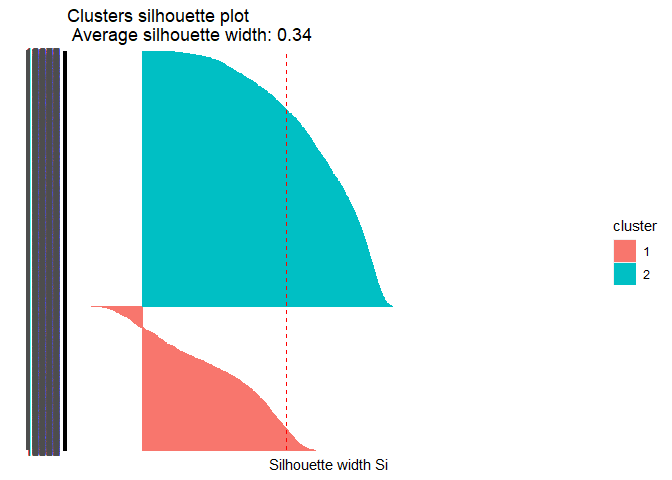
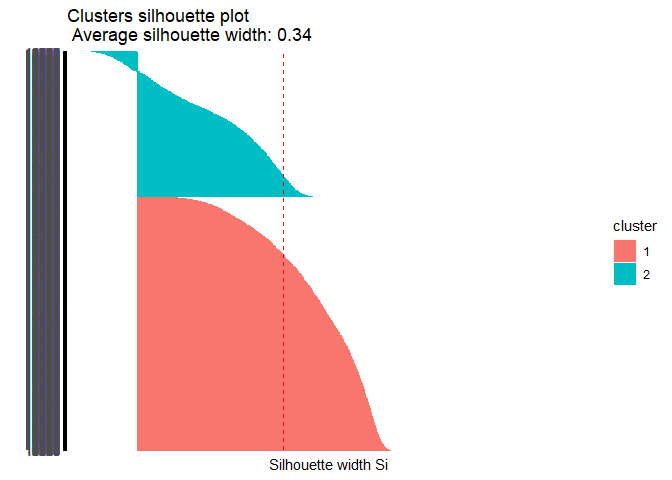
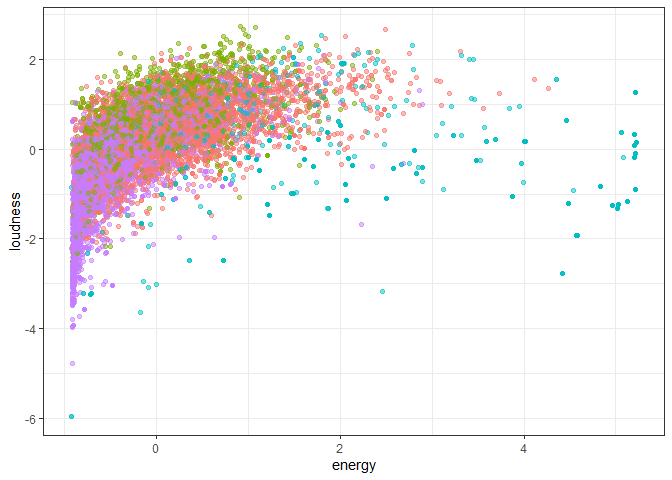
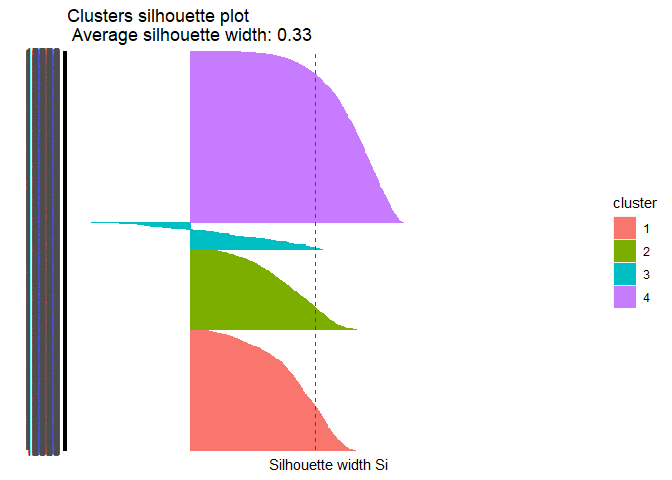

Entrega Proyecto 2
================

## Objetivo

El objetivo principal de este encargo es crear un programa computacional
que permita crear una lista de reproducción de 3 horas de duración
basándose en alguna canción de referencia. La base de datos incluye
447.622 canciones, con 36 de las variables descritas en la documentación
de la API.

## Importar Librerias

``` r
library(tidyverse)
```

    ## ── Attaching packages ─────────────────────────────────────── tidyverse 1.3.1 ──

    ## ✓ ggplot2 3.3.3     ✓ purrr   0.3.4
    ## ✓ tibble  3.1.1     ✓ dplyr   1.0.6
    ## ✓ tidyr   1.1.3     ✓ stringr 1.4.0
    ## ✓ readr   1.4.0     ✓ forcats 0.5.1

    ## ── Conflicts ────────────────────────────────────────── tidyverse_conflicts() ──
    ## x dplyr::filter() masks stats::filter()
    ## x dplyr::lag()    masks stats::lag()

``` r
library(cluster)
library(factoextra)
```

    ## Welcome! Want to learn more? See two factoextra-related books at https://goo.gl/ve3WBa

``` r
library(janitor)
```

    ## 
    ## Attaching package: 'janitor'

    ## The following objects are masked from 'package:stats':
    ## 
    ##     chisq.test, fisher.test

``` r
library(lattice)
library(stats4)
library(flexclust)
```

    ## Loading required package: grid

    ## Loading required package: modeltools

``` r
library(ggdendro)
```

## Importar datos

``` r
#setwd("C:/Users/Felipe/Documents/GitHub/Entregas_mineria_de_datos/Proyecto 2")
load(file="beats.RData")

summary(beats)
```

    ##  artist_name         artist_id           album_id          album_type       
    ##  Length:447622      Length:447622      Length:447622      Length:447622     
    ##  Class :character   Class :character   Class :character   Class :character  
    ##  Mode  :character   Mode  :character   Mode  :character   Mode  :character  
    ##                                                                             
    ##                                                                             
    ##                                                                             
    ##                                                                             
    ##  album_release_date album_release_year album_release_date_precision
    ##  Length:447622      Min.   :   0       Length:447622               
    ##  Class :character   1st Qu.:2010       Class :character            
    ##  Mode  :character   Median :2019       Mode  :character            
    ##                     Mean   :2013                                   
    ##                     3rd Qu.:2020                                   
    ##                     Max.   :2021                                   
    ##                     NA's   :447                                    
    ##   danceability        energy            key            loudness      
    ##  Min.   :0.0000   Min.   :0.0000   Min.   : 0.000   Min.   :-60.000  
    ##  1st Qu.:0.2520   1st Qu.:0.0756   1st Qu.: 2.000   1st Qu.:-24.445  
    ##  Median :0.3700   Median :0.2100   Median : 5.000   Median :-19.477  
    ##  Mean   :0.3911   Mean   :0.3405   Mean   : 5.061   Mean   :-18.672  
    ##  3rd Qu.:0.5140   3rd Qu.:0.5820   3rd Qu.: 8.000   3rd Qu.:-11.644  
    ##  Max.   :0.9860   Max.   :1.0000   Max.   :11.000   Max.   :  0.496  
    ##                                                                      
    ##       mode         speechiness       acousticness    instrumentalness 
    ##  Min.   :0.0000   Min.   :0.00000   Min.   :0.0000   Min.   :0.00000  
    ##  1st Qu.:0.0000   1st Qu.:0.03780   1st Qu.:0.3940   1st Qu.:0.00169  
    ##  Median :1.0000   Median :0.04430   Median :0.9230   Median :0.71500  
    ##  Mean   :0.6834   Mean   :0.06892   Mean   :0.6987   Mean   :0.50607  
    ##  3rd Qu.:1.0000   3rd Qu.:0.05840   3rd Qu.:0.9860   3rd Qu.:0.90100  
    ##  Max.   :1.0000   Max.   :0.97100   Max.   :0.9960   Max.   :1.00000  
    ##                                                                       
    ##     liveness         valence           tempo          track_id        
    ##  Min.   :0.0000   Min.   :0.0000   Min.   :  0.00   Length:447622     
    ##  1st Qu.:0.0968   1st Qu.:0.0894   1st Qu.: 82.39   Class :character  
    ##  Median :0.1230   Median :0.2740   Median :105.72   Mode  :character  
    ##  Mean   :0.2217   Mean   :0.3374   Mean   :108.74                     
    ##  3rd Qu.:0.2530   3rd Qu.:0.5370   3rd Qu.:131.05                     
    ##  Max.   :1.0000   Max.   :0.9960   Max.   :244.95                     
    ##                                                                       
    ##  analysis_url       time_signature   disc_number      duration_ms     
    ##  Length:447622      Min.   :0.000   Min.   : 1.000   Min.   :   1066  
    ##  Class :character   1st Qu.:4.000   1st Qu.: 1.000   1st Qu.: 123440  
    ##  Mode  :character   Median :4.000   Median : 1.000   Median : 194961  
    ##                     Mean   :3.728   Mean   : 1.212   Mean   : 229110  
    ##                     3rd Qu.:4.000   3rd Qu.: 1.000   3rd Qu.: 271560  
    ##                     Max.   :5.000   Max.   :26.000   Max.   :4796395  
    ##                                                                       
    ##   explicit        track_href         is_local        track_name       
    ##  Mode :logical   Length:447622      Mode :logical   Length:447622     
    ##  FALSE:442045    Class :character   FALSE:447622    Class :character  
    ##  TRUE :5577      Mode  :character                   Mode  :character  
    ##                                                                       
    ##                                                                       
    ##                                                                       
    ##                                                                       
    ##  track_preview_url   track_number       type            track_uri        
    ##  Length:447622      Min.   :  1.0   Length:447622      Length:447622     
    ##  Class :character   1st Qu.:  6.0   Class :character   Class :character  
    ##  Mode  :character   Median : 11.0   Mode  :character   Mode  :character  
    ##                     Mean   : 44.6                                        
    ##                     3rd Qu.: 30.0                                        
    ##                     Max.   :545.0                                        
    ##                                                                          
    ##  external_urls.spotify  album_name          key_name          mode_name        
    ##  Length:447622         Length:447622      Length:447622      Length:447622     
    ##  Class :character      Class :character   Class :character   Class :character  
    ##  Mode  :character      Mode  :character   Mode  :character   Mode  :character  
    ##                                                                                
    ##                                                                                
    ##                                                                                
    ##                                                                                
    ##    key_mode        
    ##  Length:447622     
    ##  Class :character  
    ##  Mode  :character  
    ##                    
    ##                    
    ##                    
    ## 

``` r
head(beats)
```

    ##   artist_name              artist_id               album_id album_type
    ## 1        2Pac 1ZwdS5xdxEREPySFridCfh 1nGbXgS6toEOcFCDwEl5R3      album
    ## 2        2Pac 1ZwdS5xdxEREPySFridCfh 1nGbXgS6toEOcFCDwEl5R3      album
    ## 3        2Pac 1ZwdS5xdxEREPySFridCfh 1nGbXgS6toEOcFCDwEl5R3      album
    ## 4        2Pac 1ZwdS5xdxEREPySFridCfh 1nGbXgS6toEOcFCDwEl5R3      album
    ## 5        2Pac 1ZwdS5xdxEREPySFridCfh 1nGbXgS6toEOcFCDwEl5R3      album
    ## 6        2Pac 1ZwdS5xdxEREPySFridCfh 1nGbXgS6toEOcFCDwEl5R3      album
    ##   album_release_date album_release_year album_release_date_precision
    ## 1         2019-08-01               2019                          day
    ## 2         2019-08-01               2019                          day
    ## 3         2019-08-01               2019                          day
    ## 4         2019-08-01               2019                          day
    ## 5         2019-08-01               2019                          day
    ## 6         2019-08-01               2019                          day
    ##   danceability energy key loudness mode speechiness acousticness
    ## 1        0.656  0.882   0   -3.011    1      0.0941      0.03300
    ## 2        0.810  0.642   8   -8.647    1      0.2440      0.04800
    ## 3        0.548  0.590   4   -9.301    0      0.4750      0.11300
    ## 4        0.839  0.657   5   -4.959    0      0.2220      0.05260
    ## 5        0.854  0.694   0   -4.258    0      0.1230      0.00944
    ## 6        0.697  0.598   2   -9.604    1      0.1360      0.00522
    ##   instrumentalness liveness valence   tempo               track_id
    ## 1         0.000000   0.6700   0.782  91.661 6ayeqYtOtwVhqVB6k6MKoh
    ## 2         0.000000   0.2640   0.694  90.956 1UDsnzBp8gUCFsrzUDlZI9
    ## 3         0.000722   0.2290   0.267  87.841 3bKs15o7F9VP6GBExCbb6H
    ## 4         0.000106   0.3910   0.615  85.111 4L0iAst3yLonw8aGxTRCvb
    ## 5         0.071900   0.0767   0.776 104.379 66men3J5qFERvIY06M5hQ9
    ## 6         0.000000   0.1720   0.387  85.862 7GVCAVH7SZnjrzHI1FmfeA
    ##                                                       analysis_url
    ## 1 https://api.spotify.com/v1/audio-analysis/6ayeqYtOtwVhqVB6k6MKoh
    ## 2 https://api.spotify.com/v1/audio-analysis/1UDsnzBp8gUCFsrzUDlZI9
    ## 3 https://api.spotify.com/v1/audio-analysis/3bKs15o7F9VP6GBExCbb6H
    ## 4 https://api.spotify.com/v1/audio-analysis/4L0iAst3yLonw8aGxTRCvb
    ## 5 https://api.spotify.com/v1/audio-analysis/66men3J5qFERvIY06M5hQ9
    ## 6 https://api.spotify.com/v1/audio-analysis/7GVCAVH7SZnjrzHI1FmfeA
    ##   time_signature disc_number duration_ms explicit
    ## 1              4           1      347973    FALSE
    ## 2              4           1      241026    FALSE
    ## 3              4           1      240013    FALSE
    ## 4              4           1      295026    FALSE
    ## 5              4           1      241000    FALSE
    ## 6              4           1      224026    FALSE
    ##                                                 track_href is_local
    ## 1 https://api.spotify.com/v1/tracks/6ayeqYtOtwVhqVB6k6MKoh    FALSE
    ## 2 https://api.spotify.com/v1/tracks/1UDsnzBp8gUCFsrzUDlZI9    FALSE
    ## 3 https://api.spotify.com/v1/tracks/3bKs15o7F9VP6GBExCbb6H    FALSE
    ## 4 https://api.spotify.com/v1/tracks/4L0iAst3yLonw8aGxTRCvb    FALSE
    ## 5 https://api.spotify.com/v1/tracks/66men3J5qFERvIY06M5hQ9    FALSE
    ## 6 https://api.spotify.com/v1/tracks/7GVCAVH7SZnjrzHI1FmfeA    FALSE
    ##               track_name
    ## 1        California Love
    ## 2 Slippin' Into Darkness
    ## 3            Ride or Die
    ## 4     I Ain't Mad At Cha
    ## 5              Static II
    ## 6                Runnin'
    ##                                                                                             track_preview_url
    ## 1 https://p.scdn.co/mp3-preview/93e456ef0b73f23f50eeadaeaad852d79d4f4610?cid=ac26d97eca664234ab133e5208ea5737
    ## 2 https://p.scdn.co/mp3-preview/440595604d3f49464bcf28efc867f7df31d62e53?cid=ac26d97eca664234ab133e5208ea5737
    ## 3 https://p.scdn.co/mp3-preview/cc18dc90d609d37591e5993615a0cea1fa25f428?cid=ac26d97eca664234ab133e5208ea5737
    ## 4 https://p.scdn.co/mp3-preview/d138f0170423cd9a14f31006d4add57c07f705c4?cid=ac26d97eca664234ab133e5208ea5737
    ## 5 https://p.scdn.co/mp3-preview/dddb7d0ea0205338a00c591e6045b0c21cd7c9fc?cid=ac26d97eca664234ab133e5208ea5737
    ## 6 https://p.scdn.co/mp3-preview/fc169c99acc9d8bb19b34cf1aaad9f1b0b9b68e8?cid=ac26d97eca664234ab133e5208ea5737
    ##   track_number  type                            track_uri
    ## 1            1 track spotify:track:6ayeqYtOtwVhqVB6k6MKoh
    ## 2            2 track spotify:track:1UDsnzBp8gUCFsrzUDlZI9
    ## 3            3 track spotify:track:3bKs15o7F9VP6GBExCbb6H
    ## 4            4 track spotify:track:4L0iAst3yLonw8aGxTRCvb
    ## 5            5 track spotify:track:66men3J5qFERvIY06M5hQ9
    ## 6            6 track spotify:track:7GVCAVH7SZnjrzHI1FmfeA
    ##                                   external_urls.spotify      album_name
    ## 1 https://open.spotify.com/track/6ayeqYtOtwVhqVB6k6MKoh California Love
    ## 2 https://open.spotify.com/track/1UDsnzBp8gUCFsrzUDlZI9 California Love
    ## 3 https://open.spotify.com/track/3bKs15o7F9VP6GBExCbb6H California Love
    ## 4 https://open.spotify.com/track/4L0iAst3yLonw8aGxTRCvb California Love
    ## 5 https://open.spotify.com/track/66men3J5qFERvIY06M5hQ9 California Love
    ## 6 https://open.spotify.com/track/7GVCAVH7SZnjrzHI1FmfeA California Love
    ##   key_name mode_name key_mode
    ## 1        C     major  C major
    ## 2       G#     major G# major
    ## 3        E     minor  E minor
    ## 4        F     minor  F minor
    ## 5        C     minor  C minor
    ## 6        D     major  D major

## Elección de variables

De las 36 columnas que entrega la base de datos, muchass de ellas no son
necesarias ni utiles para el trabajo. Se procede a eliminar las columnas
de: - Artist\_id: El nombre del artista entrega mas información que su
ID dentro de la base de datos y el ID es mas dificil de analizar
visualmente que el nombre - Album\_id: El id del album no es relevante
para el trabajo. - Album\_type: Saber que la canción esta en un album no
aytuda a identificiar similitudes entre las canciones -
Album\_release\_day: Al ser una información demasiado especifica, es
preferible utilizar solo el año de la canción para establecer
similitudes. - Album\_release\_day\_presition: No aporta información
ademas de especificar que la canción fue liberada en un dia

  - Track\_id: No aporta info

  - Analysis\_url: No aporta info para buscar semejanzas

  - Time\_signature:

  - Disc\_number:

  - Explicit:

  - Track\_href:

  - is\_local:

  - Track\_preview\_url:

  - Track\_number:

  - Type:

  - Track\_url:

  - External\_url\_spotify:

  - 
<!-- end list -->

``` r
beats=beats[,c(1,6,8:18,19,23,27,33:36)]
```

\#\#Selección de Data

Debido a la gran cantidad de datos, algunas funciones y graficas saturan
las capacidades del computador, por lo cual es necesario realizar una
muestra. El procedimiento consiste en generar una muestra aleatoria
simple sin reemplazo a traves de la función “sample()” con una cantidad
de 20.000 datos. Es necesario validar que esta muestre represente a la
base de datos asignada por lo cual se compararan las estadisticas de
estas agrupaciones de datos a traves de la función “summary”.

``` r
sample_index <- sample(1:nrow(beats),20000, replace = F)
sample_data = beats[sample_index,]

summary(sample_data)
```

    ##  artist_name        album_release_year  danceability        energy         
    ##  Length:20000       Min.   :1919       Min.   :0.0000   Min.   :0.0000202  
    ##  Class :character   1st Qu.:2010       1st Qu.:0.2510   1st Qu.:0.0760000  
    ##  Mode  :character   Median :2019       Median :0.3700   Median :0.2110000  
    ##                     Mean   :2013       Mean   :0.3905   Mean   :0.3420807  
    ##                     3rd Qu.:2020       3rd Qu.:0.5140   3rd Qu.:0.5850000  
    ##                     Max.   :2021       Max.   :0.9680   Max.   :1.0000000  
    ##                     NA's   :18                                             
    ##       key            loudness            mode         speechiness     
    ##  Min.   : 0.000   Min.   :-52.838   Min.   :0.0000   Min.   :0.00000  
    ##  1st Qu.: 2.000   1st Qu.:-24.503   1st Qu.:0.0000   1st Qu.:0.03780  
    ##  Median : 5.000   Median :-19.500   Median :1.0000   Median :0.04430  
    ##  Mean   : 5.075   Mean   :-18.703   Mean   :0.6855   Mean   :0.06903  
    ##  3rd Qu.: 8.000   3rd Qu.:-11.640   3rd Qu.:1.0000   3rd Qu.:0.05880  
    ##  Max.   :11.000   Max.   : -0.713   Max.   :1.0000   Max.   :0.96900  
    ##                                                                       
    ##   acousticness       instrumentalness     liveness         valence       
    ##  Min.   :0.0000012   Min.   :0.00000   Min.   :0.0000   Min.   :0.00000  
    ##  1st Qu.:0.3830000   1st Qu.:0.00165   1st Qu.:0.0971   1st Qu.:0.08987  
    ##  Median :0.9210000   Median :0.72000   Median :0.1230   Median :0.27800  
    ##  Mean   :0.6980667   Mean   :0.50783   Mean   :0.2227   Mean   :0.33889  
    ##  3rd Qu.:0.9860000   3rd Qu.:0.90200   3rd Qu.:0.2520   3rd Qu.:0.54000  
    ##  Max.   :0.9960000   Max.   :0.99900   Max.   :0.9980   Max.   :0.99500  
    ##                                                                          
    ##      tempo          track_id          duration_ms       track_name       
    ##  Min.   :  0.00   Length:20000       Min.   :   7813   Length:20000      
    ##  1st Qu.: 82.14   Class :character   1st Qu.: 122113   Class :character  
    ##  Median :105.39   Mode  :character   Median : 193733   Mode  :character  
    ##  Mean   :108.71                      Mean   : 227556                     
    ##  3rd Qu.:131.01                      3rd Qu.: 269992                     
    ##  Max.   :217.88                      Max.   :4254670                     
    ##                                                                          
    ##   album_name          key_name          mode_name           key_mode        
    ##  Length:20000       Length:20000       Length:20000       Length:20000      
    ##  Class :character   Class :character   Class :character   Class :character  
    ##  Mode  :character   Mode  :character   Mode  :character   Mode  :character  
    ##                                                                             
    ##                                                                             
    ##                                                                             
    ## 

``` r
head(sample_data)
```

    ##                  artist_name album_release_year danceability energy key
    ## 355079            Relaxmycat               2020        0.162 0.0417   3
    ## 175004 Johann Sebastian Bach               2017        0.423 0.2100  11
    ## 44454      Children Of Bodom               2003        0.416 0.8700   5
    ## 218108  Ludwig van Beethoven               2020        0.326 0.2710   3
    ## 17580         Antonín Dvořák               1995        0.355 0.0394   4
    ## 125726 Johann Sebastian Bach               2020        0.197 0.1590   7
    ##        loudness mode speechiness acousticness instrumentalness liveness valence
    ## 355079  -24.560    1      0.0458     9.56e-01          0.93900   0.0741  0.0544
    ## 175004  -19.943    1      0.0403     8.35e-01          0.42700   0.0862  0.7100
    ## 44454    -3.762    1      0.0342     7.53e-06          0.15100   0.1360  0.1760
    ## 218108  -17.173    1      0.0444     9.91e-01          0.82500   0.1160  0.6550
    ## 17580   -21.651    0      0.0436     9.53e-01          0.57500   0.1680  0.1930
    ## 125726  -22.349    1      0.0387     7.94e-01          0.00118   0.0986  0.4430
    ##          tempo               track_id duration_ms
    ## 355079 136.966 0nZeHmih9YqpedBNlFIXWV       96894
    ## 175004  93.101 6rYHNWq2Hj67BGDA1JE3UD      158402
    ## 44454   92.019 3N8Bmm1sFSjTNbSfuAxCTr      313733
    ## 218108 144.312 6hUaUrZ35OlhNT2WaS1qoS       44933
    ## 17580   99.460 5DqZa4aC0nCRJSmKTRfJvZ      480000
    ## 125726  87.792 4oGto1PnG8QgY2Fsl9VqSJ      210000
    ##                                                                               track_name
    ## 355079                                                                           At Ease
    ## 175004 The Well-Tempered Clavier, Book 1, Prelude & Fugue in C Major, BWV 846: II. Fugue
    ## 44454                                                                  Angels Don't Kill
    ## 218108 15 Piano Variations and Fugue in E flat, Op.35 -"Eroica Variations": Variation 13
    ## 17580              String Quintet in G Major, Op. 77, B. 49: II. Scherzo: Allegro vivace
    ## 125726                       Viola da Gamba Sonata No. 1 in G Major, BWV 1027: 1. Adagio
    ##                                                                                          album_name
    ## 355079                                                                  100 Ambient Tracks for Cats
    ## 175004                                         Bach: The Well-Tempered Clavier, Vol. 1, BWV 846-857
    ## 44454                                                                           Hate Crew Deathroll
    ## 218108                                                                       Beethoven For The Mind
    ## 17580  Dvorak, A.: Serenade, Op. 44 / String Quintet, Op. 77 (Lincoln Center Chamber Music Society)
    ## 125726                                                                            Bach Winter Music
    ##        key_name mode_name key_mode
    ## 355079       D#     major D# major
    ## 175004        B     major  B major
    ## 44454         F     major  F major
    ## 218108       D#     major D# major
    ## 17580         E     minor  E minor
    ## 125726        G     major  G major

Lo importante es comparar las variables numericas dado que estas son las
variables elegidas.Como se puede observar, en ninguno de los parametros
comparados (Minimo,Maximo,Median,Mean,Cuartiles) las diferencias superan
las magnitudes del 0,01 por lo cual se asume que la muestra seleccionada
reprsenta a la data total dado que son similares.

## Limpieza de datos

\#Busqueda de datos faltantes

En primer lugar, para las observaciones que tengan datos faltantes, le
asignamos el valor NA para eliminarlos en el siguiente paso. Luego, se
revisa que no queden valores nulos. Podemos observar que solo la columna
“album\_release\_year” cuenta con datos faltantes, por lo cual solo se
trabaja esa columna. En el primer “sumarise\_all” se muestran los NA
encontrados por cada columna y en la segunda iteración de este comando
se evidencia que la data seleccionada ya no contiene elementos
faltantes.

``` r
sample_data[sample_data == ""] <- NA
sample_data %>%  summarise_all(funs(sum(is.na(.))))
```

    ## Warning: `funs()` was deprecated in dplyr 0.8.0.
    ## Please use a list of either functions or lambdas: 
    ## 
    ##   # Simple named list: 
    ##   list(mean = mean, median = median)
    ## 
    ##   # Auto named with `tibble::lst()`: 
    ##   tibble::lst(mean, median)
    ## 
    ##   # Using lambdas
    ##   list(~ mean(., trim = .2), ~ median(., na.rm = TRUE))

    ##   artist_name album_release_year danceability energy key loudness mode
    ## 1           0                 18            0      0   0        0    0
    ##   speechiness acousticness instrumentalness liveness valence tempo track_id
    ## 1           0            0                0        0       0     0        0
    ##   duration_ms track_name album_name key_name mode_name key_mode
    ## 1           0          0          0        0         0        0

``` r
sample_data <- sample_data %>% filter(!(is.na(sample_data$album_release_year)))
sample_data %>% summarise_all(funs(sum(is.na(.))))
```

    ##   artist_name album_release_year danceability energy key loudness mode
    ## 1           0                  0            0      0   0        0    0
    ##   speechiness acousticness instrumentalness liveness valence tempo track_id
    ## 1           0            0                0        0       0     0        0
    ##   duration_ms track_name album_name key_name mode_name key_mode
    ## 1           0          0          0        0         0        0

\#Busqueda de datos duplicados

Asumiendo que la base de datos cuenta con una perfecta identificación de
cada canción, el siguente algoritmo pretende buscar si dentro de la
muestra seleccionada se encuentran canciones con su mismo ID. En caso de
ser encontradas, se eliminan debido a que se considera una canción
duplicada.

Data actualizada pretende mantenerel data frame sin escalar para luego
ocupar las duraciones de las canciones reales, es decir, sin escalar.

``` r
data_lista = sample_data[!duplicated(sample_data$track_id),]

data_actualizada=data_lista
```

\#\#Analisis de Clusters

Se necesita identificar las variables que definen el comportamiento de
las canciones para luego evaluar su semejanza o difeencia, por lo cual
se utilizaran las variables: - danceability - energy - key - loudness -
mode - spechiness - acusticness - instrumentalness - liveness - valance
- tempo - duracicon\_ms

Todas las variables ya son numericas por lo cual es mas facil escalarlas

\#Escalar Datos

La intención de escalar los datos es que estos se encuentren centrados
en el 0 y con desviación estandar 1

Dado que la función “scale” entrega el resultado como una matriz, se
utiliza el argumento “as\_tibble” para que el resultado sea un data
frame.

``` r
var_a_utilizar_en_clusters = data_lista[,c(3:13,15)]
data_escalada_1=scale(var_a_utilizar_en_clusters) %>% as_tibble()
summary(data_escalada_1)
```

    ##   danceability         energy             key              loudness       
    ##  Min.   :-2.1373   Min.   :-1.0711   Min.   :-1.45378   Min.   :-3.94368  
    ##  1st Qu.:-0.7631   1st Qu.:-0.8334   1st Qu.:-0.88092   1st Qu.:-0.67005  
    ##  Median :-0.1117   Median :-0.4102   Median :-0.02162   Median :-0.09354  
    ##  Mean   : 0.0000   Mean   : 0.0000   Mean   : 0.00000   Mean   : 0.00000  
    ##  3rd Qu.: 0.6767   3rd Qu.: 0.7612   3rd Qu.: 0.83767   3rd Qu.: 0.81677  
    ##  Max.   : 3.1622   Max.   : 2.0611   Max.   : 1.69696   Max.   : 2.07975  
    ##       mode          speechiness       acousticness     instrumentalness 
    ##  Min.   :-1.4769   Min.   :-0.7410   Min.   :-1.8900   Min.   :-1.2274  
    ##  1st Qu.:-1.4769   1st Qu.:-0.3354   1st Qu.:-0.8520   1st Qu.:-1.2233  
    ##  Median : 0.6771   Median :-0.2656   Median : 0.6029   Median : 0.5140  
    ##  Mean   : 0.0000   Mean   : 0.0000   Mean   : 0.0000   Mean   : 0.0000  
    ##  3rd Qu.: 0.6771   3rd Qu.:-0.1100   3rd Qu.: 0.7788   3rd Qu.: 0.9512  
    ##  Max.   : 0.6771   Max.   : 9.6578   Max.   : 0.8059   Max.   : 1.1855  
    ##     liveness          valence            tempo          duration_ms     
    ##  Min.   :-1.0071   Min.   :-1.2372   Min.   :-3.4054   Min.   :-1.2702  
    ##  1st Qu.:-0.5681   1st Qu.:-0.9096   1st Qu.:-0.8330   1st Qu.:-0.6096  
    ##  Median :-0.4510   Median :-0.2219   Median :-0.1040   Median :-0.1952  
    ##  Mean   : 0.0000   Mean   : 0.0000   Mean   : 0.0000   Mean   : 0.0000  
    ##  3rd Qu.: 0.1322   3rd Qu.: 0.7350   3rd Qu.: 0.6987   3rd Qu.: 0.2452  
    ##  Max.   : 3.5049   Max.   : 2.3968   Max.   : 3.4200   Max.   :23.3002

Se puede observar que la data se encuentra escalada dado que

\#Implementacion de K Means

En primer lugar se planea identificar la mejor combinación a partir de
la “regla del codo” y del “coeficiente de silueta”. Con la regla del
codo Asi se puede ver como evoluciona la suma de cuadrados intra-cluster
en la medida que aumentamos el numero de k. Se deveria poder observar
como disminuye la cohesión mientras aumenta el numero de klusters.Por
otro lado, el coeficiente de silueta tambien ayuda a determinar el
numero optimo de agrupamientos de clusters.

``` r
vector_codo_1 <- numeric(30)

for(k_codo_iteracion_1 in 1:30){
  modelo_codo_1 <- kmeans(data_escalada_1, centers = k_codo_iteracion_1)
  vector_codo_1[k_codo_iteracion_1] <- modelo_codo_1$tot.withinss
}

plot(vector_codo_1)
```

<!-- --> A simple
vista no queda muy claro cual es el valor que genera el “codo” o quiebre
en la recta por lo cual se complementa con el coeficiente de silueta.

# Utilizamos el coeficiente de silueta para encontrar el mejor valor de K (Plagio al profe)

``` r
vector_silueta_1=numeric(20)
for (k_silueta_iteracion_1 in 2:20){
  modelo_silueta_1 <- kmeans(data_escalada_1, centers = k_silueta_iteracion_1)
  variable_temporal_1 <- silhouette(modelo_silueta_1$cluster,dist(data_escalada_1))
  vector_silueta_1[k_silueta_iteracion_1] <- mean(variable_temporal_1[,3])
}
tempDF_1=data.frame(CS=vector_silueta_1,K=c(1:20))

ggplot(tempDF_1, aes(x=K, y=CS)) + geom_line() + scale_x_continuous(breaks=c(1:30))
```

<!-- -->

A partir de la regla del codo y del coeficiente de silueta se determina
que el mejor K es el valor 3 dado que presenta un buen indice de
cohesión. Se crea la variable “clus” para guardar el resultado del
modelo

BUSCAR AQUI LA MEJOR COMBINACION DE VARIABLES QUE MUESTREN EL CLUSTER

``` r
modelo_k_means_1 <- kmeans(data_escalada_1, centers = 3)

data_escalada_1$clus_iteracion_1 <- modelo_k_means_1$cluster %>% as.factor()
data_actualizada$clus_iteracion_1 <- modelo_k_means_1$cluster %>% as.factor()

ggplot(data_escalada_1, aes(energy,loudness, color=clus_iteracion_1 )) +  geom_point(alpha=0.5, show.legend = F) +  theme_bw()
```

<!-- -->

\#Evaluación de K Means

De acuerdo al estadistico de Hopkins, el cual mide la tendencia de los
Klusters. Se realzia con una cantidad de 20 muestras

Luego se validará mediante el limite de Cohesión y de separación

No se realiza un estudio del indice de correlación dado que en la matriz
de correlación el sistema indica que “no se puede ubicar un vector de
tamaño 244.2 Gb”

``` r
#Estadistico de Hopkins
Hopkins_1 <- get_clust_tendency(var_a_utilizar_en_clusters, n = 20, graph = FALSE)
print(Hopkins_1)
```

    ## $hopkins_stat
    ## [1] 0.9993406
    ## 
    ## $plot
    ## NULL

``` r
data_escalada_1 <- apply(data_escalada_1,2,as.numeric)
 
#Cohesion
print(modelo_k_means_1$tot.withinss)
```

    ## [1] 171495.8

``` r
#Separation
meanData_1 <- colMeans(data_escalada_1)
SSB_1 <- numeric(3)                     #Este valor y el que esta en el for DEPENDEN DE LA CANTIDAD DE CLUSTERS QUE DETERMINA EL MODELO. 
for (i_1 in 1:3){
  tempData_1 <- data_escalada_1[which(modelo_k_means_1$cluster==i_1),]
  SSB_1[i_1] <- nrow(tempData_1)*sum((meanData_1-colMeans(tempData_1))^2)
}
separation_1 = sum(SSB_1)

print(separation_1)
```

    ## [1] 81950.87

``` r
#Coeficiente de silueta
coefSilueta_1 <- silhouette(modelo_k_means_1$cluster,dist(data_escalada_1))
summary(coefSilueta_1)
```

    ## Silhouette of 19975 units in 3 clusters from silhouette.default(x = modelo_k_means_1$cluster, dist = dist(data_escalada_1)) :
    ##  Cluster sizes and average silhouette widths:
    ##      7821      6066      6088 
    ## 0.1178394 0.2113813 0.1434490 
    ## Individual silhouette widths:
    ##     Min.  1st Qu.   Median     Mean  3rd Qu.     Max. 
    ## -0.11201  0.09437  0.15540  0.15405  0.21955  0.38471

``` r
#visualizamos el codigo de silueta de cada cluster
fviz_silhouette(coefSilueta_1) + coord_flip()
```

    ##   cluster size ave.sil.width
    ## 1       1 7821          0.12
    ## 2       2 6066          0.21
    ## 3       3 6088          0.14

<!-- --> Un valor
alto en el estadistico de Hopkins demuestra que existen agrupaciones de
datos

El valor de la cohesión indica que

El valor de la separación indica que

A traves del coeficiente de silueta se determino que en el tercer
cluster hay mas del triple de elementos que en el resto y los
coeficientes de silueta para cada Cluster son 0,33, 0,05 y 0,28

Hay un cluster que presenta datos atipicos dado que tiene valores
negativos en el grafico.

Debido a que la primera iteración del algoritmo K Means no genera
clusters con caracteristicas que demuestran una semejanza alta, se
decide tomar el mejor Cluster de la primera iteración de K Means y
volver a generar Clusters a partir de la data de este cluster.

\#\#Segunda iteración K Means

En primer lugar se genera un nuevo Data Frame con las canciones que en
la iteración anterior fueron seleccionados en el mejor cluster.

``` r
data_iteracion_2= data_actualizada[data_actualizada$clus_iteracion_1 == 2,]
data_actualizada= data_actualizada[data_actualizada$clus_iteracion_1 == 2,]
```

\#Escalar Datos

``` r
data_escalada_2=data_iteracion_2[,c(3:13,15)]
data_escalada_2=scale(data_escalada_2) %>% as_tibble()
summary(data_escalada_2)
```

    ##   danceability         energy             key              loudness       
    ##  Min.   :-2.7964   Min.   :-1.4294   Min.   :-1.49815   Min.   :-4.23351  
    ##  1st Qu.:-0.6858   1st Qu.:-0.7811   1st Qu.:-0.91038   1st Qu.:-0.63603  
    ##  Median :-0.1056   Median :-0.1906   Median :-0.02873   Median : 0.04906  
    ##  Mean   : 0.0000   Mean   : 0.0000   Mean   : 0.00000   Mean   : 0.00000  
    ##  3rd Qu.: 0.6253   3rd Qu.: 0.6184   3rd Qu.: 0.85292   3rd Qu.: 0.67260  
    ##  Max.   : 3.9107   Max.   : 4.8168   Max.   : 1.73457   Max.   : 2.63203  
    ##       mode          speechiness        acousticness      instrumentalness 
    ##  Min.   :-1.8314   Min.   :-0.53705   Min.   :-9.36641   Min.   :-1.5971  
    ##  1st Qu.: 0.5459   1st Qu.:-0.31731   1st Qu.:-0.08478   1st Qu.:-1.2253  
    ##  Median : 0.5459   Median :-0.20377   Median : 0.42230   Median : 0.6112  
    ##  Mean   : 0.0000   Mean   : 0.00000   Mean   : 0.00000   Mean   : 0.0000  
    ##  3rd Qu.: 0.5459   3rd Qu.:-0.02249   3rd Qu.: 0.55414   3rd Qu.: 0.7863  
    ##  Max.   : 0.5459   Max.   :16.04980   Max.   : 0.60485   Max.   : 1.0110  
    ##     liveness          valence             tempo           duration_ms     
    ##  Min.   :-1.1976   Min.   :-2.18671   Min.   :-2.43611   Min.   :-1.4061  
    ##  1st Qu.:-0.5114   1st Qu.:-0.76095   1st Qu.:-0.78553   1st Qu.:-0.7378  
    ##  Median :-0.3232   Median :-0.07766   Median :-0.03319   Median :-0.2023  
    ##  Mean   : 0.0000   Mean   : 0.00000   Mean   : 0.00000   Mean   : 0.0000  
    ##  3rd Qu.: 0.1015   3rd Qu.: 0.74874   3rd Qu.: 0.65397   3rd Qu.: 0.4733  
    ##  Max.   : 7.3496   Max.   : 2.07442   Max.   : 3.27151   Max.   : 7.2525

\#Modelo del codo

``` r
vector_codo_2 <- numeric(30)

for(k_codo_iteracion_2 in 1:30){
  modelo_codo_2 <- kmeans(data_escalada_2, centers = k_codo_iteracion_2)
  vector_codo_2[k_codo_iteracion_2] <- modelo_codo_2$tot.withinss
}
```

    ## Warning: did not converge in 10 iterations
    
    ## Warning: did not converge in 10 iterations

``` r
plot(vector_codo_2)
```

<!-- --> \#
Coeficiente de silueta

``` r
vector_silueta_2=numeric(20)
for (k_silueta_iteracion_2 in 2:20){
  modelo_silueta_2 <- kmeans(data_escalada_2, centers = k_silueta_iteracion_2)
  variable_temporal_2 <- silhouette(modelo_silueta_2$cluster,dist(data_escalada_2))
  vector_silueta_2[k_silueta_iteracion_2] <- mean(variable_temporal_2[,3])
}
```

    ## Warning: did not converge in 10 iterations
    
    ## Warning: did not converge in 10 iterations

``` r
tempDF_2=data.frame(CS=vector_silueta_2,K=c(1:20))

ggplot(tempDF_2, aes(x=K, y=CS)) + geom_line() + scale_x_continuous(breaks=c(1:30))
```

<!-- -->
\#Implementacion de la segunda iteración

``` r
modelo_k_means_2 <- kmeans(data_escalada_2, centers = 3)

data_escalada_2$clus_iteracion_2 <- modelo_k_means_2$cluster %>% as.factor()

#Esto agrega el valor de la segunda iteracion
data_iteracion_2$clus_iteracion_2 <- modelo_k_means_2$cluster %>% as.factor() #dudo si eso esta bien
data_actualizada$clus_iteracion_2 <- modelo_k_means_2$cluster %>% as.factor()

ggplot(data_escalada_2, aes(energy,loudness, color=clus_iteracion_2 )) +  geom_point(alpha=0.5, show.legend = F) +  theme_bw()
```

<!-- --> \#Evaluación
de segunda iteracion de K Means

``` r
#Estadistico de Hopkins
Hopkins_2 <- get_clust_tendency(var_a_utilizar_en_clusters, n = 20, graph = FALSE)
print(Hopkins_2)
```

    ## $hopkins_stat
    ## [1] 0.9993406
    ## 
    ## $plot
    ## NULL

``` r
data_escalada_2 <- apply(data_escalada_2,2,as.numeric)
 
#Cohesion
print(modelo_k_means_2$tot.withinss)
```

    ## [1] 59867.02

``` r
#Separation
meanData_2 <- colMeans(data_escalada_2)
SSB_2 <- numeric(2)                     #Este valor y el que esta en el for DEPENDEN DE LA CANTIDAD DE CLUSTERS QUE DETERMINA EL MODELO. 
for (i_2 in 1:2){
  tempData_2 <- data_escalada_2[which(modelo_k_means_2$cluster==i_2),]
  SSB_1[i_2] <- nrow(tempData_2)*sum((meanData_2-colMeans(tempData_2))^2)
}
separation_2 = sum(SSB_2)

print(separation_2)
```

    ## [1] 0

``` r
#Coeficiente de silueta
coefSilueta_2 <- silhouette(modelo_k_means_2$cluster,dist(data_escalada_2))
summary(coefSilueta_2)
```

    ## Silhouette of 6066 units in 3 clusters from silhouette.default(x = modelo_k_means_2$cluster, dist = dist(data_escalada_2)) :
    ##  Cluster sizes and average silhouette widths:
    ##       1441       2211       2414 
    ## 0.07921359 0.14929752 0.11827814 
    ## Individual silhouette widths:
    ##     Min.  1st Qu.   Median     Mean  3rd Qu.     Max. 
    ## -0.07993  0.06876  0.11857  0.12030  0.17590  0.30468

``` r
#visualizamos el codigo de silueta de cada cluster
fviz_silhouette(coefSilueta_2) + coord_flip()
```

    ##   cluster size ave.sil.width
    ## 1       1 1441          0.08
    ## 2       2 2211          0.15
    ## 3       3 2414          0.12

<!-- --> \#\#Tercera
iteración K Means

En primer lugar se genera un nuevo Data Frame con las canciones que en
la iteración anterior fueron seleccionados en el mejor cluster.

``` r
data_iteracion_3= data_actualizada[data_actualizada$clus_iteracion_2 == 1,]
data_actualizada= data_actualizada[data_actualizada$clus_iteracion_2 == 1,]
```

\#Escalar Datos

Elimino la variable 7 (Mode) porque al escalarla tira una columna de Na

``` r
data_escalada_3=data_iteracion_3[,c(3:6,8:13,15)]
data_escalada_3=scale(data_escalada_3) %>% as_tibble()
summary(data_escalada_3)
```

    ##   danceability         energy              key              loudness       
    ##  Min.   :-2.3962   Min.   :-2.19490   Min.   :-1.42371   Min.   :-5.52759  
    ##  1st Qu.:-0.6691   1st Qu.:-0.74035   1st Qu.:-0.83730   1st Qu.:-0.67491  
    ##  Median :-0.1003   Median :-0.08329   Median : 0.04232   Median : 0.03394  
    ##  Mean   : 0.0000   Mean   : 0.00000   Mean   : 0.00000   Mean   : 0.00000  
    ##  3rd Qu.: 0.5782   3rd Qu.: 0.53269   3rd Qu.: 0.62874   3rd Qu.: 0.68325  
    ##  Max.   : 3.3402   Max.   : 4.06435   Max.   : 1.80156   Max.   : 2.33810  
    ##   speechiness        acousticness     instrumentalness     liveness      
    ##  Min.   :-0.59593   Min.   :-5.6987   Min.   :-0.7143   Min.   :-1.1147  
    ##  1st Qu.:-0.37328   1st Qu.:-0.4041   1st Qu.:-0.7142   1st Qu.:-0.5615  
    ##  Median :-0.23919   Median : 0.2322   Median :-0.6761   Median :-0.3668  
    ##  Mean   : 0.00000   Mean   : 0.0000   Mean   : 0.0000   Mean   : 0.0000  
    ##  3rd Qu.: 0.03406   3rd Qu.: 0.7356   3rd Qu.: 0.8328   3rd Qu.: 0.1824  
    ##  Max.   :12.90976   Max.   : 1.1692   Max.   : 2.0807   Max.   : 5.7472  
    ##     valence            tempo           duration_ms     
    ##  Min.   :-1.9664   Min.   :-2.17162   Min.   :-1.7298  
    ##  1st Qu.:-0.7542   1st Qu.:-0.78554   1st Qu.:-0.6448  
    ##  Median :-0.1497   Median :-0.09388   Median :-0.1825  
    ##  Mean   : 0.0000   Mean   : 0.00000   Mean   : 0.0000  
    ##  3rd Qu.: 0.7171   3rd Qu.: 0.64838   3rd Qu.: 0.3838  
    ##  Max.   : 2.3039   Max.   : 3.14765   Max.   : 5.7967

\#Modelo del codo

``` r
vector_codo_3 <- numeric(30)

for(k_codo_iteracion_3 in 1:30){
  modelo_codo_3 <- kmeans(data_escalada_3, centers = k_codo_iteracion_3)
  vector_codo_3[k_codo_iteracion_3] <- modelo_codo_3$tot.withinss
}
```

    ## Warning: did not converge in 10 iterations

``` r
plot(vector_codo_3)
```

<!-- --> \#
Coeficiente de silueta

``` r
vector_silueta_3=numeric(20)
for (k_silueta_iteracion_3 in 2:20){
  modelo_silueta_3 <- kmeans(data_escalada_3, centers = k_silueta_iteracion_3)
  variable_temporal_3 <- silhouette(modelo_silueta_3$cluster,dist(data_escalada_3))
  vector_silueta_3[k_silueta_iteracion_3] <- mean(variable_temporal_3[,3])
}
tempDF_3=data.frame(CS=vector_silueta_3,K=c(1:20))

ggplot(tempDF_3, aes(x=K, y=CS)) + geom_line() + scale_x_continuous(breaks=c(1:30))
```

<!-- -->
\#Implementacion de la tercera iteración

``` r
modelo_k_means_3 <- kmeans(data_escalada_3, centers = 3)

data_escalada_3$clus_iteracion_3 <- modelo_k_means_3$cluster %>% as.factor()

#Esto agrega el valor de la tercera iteracion
data_iteracion_3$clus_iteracion_3 <- modelo_k_means_3$cluster %>% as.factor()

data_actualizada$clus_iteracion_3 <- modelo_k_means_3$cluster %>% as.factor() #####

ggplot(data_escalada_3, aes(energy,loudness, color=clus_iteracion_3 )) +  geom_point(alpha=0.5, show.legend = F) +  theme_bw()
```

<!-- --> \#Evaluación
de tercera iteracion de K Means

``` r
#Estadistico de Hopkins
Hopkins_3 <- get_clust_tendency(var_a_utilizar_en_clusters, n = 20, graph = FALSE)
print(Hopkins_3)
```

    ## $hopkins_stat
    ## [1] 0.9993406
    ## 
    ## $plot
    ## NULL

``` r
data_escalada_3 <- apply(data_escalada_3,2,as.numeric)
 
#Cohesion
print(modelo_k_means_3$tot.withinss)
```

    ## [1] 13226.72

``` r
#Separation
meanData_3 <- colMeans(data_escalada_3)
SSB_3 <- numeric(3)                     #Este valor y el que esta en el for DEPENDEN DE LA CANTIDAD DE CLUSTERS QUE DETERMINA EL MODELO. 
for (i_3 in 1:3){
  tempData_3 <- data_escalada_3[which(modelo_k_means_3$cluster==i_3),]
  SSB_1[i_3] <- nrow(tempData_3)*sum((meanData_3-colMeans(tempData_3))^2)
}
separation_3 = sum(SSB_3)

print(separation_3)
```

    ## [1] 0

``` r
#Coeficiente de silueta
coefSilueta_3 <- silhouette(modelo_k_means_3$cluster,dist(data_escalada_3))
summary(coefSilueta_3)
```

    ## Silhouette of 1441 units in 3 clusters from silhouette.default(x = modelo_k_means_3$cluster, dist = dist(data_escalada_3)) :
    ##  Cluster sizes and average silhouette widths:
    ##        575        475        391 
    ## 0.23744535 0.02341038 0.11675592 
    ## Individual silhouette widths:
    ##     Min.  1st Qu.   Median     Mean  3rd Qu.     Max. 
    ## -0.09042  0.04836  0.12856  0.13414  0.21807  0.38739

``` r
#visualizamos el codigo de silueta de cada cluster
fviz_silhouette(coefSilueta_3) + coord_flip()
```

    ##   cluster size ave.sil.width
    ## 1       1  575          0.24
    ## 2       2  475          0.02
    ## 3       3  391          0.12

<!-- --> \#\#Playlist
a partir de K Means

\#Selección del mejor Cluster de Ultima iteración

``` r
dataframe_playlist= data_actualizada[data_iteracion_3$clus_iteracion_3 == 3,]
dataframe_playlist=dataframe_playlist[,c(1,2,14:17)]
```

\#Generación de numeros aleatorios

``` r
sample_index_playlist <- sample(1:nrow(dataframe_playlist),dim(dataframe_playlist), replace = F)
```

\#Transformación del tiempo Pasarlos de ms a segundos y luego de
segundos a minutos

``` r
dataframe_playlist$duration_ms=dataframe_playlist$duration_ms*0.001/60
```

\#Generación de playlist

``` r
contador_de_tiempo=0

for (k_playlist in 1:dim(dataframe_playlist)){
    variable_auxiliar_playlist=sample_index_playlist[k_playlist]
    print(dataframe_playlist[variable_auxiliar_playlist,c(1,5)])
    contador_de_tiempo=contador_de_tiempo+dataframe_playlist$duration_ms[variable_auxiliar_playlist]
    #print(k_playlist)
    #print(variable_auxiliar_playlist)
    if(contador_de_tiempo >= 60){
      break
      
    }
  
}
```

    ## Warning in 1:dim(dataframe_playlist): numerical expression has 2 elements: only
    ## the first used

    ##                artist_name                           track_name
    ## 12980 Soft Jazz Relaxation Backdrop for Working at Home - Flute
    ##               artist_name                                track_name
    ## 8236 Soft Jazz Relaxation Mood for Social Distancing - Jazz Quintet
    ##         artist_name            track_name
    ## 16248 Inti-Illimani La flor de la chamiza
    ##              artist_name                  track_name
    ## 3151 Easy Listening Jazz Playing All The Right Notes
    ##                  artist_name                    track_name
    ## 1525 Wolfgang Amadeus Mozart Contredanse in G Major, K.15e
    ##                 artist_name
    ## 11969 Johann Sebastian Bach
    ##                                                                           track_name
    ## 11969 The Well-Tempered Clavier, Book 1: Prelude and Fugue No. 5 in D Major, BWV 850
    ##                   artist_name
    ## 14433 Wolfgang Amadeus Mozart
    ##                                                                       track_name
    ## 14433 Serenade in G Major, K. 525 "Eine kleine Nachtmusik": 1. Allegro - Excerpt
    ##                artist_name
    ## 9628 Johann Sebastian Bach
    ##                                                                                    track_name
    ## 9628 Aria variata in A Minor, BWV 989 "Alla maniera italiana": VII. Var. VII. Un poco allegro
    ##                    artist_name                                  track_name
    ## 12996 Pyotr Ilyich Tchaikovsky Swan Lake, Op. 20a: Act III No. 15: Allegro
    ##              artist_name                    track_name
    ## 5955 Easy Listening Jazz Vibes for Taking Naps at Home
    ##        artist_name  track_name
    ## 543 Glenn Stafford Naga Ambush
    ##        artist_name            track_name
    ## 15248 Yann Tiersen I've Never Been There
    ##           artist_name   track_name
    ## 19852 Christophe Beck Time to Burn
    ##        artist_name                track_name
    ## 10541 Yann Tiersen The Waltz of the Monsters
    ##                 artist_name                      track_name
    ## 18392 Johann Sebastian Bach Fugue in F-Sharp Minor, BWV 859
    ##                 artist_name
    ## 13525 Johann Sebastian Bach
    ##                                                         track_name
    ## 13525 Suite In E Minor For Lute, BWV 996 - Arr. Segovia: 5. Bourée
    ##              artist_name                                           track_name
    ## 1419 Easy Listening Jazz Scintillating Instrumental for Rejuvenating the Soul
    ##               artist_name
    ## 3045 Ludwig van Beethoven
    ##                                                                               track_name
    ## 3045 Violin Sonata No. 3 in E-Flat Major, Op. 12 No. 3: III. Rondo. Allegro molto (Live)
    ##               artist_name                        track_name
    ## 14130 Easy Listening Jazz Modish Mood for Social Distancing
    ##                artist_name                         track_name
    ## 10908 Soft Jazz Relaxation Romantic Background for Quarantine
    ##                 artist_name
    ## 17528 Johann Sebastian Bach
    ##                                                     track_name
    ## 17528 Orchestral Suite No.2 In B Minor, BWV 1067: 8. Badinerie
    ##                artist_name
    ## 8731 Johann Sebastian Bach
    ##                                                  track_name
    ## 8731 Faust, Ballet Music: 7. Danse de Phryné (Allegro vivo)
    ##      artist_name        track_name
    ## 3352 Hans Zimmer The Dragon Scroll
