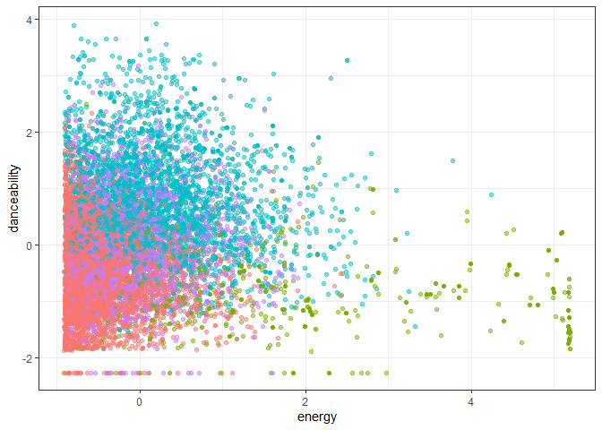
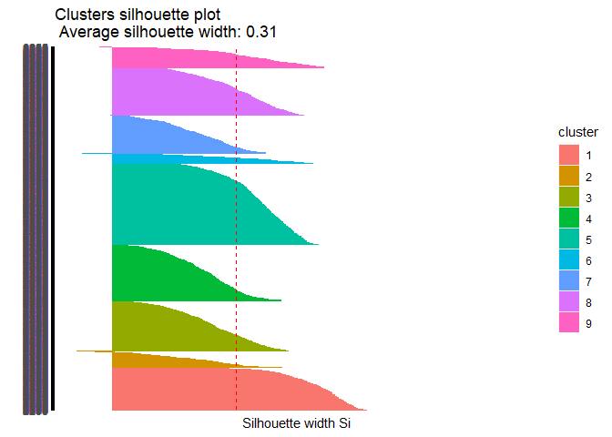

Entrega Proyecto 2
================

# Objetivo

El objetivo principal de este entregable es crear un programa
computacional que permita crear una lista de reproducción de 3 horas de
duración basándose en alguna canción de referencia. La base de datos
incluye 447.622 canciones, con 36 de las variables descritas en la
documentación de la API de Spotify.

El procedimiento consiste en generar una muestra aleatoria de la base de
datos descrita, a la cual se le realizará una clusterización mediante K
medias con una cantidad de clusters seleccionado por el estudio del
coeficiente de silueta. Luego, se generará una nueva base de datos con
las canciones que pertenecen al cluster con mayor agrupación resultante
de la iteración anterior, al cual nuevamente se le realizará una
clusterización mediante el algoritmo K Medias con una cantidad de
cluster determinado por el coeficiente de siluet apliado a la nueava
data seleccionada. Por ultimo, las canciones que pertenecen al cluster
con mejor agrupación obtenido por esta nueva iteración, se les realizará
una ultima clusterización mediante el algoritmo de K Medias con una
cantidad de clusters determinado por el coeficiente de silueta apliado a
la nueava data seleccionada.

Las canciones resultantes de esta tercera iteración corresponderan a las
canciones que podrían ser incluidas en la playlist. A continuación, de
manera aleatoria se iran seleccionando canciones pertenecientes a este
conjunto de canciones hasta completar las tres horas de duración
requeridas.

Por ultimo, dentro de esta nueva pequeña agrupación de canciones, se
seleccionará una de manera aleatoria y se conncluirá que el resto de
canciones que esta ultima acción seleccionó corresponden a una playlist
con canciones similares a la canción elegida.

La idea detras del algoritmo de K Medias es agrupar las canciones que
presenten una similitud en variables numericas que describen el
comportamiento de la canción, es decir, seleccionar canciones similares
en su composición y sonido.

Es importante destacar que el codigo es totalmente autonomo, es decir,
es capaz de adaptarse a cualquier conjunto aleatorio de canciones que se
determinan y es capaz de decidir automaticamente la cantidad de clusters
y el mejor cluster obtenido por cada iteración.

## Importar Librerias

Se incorporarán al algoritmo las librerias que contienen las funciones
que se utilizaran durante el funcionamiento del algoritmo.

``` r
library(tidyverse)
```

    ## Warning in as.POSIXlt.POSIXct(Sys.time()): unable to identify current timezone 'H':
    ## please set environment variable 'TZ'

``` r
library(cluster)
library(factoextra)
```

    ## Warning: package 'factoextra' was built under R version 4.0.5

``` r
library(janitor)
```

    ## Warning: package 'janitor' was built under R version 4.0.5

``` r
library(lattice)
```

    ## Warning: package 'lattice' was built under R version 4.0.5

``` r
library(stats4)
library(flexclust)
```

    ## Warning: package 'flexclust' was built under R version 4.0.5

``` r
library(ggdendro)
```

    ## Warning: package 'ggdendro' was built under R version 4.0.5

``` r
library(knitr)
```

## Importar datos

Los datos son asignados y corresponden al csv denominado “beats”, el
cual contiene 447.622 canciones, con 36 de las variables descritas en la
documentación de la API de Spotify.

``` r
setwd("C:/Users/Felipe/Documents/GitHub/Entregas_mineria_de_datos/Proyecto 2")
load(file="beats.RData")

summary(beats)
```

    ##  artist_name         artist_id           album_id          album_type       
    ##  Length:447622      Length:447622      Length:447622      Length:447622     
    ##  Class :character   Class :character   Class :character   Class :character  
    ##  Mode  :character   Mode  :character   Mode  :character   Mode  :character  
    ##                                                                             
    ##                                                                             
    ##                                                                             
    ##                                                                             
    ##  album_release_date album_release_year album_release_date_precision
    ##  Length:447622      Min.   :   0       Length:447622               
    ##  Class :character   1st Qu.:2010       Class :character            
    ##  Mode  :character   Median :2019       Mode  :character            
    ##                     Mean   :2013                                   
    ##                     3rd Qu.:2020                                   
    ##                     Max.   :2021                                   
    ##                     NA's   :447                                    
    ##   danceability        energy            key            loudness      
    ##  Min.   :0.0000   Min.   :0.0000   Min.   : 0.000   Min.   :-60.000  
    ##  1st Qu.:0.2520   1st Qu.:0.0756   1st Qu.: 2.000   1st Qu.:-24.445  
    ##  Median :0.3700   Median :0.2100   Median : 5.000   Median :-19.477  
    ##  Mean   :0.3911   Mean   :0.3405   Mean   : 5.061   Mean   :-18.672  
    ##  3rd Qu.:0.5140   3rd Qu.:0.5820   3rd Qu.: 8.000   3rd Qu.:-11.644  
    ##  Max.   :0.9860   Max.   :1.0000   Max.   :11.000   Max.   :  0.496  
    ##                                                                      
    ##       mode         speechiness       acousticness    instrumentalness 
    ##  Min.   :0.0000   Min.   :0.00000   Min.   :0.0000   Min.   :0.00000  
    ##  1st Qu.:0.0000   1st Qu.:0.03780   1st Qu.:0.3940   1st Qu.:0.00169  
    ##  Median :1.0000   Median :0.04430   Median :0.9230   Median :0.71500  
    ##  Mean   :0.6834   Mean   :0.06892   Mean   :0.6987   Mean   :0.50607  
    ##  3rd Qu.:1.0000   3rd Qu.:0.05840   3rd Qu.:0.9860   3rd Qu.:0.90100  
    ##  Max.   :1.0000   Max.   :0.97100   Max.   :0.9960   Max.   :1.00000  
    ##                                                                       
    ##     liveness         valence           tempo          track_id        
    ##  Min.   :0.0000   Min.   :0.0000   Min.   :  0.00   Length:447622     
    ##  1st Qu.:0.0968   1st Qu.:0.0894   1st Qu.: 82.39   Class :character  
    ##  Median :0.1230   Median :0.2740   Median :105.72   Mode  :character  
    ##  Mean   :0.2217   Mean   :0.3374   Mean   :108.74                     
    ##  3rd Qu.:0.2530   3rd Qu.:0.5370   3rd Qu.:131.05                     
    ##  Max.   :1.0000   Max.   :0.9960   Max.   :244.95                     
    ##                                                                       
    ##  analysis_url       time_signature   disc_number      duration_ms     
    ##  Length:447622      Min.   :0.000   Min.   : 1.000   Min.   :   1066  
    ##  Class :character   1st Qu.:4.000   1st Qu.: 1.000   1st Qu.: 123440  
    ##  Mode  :character   Median :4.000   Median : 1.000   Median : 194961  
    ##                     Mean   :3.728   Mean   : 1.212   Mean   : 229110  
    ##                     3rd Qu.:4.000   3rd Qu.: 1.000   3rd Qu.: 271560  
    ##                     Max.   :5.000   Max.   :26.000   Max.   :4796395  
    ##                                                                       
    ##   explicit        track_href         is_local        track_name       
    ##  Mode :logical   Length:447622      Mode :logical   Length:447622     
    ##  FALSE:442045    Class :character   FALSE:447622    Class :character  
    ##  TRUE :5577      Mode  :character                   Mode  :character  
    ##                                                                       
    ##                                                                       
    ##                                                                       
    ##                                                                       
    ##  track_preview_url   track_number       type            track_uri        
    ##  Length:447622      Min.   :  1.0   Length:447622      Length:447622     
    ##  Class :character   1st Qu.:  6.0   Class :character   Class :character  
    ##  Mode  :character   Median : 11.0   Mode  :character   Mode  :character  
    ##                     Mean   : 44.6                                        
    ##                     3rd Qu.: 30.0                                        
    ##                     Max.   :545.0                                        
    ##                                                                          
    ##  external_urls.spotify  album_name          key_name          mode_name        
    ##  Length:447622         Length:447622      Length:447622      Length:447622     
    ##  Class :character      Class :character   Class :character   Class :character  
    ##  Mode  :character      Mode  :character   Mode  :character   Mode  :character  
    ##                                                                                
    ##                                                                                
    ##                                                                                
    ##                                                                                
    ##    key_mode        
    ##  Length:447622     
    ##  Class :character  
    ##  Mode  :character  
    ##                    
    ##                    
    ##                    
    ## 

## Elección de variables

De las 36 columnas que entrega la base de datos, muchas de ellas no son
necesarias ni utiles para crear una playlist. Se procede a eliminar las
columnas de:

-   Artist\_id: El nombre del artista es mas relevante para el objetivo
    del trabajo y representa la misma información pero de una manera
    visibilemente mas agradable.  
-   Album\_id: El nombre del album es mas relevante para el objetivo del
    trabajo y representa la misma información pero de una manera
    visibilemente mas agradable.
-   Album\_type: Saber que la canción esta en un album no aytuda a
    identificiar similitudes entre las canciones
-   Album release year: A pesar de que una similitud en las canciones
    puede ser el año de creación, esta no corresponde a una similitud en
    la composición de la canción por lo cual no se utilizará esta
    variable.
-   Album\_release\_day:Es una información demasiado especifica que no
    ayuda a generar similitudes en la composición o estilo de las
    canciones.  
-   Album\_release\_day\_presition: No aporta información ademas de
    especificar que la canción fue liberada en un dia -mode: Representa
    un valor binario que no es relevante para generar similitudes en la
    composición de las canciones.
-   key: No se encontró información sobre lo que aporta esta variable,
    por lo cual se deside eliminarla.
-   Track\_id: El nombre de la cancion es mas relevante para el objetivo
    del trabajo y representa la misma información pero de una manera
    visibilemente mas agradable.
-   Analysis\_url: No aporta informacion para buscar semejanzas entre
    las canciones en terminos de su composición o estilo musical.  
-   Time\_signature:No aporta informacion para buscar semejanzas entre
    canciones en relación a su composición musical.
-   Disc\_number: No aporta info para buscar semejanzas entre canciones
    en relación a su composición musical dado que es una información que
    apunta a la historia del artista.
-   Explicit: No aporta informacion para buscar semejanzas entre las
    canciones en terminos de su composición o estilo musical.
-   Track\_href: No aporta informacion para buscar semejanzas entre las
    canciones en terminos de su composición o estilo musical.
-   is\_local: No aporta informacion para buscar semejanzas entre las
    canciones en terminos de su composición o estilo musical.
-   Track\_preview\_url: No aporta informacion para buscar semejanzas
    entre las canciones en terminos de su composición o estilo musical.
-   Track\_number: No aporta informacion para buscar semejanzas entre
    las canciones en terminos de su composición o estilo musical.
-   Type: No aporta informacion para buscar semejanzas entre las
    canciones en terminos de su composición o estilo musical.
-   Track\_url: No aporta informacion para buscar semejanzas entre las
    canciones en terminos de su composición o estilo musical.
-   External\_url\_spotify: No aporta informacion para buscar semejanzas
    entre las canciones en terminos de su composición o estilo musical.
-   Key name:No aporta informacion para buscar semejanzas entre las
    canciones en terminos de su composición o estilo musical.
-   mode name:No aporta informacion para buscar semejanzas entre las
    canciones en terminos de su composición o estilo musical.
-   key mode:No aporta informacion para buscar semejanzas entre las
    canciones en terminos de su composición o estilo musical.

``` r
beats=beats[,c(1,8:9,11,13:18,19,23,27,33)]
```

## Selección de Data

Debido a la gran cantidad de datos, algunas funciones y graficas saturan
las capacidades de procesamiento del computador, por lo cual se decidió
implementar una muestra. El procedimiento consiste en generar una
muestra aleatoria simple sin reemplazo a traves de la función “sample()”
con una cantidad de 20.000 datos. Es necesario validar que esta muestre
represente a la base de datos asignada por lo cual se compararan las
estadisticas de esta SELECCION de datos con la data original a traves de
la función “summary”.

``` r
sample_index <- sample(1:nrow(beats),20000, replace = F)
sample_data = beats[sample_index,]

summary(sample_data)
```

    ##  artist_name         danceability        energy          loudness      
    ##  Length:20000       Min.   :0.0000   Min.   :0.0000   Min.   :-60.000  
    ##  Class :character   1st Qu.:0.2520   1st Qu.:0.0764   1st Qu.:-24.339  
    ##  Mode  :character   Median :0.3700   Median :0.2070   Median :-19.520  
    ##                     Mean   :0.3913   Mean   :0.3404   Mean   :-18.672  
    ##                     3rd Qu.:0.5130   3rd Qu.:0.5820   3rd Qu.:-11.690  
    ##                     Max.   :0.9680   Max.   :1.0000   Max.   : -0.407  
    ##   speechiness       acousticness    instrumentalness     liveness     
    ##  Min.   :0.00000   Min.   :0.0000   Min.   :0.00000   Min.   :0.0000  
    ##  1st Qu.:0.03780   1st Qu.:0.3967   1st Qu.:0.00177   1st Qu.:0.0969  
    ##  Median :0.04430   Median :0.9230   Median :0.72200   Median :0.1230  
    ##  Mean   :0.06884   Mean   :0.6987   Mean   :0.50853   Mean   :0.2219  
    ##  3rd Qu.:0.05830   3rd Qu.:0.9860   3rd Qu.:0.90000   3rd Qu.:0.2520  
    ##  Max.   :0.96600   Max.   :0.9960   Max.   :1.00000   Max.   :1.0000  
    ##     valence           tempo          track_id          duration_ms     
    ##  Min.   :0.0000   Min.   :  0.00   Length:20000       Min.   :   4055  
    ##  1st Qu.:0.0895   1st Qu.: 82.62   Class :character   1st Qu.: 122703  
    ##  Median :0.2760   Median :105.80   Mode  :character   Median : 194733  
    ##  Mean   :0.3378   Mean   :108.62                      Mean   : 229823  
    ##  3rd Qu.:0.5390   3rd Qu.:130.83                      3rd Qu.: 271668  
    ##  Max.   :0.9910   Max.   :232.41                      Max.   :4787413  
    ##   track_name         album_name       
    ##  Length:20000       Length:20000      
    ##  Class :character   Class :character  
    ##  Mode  :character   Mode  :character  
    ##                                       
    ##                                       
    ## 

Lo importante es comparar las variables numericas dado que estas son las
variables elegidas.Como se puede observar, en ninguno de los parametros
comparados (Minimo,Maximo,Median,Mean,Cuartiles) las diferencias superan
las magnitudes del 0,01 por lo cual se asume que la muestra seleccionada
reprsenta a la data total dado que son similares.

# Limpieza de datos

## Busqueda de datos faltantes

En primer lugar, se revisa si hay casos faltantes. Para las
observaciones que tengan datos faltantes, se le asigna el valor NA para
eliminarlos en el siguiente paso. Luego, se revisa que no queden valores
nulos. Tal como se observa a continuación, no se encontraron datos
faltantes en la muestra seleccionada.

En iteraciones previas a la entrega final se determinó que solo la
columna “album\_release\_year” cuenta con datos faltantes, pero no se va
a trabajar con esa columna. De haber utilizado esa variable, para
eliminar los datos faltantes se debe ocupar el comando “sample\_data
&lt;- sample\_data %&gt;%
filter(!(is.na(sample\_data$album\_release\_year)))” y de esta manera se
excluyen de la base de datos las filas que en esa determinada columna
cuentten con un NA.

``` r
sample_data[sample_data == ""] <- NA
sample_data %>%  summarise_all(funs(sum(is.na(.))))
```

    ## Warning: `funs()` was deprecated in dplyr 0.8.0.
    ## Please use a list of either functions or lambdas: 
    ## 
    ##   # Simple named list: 
    ##   list(mean = mean, median = median)
    ## 
    ##   # Auto named with `tibble::lst()`: 
    ##   tibble::lst(mean, median)
    ## 
    ##   # Using lambdas
    ##   list(~ mean(., trim = .2), ~ median(., na.rm = TRUE))

    ##   artist_name danceability energy loudness speechiness acousticness
    ## 1           0            0      0        0           0            0
    ##   instrumentalness liveness valence tempo track_id duration_ms track_name
    ## 1                0        0       0     0        0           0          0
    ##   album_name
    ## 1          0

## Busqueda de datos duplicados

Asumiendo que la base de datos cuenta con una perfecta identificación de
cada canción, el siguente comando pretende buscar si dentro de la
muestra seleccionada se encuentran canciones con su mismo ID. En caso de
ser encontradas, se eliminan debido a que se considera una canción
duplicada.

La variable “aata actualizada” pretende mantener un data frame sin
escalar para luego ocupar las duraciones de las canciones reales, es
decir, con datos identicos a la base de datos sin alguna modificación.

``` r
data_lista = sample_data[!duplicated(sample_data$track_id),]

data_actualizada=data_lista
```

# Analisis de Clusters

Se necesita identificar las variables que definen el comportamiento de
las canciones para luego evaluar su semejanza o difeencia, por lo cual
se utilizaran las variables:

-   danceability
-   energy
-   loudness
-   spechiness
-   acusticness
-   instrumentalness
-   liveness
-   valance
-   tempo

Todas las variables ya son numericas por lo cual es mas facil escalarlas

## Escalar Datos

La intención de escalar los datos es que estos se encuentren centrados
en el 0 y con desviación estandar 1.

Dado que la función “scale” entrega el resultado como una matriz, se
utiliza el argumento “as\_tibble” para que el resultado sea un data
frame.

``` r
var_a_utilizar_en_clusters = data_lista[,c(2:10)]
data_escalada_1=scale(var_a_utilizar_en_clusters) %>% as_tibble()
summary(data_escalada_1)
```

    ##   danceability         energy           loudness         speechiness     
    ##  Min.   :-2.1309   Min.   :-1.0706   Min.   :-4.77072   Min.   :-0.7303  
    ##  1st Qu.:-0.7585   1st Qu.:-0.8303   1st Qu.:-0.65403   1st Qu.:-0.3291  
    ##  Median :-0.1158   Median :-0.4196   Median :-0.09784   Median :-0.2602  
    ##  Mean   : 0.0000   Mean   : 0.0000   Mean   : 0.00000   Mean   : 0.0000  
    ##  3rd Qu.: 0.6630   3rd Qu.: 0.7598   3rd Qu.: 0.80594   3rd Qu.:-0.1116  
    ##  Max.   : 3.1410   Max.   : 2.0744   Max.   : 2.10867   Max.   : 9.5225  
    ##   acousticness     instrumentalness     liveness          valence       
    ##  Min.   :-1.8928   Min.   :-1.2312   Min.   :-1.0131   Min.   :-1.2286  
    ##  1st Qu.:-0.8193   1st Qu.:-1.2269   1st Qu.:-0.5706   1st Qu.:-0.9030  
    ##  Median : 0.6077   Median : 0.5165   Median :-0.4515   Median :-0.2246  
    ##  Mean   : 0.0000   Mean   : 0.0000   Mean   : 0.0000   Mean   : 0.0000  
    ##  3rd Qu.: 0.7784   3rd Qu.: 0.9474   3rd Qu.: 0.1375   3rd Qu.: 0.7321  
    ##  Max.   : 0.8055   Max.   : 1.1895   Max.   : 3.5528   Max.   : 2.3763  
    ##      tempo         
    ##  Min.   :-3.45865  
    ##  1st Qu.:-0.82778  
    ##  Median :-0.08998  
    ##  Mean   : 0.00000  
    ##  3rd Qu.: 0.70726  
    ##  Max.   : 3.94169

Se puede observar que la data se encuentra escalada dado que

## Implementacion de K Means

En primer lugar se planea identificar la mejor elecion de cluster a
partir de la “regla del codo” y del “coeficiente de silueta”. De esta
manera se pretende ver como evoluciona la suma de cuadrados
intra-cluster en la medida que se aumenta el numero de clusters
elegidos. Se deveria poder observar como disminuye la cohesión mientras
aumenta el numero de klusters. Por otro lado, el coeficiente de silueta
tambien ayuda a determinar el numero optimo de agrupamientos de
clusters.

``` r
vector_codo_1 <- numeric(30)

for(k_codo_iteracion_1 in 1:30){
  modelo_codo_1 <- kmeans(data_escalada_1, centers = k_codo_iteracion_1)
  vector_codo_1[k_codo_iteracion_1] <- modelo_codo_1$tot.withinss
}
```

    ## Warning: did not converge in 10 iterations

    ## Warning: did not converge in 10 iterations

``` r
plot(vector_codo_1)
```

<!-- -->

A simple vista no queda muy claro cual es el valor que genera el “codo”
o quiebre en la tendencia por lo cual se complementa con el coeficiente
de silueta, el cual si determina de manera precisa cual es la mejor
elección de clusters dado que detecta cual es el valor con mayor
cohesión.

## Coeficiente de silueta

Se utiliza el coeficiente de silueta para determinar el mejor valor de
K. Ademas, dentro de la ciclo “for” se agrega una condición “if” que
permite ir guardando el valor de cluster K que presentó el valor de
cohesión mas alto durante el ciclo para luego utilizar ese valor en la
iteración del algoritmo de K Means.

``` r
vector_silueta_1=numeric(20)
Buffer_1 = 0

for (k_silueta_iteracion_1 in 2:20){
  modelo_silueta_1 <- kmeans(data_escalada_1, centers = k_silueta_iteracion_1)
  variable_temporal_1 <- silhouette(modelo_silueta_1$cluster,dist(data_escalada_1))
  vector_silueta_1[k_silueta_iteracion_1] <- mean(variable_temporal_1[,3])
  
  if(vector_silueta_1[k_silueta_iteracion_1]>= Buffer_1){
    Buffer_1 = vector_silueta_1[k_silueta_iteracion_1]
    elección_k_iteracion_1 = k_silueta_iteracion_1
  }
}
```

    ## Warning: did not converge in 10 iterations

``` r
tempDF_1=data.frame(CS=vector_silueta_1,K=c(1:20))

ggplot(tempDF_1, aes(x=K, y=CS)) + geom_line() + scale_x_continuous(breaks=c(1:30))
```

<!-- --> \#
Implementación de K Means Primera iteración

Se crea el modelo de K Means sobre la data elegida y con la cantidad de
clusters almacenado en la variable “elección\_k\_iteracion\_1”, la cual
contiene la mejor cantidad de clusters para utilizar en el modelo de K
Means. A traves del modelo se almacena en el data frame
“data\_actualizada” el valor del cluster al cual pertenece cada una de
las canciones a partir de esta primera iteración del modelo.

El resultado se representa a traves del siguente Plot, sin embargo, es
importante mencionar que esta es una de las tantas posibles
combinaciones de variables que ilustran la agrupación de Cluster
resultante de esta iteración.

``` r
modelo_k_means_1 <- kmeans(data_escalada_1, centers = elección_k_iteracion_1)

data_escalada_1$clus_iteracion_1 <- modelo_k_means_1$cluster %>% as.factor()
data_actualizada$clus_iteracion_1 <- modelo_k_means_1$cluster %>% as.factor()

ggplot(data_escalada_1, aes(energy,danceability, color=clus_iteracion_1 )) +  geom_point(alpha=0.5, show.legend = F) +  theme_bw()
```

<!-- -->

## Evaluación de K Means

De acuerdo al estadistico de Hopkins, el cual mide la tendencia de los
Klusters. Se realzia con una cantidad de 20 muestras. Luego se validará
mediante el limite de Cohesión y de separación.

Se evita la evaluación visual dado que el algoritmo funciona con numeros
generados aleatoriamente, es decir, en cada iteración se genera una
difernete agrupación y cantidad de cluster, a los cuales el algoritmo
por su cuenta debe decidir cual es el mejor.

En primer lugar tenemos el estadistico de Hopkins:

``` r
Hopkins_1 <- get_clust_tendency(var_a_utilizar_en_clusters, n = 20, graph = FALSE)
Hopkins_1
```

    ## $hopkins_stat
    ## [1] 0.8813759
    ## 
    ## $plot
    ## NULL

Un valor alto en el estadistico de Hopkins demuestra que existen
agrupaciones en los datos.

Luego se estudia la Cohesión:

``` r
data_escalada_1 <- apply(data_escalada_1,2,as.numeric)
modelo_k_means_1$tot.withinss
```

    ## [1] 106850.7

Un alto valor en la cohesion indica que tan cercanos se encuentran los
integrantes de un determinado cluster. Se pretende que este valor sea
alto.

A continuación se estudia la Separación:

``` r
meanData_1 <- colMeans(data_escalada_1)
SSB_1 <- numeric(elección_k_iteracion_1) #Este valor y el que esta en el for DEPENDEN DE LA CANTIDAD DE CLUSTERS QUE DETERMINA EL MODELO. 
for (i_1 in 1:elección_k_iteracion_1){
  tempData_1 <- data_escalada_1[which(modelo_k_means_1$cluster==i_1),]
  SSB_1[i_1] <- nrow(tempData_1)*sum((meanData_1-colMeans(tempData_1))^2)
}
separation_1 = sum(SSB_1)
separation_1
```

    ## [1] 87931.18

El valor de la separación mide que tan alejados se encuentran los
clusters frente a otros clusters.

Y finalmente se evalua y grafica el coeficiente de silueta:

``` r
coefSilueta_1 <- silhouette(modelo_k_means_1$cluster,dist(data_escalada_1))
summary(coefSilueta_1)
```

    ## Silhouette of 19994 units in 3 clusters from silhouette.default(x = modelo_k_means_1$cluster, dist = dist(data_escalada_1)) :
    ##  Cluster sizes and average silhouette widths:
    ##     12141      2704      5149 
    ## 0.4517580 0.1119354 0.3681878 
    ## Individual silhouette widths:
    ##    Min. 1st Qu.  Median    Mean 3rd Qu.    Max. 
    ## -0.1698  0.2838  0.4255  0.3843  0.5128  0.6168

``` r
fviz_silhouette(coefSilueta_1) + coord_flip()
```

    ##   cluster  size ave.sil.width
    ## 1       1 12141          0.45
    ## 2       2  2704          0.11
    ## 3       3  5149          0.37

<!-- -->

El análisis de siluetas mide qué tan bien se agrupa una observación y
estima la distancia media entre los clústeres. Mientras mas grande sea
el ancho medio de las siluetas, mejor agrupados se encuentran.

Debido a que la primera iteración del algoritmo K Means no genera
clusters con caracteristicas que demuestran una semejanza alta, se
decide tomar el mejor Cluster de la primera iteración de K Means y
volver a generar Clusters a partir de la data de este cluster. Se
determina que “el mejor cluster” es aquel que tenga una mayor agrupación
de datos.

# Segunda iteración K Means

## Eleccion del mejor cluster de iteración pasada

En primer lugar, se genera un nuevo Data Frame con las canciones que en
la iteración anterior fueron seleccionados en el mejor cluster. Para
lograr esto se debe encontrar cual fue el mejor cluster y por ende se
utiliza el siguente codigo, el cual finaliza con la elección del mejor
cluster en la variable
“variable\_4\_anexa\_para\_seleccionar\_cluster\_1”.

Su funcionamiento es calcular de manera mecanica la columna que el
grafico anterior expone como “ave.sil.wwidt”. Esta variable indica la
agrupación en promedio que tuvo cada cluster. Para lograr este
resultado, se recorre toda la variable “CoefSilueta\_1”, la cual
contiene la agrupación y el cluster al cual cada cancón pertenece.
Almacenando cada uno de estos valores por cada cluster y luego
dividiendo por la cantidad de canciones que pertenecen a ese cluster se
obtiene el valor en estudio. Para finalizar, se utiliza la segunda
condición “if” para guardar el valor del cluster que presentó el mayor
valor de agrupación.

Finalmente, en “data\_iteracion\_2” se almacenan las canciones presentes
en “data\_actualizada” que fueron seleccionadas en el cluster
seleccionado en la itetación de K Medias anterior.

Si no pongo coefSilueta\_1\[,1\] recorre tres veces la length de la
variables porque esta tiene 3 columnas

En “data\_iteracion\_2” selecciono las canciones que en
“data\_actualizada” pertenecen al cluster con mejor agrupación a partir
de la primera iteración del algoritmo de K Medias.

``` r
variable_1_anexa_para_seleccionar_cluster_1= 0
contador_anexa_para_seleccionar_cluster_1=0
variable_2_anexa_para_seleccionar_cluster_1=0
variable_3_anexa_para_seleccionar_cluster_1=0
variable_4_anexa_para_seleccionar_cluster_1=0

for(k_silueta_1 in 1:elección_k_iteracion_1){
    for (i_silueta_1 in 1:length(coefSilueta_1[,1]) ){
        if(coefSilueta_1[i_silueta_1,1]== k_silueta_1){
          variable_1_anexa_para_seleccionar_cluster_1=variable_1_anexa_para_seleccionar_cluster_1+coefSilueta_1[i_silueta_1,3]    
          contador_anexa_para_seleccionar_cluster_1=contador_anexa_para_seleccionar_cluster_1+1         
        }
    } 
    variable_2_anexa_para_seleccionar_cluster_1=variable_1_anexa_para_seleccionar_cluster_1/contador_anexa_para_seleccionar_cluster_1     
    
    if(variable_2_anexa_para_seleccionar_cluster_1 > variable_3_anexa_para_seleccionar_cluster_1){
       variable_3_anexa_para_seleccionar_cluster_1 = variable_2_anexa_para_seleccionar_cluster_1
       variable_4_anexa_para_seleccionar_cluster_1 = k_silueta_1      
    }
    variable_1_anexa_para_seleccionar_cluster_1= 0
    contador_anexa_para_seleccionar_cluster_1=0
    variable_2_anexa_para_seleccionar_cluster_1=0
}

data_iteracion_2= data_actualizada[data_actualizada$clus_iteracion_1 == variable_4_anexa_para_seleccionar_cluster_1,]  
data_actualizada= data_actualizada[data_actualizada$clus_iteracion_1 == variable_4_anexa_para_seleccionar_cluster_1,]
```

A forma de comprobación, dada la iteración anterior, el mejor cluster
elegido fue el cluster numero:

``` r
variable_4_anexa_para_seleccionar_cluster_1
```

    ## [1] 1

## Escalar Datos

La intención de escalar los datos es que estos se encuentren centrados
en el 0 y con desviación estandar 1.

Al igual que antes, dado que la función “scale” entrega el resultado
como una matriz, se utiliza el argumento “as\_tibble” para que el
resultado sea un data frame.

``` r
data_escalada_2=data_iteracion_2[,c(2:10)]
data_escalada_2=scale(data_escalada_2) %>% as_tibble()
summary(data_escalada_2)
```

    ##   danceability          energy           loudness        speechiness      
    ##  Min.   :-2.35844   Min.   :-1.1668   Min.   :-5.9065   Min.   :-1.85993  
    ##  1st Qu.:-0.74474   1st Qu.:-0.7753   1st Qu.:-0.5586   1st Qu.:-0.37227  
    ##  Median :-0.05113   Median :-0.2495   Median : 0.1137   Median :-0.18778  
    ##  Mean   : 0.00000   Mean   : 0.0000   Mean   : 0.0000   Mean   : 0.00000  
    ##  3rd Qu.: 0.63540   3rd Qu.: 0.5244   3rd Qu.: 0.6851   3rd Qu.: 0.07913  
    ##  Max.   : 4.29454   Max.   : 6.5816   Max.   : 2.7635   Max.   :25.34197  
    ##   acousticness      instrumentalness     liveness          valence       
    ##  Min.   :-6.91406   Min.   :-2.0457   Min.   :-1.6372   Min.   :-1.1561  
    ##  1st Qu.: 0.03339   1st Qu.:-0.3456   1st Qu.:-0.5408   1st Qu.:-0.8413  
    ##  Median : 0.34481   Median : 0.5310   Median :-0.3243   Median :-0.3348  
    ##  Mean   : 0.00000   Mean   : 0.0000   Mean   : 0.0000   Mean   : 0.0000  
    ##  3rd Qu.: 0.43378   3rd Qu.: 0.6608   3rd Qu.: 0.1015   3rd Qu.: 0.5911  
    ##  Max.   : 0.47085   Max.   : 0.9058   Max.   : 7.1984   Max.   : 2.8052  
    ##      tempo        
    ##  Min.   :-3.3647  
    ##  1st Qu.:-0.8131  
    ##  Median :-0.1582  
    ##  Mean   : 0.0000  
    ##  3rd Qu.: 0.7695  
    ##  Max.   : 3.3714

Nuevamente se puede observar que la data elegida se encuentra escalada
dado que ().

## Regla del codo

De manera similar a la iteración anterior, se utiliza la regla del codo
para observar el comportamiento de la posible elección de cluster y se
utiliza el coeficiente de siluetra para determinar la mejor cantidad de
clusters dada la nueva data seleccionada.

``` r
vector_codo_2 <- numeric(30)

for(k_codo_iteracion_2 in 1:30){
  modelo_codo_2 <- kmeans(data_escalada_2, centers = k_codo_iteracion_2)
  vector_codo_2[k_codo_iteracion_2] <- modelo_codo_2$tot.withinss
}
```

    ## Warning: did not converge in 10 iterations

``` r
plot(vector_codo_2)
```

<!-- -->

## Coeficiente de silueta

La cantidad de cluster que agrupa de mejor manera los datos queda
almacenada en la variable “elección\_k\_iteracion\_2”.

``` r
vector_silueta_2=numeric(20)
Buffer_2 = 0

for (k_silueta_iteracion_2 in 2:20){
  modelo_silueta_2 <- kmeans(data_escalada_2, centers = k_silueta_iteracion_2)
  variable_temporal_2 <- silhouette(modelo_silueta_2$cluster,dist(data_escalada_2))
  vector_silueta_2[k_silueta_iteracion_2] <- mean(variable_temporal_2[,3])
  
    if(vector_silueta_2[k_silueta_iteracion_2]>= Buffer_2){
    Buffer_2 = vector_silueta_2[k_silueta_iteracion_2]
    elección_k_iteracion_2 = k_silueta_iteracion_2
    }
}
```

    ## Warning: did not converge in 10 iterations

``` r
tempDF_2=data.frame(CS=vector_silueta_2,K=c(1:20))

ggplot(tempDF_2, aes(x=K, y=CS)) + geom_line() + scale_x_continuous(breaks=c(1:30))
```

<!-- -->

## Implementacion de la segunda iteración

Se crea el modelo de K Means sobre la nueva data seleccionada y con la
cantidad de clusters almacenado en la variable
“elección\_k\_iteracion\_2”, la cual contiene la mejor cantidad de
clusters para utilizar en el modelo de K Means. A traves del modelo se
almacena en el data frame “data\_actualizada” el valor del cluster al
cual pertenece cada una de las canciones a partir de esta segunda
iteración del modelo.

El resultado se representa a traves del siguente Plot, sin embargo, es
importante volver a mencionar que esta es una de las tantas posibles
combinaciones de variables que ilustran la agrupación de Cluster
resultante de esta iteración.

``` r
modelo_k_means_2 <- kmeans(data_escalada_2, centers = elección_k_iteracion_2)

data_escalada_2$clus_iteracion_2 <- modelo_k_means_2$cluster %>% as.factor()

#Esto agrega el valor de la segunda iteracion
data_iteracion_2$clus_iteracion_2 <- modelo_k_means_2$cluster %>% as.factor() #dudo si eso esta bien
data_actualizada$clus_iteracion_2 <- modelo_k_means_2$cluster %>% as.factor()

ggplot(data_escalada_2, aes(energy,danceability, color=clus_iteracion_2 )) +  geom_point(alpha=0.5, show.legend = F) +  theme_bw()
```

<!-- -->

## Evaluación de segunda iteracion de K Means

Para evaluar la nueva iteración, en primer lugar se utilizará el
estadistico de Hopkins:

``` r
Hopkins_2 <- get_clust_tendency(var_a_utilizar_en_clusters, n = 20, graph = FALSE)
Hopkins_2
```

    ## $hopkins_stat
    ## [1] 0.8813759
    ## 
    ## $plot
    ## NULL

Un valor alto en el estadistico de Hopkins demuestra que existen
agrupaciones en los datos.

Luego, se utilizará la cohesión:

``` r
data_escalada_2 <- apply(data_escalada_2,2,as.numeric)
modelo_k_means_2$tot.withinss
```

    ## [1] 67199

Un alto valor en la cohesion indica que tan cercanos se encuentran los
integrantes de un determinado cluster. Se pretende que este valor sea
alto.

A continuación se valida la separación entre clusters:

``` r
meanData_2 <- colMeans(data_escalada_2)
SSB_2 <- numeric(elección_k_iteracion_2) #Este valor y el que esta en el for DEPENDEN DE LA CANTIDAD DE CLUSTERS QUE DETERMINA EL MODELO. 
for (i_2 in 1:elección_k_iteracion_2){
  tempData_2 <- data_escalada_2[which(modelo_k_means_2$cluster==i_2),]
  SSB_1[i_2] <- nrow(tempData_2)*sum((meanData_2-colMeans(tempData_2))^2)
}
separation_2 = sum(SSB_2)

separation_2
```

    ## [1] 0

El valor de la separación mide que tan alejados se encuentran los
clusters frente a otros clusters.

Y finalmente se utiliza el coeficiente de silueta:

``` r
coefSilueta_2 <- silhouette(modelo_k_means_2$cluster,dist(data_escalada_2))
summary(coefSilueta_2)
```

    ## Silhouette of 12141 units in 5 clusters from silhouette.default(x = modelo_k_means_2$cluster, dist = dist(data_escalada_2)) :
    ##  Cluster sizes and average silhouette widths:
    ##       925      2129      3582      5041       464 
    ## 0.1781886 0.2417667 0.1855450 0.3565638 0.2156845 
    ## Individual silhouette widths:
    ##    Min. 1st Qu.  Median    Mean 3rd Qu.    Max. 
    ## -0.1610  0.1732  0.2724  0.2670  0.3645  0.5337

``` r
fviz_silhouette(coefSilueta_2) + coord_flip()
```

    ##   cluster size ave.sil.width
    ## 1       1  925          0.18
    ## 2       2 2129          0.24
    ## 3       3 3582          0.19
    ## 4       4 5041          0.36
    ## 5       5  464          0.22

<!-- --> El análisis
de siluetas mide qué tan bien se agrupa una observación y estima la
distancia media entre los clústeres. Mientras mas grande sea el ancho
medio de las siluetas, mejor agrupados se encuentran.

# Tercera iteración K Means

## Eleccion del mejor cluster de iteración pasada

Se genera un nuevo Data Frame con las canciones que en la iteración
anterior fueron seleccionados en el mejor cluster. Para lograr esto se
debe encontrar cual fue el mejor cluster y por ende se utiliza el
siguente codigo, el cual finaliza con la elección del mejor cluster en
la variable “variable\_4\_anexa\_para\_seleccionar\_cluster\_2”.

El funcionamiento es identico al ya explicado, por lo cual este codigo
no volverá a ser explicado.

Finalmente, en “data\_iteracion\_3” se almacenan las canciones presentes
en “data\_actualizada” que fueron seleccionadas en el cluster
seleccionado en la itetación de K Medias anterior.

``` r
variable_1_anexa_para_seleccionar_cluster_2= 0
contador_anexa_para_seleccionar_cluster_2=0
variable_2_anexa_para_seleccionar_cluster_2=0
variable_3_anexa_para_seleccionar_cluster_2=0
variable_4_anexa_para_seleccionar_cluster_2=0

for(k_silueta_2 in 1:elección_k_iteracion_2){
    for (i_silueta_2 in 1:length(coefSilueta_2[,1]) ){
        if(coefSilueta_2[i_silueta_2,1]== k_silueta_2){
          variable_1_anexa_para_seleccionar_cluster_2=variable_1_anexa_para_seleccionar_cluster_2+coefSilueta_2[i_silueta_2,3]    
          contador_anexa_para_seleccionar_cluster_2=contador_anexa_para_seleccionar_cluster_2+1         
        }
    } 
    variable_2_anexa_para_seleccionar_cluster_2=variable_1_anexa_para_seleccionar_cluster_2/contador_anexa_para_seleccionar_cluster_2   
    
    if(variable_2_anexa_para_seleccionar_cluster_2 > variable_3_anexa_para_seleccionar_cluster_2){
       variable_3_anexa_para_seleccionar_cluster_2 = variable_2_anexa_para_seleccionar_cluster_2
       variable_4_anexa_para_seleccionar_cluster_2 = k_silueta_2     
    }
    variable_1_anexa_para_seleccionar_cluster_2= 0
    contador_anexa_para_seleccionar_cluster_2=0
    variable_2_anexa_para_seleccionar_cluster_2=0
}

data_iteracion_3= data_actualizada[data_actualizada$clus_iteracion_2 == variable_4_anexa_para_seleccionar_cluster_2,]
data_actualizada= data_actualizada[data_actualizada$clus_iteracion_2 == variable_4_anexa_para_seleccionar_cluster_2,]
```

Nuevamente a forma de comprobación, dada la iteración anterior, el mejor
cluster elegido fue el cluster numero:

``` r
variable_4_anexa_para_seleccionar_cluster_2
```

    ## [1] 4

## Escalar Datos

La intención de escalar los datos es que estos se encuentren centrados
en el 0 y con desviación estandar 1.

Al igual que antes, dado que la función “scale” entrega el resultado
como una matriz, se utiliza el argumento “as\_tibble” para que el
resultado sea un data frame.

``` r
data_escalada_3=data_iteracion_3[,c(2:10)]
data_escalada_3=scale(data_escalada_3) %>% as_tibble()
summary(data_escalada_3)
```

    ##   danceability          energy           loudness        speechiness     
    ##  Min.   :-2.41927   Min.   :-1.0813   Min.   :-4.3110   Min.   :-3.3187  
    ##  1st Qu.:-0.78857   1st Qu.:-0.7632   1st Qu.:-0.5924   1st Qu.:-0.4448  
    ##  Median :-0.02277   Median :-0.3001   Median : 0.1100   Median :-0.1590  
    ##  Mean   : 0.00000   Mean   : 0.0000   Mean   : 0.0000   Mean   : 0.0000  
    ##  3rd Qu.: 0.70699   3rd Qu.: 0.4932   3rd Qu.: 0.7257   3rd Qu.: 0.2172  
    ##  Max.   : 4.04948   Max.   : 6.8448   Max.   : 2.6778   Max.   :26.6235  
    ##   acousticness      instrumentalness      liveness          valence       
    ##  Min.   :-7.61138   Min.   :-6.64193   Min.   :-2.0755   Min.   :-1.1714  
    ##  1st Qu.:-0.09419   1st Qu.:-0.07453   1st Qu.:-0.6230   1st Qu.:-0.7910  
    ##  Median : 0.41648   Median : 0.28818   Median :-0.1521   Median :-0.3341  
    ##  Mean   : 0.00000   Mean   : 0.00000   Mean   : 0.0000   Mean   : 0.0000  
    ##  3rd Qu.: 0.53905   3rd Qu.: 0.51198   3rd Qu.: 0.3274   3rd Qu.: 0.4382  
    ##  Max.   : 0.60033   Max.   : 1.07534   Max.   : 5.8270   Max.   : 6.2019  
    ##      tempo        
    ##  Min.   :-3.2676  
    ##  1st Qu.:-0.7551  
    ##  Median :-0.3262  
    ##  Mean   : 0.0000  
    ##  3rd Qu.: 0.6308  
    ##  Max.   : 3.8612

## Modelo del codo

Finalmente y de manera identica a las dos iteraciones anteriores, se
utiliza la regla del codo para observar el comportamiento de la posible
elección de cluster y se utiliza el coeficiente de siluetra para
determinar la mejor cantidad de clusters dada la nueva data
seleccionada.

``` r
vector_codo_3 <- numeric(30)

for(k_codo_iteracion_3 in 1:30){
  modelo_codo_3 <- kmeans(data_escalada_3, centers = k_codo_iteracion_3)
  vector_codo_3[k_codo_iteracion_3] <- modelo_codo_3$tot.withinss
}

plot(vector_codo_3)
```

<!-- -->

## Coeficiente de silueta

La cantidad de cluster que agrupa de mejor manera los datos queda
almacenada en la variable “elección\_k\_iteracion\_3”.

``` r
vector_silueta_3=numeric(20)
Buffer_3 = 0

for (k_silueta_iteracion_3 in 2:20){
  modelo_silueta_3 <- kmeans(data_escalada_3, centers = k_silueta_iteracion_3)
  variable_temporal_3 <- silhouette(modelo_silueta_3$cluster,dist(data_escalada_3))
  vector_silueta_3[k_silueta_iteracion_3] <- mean(variable_temporal_3[,3])
  
    if(vector_silueta_3[k_silueta_iteracion_3]>= Buffer_3){
    Buffer_3 = vector_silueta_3[k_silueta_iteracion_3]
    elección_k_iteracion_3 = k_silueta_iteracion_3
  }
}
```

    ## Warning: did not converge in 10 iterations

``` r
tempDF_3=data.frame(CS=vector_silueta_3,K=c(1:20))

ggplot(tempDF_3, aes(x=K, y=CS)) + geom_line() + scale_x_continuous(breaks=c(1:30))
```

<!-- -->

## Implementacion de la tercera iteración

Se crea el modelo de K Means sobre la nueva data seleccionada y con la
cantidad de clusters almacenado en la variable
“elección\_k\_iteracion\_3”, la cual contiene la mejor cantidad de
clusters para utilizar en el modelo de K Means. A traves del modelo se
almacena en el data frame “data\_actualizada” el valor del cluster al
cual pertenece cada una de las canciones a partir de esta segunda
iteración del modelo.

El resultado se representa a traves del siguente Plot, sin embargo, es
importante mencionar por ultima vez que esta es una de las tantas
posibles combinaciones de variables que ilustran la agrupación de
Cluster resultante de esta iteración.

``` r
modelo_k_means_3 <- kmeans(data_escalada_3, centers = elección_k_iteracion_3)

data_escalada_3$clus_iteracion_3 <- modelo_k_means_3$cluster %>% as.factor()
data_iteracion_3$clus_iteracion_3 <- modelo_k_means_3$cluster %>% as.factor()
data_actualizada$clus_iteracion_3 <- modelo_k_means_3$cluster %>% as.factor() 

ggplot(data_escalada_3, aes(energy,loudness, color=clus_iteracion_3 )) +  geom_point(alpha=0.5, show.legend = F) +  theme_bw()
```

<!-- -->

## Evaluación de tercera iteracion de K Means

De acuerdo al estadistico de Hopkins, el cual mide la tendencia de los
Klusters. Se realzia con una cantidad de 20 muestras. Luego se validará
mediante el limite de Cohesión y de separación.

Se evita la evaluación visual dado que el algoritmo funciona con numeros
generados aleatoriamente, es decir, en cada iteración se genera una
difernete agrupación y cantidad de cluster, a los cuales el algoritmo
por su cuenta debe decidir cual es el mejor.

En primer lugar tenemos el estadistico de Hopkins:

``` r
Hopkins_3 <- get_clust_tendency(var_a_utilizar_en_clusters, n = 20, graph = FALSE)
Hopkins_3
```

    ## $hopkins_stat
    ## [1] 0.8813759
    ## 
    ## $plot
    ## NULL

Un valor alto en el estadistico de Hopkins demuestra que existen
agrupaciones en los datos.

Luego esta la cohesión:

``` r
data_escalada_3 <- apply(data_escalada_3,2,as.numeric)
modelo_k_means_3$tot.withinss
```

    ## [1] 25350.59

Un alto valor en la cohesion indica que tan cercanos se encuentran los
integrantes de un determinado cluster. Se pretende que este valor sea
alto.

A continuación se realiza el estudio de la separación:

``` r
meanData_3 <- colMeans(data_escalada_3)
SSB_3 <- numeric(elección_k_iteracion_3) #Este valor y el que esta en el for DEPENDEN DE LA CANTIDAD DE CLUSTERS QUE DETERMINA EL MODELO. 
for (i_3 in 1:elección_k_iteracion_3){
  tempData_3 <- data_escalada_3[which(modelo_k_means_3$cluster==i_3),]
  SSB_1[i_3] <- nrow(tempData_3)*sum((meanData_3-colMeans(tempData_3))^2)
}
separation_3 = sum(SSB_3)

separation_3
```

    ## [1] 0

El valor de la separación mide que tan alejados se encuentran los
clusters frente a otros clusters.

Y finalmente se utiliza el coeficiente de silueta:

``` r
coefSilueta_3 <- silhouette(modelo_k_means_3$cluster,dist(data_escalada_3))
summary(coefSilueta_3)
```

    ## Silhouette of 5041 units in 7 clusters from silhouette.default(x = modelo_k_means_3$cluster, dist = dist(data_escalada_3)) :
    ##  Cluster sizes and average silhouette widths:
    ##       981       250       376       282      1351       938       863 
    ## 0.3763505 0.2357525 0.2691351 0.2558221 0.3613206 0.1336548 0.2821103 
    ## Individual silhouette widths:
    ##     Min.  1st Qu.   Median     Mean  3rd Qu.     Max. 
    ## -0.06852  0.20268  0.30765  0.28932  0.38818  0.53377

``` r
fviz_silhouette(coefSilueta_3) + coord_flip()
```

    ##   cluster size ave.sil.width
    ## 1       1  981          0.38
    ## 2       2  250          0.24
    ## 3       3  376          0.27
    ## 4       4  282          0.26
    ## 5       5 1351          0.36
    ## 6       6  938          0.13
    ## 7       7  863          0.28

<!-- -->

El análisis de siluetas mide qué tan bien se agrupa una observación y
estima la distancia media entre los clústeres. Mientras mas grande sea
el ancho medio de las siluetas, mejor agrupados se encuentran. \#
Playlist a partir de K Means

## Selección del mejor Cluster de Ultima iteración

Se genera un nuevo Data Frame con las canciones que en la iteración
anterior fueron seleccionados en el mejor cluster. Para lograr esto se
debe encontrar cual fue el mejor cluster y por ende se utiliza el
siguente codigo, el cual finaliza con la elección del mejor cluster en
la variable “variable\_4\_anexa\_para\_seleccionar\_cluster\_3”.

El funcionamiento es identico al ya explicado, por lo cual este codigo
no volverá a ser explicado.

Finalmente, en “dataframe\_playlist” se almacenan las canciones
presentes en “data\_actualizada” que fueron seleccionadas en el cluster
seleccionado en la itetación de K Medias anterior.

``` r
variable_1_anexa_para_seleccionar_cluster_3= 0
contador_anexa_para_seleccionar_cluster_3=0
variable_2_anexa_para_seleccionar_cluster_3=0
variable_3_anexa_para_seleccionar_cluster_3=0
variable_4_anexa_para_seleccionar_cluster_3=0

for(k_silueta_3 in 1:elección_k_iteracion_3){
    for (i_silueta_3 in 1:length(coefSilueta_3[,1]) ){
        if(coefSilueta_3[i_silueta_3,1]== k_silueta_3){
          variable_1_anexa_para_seleccionar_cluster_3=variable_1_anexa_para_seleccionar_cluster_3+coefSilueta_3[i_silueta_3,3]    
          contador_anexa_para_seleccionar_cluster_3=contador_anexa_para_seleccionar_cluster_3+1         
        }
    } 
    variable_2_anexa_para_seleccionar_cluster_3=variable_1_anexa_para_seleccionar_cluster_3/contador_anexa_para_seleccionar_cluster_3 
    
    if(variable_2_anexa_para_seleccionar_cluster_3 > variable_3_anexa_para_seleccionar_cluster_3){
       variable_3_anexa_para_seleccionar_cluster_3 = variable_2_anexa_para_seleccionar_cluster_3
       variable_4_anexa_para_seleccionar_cluster_3 = k_silueta_3    
    }
    variable_1_anexa_para_seleccionar_cluster_3= 0
    contador_anexa_para_seleccionar_cluster_3=0
    variable_2_anexa_para_seleccionar_cluster_3=0
}

dataframe_playlist= data_actualizada[data_iteracion_3$clus_iteracion_3 == variable_4_anexa_para_seleccionar_cluster_3,]
dataframe_playlist=dataframe_playlist[,c(1,12,13)]
```

Finalmente a forma de comprobación, dada la iteración anterior, el mejor
cluster elegido fue el cluster numero:

``` r
variable_4_anexa_para_seleccionar_cluster_3
```

    ## [1] 1

## Generación de numeros aleatorios

Para poder generar una especie de “shuffle” en la playlist, se realizará
una lista con valores aleatorios para seleccionar canciones del
dataframe de canciones que fueron determinadas del analisis de cluster,
es decir, de todas las canciones que presentaron las mas altas
similitudes se generará una lista para seleccionar de manera aleatoria a
alguna de ellas.

``` r
sample_index_playlist <- sample(1:nrow(dataframe_playlist),dim(dataframe_playlist), replace = F)
```

## Transformación del tiempo

La duación presente en la base de datos original se encuentra en
milisegundos (ms) por lo cual mediante el siguente codigo se
trasnformará a segundos y luego a minutos.

``` r
dataframe_playlist$duration_ms=dataframe_playlist$duration_ms*0.001/60
```

## Generación de playlist

Con un ciclo que recorre desde el valor 1 hasta el valor del largo del
datafrake de canciones que fueron seleccionadas por la clusterización,
se seleccionaran por orden las canciones que la lista de numeros
aleatorios determinó hasta completar un tiempo acumulado de 3 horas para
asi completar el requisito del entregable.

``` r
contador_de_tiempo=0
playlist_semi_final=NULL
playlist_semi_final= data.frame('artista','cancion','index')

for (k_playlist in 1:dim(dataframe_playlist)){
    variable_auxiliar_playlist=sample_index_playlist[k_playlist]
    
    playlist_semi_final[k_playlist,1]=dataframe_playlist[variable_auxiliar_playlist,1]
    playlist_semi_final[k_playlist,2]=dataframe_playlist[variable_auxiliar_playlist,3]
    playlist_semi_final[k_playlist,3]=k_playlist
    
    contador_de_tiempo=contador_de_tiempo+dataframe_playlist$duration_ms[variable_auxiliar_playlist]
    if(contador_de_tiempo >= 180){
      break
    }
}
```

    ## Warning in 1:dim(dataframe_playlist): numerical expression has 2 elements: only
    ## the first used

# Elección de canción y playlist asociada

Finalmente, se ilustran los resultados del algoritmo.

## Cancion elegida

La canción elegida es elegida de manera aleatoria de las canciones que
fueron seleccionadas para compeletar las 3 horas de reproducción. En
esta iteración la cancion elegida fue:

``` r
sample_index_cancion <- sample(1:nrow(playlist_semi_final),1, replace = F)
playlist_semi_final[sample_index_cancion,]
```

    ##                X.artista.       X.cancion. X.index.
    ## 14 Mother Nature Sound FX Visions of Peace       14

## Playlist Asociada

La playlist corresponde al resto de canciones que fueron elegidas para
completar las tres horas de duración, por lo que la playlist asociada a
esa determinada canción elegida es:

``` r
playlist_final = playlist_semi_final[!(playlist_semi_final$X.index. == sample_index_cancion),]
playlist_final$X.index.=NULL

playlist_final
```

    ##                  X.artista.
    ## 1                Relaxmycat
    ## 2      Ludwig van Beethoven
    ## 3  Pyotr Ilyich Tchaikovsky
    ## 4           Frédéric Chopin
    ## 5  Pyotr Ilyich Tchaikovsky
    ## 6  Pyotr Ilyich Tchaikovsky
    ## 7  Pyotr Ilyich Tchaikovsky
    ## 8  Pyotr Ilyich Tchaikovsky
    ## 9       Sergei Rachmaninoff
    ## 10      Camille Saint-Saëns
    ## 11    Johann Sebastian Bach
    ## 12          Frédéric Chopin
    ## 13      Sergei Rachmaninoff
    ## 15          Frédéric Chopin
    ## 16          Frédéric Chopin
    ## 17      Sergei Rachmaninoff
    ## 18          Frédéric Chopin
    ## 19   Mother Nature Sound FX
    ## 20          Frédéric Chopin
    ## 21  Wolfgang Amadeus Mozart
    ## 22    Johann Sebastian Bach
    ## 23          Frédéric Chopin
    ## 24          Frédéric Chopin
    ## 25          Frédéric Chopin
    ## 26   Mother Nature Sound FX
    ## 27           Antonín Dvorák
    ## 28          Frédéric Chopin
    ## 29 Pyotr Ilyich Tchaikovsky
    ##                                                                                                                          X.cancion.
    ## 1                                                                                                                         Awakening
    ## 2                                           Piano Sonata No. 32 in C Minor, Op. 111: I. Maestoso - Allegro con brio ed appassionato
    ## 3  Symphony No.4 In F Minor, Op.36, TH.27: 1. Andante sostenuto - Moderato con anima - Moderato assai, quasi Andante - Allegro vivo
    ## 4                                                                                             Scherzo No. 2 in B-Flat Minor, Op. 31
    ## 5                                                                                  Swan Lake (Suite), Op.20a, TH 219: 2. Valse In A
    ## 6                                                          Symphony No. 5 in E Minor, Op. 64, TH 29: I. Andante - Allegro con anima
    ## 7                                      Souvenir de Florence, Op. 70 (version for string orchestra): II. Adagio cantabile e con moto
    ## 8                                                                                             18 Morceaux, Op. 72: No. 1. Impromptu
    ## 9                                                                       Études-tableaux, Op. 39: No. 8 in D Minor, Allegro moderato
    ## 10                                                                                                 Wedding Cake Op. 76 A flat major
    ## 11                                                                   Suite For Lute In G Minor, BWV 995: 5. Gavotte I/II en Rondeau
    ## 12                                              <U+30DE><U+30BA><U+30EB><U+30AB><U+5F1F>19<U+756A> <U+30ED><U+77ED><U+8ABF> op.30-2
    ## 13                                                                       Rachmaninoff: Aleko: No. 5, Women's Dance (Tempo di Valse)
    ## 15                                          Piano Concerto No.1 In E Minor, Op.11: 1. Allegro maestoso - Live at Philharmonie Essen
    ## 16                                                                                                Mazurka in C major (KK 1225-1226)
    ## 17                                                                                                       Oriental Dance, Op.2, No.2
    ## 18                                                                                        Nocturne no. 13 en ut mineur, Op.48 no. 1
    ## 19                                                                                                                           Sunset
    ## 20                                                                                     24 Preludes, Op. 28, No. 1 Agitato – C major
    ## 21                                                                           Symphony No.31 in D, K.297 - "Paris": 1. Allegro assai
    ## 22                                                                             Suite For Cello Solo No.1 In G, BWV 1007: 1. Prélude
    ## 23                                                                                                12 Etudes, Op.25: No.2 In F Minor
    ## 24                                                                                              12 Etudes, Op.10: No. 9. in F minor
    ## 25                                                                                               Mazurka No.16 In A Flat Op.24 No.3
    ## 26                                                                                                                   Holiday Dreams
    ## 27                                String Quartet No. 12 in F Major, Op. 96, B. 179 "The American": IV. Finale. Vivace ma non troppo
    ## 28                                                                                              12 Etudes, Op.10: No. 9. in F minor
    ## 29                      Piano Concerto No. 1 in B flat minor Op. 23 (1993 Digital Remaster): I. Allegro non troppo e molto maestoso

De esta manera, se finaliza el entregable.
