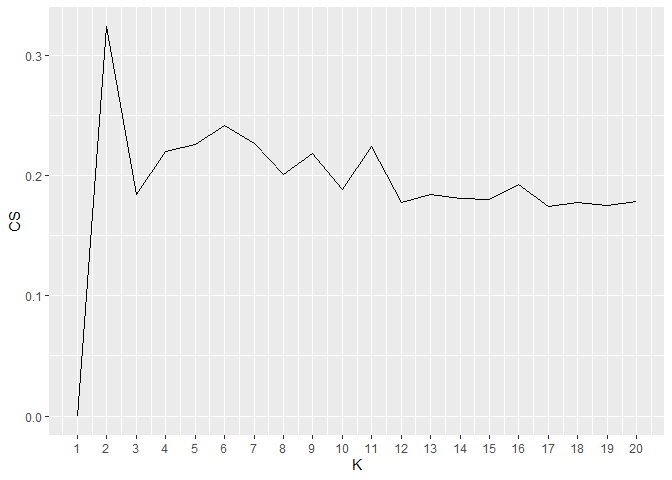
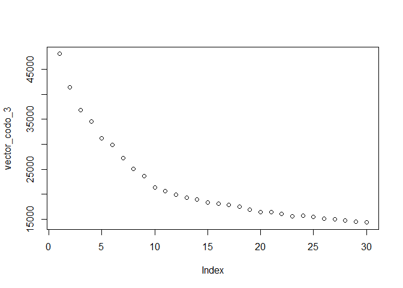

Entrega Proyecto 2
================

# Objetivo

El objetivo principal de este entregable es crear un programa
computacional que permita crear una lista de reproducción de 3 horas de
duración basándose en alguna canción de referencia. La base de datos
incluye 447.622 canciones, con 36 de las variables descritas en la
documentación de la API de Spotify.

El procedimiento consiste en generar una muestra aleatoria de la base de
datos descrita, a la cual se le realizará una clusterización mediante K
medias con una cantidad de clusters seleccionado por el estudio del
coeficiente de silueta. Luego, se generará una nueva base de datos con
las canciones que pertenecen al cluster con mayor agrupación resultante
de la iteración anterior, al cual nuevamente se le realizará una
clusterización mediante el algoritmo K Medias con una cantidad de
cluster determinado por el coeficiente de silueta aplicado a la nueva
data seleccionada. Por último, las canciones que pertenecen al cluster
con mejor agrupación obtenido por esta nueva iteración, se les realizará
una ultima clusterización mediante el algoritmo de K Medias con una
cantidad de clusters determinado por el coeficiente de silueta ampliado
a la nueva data seleccionada.

Las canciones resultantes de esta tercera iteración corresponderán a las
canciones que podrían ser incluidas en la playlist. A continuación, de
manera aleatoria se irán seleccionando canciones pertenecientes a este
conjunto de canciones hasta completar las tres horas de duración
requeridas.

Por último, dentro de esta nueva pequeña agrupación de canciones, se
seleccionará una de manera aleatoria y se concluirá que el resto de
canciones que esta ultima acción seleccionó corresponden a una playlist
con canciones similares a la canción elegida.

La idea detrás del algoritmo de K Medias es agrupar las canciones que
presenten una similitud en variables numéricas que describen el
comportamiento de la canción, es decir, seleccionar canciones similares
en su composición y sonido.

Se utiliza este algoritmo dado que es un algoritmo de clasificación no
supervisada (clusterización) que agrupa objetos en k grupos basándose en
sus características. El agrupamiento se realiza minimizando la suma de
distancias entre cada objeto y el centroide de su grupo o cluster, es
decir, es bastante hábil guiándose en las semejanzas que se tiene en los
datos, lo cual es super útil si se trata de buscar una playlist con
canciones semejantes.

Es importante destacar que el código es totalmente autónomo, es decir,
es capaz de adaptarse a cualquier conjunto aleatorio de canciones que se
determinan y es capaz de decidir automáticamente la cantidad de clusters
y el mejor cluster obtenido por cada iteración.Debido a lo anterior y
para obtener resultados de una iteración en específico, se utilizó una
semilla para mitigar la parte aleatoria de los resultados.

## Importar Librerías

Se incorporarán al algoritmo las librarías que contienen las funciones
que se utilizaran durante el funcionamiento del algoritmo.

``` r
library(tidyverse)
```

    ## Warning in as.POSIXlt.POSIXct(Sys.time()): unable to identify current timezone 'H':
    ## please set environment variable 'TZ'

``` r
library(cluster)
library(factoextra)
```

    ## Warning: package 'factoextra' was built under R version 4.0.5

``` r
library(janitor)
```

    ## Warning: package 'janitor' was built under R version 4.0.5

``` r
library(lattice)
```

    ## Warning: package 'lattice' was built under R version 4.0.5

``` r
library(stats4)
library(flexclust)
```

    ## Warning: package 'flexclust' was built under R version 4.0.5

``` r
library(ggdendro)
```

    ## Warning: package 'ggdendro' was built under R version 4.0.5

``` r
library(knitr)
```

## Importar datos

Los datos son asignados y corresponden al csv denominado “beats”, el
cual contiene 447.622 canciones, con 36 de las variables descritas en la
documentación de la API de Spotify.

``` r
setwd("C:/Users/Felipe/Documents/GitHub/Entregas_mineria_de_datos/Proyecto 2")
load(file="beats.RData")

summary(beats)
```

    ##  artist_name         artist_id           album_id          album_type       
    ##  Length:447622      Length:447622      Length:447622      Length:447622     
    ##  Class :character   Class :character   Class :character   Class :character  
    ##  Mode  :character   Mode  :character   Mode  :character   Mode  :character  
    ##                                                                             
    ##                                                                             
    ##                                                                             
    ##                                                                             
    ##  album_release_date album_release_year album_release_date_precision
    ##  Length:447622      Min.   :   0       Length:447622               
    ##  Class :character   1st Qu.:2010       Class :character            
    ##  Mode  :character   Median :2019       Mode  :character            
    ##                     Mean   :2013                                   
    ##                     3rd Qu.:2020                                   
    ##                     Max.   :2021                                   
    ##                     NA's   :447                                    
    ##   danceability        energy            key            loudness      
    ##  Min.   :0.0000   Min.   :0.0000   Min.   : 0.000   Min.   :-60.000  
    ##  1st Qu.:0.2520   1st Qu.:0.0756   1st Qu.: 2.000   1st Qu.:-24.445  
    ##  Median :0.3700   Median :0.2100   Median : 5.000   Median :-19.477  
    ##  Mean   :0.3911   Mean   :0.3405   Mean   : 5.061   Mean   :-18.672  
    ##  3rd Qu.:0.5140   3rd Qu.:0.5820   3rd Qu.: 8.000   3rd Qu.:-11.644  
    ##  Max.   :0.9860   Max.   :1.0000   Max.   :11.000   Max.   :  0.496  
    ##                                                                      
    ##       mode         speechiness       acousticness    instrumentalness 
    ##  Min.   :0.0000   Min.   :0.00000   Min.   :0.0000   Min.   :0.00000  
    ##  1st Qu.:0.0000   1st Qu.:0.03780   1st Qu.:0.3940   1st Qu.:0.00169  
    ##  Median :1.0000   Median :0.04430   Median :0.9230   Median :0.71500  
    ##  Mean   :0.6834   Mean   :0.06892   Mean   :0.6987   Mean   :0.50607  
    ##  3rd Qu.:1.0000   3rd Qu.:0.05840   3rd Qu.:0.9860   3rd Qu.:0.90100  
    ##  Max.   :1.0000   Max.   :0.97100   Max.   :0.9960   Max.   :1.00000  
    ##                                                                       
    ##     liveness         valence           tempo          track_id        
    ##  Min.   :0.0000   Min.   :0.0000   Min.   :  0.00   Length:447622     
    ##  1st Qu.:0.0968   1st Qu.:0.0894   1st Qu.: 82.39   Class :character  
    ##  Median :0.1230   Median :0.2740   Median :105.72   Mode  :character  
    ##  Mean   :0.2217   Mean   :0.3374   Mean   :108.74                     
    ##  3rd Qu.:0.2530   3rd Qu.:0.5370   3rd Qu.:131.05                     
    ##  Max.   :1.0000   Max.   :0.9960   Max.   :244.95                     
    ##                                                                       
    ##  analysis_url       time_signature   disc_number      duration_ms     
    ##  Length:447622      Min.   :0.000   Min.   : 1.000   Min.   :   1066  
    ##  Class :character   1st Qu.:4.000   1st Qu.: 1.000   1st Qu.: 123440  
    ##  Mode  :character   Median :4.000   Median : 1.000   Median : 194961  
    ##                     Mean   :3.728   Mean   : 1.212   Mean   : 229110  
    ##                     3rd Qu.:4.000   3rd Qu.: 1.000   3rd Qu.: 271560  
    ##                     Max.   :5.000   Max.   :26.000   Max.   :4796395  
    ##                                                                       
    ##   explicit        track_href         is_local        track_name       
    ##  Mode :logical   Length:447622      Mode :logical   Length:447622     
    ##  FALSE:442045    Class :character   FALSE:447622    Class :character  
    ##  TRUE :5577      Mode  :character                   Mode  :character  
    ##                                                                       
    ##                                                                       
    ##                                                                       
    ##                                                                       
    ##  track_preview_url   track_number       type            track_uri        
    ##  Length:447622      Min.   :  1.0   Length:447622      Length:447622     
    ##  Class :character   1st Qu.:  6.0   Class :character   Class :character  
    ##  Mode  :character   Median : 11.0   Mode  :character   Mode  :character  
    ##                     Mean   : 44.6                                        
    ##                     3rd Qu.: 30.0                                        
    ##                     Max.   :545.0                                        
    ##                                                                          
    ##  external_urls.spotify  album_name          key_name          mode_name        
    ##  Length:447622         Length:447622      Length:447622      Length:447622     
    ##  Class :character      Class :character   Class :character   Class :character  
    ##  Mode  :character      Mode  :character   Mode  :character   Mode  :character  
    ##                                                                                
    ##                                                                                
    ##                                                                                
    ##                                                                                
    ##    key_mode        
    ##  Length:447622     
    ##  Class :character  
    ##  Mode  :character  
    ##                    
    ##                    
    ##                    
    ## 

## Elección de variables

De las 36 columnas que entrega la base de datos, muchas de ellas no son
necesarias ni útiles para crear una playlist. Se procede a eliminar las
columnas de:

-   Artist\_id: El nombre del artista es más relevante para el objetivo
    del trabajo y representa la misma información pero de una manera
    visiblemente más agradable.

-   Album\_id: El nombre del álbum es más relevante para el objetivo del
    trabajo y representa la misma información pero de una manera
    visiblemente más agradable.

-   Album\_type: Saber que la canción está en un álbum no ayuda a
    identificar similitudes entre las canciones.

-   Album release year: A pesar de que una similitud en las canciones
    puede ser el año de creación, esta no corresponde a una similitud en
    la composición de la canción por lo cual no se utilizará esta
    variable.

-   Album\_release\_day:Es una información demasiado específica que no
    ayuda a generar similitudes en la composición o estilo de las
    canciones.

-   Album\_release\_day\_presition: No aporta información además de
    especificar que la canción fue liberada en un día.

-   mode: Representa un valor binario que no es relevante para generar
    similitudes en la composición de las canciones.

-   key: No se encontró información sobre lo que aporta esta variable,
    por lo cual se decide eliminarla.

-   Track\_id: El nombre de la canción es más relevante para el objetivo
    del trabajo y representa la misma información pero de una manera
    visiblemente más agradable.

-   Analysis\_url: No aporta información para buscar semejanzas entre
    las canciones en términos de su composición o estilo musical.

-   Time\_signature:No aporta información para buscar semejanzas entre
    canciones en relación con su composición musical.

-   Disc\_number: No aporta información para buscar semejanzas entre
    canciones en relación con su composición musical dado que es una
    información que apunta a la historia del artista.

-   Explicit: No aporta información para buscar semejanzas entre las
    canciones en términos de su composición o estilo musical.

-   Track\_href: No aporta información para buscar semejanzas entre las
    canciones en términos de su composición o estilo musical.

-   is\_local: No aporta información para buscar semejanzas entre las
    canciones en términos de su composición o estilo musical.

-   Track\_preview\_url: No aporta información para buscar semejanzas
    entre las canciones en términos de su composición o estilo musical.

-   Track\_number: No aporta información para buscar semejanzas entre
    las canciones en términos de su composición o estilo musical.

-   Type: No aporta información para buscar semejanzas entre las
    canciones en términos de su composición o estilo musical.

-   Track\_url: No aporta información para buscar semejanzas entre las
    canciones en términos de su composición o estilo musical.

-   External\_url\_spotify: No aporta información para buscar semejanzas
    entre las canciones en términos de su composición o estilo musical.

-   Key name:No aporta información para buscar semejanzas entre las
    canciones en términos de su composición o estilo musical.

-   mode name:No aporta información para buscar semejanzas entre las
    canciones en términos de su composición o estilo musical.

-   key mode:No aporta información para buscar semejanzas entre las
    canciones en términos de su composición o estilo musical.

``` r
beats=beats[,c(1,8:9,11,13:18,19,23,27,33)]
```

## Selección de Data

Debido a la gran cantidad de datos, algunas funciones y gráficas saturan
las capacidades de procesamiento del computador, por lo cual se decidió
implementar una muestra. El procedimiento consiste en generar una
muestra aleatoria simple sin reemplazo a través de la función “sample()”
con una cantidad de 20.000 datos. Es necesario validar que esta muestra
represente a la base de datos asignada por lo cual se compararan las
estadísticas de esta selección de datos con la data original a través de
la función “summary”.

``` r
set.seed(2000000)
sample_index <- sample(1:nrow(beats),20000, replace = F)
sample_data = beats[sample_index,]

summary(sample_data)
```

    ##  artist_name         danceability        energy           loudness      
    ##  Length:20000       Min.   :0.0000   Min.   :0.00000   Min.   :-60.000  
    ##  Class :character   1st Qu.:0.2500   1st Qu.:0.07568   1st Qu.:-24.443  
    ##  Mode  :character   Median :0.3700   Median :0.21000   Median :-19.439  
    ##                     Mean   :0.3917   Mean   :0.34199   Mean   :-18.666  
    ##                     3rd Qu.:0.5150   3rd Qu.:0.58925   3rd Qu.:-11.494  
    ##                     Max.   :0.9720   Max.   :1.00000   Max.   : -0.887  
    ##   speechiness       acousticness    instrumentalness    liveness     
    ##  Min.   :0.00000   Min.   :0.0000   Min.   :0.0000   Min.   :0.0000  
    ##  1st Qu.:0.03780   1st Qu.:0.4000   1st Qu.:0.0016   1st Qu.:0.0977  
    ##  Median :0.04430   Median :0.9210   Median :0.7180   Median :0.1230  
    ##  Mean   :0.06873   Mean   :0.6992   Mean   :0.5066   Mean   :0.2230  
    ##  3rd Qu.:0.05820   3rd Qu.:0.9860   3rd Qu.:0.9020   3rd Qu.:0.2540  
    ##  Max.   :0.96900   Max.   :0.9960   Max.   :0.9980   Max.   :1.0000  
    ##     valence           tempo          track_id          duration_ms     
    ##  Min.   :0.0000   Min.   :  0.00   Length:20000       Min.   :   4653  
    ##  1st Qu.:0.0858   1st Qu.: 82.78   Class :character   1st Qu.: 121786  
    ##  Median :0.2710   Median :106.13   Mode  :character   Median : 192180  
    ##  Mean   :0.3374   Mean   :108.98                      Mean   : 227427  
    ##  3rd Qu.:0.5423   3rd Qu.:131.38                      3rd Qu.: 269654  
    ##  Max.   :0.9870   Max.   :215.90                      Max.   :4787355  
    ##   track_name         album_name       
    ##  Length:20000       Length:20000      
    ##  Class :character   Class :character  
    ##  Mode  :character   Mode  :character  
    ##                                       
    ##                                       
    ## 

Lo importante es comparar las variables numéricas dado que estas son las
variables elegidas. Como se puede observar, en ninguno de los parámetros
comparados (Mínimo, Maximo, Median,Mean, Cuartiles) las diferencias
superan las magnitudes del 0,01 por lo cual se asume que la muestra
seleccionada representa a la data total dado que son similares.

# Limpieza de datos

## Búsqueda de datos faltantes

En primer lugar, se revisa si hay casos faltantes. Para las
observaciones que tengan datos faltantes, se le asigna el valor NA para
eliminarlos en el siguiente paso. Luego, se revisa que no queden valores
nulos. Tal como se observa a continuación, no se encontraron datos
faltantes en la muestra seleccionada.

En iteraciones previas a la entrega final se determinó que solo la
columna “album\_release\_year” cuenta con datos faltantes, pero no se va
a trabajar con esa columna. De haber utilizado esa variable, para
eliminar los datos faltantes se debe ocupar el comando “sample\_data
&lt;- sample\_data %&gt;%
filter(!(is.na(sample\_data$album\_release\_year)))” y de esta manera se
excluyen de la base de datos las filas que en esa determinada columna
cuenten con un NA.

``` r
sample_data[sample_data == ""] <- NA
sample_data %>%  summarise_all(funs(sum(is.na(.))))
```

    ## Warning: `funs()` was deprecated in dplyr 0.8.0.
    ## Please use a list of either functions or lambdas: 
    ## 
    ##   # Simple named list: 
    ##   list(mean = mean, median = median)
    ## 
    ##   # Auto named with `tibble::lst()`: 
    ##   tibble::lst(mean, median)
    ## 
    ##   # Using lambdas
    ##   list(~ mean(., trim = .2), ~ median(., na.rm = TRUE))

    ##   artist_name danceability energy loudness speechiness acousticness
    ## 1           0            0      0        0           0            0
    ##   instrumentalness liveness valence tempo track_id duration_ms track_name
    ## 1                0        0       0     0        0           0          0
    ##   album_name
    ## 1          0

## Búsqueda de datos duplicados

Asumiendo que la base de datos cuenta con una perfecta identificación de
cada canción, el siguiente comando pretende buscar si dentro de la
muestra seleccionada se encuentran canciones con su mismo ID. En caso de
ser encontradas, se eliminan debido a que se considera una canción
duplicada.

La variable “data actualizada” pretende mantener un data frame sin
escalar para luego ocupar las duraciones de las canciones reales, es
decir, con datos idénticos a la base de datos sin alguna modificación.

``` r
data_lista = sample_data[!duplicated(sample_data$track_id),]

data_actualizada=data_lista
```

# Análisis de Clúster

Se necesita identificar las variables que definen el comportamiento de
las canciones para luego evaluar su semejanza o diferencia, por lo cual
se utilizaran las variables:

-   danceability: la cualidad o el estado de ser bailable
-   energy: es la sensación de movimiento hacia adelante en la música,
    lo que mantiene al oyente comprometido y escuchando
-   loudness: es una forma de medir los niveles de audio basada en la
    forma en que los humanos perciben el sonido
-   spechiness: “La locuacidad detecta la presencia de palabras habladas
    en una canción”. Si la locuacidad de una canción es superior a 0,66,
    probablemente esté compuesta por palabras habladas, una puntuación
    entre 0,33 y 0,66 es una canción que puede contener tanto música
    como palabras, y una puntuación inferior a 0,33 significa que la
    canción no tiene ninguna palabra.
-   acusticness: Este valor describe cómo de acústica es una canción.
-   instrumentalness: Este valor representa la cantidad de voces en la
    canción.
-   liveness: Este valor describe la probabilidad de que la canción se
    haya grabado con público en directo. Según la documentación oficial,
    “un valor superior a 0,8 proporciona una fuerte probabilidad de que
    la canción sea en directo”.
-   valance: Una medida de 0,0 a 1,0 que describe la positividad musical
    que transmite una pista. Las pistas con alta valencia suenan más
    positivas (por ejemplo, felices, alegres, eufóricas), mientras que
    las pistas con baja valencia suenan más negativas (por ejemplo,
    tristes, deprimidas, enfadadas)
-   tempo: es la velocidad a la que se toca una pieza musical. Hay tres
    formas principales de comunicar el tempo a los músicos: BPM,
    terminología italiana y lenguaje moderno.

Todas las variables ya son numéricas por lo cual es más fácil escalarlas

## Escalar Datos

Dado que el algoritmo calcula la distancia euclidiana entre las
variables, es necesario que las variables se muevan dentro de un rango
acotado de valores puesto que si una variable se mueve entre 0 y 1
mientras que otra se mueve entre 0 y 1000, esta ultima influirá mucho
más en el resultado porque pesa más.

La intención de escalar los datos es que estos se encuentren centrados
en el 0 y con desviación estándar 1.

Dado que la función “scale” entrega el resultado como una matriz, se
utiliza el argumento “as\_tibble” para que el resultado sea un data
frame.

``` r
var_a_utilizar_en_clusters = data_lista[,c(2:10)]
data_escalada_1=scale(var_a_utilizar_en_clusters) %>% as_tibble()
summary(data_escalada_1)
```

    ##   danceability         energy           loudness         speechiness     
    ##  Min.   :-2.1169   Min.   :-1.0726   Min.   :-4.77039   Min.   :-0.7288  
    ##  1st Qu.:-0.7657   1st Qu.:-0.8354   1st Qu.:-0.66650   1st Qu.:-0.3279  
    ##  Median :-0.1172   Median :-0.4170   Median :-0.08942   Median :-0.2590  
    ##  Mean   : 0.0000   Mean   : 0.0000   Mean   : 0.00000   Mean   : 0.0000  
    ##  3rd Qu.: 0.6665   3rd Qu.: 0.7751   3rd Qu.: 0.82717   3rd Qu.:-0.1116  
    ##  Max.   : 3.1363   Max.   : 2.0644   Max.   : 2.05226   Max.   : 9.5464  
    ##   acousticness     instrumentalness     liveness          valence       
    ##  Min.   :-1.9016   Min.   :-1.2238   Min.   :-1.0085   Min.   :-1.2198  
    ##  1st Qu.:-0.8139   1st Qu.:-1.2200   1st Qu.:-0.5667   1st Qu.:-0.9095  
    ##  Median : 0.6030   Median : 0.5126   Median :-0.4523   Median :-0.2400  
    ##  Mean   : 0.0000   Mean   : 0.0000   Mean   : 0.0000   Mean   : 0.0000  
    ##  3rd Qu.: 0.7797   3rd Qu.: 0.9546   3rd Qu.: 0.1400   3rd Qu.: 0.7399  
    ##  Max.   : 0.8069   Max.   : 1.1864   Max.   : 3.5133   Max.   : 2.3488  
    ##      tempo         
    ##  Min.   :-3.44387  
    ##  1st Qu.:-0.82779  
    ##  Median :-0.08991  
    ##  Mean   : 0.00000  
    ##  3rd Qu.: 0.70825  
    ##  Max.   : 3.37931

Se puede observar que la data se encuentra escalada dado que sus rangos
máximos y mínimos son similares entre cada variable, lo cual permite que
las distancias euclidianas de las variables con mayor dispersión valores
no sesgan el resultado.

## Implementación de K Means

En primer lugar se planea identificar la mejor elección de clúster a
partir de la “regla del codo” y del “coeficiente de silueta”. De esta
manera se pretende ver como evoluciona la suma de cuadrados
intra-clúster en la medida que se aumenta el número de clúster elegidos.
Se debería poder observar como disminuye la cohesión mientras aumenta el
número de clúster. Por otro lado, el coeficiente de silueta también
ayuda a determinar el número óptimo de agrupamientos de clúster.

``` r
vector_codo_1 <- numeric(30)

for(k_codo_iteracion_1 in 1:30){
  modelo_codo_1 <- kmeans(data_escalada_1, centers = k_codo_iteracion_1)
  vector_codo_1[k_codo_iteracion_1] <- modelo_codo_1$tot.withinss
}
```

    ## Warning: did not converge in 10 iterations

    ## Warning: did not converge in 10 iterations

``` r
plot(vector_codo_1)
```

<!-- -->

A simple vista no queda muy claro cuál es el valor que genera el “codo”
o quiebre en la tendencia por lo cual se complementa con el coeficiente
de silueta, el cual si determina de manera precisa cuál es la mejor
elección de clúster dado que detecta cuál es el valor con mayor
cohesión.

## Coeficiente de silueta

Se utiliza el coeficiente de silueta para determinar el mejor valor de
K. Además, dentro del ciclo “for” se agrega una condición “if” que
permite ir guardando el valor de clúster K que presentó el valor de
cohesión más alto durante el ciclo para luego utilizar ese valor en la
iteración del algoritmo de K Means.

``` r
vector_silueta_1=numeric(20)
Buffer_1 = 0

for (k_silueta_iteracion_1 in 2:20){
  modelo_silueta_1 <- kmeans(data_escalada_1, centers = k_silueta_iteracion_1)
  variable_temporal_1 <- silhouette(modelo_silueta_1$cluster,dist(data_escalada_1))
  vector_silueta_1[k_silueta_iteracion_1] <- mean(variable_temporal_1[,3])
  
  if(vector_silueta_1[k_silueta_iteracion_1]>= Buffer_1){
    Buffer_1 = vector_silueta_1[k_silueta_iteracion_1]
    elección_k_iteracion_1 = k_silueta_iteracion_1
  }
}
tempDF_1=data.frame(CS=vector_silueta_1,K=c(1:20))

ggplot(tempDF_1, aes(x=K, y=CS)) + geom_line() + scale_x_continuous(breaks=c(1:30))
```

<!-- -->

# Implementación de K Means Primera iteración

Se crea el modelo de K Means sobre la data elegida y con la cantidad de
clúster almacenado en la variable “elección\_k\_iteracion\_1”, la cual
contiene la mejor cantidad de clúster para utilizar en el modelo de K
Means. A través del modelo se almacena en el data frame
“data\_actualizada” el valor del clúster al cual pertenece cada una de
las canciones a partir de esta primera iteración del modelo.

El resultado se representa a través del siguiente Plot, sin embargo, es
importante mencionar que esta es una de las tantas posibles
combinaciones de variables que ilustran la agrupación de clúster
resultante de esta iteración.

``` r
modelo_k_means_1 <- kmeans(data_escalada_1, centers = elección_k_iteracion_1)

data_escalada_1$clus_iteracion_1 <- modelo_k_means_1$cluster %>% as.factor()
data_actualizada$clus_iteracion_1 <- modelo_k_means_1$cluster %>% as.factor()

ggplot(data_escalada_1, aes(energy,danceability, color=clus_iteracion_1 )) +  geom_point(alpha=0.5, show.legend = F) +  theme_bw()
```

<!-- -->

## Evaluación de K Means

De acuerdo al estadístico de Hopkins, el cual mide la tendencia de los
Klusters. Se realiza con una cantidad de 20 muestras. Luego se validará
mediante el límite de Cohesión y de separación.

Se evita la evaluación visual dado que el algoritmo funciona con números
generados aleatoriamente, es decir, en cada iteración se genera una
diferente agrupación y cantidad de clúster, a los cuales el algoritmo
por su cuenta debe decidir cuál es el mejor.

En primer lugar tenemos el estadístico de Hopkins:

``` r
Hopkins_1 <- get_clust_tendency(var_a_utilizar_en_clusters, n = 20, graph = FALSE)
Hopkins_1
```

    ## $hopkins_stat
    ## [1] 0.8901281
    ## 
    ## $plot
    ## NULL

Un valor alto en el estadístico de Hopkins demuestra que existen
agrupaciones en los datos.

Luego se estudia la Cohesión:

``` r
data_escalada_1 <- apply(data_escalada_1,2,as.numeric)
modelo_k_means_1$tot.withinss
```

    ## [1] 127147.5

Un alto valor en la cohesión indica que tan cercanos se encuentran los
integrantes de un determinado clúster. Se pretende que este valor sea
alto.

A continuación se estudia la Separación:

``` r
meanData_1 <- colMeans(data_escalada_1)
SSB_1 <- numeric(elección_k_iteracion_1) #Este valor y el que esta en el for DEPENDEN DE LA CANTIDAD DE CLUSTERS QUE DETERMINA EL MODELO. 
for (i_1 in 1:elección_k_iteracion_1){
  tempData_1 <- data_escalada_1[which(modelo_k_means_1$cluster==i_1),]
  SSB_1[i_1] <- nrow(tempData_1)*sum((meanData_1-colMeans(tempData_1))^2)
}
separation_1 = sum(SSB_1)
separation_1
```

    ## [1] 57437.82

El valor de la separación mide que tan alejados se encuentran los
clúster frente a otros clúster.

Y finalmente se evalúa y grafica el coeficiente de silueta:

``` r
coefSilueta_1 <- silhouette(modelo_k_means_1$cluster,dist(data_escalada_1))
summary(coefSilueta_1)
```

    ## Silhouette of 19996 units in 2 clusters from silhouette.default(x = modelo_k_means_1$cluster, dist = dist(data_escalada_1)) :
    ##  Cluster sizes and average silhouette widths:
    ##     12713      7283 
    ## 0.4263162 0.1872850 
    ## Individual silhouette widths:
    ##    Min. 1st Qu.  Median    Mean 3rd Qu.    Max. 
    ## -0.1069  0.2360  0.3564  0.3393  0.4915  0.5902

``` r
fviz_silhouette(coefSilueta_1) + coord_flip()
```

    ##   cluster  size ave.sil.width
    ## 1       1 12713          0.43
    ## 2       2  7283          0.19

<!-- -->

El análisis de siluetas mide qué tan bien se agrupa una observación y
estima la distancia media entre los clústeres. Mientras más grande sea
el ancho medio de las siluetas, mejor agrupados se encuentran.

Debido a que la primera iteración del algoritmo K Means no genera
clúster con características que demuestran una semejanza alta, se decide
tomar el mejor clúster de la primera iteración de K Means y volver a
generar clúster a partir de la data de este clúster. Se determina que
“el mejor clúster” es aquel que tenga una mayor agrupación de datos.

# Segunda iteración K Means

## Elección del mejor clúster de iteración pasada

En primer lugar, se genera un nuevo Data Frame con las canciones que en
la iteración anterior fueron seleccionados en el mejor clúster. Para
lograr esto se debe encontrar cuál fue el mejor clúster y por ende se
utiliza el siguiente código, el cual finaliza con la elección del mejor
clúster en la variable
“variable\_4\_anexa\_para\_seleccionar\_cluster\_1”.

Su funcionamiento es calcular de manera mecánica la columna que el
gráfico anterior expone como “ave.sil.widt”. Esta variable indica la
agrupación en promedio que tuvo cada clúster. Para lograr este
resultado, se recorre toda la variable “CoefSilueta\_1”, la cual
contiene la agrupación y el clúster al cual cada cancón pertenece.
Almacenando cada uno de estos valores por cada clúster y luego
dividiendo por la cantidad de canciones que pertenecen a ese clúster se
obtiene el valor en estudio. Para finalizar, se utiliza la segunda
condición “if” para guardar el valor del clúster que presentó el mayor
valor de agrupación.

Finalmente, en “data\_iteracion\_2” se almacenan las canciones presentes
en “data\_actualizada” que fueron seleccionadas en el clúster
seleccionado en la iteración de K Medias anterior.

Si no se introduce el comando “coefSilueta\_1\[,1\]” se recorre tres
veces el largo de la variable porque esta tiene 3 columnas.

``` r
variable_1_anexa_para_seleccionar_cluster_1= 0
contador_anexa_para_seleccionar_cluster_1=0
variable_2_anexa_para_seleccionar_cluster_1=0
variable_3_anexa_para_seleccionar_cluster_1=0
variable_4_anexa_para_seleccionar_cluster_1=0

for(k_silueta_1 in 1:elección_k_iteracion_1){
    for (i_silueta_1 in 1:length(coefSilueta_1[,1]) ){
        if(coefSilueta_1[i_silueta_1,1]== k_silueta_1){
          variable_1_anexa_para_seleccionar_cluster_1=variable_1_anexa_para_seleccionar_cluster_1+coefSilueta_1[i_silueta_1,3]    
          contador_anexa_para_seleccionar_cluster_1=contador_anexa_para_seleccionar_cluster_1+1         
        }
    } 
    variable_2_anexa_para_seleccionar_cluster_1=variable_1_anexa_para_seleccionar_cluster_1/contador_anexa_para_seleccionar_cluster_1     
    
    if(variable_2_anexa_para_seleccionar_cluster_1 > variable_3_anexa_para_seleccionar_cluster_1){
       variable_3_anexa_para_seleccionar_cluster_1 = variable_2_anexa_para_seleccionar_cluster_1
       variable_4_anexa_para_seleccionar_cluster_1 = k_silueta_1      
    }
    variable_1_anexa_para_seleccionar_cluster_1= 0
    contador_anexa_para_seleccionar_cluster_1=0
    variable_2_anexa_para_seleccionar_cluster_1=0
}

data_iteracion_2= data_actualizada[data_actualizada$clus_iteracion_1 == variable_4_anexa_para_seleccionar_cluster_1,]  
data_actualizada= data_actualizada[data_actualizada$clus_iteracion_1 == variable_4_anexa_para_seleccionar_cluster_1,]
```

A forma de comprobación, dada la iteración anterior, el mejor clúster
elegido fue el clúster número:

``` r
variable_4_anexa_para_seleccionar_cluster_1
```

    ## [1] 1

## Escalar Datos

La intención de escalar los datos es que estos se encuentren centrados
en el 0 y con desviación estándar 1.

Al igual que antes, dado que la función “scale” entrega el resultado
como una matriz, se utiliza el argumento “as\_tibble” para que el
resultado sea un data frame.

``` r
data_escalada_2=data_iteracion_2[,c(2:10)]
data_escalada_2=scale(data_escalada_2) %>% as_tibble()
summary(data_escalada_2)
```

    ##   danceability          energy           loudness        speechiness      
    ##  Min.   :-2.26235   Min.   :-0.9147   Min.   :-5.9179   Min.   :-1.53001  
    ##  1st Qu.:-0.75025   1st Qu.:-0.6481   1st Qu.:-0.5908   1st Qu.:-0.33958  
    ##  Median :-0.06981   Median :-0.2604   Median : 0.1035   Median :-0.18648  
    ##  Mean   : 0.00000   Mean   : 0.0000   Mean   : 0.0000   Mean   : 0.00000  
    ##  3rd Qu.: 0.63126   3rd Qu.: 0.2900   3rd Qu.: 0.6934   3rd Qu.: 0.04473  
    ##  Max.   : 3.92351   Max.   : 5.1942   Max.   : 2.7662   Max.   :26.65280  
    ##   acousticness      instrumentalness     liveness           valence       
    ##  Min.   :-5.62050   Min.   :-2.0024   Min.   :-1.16763   Min.   :-1.1094  
    ##  1st Qu.: 0.06759   1st Qu.:-0.4155   1st Qu.:-0.47508   1st Qu.:-0.8304  
    ##  Median : 0.36761   Median : 0.5379   Median :-0.33421   Median :-0.3333  
    ##  Mean   : 0.00000   Mean   : 0.0000   Mean   : 0.00000   Mean   : 0.0000  
    ##  3rd Qu.: 0.44721   3rd Qu.: 0.6687   3rd Qu.:-0.03182   3rd Qu.: 0.5542  
    ##  Max.   : 0.47782   Max.   : 0.8983   Max.   : 5.98652   Max.   : 2.8189  
    ##      tempo        
    ##  Min.   :-3.2969  
    ##  1st Qu.:-0.7875  
    ##  Median :-0.1788  
    ##  Mean   : 0.0000  
    ##  3rd Qu.: 0.7665  
    ##  Max.   : 3.5719

Se puede observar que la data se encuentra escalada dado que sus rangos
máximos y mínimos son similares entre cada variable, lo cual permite que
las distancias euclidianas de las variables con mayor dispersión valores
no sesgan el resultado.

## Regla del codo

De manera similar a la iteración anterior, se utiliza la regla del codo
para observar el comportamiento de la posible elección de clúster y se
utiliza el coeficiente de silueta para determinar la mejor cantidad de
clúster dada la nueva data seleccionada.

``` r
vector_codo_2 <- numeric(30)

for(k_codo_iteracion_2 in 1:30){
  modelo_codo_2 <- kmeans(data_escalada_2, centers = k_codo_iteracion_2)
  vector_codo_2[k_codo_iteracion_2] <- modelo_codo_2$tot.withinss
}
```

    ## Warning: did not converge in 10 iterations

    ## Warning: did not converge in 10 iterations

``` r
plot(vector_codo_2)
```

<!-- -->

## Coeficiente de silueta

La cantidad de clúster que agrupa de mejor manera los datos queda
almacenada en la variable “elección\_k\_iteracion\_2” en la condición
“if”.

``` r
vector_silueta_2=numeric(20)
Buffer_2 = 0

for (k_silueta_iteracion_2 in 2:20){
  modelo_silueta_2 <- kmeans(data_escalada_2, centers = k_silueta_iteracion_2)
  variable_temporal_2 <- silhouette(modelo_silueta_2$cluster,dist(data_escalada_2))
  vector_silueta_2[k_silueta_iteracion_2] <- mean(variable_temporal_2[,3])
  
    if(vector_silueta_2[k_silueta_iteracion_2]>= Buffer_2){
    Buffer_2 = vector_silueta_2[k_silueta_iteracion_2]
    elección_k_iteracion_2 = k_silueta_iteracion_2
    }
}
```

    ## Warning: did not converge in 10 iterations

``` r
tempDF_2=data.frame(CS=vector_silueta_2,K=c(1:20))

ggplot(tempDF_2, aes(x=K, y=CS)) + geom_line() + scale_x_continuous(breaks=c(1:30))
```

<!-- -->

## Implementación de la segunda iteración

Se crea el modelo de K Means sobre la nueva data seleccionada y con la
cantidad de clúster almacenado en la variable
“elección\_k\_iteracion\_2”, la cual contiene la mejor cantidad de
clúster para utilizar en el modelo de K Means. A través del modelo se
almacena en el data frame “data\_actualizada” el valor del clúster al
cual pertenece cada una de las canciones a partir de esta segunda
iteración del modelo.

El resultado se representa a través del siguiente Plot, sin embargo, es
importante volver a mencionar que esta es una de las tantas posibles
combinaciones de variables que ilustran la agrupación de clúster
resultante de esta iteración.

``` r
modelo_k_means_2 <- kmeans(data_escalada_2, centers = elección_k_iteracion_2)

data_escalada_2$clus_iteracion_2 <- modelo_k_means_2$cluster %>% as.factor()

#Esto agrega el valor de la segunda iteracion
data_iteracion_2$clus_iteracion_2 <- modelo_k_means_2$cluster %>% as.factor() #dudo si eso esta bien
data_actualizada$clus_iteracion_2 <- modelo_k_means_2$cluster %>% as.factor()

ggplot(data_escalada_2, aes(energy,danceability, color=clus_iteracion_2 )) +  geom_point(alpha=0.5, show.legend = F) +  theme_bw()
```

<!-- -->

## Evaluación de segunda iteración de K Means

Para evaluar la nueva iteración, en primer lugar se utilizará el
estadístico de Hopkins

``` r
Hopkins_2 <- get_clust_tendency(var_a_utilizar_en_clusters, n = 20, graph = FALSE)
Hopkins_2
```

    ## $hopkins_stat
    ## [1] 0.8901281
    ## 
    ## $plot
    ## NULL

Un valor alto en el estadístico de Hopkins demuestra que existen
agrupaciones en los datos.

Luego, se utilizará la cohesión:

``` r
data_escalada_2 <- apply(data_escalada_2,2,as.numeric)
modelo_k_means_2$tot.withinss
```

    ## [1] 71950.48

Un alto valor en la cohesión indica que tan cercanos se encuentran los
integrantes de un determinado clúster. Se pretende que este valor sea
alto.

A continuación se valida la separación entre clúster:

``` r
meanData_2 <- colMeans(data_escalada_2)
SSB_2 <- numeric(elección_k_iteracion_2) #Este valor y el que esta en el for DEPENDEN DE LA CANTIDAD DE CLUSTERS QUE DETERMINA EL MODELO. 
for (i_2 in 1:elección_k_iteracion_2){
  tempData_2 <- data_escalada_2[which(modelo_k_means_2$cluster==i_2),]
  SSB_1[i_2] <- nrow(tempData_2)*sum((meanData_2-colMeans(tempData_2))^2)
}
separation_2 = sum(SSB_2)

separation_2
```

    ## [1] 0

El valor de la separación mide que tan alejados se encuentran el clúster
frente a otro clúster.

Y finalmente se utiliza el coeficiente de silueta:

``` r
coefSilueta_2 <- silhouette(modelo_k_means_2$cluster,dist(data_escalada_2))
summary(coefSilueta_2)
```

    ## Silhouette of 12713 units in 4 clusters from silhouette.default(x = modelo_k_means_2$cluster, dist = dist(data_escalada_2)) :
    ##  Cluster sizes and average silhouette widths:
    ##      5346       844      3943      2580 
    ## 0.4163868 0.1228696 0.2556402 0.2782851 
    ## Individual silhouette widths:
    ##    Min. 1st Qu.  Median    Mean 3rd Qu.    Max. 
    ## -0.2104  0.2338  0.3313  0.3190  0.4122  0.5690

``` r
fviz_silhouette(coefSilueta_2) + coord_flip()
```

    ##   cluster size ave.sil.width
    ## 1       1 5346          0.42
    ## 2       2  844          0.12
    ## 3       3 3943          0.26
    ## 4       4 2580          0.28

<!-- -->

El análisis de siluetas mide qué tan bien se agrupa una observación y
estima la distancia media entre los clústeres. Mientras más grande sea
el ancho medio de las siluetas, mejor agrupados se encuentran.

A pesar de que el éndice expuesto en el gráfico es menor al de la
primera iteración, se puede observar que por lo menos un clúster
demuestra tener un tamaño y agrupación significativamente mayor al
resto.

# Tercera iteración K Means

## Elección del mejor clúster de iteración pasada

Se genera un nuevo Data Frame con las canciones que en la iteración
anterior fueron seleccionados en el mejor clúster. Para lograr esto se
debe encontrar cuál fue el mejor clúster y por ende se utiliza el
siguiente código, el cual finaliza con la elección del mejor clúster en
la variable “variable\_4\_anexa\_para\_seleccionar\_cluster\_2”.

El funcionamiento es idéntico al ya explicado, por lo cual este código
no volverá a ser explicado.

Finalmente, en “data\_iteracion\_3” se almacenan las canciones presentes
en “data\_actualizada” que fueron seleccionadas en el clúster
seleccionado en la iteración de K Medias anterior.

``` r
variable_1_anexa_para_seleccionar_cluster_2= 0
contador_anexa_para_seleccionar_cluster_2=0
variable_2_anexa_para_seleccionar_cluster_2=0
variable_3_anexa_para_seleccionar_cluster_2=0
variable_4_anexa_para_seleccionar_cluster_2=0

for(k_silueta_2 in 1:elección_k_iteracion_2){
    for (i_silueta_2 in 1:length(coefSilueta_2[,1]) ){
        if(coefSilueta_2[i_silueta_2,1]== k_silueta_2){
          variable_1_anexa_para_seleccionar_cluster_2=variable_1_anexa_para_seleccionar_cluster_2+coefSilueta_2[i_silueta_2,3]    
          contador_anexa_para_seleccionar_cluster_2=contador_anexa_para_seleccionar_cluster_2+1         
        }
    } 
    variable_2_anexa_para_seleccionar_cluster_2=variable_1_anexa_para_seleccionar_cluster_2/contador_anexa_para_seleccionar_cluster_2   
    
    if(variable_2_anexa_para_seleccionar_cluster_2 > variable_3_anexa_para_seleccionar_cluster_2){
       variable_3_anexa_para_seleccionar_cluster_2 = variable_2_anexa_para_seleccionar_cluster_2
       variable_4_anexa_para_seleccionar_cluster_2 = k_silueta_2     
    }
    variable_1_anexa_para_seleccionar_cluster_2= 0
    contador_anexa_para_seleccionar_cluster_2=0
    variable_2_anexa_para_seleccionar_cluster_2=0
}

data_iteracion_3= data_actualizada[data_actualizada$clus_iteracion_2 == variable_4_anexa_para_seleccionar_cluster_2,]
data_actualizada= data_actualizada[data_actualizada$clus_iteracion_2 == variable_4_anexa_para_seleccionar_cluster_2,]
```

Nuevamente a forma de comprobación, dada la iteración anterior, el mejor
cluster elegido fue el cluster numero:

``` r
variable_4_anexa_para_seleccionar_cluster_2
```

    ## [1] 1

## Escalar Datos

La intención de escalar los datos es que estos se encuentren centrados
en el 0 y con desviación estándar 1.

Al igual que antes, dado que la función “scale” entrega el resultado
como una matriz, se utiliza el argumento “as\_tibble” para que el
resultado sea un data frame.

``` r
data_escalada_3=data_iteracion_3[,c(2:10)]
data_escalada_3=scale(data_escalada_3) %>% as_tibble()
summary(data_escalada_3)
```

    ##   danceability          energy           loudness         speechiness     
    ##  Min.   :-2.42031   Min.   :-1.0413   Min.   :-3.62645   Min.   :-3.2251  
    ##  1st Qu.:-0.77833   1st Qu.:-0.7416   1st Qu.:-0.58933   1st Qu.:-0.4241  
    ##  Median :-0.05475   Median :-0.3118   Median : 0.09168   Median :-0.1440  
    ##  Mean   : 0.00000   Mean   : 0.0000   Mean   : 0.00000   Mean   : 0.0000  
    ##  3rd Qu.: 0.71522   3rd Qu.: 0.4585   3rd Qu.: 0.72442   3rd Qu.: 0.2172  
    ##  Max.   : 3.79508   Max.   : 6.7146   Max.   : 2.63103   Max.   :26.1121  
    ##   acousticness      instrumentalness      liveness           valence       
    ##  Min.   :-8.79531   Min.   :-6.97528   Min.   :-1.85820   Min.   :-1.1819  
    ##  1st Qu.:-0.02778   1st Qu.:-0.09634   1st Qu.:-0.50923   1st Qu.:-0.8131  
    ##  Median : 0.39556   Median : 0.29212   Median :-0.23444   Median :-0.3575  
    ##  Mean   : 0.00000   Mean   : 0.00000   Mean   : 0.00000   Mean   : 0.0000  
    ##  3rd Qu.: 0.48605   3rd Qu.: 0.51872   3rd Qu.: 0.07782   3rd Qu.: 0.4942  
    ##  Max.   : 0.52483   Max.   : 1.08522   Max.   : 9.78915   Max.   : 6.3700  
    ##      tempo        
    ##  Min.   :-3.2687  
    ##  1st Qu.:-0.7538  
    ##  Median :-0.3105  
    ##  Mean   : 0.0000  
    ##  3rd Qu.: 0.6596  
    ##  Max.   : 3.5999

Se puede observar que la data se encuentra escalada dado que sus rangos
máximos y mínimos son similares entre cada variable, lo cual permite que
las distancias euclidianas de las variables con mayor dispersión valores
no sesgan el resultado.

## Modelo del codo

Finalmente y de manera idéntica a las dos iteraciones anteriores, se
utiliza la regla del codo para observar el comportamiento de la posible
elección de clúster y se utiliza el coeficiente de silueta para
determinar la mejor cantidad de clúster dada la nueva data seleccionada.

``` r
vector_codo_3 <- numeric(30)

for(k_codo_iteracion_3 in 1:30){
  modelo_codo_3 <- kmeans(data_escalada_3, centers = k_codo_iteracion_3)
  vector_codo_3[k_codo_iteracion_3] <- modelo_codo_3$tot.withinss
}
```

    ## Warning: did not converge in 10 iterations

    ## Warning: did not converge in 10 iterations

    ## Warning: did not converge in 10 iterations

``` r
plot(vector_codo_3)
```

<!-- -->

## Coeficiente de silueta

La cantidad de clúster que agrupa de mejor manera los datos queda
almacenada en la variable “elección\_k\_iteracion\_3”.

``` r
vector_silueta_3=numeric(20)
Buffer_3 = 0

for (k_silueta_iteracion_3 in 2:20){
  modelo_silueta_3 <- kmeans(data_escalada_3, centers = k_silueta_iteracion_3)
  variable_temporal_3 <- silhouette(modelo_silueta_3$cluster,dist(data_escalada_3))
  vector_silueta_3[k_silueta_iteracion_3] <- mean(variable_temporal_3[,3])
  
    if(vector_silueta_3[k_silueta_iteracion_3]>= Buffer_3){
    Buffer_3 = vector_silueta_3[k_silueta_iteracion_3]
    elección_k_iteracion_3 = k_silueta_iteracion_3
  }
}
```

    ## Warning: did not converge in 10 iterations

    ## Warning: did not converge in 10 iterations

``` r
tempDF_3=data.frame(CS=vector_silueta_3,K=c(1:20))

ggplot(tempDF_3, aes(x=K, y=CS)) + geom_line() + scale_x_continuous(breaks=c(1:30))
```

<!-- -->

## Implementación de la tercera iteración

Se crea el modelo de K Means sobre la nueva data seleccionada y con la
cantidad de clúster almacenado en la variable
“elección\_k\_iteracion\_3”, la cual contiene la mejor cantidad de
clúster para utilizar en el modelo de K Means. A través del modelo se
almacena en el data frame “data\_actualizada” el valor del clúster al
cual pertenece cada una de las canciones a partir de esta segunda
iteración del modelo.

El resultado se representa a través del siguiente Plot, sin embargo, es
importante mencionar por última vez que esta es una de las tantas
posibles combinaciones de variables que ilustran la agrupación de
clúster resultante de esta iteración.

``` r
modelo_k_means_3 <- kmeans(data_escalada_3, centers = elección_k_iteracion_3)

data_escalada_3$clus_iteracion_3 <- modelo_k_means_3$cluster %>% as.factor()
data_iteracion_3$clus_iteracion_3 <- modelo_k_means_3$cluster %>% as.factor()
data_actualizada$clus_iteracion_3 <- modelo_k_means_3$cluster %>% as.factor() 

ggplot(data_escalada_3, aes(energy,danceability, color=clus_iteracion_3 )) +  geom_point(alpha=0.5, show.legend = F) +  theme_bw()
```

<!-- -->

## Evaluación de tercera iteración de K Means

De acuerdo al estadístico de Hopkins, el cual mide la tendencia de los
Klusters. Se realiza con una cantidad de 20 muestras. Luego se validará
mediante el límite de Cohesión y de separación.

Se evita la evaluación visual dado que el algoritmo funciona con números
generados aleatoriamente, es decir, en cada iteración se genera una
diferente agrupación y cantidad de clúster, a los cuales el algoritmo
por su cuenta debe decidir cuál es el mejor.

En primer lugar tenemos el estadístico de Hopkins:

``` r
Hopkins_3 <- get_clust_tendency(var_a_utilizar_en_clusters, n = 20, graph = FALSE)
Hopkins_3
```

    ## $hopkins_stat
    ## [1] 0.8901281
    ## 
    ## $plot
    ## NULL

Un valor alto en el estadístico de Hopkins demuestra que existen
agrupaciones en los datos.

Luego está la cohesión:

``` r
data_escalada_3 <- apply(data_escalada_3,2,as.numeric)
modelo_k_means_3$tot.withinss
```

    ## [1] 23404.65

Un alto valor en la cohesión indica que tan cercanos se encuentran los
integrantes de un determinado clúster. Se pretende que este valor sea
alto.

A continuación se realiza el estudio de la separación:

``` r
meanData_3 <- colMeans(data_escalada_3)
SSB_3 <- numeric(elección_k_iteracion_3) #Este valor y el que esta en el for DEPENDEN DE LA CANTIDAD DE CLUSTERS QUE DETERMINA EL MODELO. 
for (i_3 in 1:elección_k_iteracion_3){
  tempData_3 <- data_escalada_3[which(modelo_k_means_3$cluster==i_3),]
  SSB_1[i_3] <- nrow(tempData_3)*sum((meanData_3-colMeans(tempData_3))^2)
}
separation_3 = sum(SSB_3)

separation_3
```

    ## [1] 0

El valor de la separación mide que tan alejados se encuentran los
clúster frente a otros clúster.

Y finalmente se utiliza el coeficiente de silueta:

``` r
coefSilueta_3 <- silhouette(modelo_k_means_3$cluster,dist(data_escalada_3))
summary(coefSilueta_3)
```

    ## Silhouette of 5346 units in 9 clusters from silhouette.default(x = modelo_k_means_3$cluster, dist = dist(data_escalada_3)) :
    ##  Cluster sizes and average silhouette widths:
    ##       623       251       739       820      1198       154       554       707 
    ## 0.5033968 0.1841324 0.2455217 0.2265427 0.3635917 0.2836160 0.2093673 0.3070028 
    ##       300 
    ## 0.3290523 
    ## Individual silhouette widths:
    ##     Min.  1st Qu.   Median     Mean  3rd Qu.     Max. 
    ## -0.08787  0.21568  0.30633  0.30641  0.39494  0.62987

``` r
fviz_silhouette(coefSilueta_3) + coord_flip()
```

    ##   cluster size ave.sil.width
    ## 1       1  623          0.50
    ## 2       2  251          0.18
    ## 3       3  739          0.25
    ## 4       4  820          0.23
    ## 5       5 1198          0.36
    ## 6       6  154          0.28
    ## 7       7  554          0.21
    ## 8       8  707          0.31
    ## 9       9  300          0.33

<!-- -->

El análisis de siluetas mide qué tan bien se agrupa una observación y
estima la distancia media entre los clústeres. Mientras más grande sea
el ancho medio de las siluetas, mejor agrupados se encuentran.

El gran cluster evidenciado en la anterior iteración se compone de esta
cantidad de cluster dentro de el. Nuevamente se puede observar que uno
de ellos destaca por sobre el resto con un gran tamaño y una ausencia de
datos atipicos. Se puede concluir que este debe ser el cluster con los
elementos mas semejantes entre ellos por lo cual este debe ser el
cluster del cual se determinará la playlist.

# Playlist a partir de K Means

## Selección del mejor Clúster de Última iteración

Se genera un nuevo Data Frame con las canciones que en la iteración
anterior fueron seleccionados en el mejor clúster. Para lograr esto se
debe encontrar cuál fue el mejor clúster y por ende se utiliza el
siguiente código, el cual finaliza con la elección del mejor clúster en
la variable “variable\_4\_anexa\_para\_seleccionar\_cluster\_3”.

El funcionamiento es idéntico al ya explicado, por lo cual este código
no volverá a ser explicado.

Finalmente, en “dataframe\_playlist” se almacenan las canciones
presentes en “data\_actualizada” que fueron seleccionadas en el clúster
seleccionado en la iteración de K Medias anterior.

``` r
variable_1_anexa_para_seleccionar_cluster_3= 0
contador_anexa_para_seleccionar_cluster_3=0
variable_2_anexa_para_seleccionar_cluster_3=0
variable_3_anexa_para_seleccionar_cluster_3=0
variable_4_anexa_para_seleccionar_cluster_3=0

for(k_silueta_3 in 1:elección_k_iteracion_3){
    for (i_silueta_3 in 1:length(coefSilueta_3[,1]) ){
        if(coefSilueta_3[i_silueta_3,1]== k_silueta_3){
          variable_1_anexa_para_seleccionar_cluster_3=variable_1_anexa_para_seleccionar_cluster_3+coefSilueta_3[i_silueta_3,3]    
          contador_anexa_para_seleccionar_cluster_3=contador_anexa_para_seleccionar_cluster_3+1         
        }
    } 
    variable_2_anexa_para_seleccionar_cluster_3=variable_1_anexa_para_seleccionar_cluster_3/contador_anexa_para_seleccionar_cluster_3 
    
    if(variable_2_anexa_para_seleccionar_cluster_3 > variable_3_anexa_para_seleccionar_cluster_3){
       variable_3_anexa_para_seleccionar_cluster_3 = variable_2_anexa_para_seleccionar_cluster_3
       variable_4_anexa_para_seleccionar_cluster_3 = k_silueta_3    
    }
    variable_1_anexa_para_seleccionar_cluster_3= 0
    contador_anexa_para_seleccionar_cluster_3=0
    variable_2_anexa_para_seleccionar_cluster_3=0
}

dataframe_playlist= data_actualizada[data_iteracion_3$clus_iteracion_3 == variable_4_anexa_para_seleccionar_cluster_3,]
dataframe_playlist=dataframe_playlist[,c(1,12,13)]
```

Finalmente a forma de comprobación, dada la iteración anterior, el mejor
clúster elegido fue el clúster número:

``` r
variable_4_anexa_para_seleccionar_cluster_3
```

    ## [1] 1

## Generación de números aleatorios

Para poder generar una especie de “shuffle” en la playlist, se realizará
una lista con valores aleatorios para seleccionar canciones del
dataframe de canciones que fueron determinadas del análisis de clúster,
es decir, de todas las canciones que presentaron las más altas
similitudes se generará una lista para seleccionar de manera aleatoria a
alguna de ellas.

``` r
sample_index_playlist <- sample(1:nrow(dataframe_playlist),dim(dataframe_playlist), replace = F)
```

## Transformación del tiempo

La duración presente en la base de datos original se encuentra en
milisegundos (ms) por lo cual mediante el siguiente código se
transformará a segundos y luego a minutos.

``` r
dataframe_playlist$duration_ms=dataframe_playlist$duration_ms*0.001/60
```

## Generación de playlist

Con un ciclo que recorre desde el valor 1 hasta el valor del largo del
dataframe de canciones que fueron seleccionadas por la clusterización,
se seleccionaran por orden las canciones que la lista de números
aleatorios determinó hasta completar un tiempo acumulado de 3 horas para
así completar el requisito del entregable.

Se ocupa una condición de mayor o igual a 180 porque dado que el
requisito son 3 horas, las cuales traducidas a minutos corresponden a
180 minutos.

``` r
contador_de_tiempo=0
playlist_semi_final=NULL
playlist_semi_final= data.frame('artista','cancion','index')

for (k_playlist in 1:dim(dataframe_playlist)){
    variable_auxiliar_playlist=sample_index_playlist[k_playlist]
    
    playlist_semi_final[k_playlist,1]=dataframe_playlist[variable_auxiliar_playlist,1]
    playlist_semi_final[k_playlist,2]=dataframe_playlist[variable_auxiliar_playlist,3]
    playlist_semi_final[k_playlist,3]=k_playlist
    
    contador_de_tiempo=contador_de_tiempo+dataframe_playlist$duration_ms[variable_auxiliar_playlist]
    if(contador_de_tiempo >= 180){
      break
    }
}
```

    ## Warning in 1:dim(dataframe_playlist): numerical expression has 2 elements: only
    ## the first used

# Elección de canción y playlist asociada

Finalmente, se ilustran los resultados del algoritmo.

## Canción elegida

La canción es elegida de manera aleatoria de las canciones que fueron
seleccionadas para completar las 3 horas de reproducción. En esta
iteración la canción elegida fue:

``` r
sample_index_cancion <- sample(1:nrow(playlist_semi_final),1, replace = F)
playlist_semi_final[sample_index_cancion,]
```

    ##                X.artista.  X.cancion. X.index.
    ## 36 Mother Nature Sound FX Going Under       36

## Playlist Asociada

La playlist corresponde al resto de canciones que fueron elegidas para
completar las tres horas de duración, por lo que la playlist asociada a
esa determinada canción elegida es:

``` r
playlist_final = playlist_semi_final[!(playlist_semi_final$X.index. == sample_index_cancion),]
playlist_final$X.index.=NULL

playlist_final
```

    ##                X.artista.
    ## 1         Frédéric Chopin
    ## 2  Mother Nature Sound FX
    ## 3              Relaxmycat
    ## 4  Mother Nature Sound FX
    ## 5  Mother Nature Sound FX
    ## 6              Relaxmycat
    ## 7  Mother Nature Sound FX
    ## 8              Relaxmycat
    ## 9         Christophe Beck
    ## 10  Johann Sebastian Bach
    ## 11 Mother Nature Sound FX
    ## 12 Mother Nature Sound FX
    ## 13        Frédéric Chopin
    ## 14 Mother Nature Sound FX
    ## 15 Mother Nature Sound FX
    ## 16             Relaxmycat
    ## 17             Relaxmycat
    ## 18 Mother Nature Sound FX
    ## 19        Frédéric Chopin
    ## 20    Camille Saint-Saëns
    ## 21 Mother Nature Sound FX
    ## 22 Mother Nature Sound FX
    ## 23        Frédéric Chopin
    ## 24    Sergei Rachmaninoff
    ## 25   Ludwig van Beethoven
    ## 26   Ludwig van Beethoven
    ## 27 Mother Nature Sound FX
    ## 28  Johann Sebastian Bach
    ## 29   Ludwig van Beethoven
    ## 30 Mother Nature Sound FX
    ## 31             Relaxmycat
    ## 32        Frédéric Chopin
    ## 33        Frédéric Chopin
    ## 34 Mother Nature Sound FX
    ## 35 Mother Nature Sound FX
    ## 37             Relaxmycat
    ## 38             Relaxmycat
    ## 39        Frédéric Chopin
    ## 40   Ludwig van Beethoven
    ## 41             Relaxmycat
    ## 42 Mother Nature Sound FX
    ## 43    Sergei Rachmaninoff
    ## 44 Mother Nature Sound FX
    ## 45  Johann Sebastian Bach
    ## 46 Mother Nature Sound FX
    ## 47    Sergei Rachmaninoff
    ## 48        Frédéric Chopin
    ## 49        Frédéric Chopin
    ## 50             Relaxmycat
    ## 51  Johann Sebastian Bach
    ## 52    Camille Saint-Saëns
    ## 53   Ludwig van Beethoven
    ##                                                                                                                   X.cancion.
    ## 1                                                      24 Preludes, Op. 28 (arr. G. Rost for organ): No. 13 in F-Sharp Major
    ## 2                                                                                                             Always Mindful
    ## 3                                                                                                              Just Fly Away
    ## 4                                                                                                                Going Under
    ## 5                                                                                                            River Rain Song
    ## 6                                                                                                       Music for Deep Sleep
    ## 7                                                                                                     A Walk Along the Beach
    ## 8                                                                                                               Lucky Voyage
    ## 9                                                                                                                   Partners
    ## 10                                                                                    Erbarm dich mein o Herre Gott, BWV 721
    ## 11                                                                                                            Contemplations
    ## 12                                                                                                         Entering Calmness
    ## 13                                                                                         24 Préludes, Op.28: 6. In B Minor
    ## 14                                                                                              Deep Asleep, Totally Relaxed
    ## 15                                                                                                                     Reiki
    ## 16                                                                                                     A Time for Relaxation
    ## 17                                                                                                            Anxiety Relief
    ## 18                                                                                                                 Hush Baby
    ## 19                                                                                        12 Etudes, Op.25: No. 2 in F minor
    ## 20                                                                                    Berceuse in E Major for Organ, Op. 105
    ## 21                                                                                                                   Healing
    ## 22                                                                                               Acknowledging True Emotions
    ## 23                                                                    Nocturnes, Op. 55: II. Lento sostenuto in E-Flat Major
    ## 24                                                                                           Rachmaniana: 4. Dolce romantico
    ## 25                                                                           Bagatelle No. 25 in A Minor, WoO 59 "Für Elise"
    ## 26                                     Piano Sonata No. 14 in C-Sharp Minor, Op. 27, No. 2, "Moonlight": I. Adagio sostenuto
    ## 27                                                                                                            Contemplations
    ## 28                                            The Well-Tempered Clavier: Book 1, BWV 846-869: 1. Prelude in C Major, BWV 846
    ## 29                                                 6 Bagatelles, Op. 126: 3. Andante, Cantabile ed espressivo (E-Flat Major)
    ## 30                                                                                                                     Reiki
    ## 31                                                                                                            Sleeping Music
    ## 32                                                                                         24 Préludes, Op.28: 2. in A minor
    ## 33                                                                                   Impromptu No. 3 in G-Flat Major, Op. 51
    ## 34                                                                                                            Deep Breathing
    ## 35                                                                                                         Peaceful Thoughts
    ## 37                                                                                                                  Ambience
    ## 38                                                                                                         Comforting Sounds
    ## 39                                                          Piano Concerto No. 1 in E Minor, Op. 11: II. Romanze (Larghetto)
    ## 40                                                    Piano Concerto No. 5 in E-Flat Major, Op. 73: II. Adagio un poco mosso
    ## 41                                                                                                               Soft Sounds
    ## 42                                                                                                              Fluid Motion
    ## 43                                                                                                     4 Pieces: II. Prélude
    ## 44                                                                                                              Fluid Motion
    ## 45 Aria mit 30 Veränderungen, BWV 988 "Goldberg Variations" - Arranged for String Trio by Dmitry Sitkovetsky: Aria - Da Capo
    ## 46                                                                                                              Poetic Winds
    ## 47                                                                                 Etudes-tableaux, Op. 39: No. 2 in A Minor
    ## 48                                                                                                   Gott Ist Mein Hirt D706
    ## 49                                                                      24 Préludes, Op.28: No. 4 in E minor (Arr. Williams)
    ## 50                                                                                                              Level-headed
    ## 51                                          18 Chorale Preludes "Leipziger": No. 13, Allein Gott in der Höh sei Ehr, BWV 663
    ## 52                                                                        3 préludes et fugues en Sol Majeur, Op. 109, No. 2
    ## 53                                          Mass in D Major, Op. 123 "Missa Solemnis": Sanctus: Sanctus Dominus Deus Sabaoth

De esta manera, se finaliza el entregable con una playlist de música
tranquila y relajante del tipo instrumental antigua de estilo clásica,
sin vocalización. Se destacan las canciones de “Mother Nature Sound FX”,
quien aparece reiterada veces durante la playlist con música totalmente
relajante, en donde incluye sonidos de la naturaleza tales como aves,
lluvia, agua, madera, entre otros. “Relaxmycat” se describe en la web
como un compositor de música relajante para gatos, lo cual corrobora la
composición de esta playlist. Continuando con los integrantes de la
playlist, “Christophe Beck” es un compositor de música sin la
incorporación de voces, en busca de sinfonías relajantes y de corta
duración. A diferencia del resto, sus canciones aparecen en películas
bastante actuales tales como “Antman and the Wasp”. “J.S. Bach” fue un
compositor, organista, clavecinista, director de orquesta, violinista,
violagambista, maestro de capilla, cantor y profesor alemán del período
barroco. Fue el miembro más importante de una de las familias de músicos
más destacadas de la historia, con más de 35 compositores famosos. Su
incorporación en la playlist señala la integración de música tanto de la
época como de épocas antiguas, pero siempre enfatizando en la búsqueda
de tranquilidad con instrumentos clásicos y la nula vocalización.
Semejante al anterior artista mencionado, “Camille Saint-Saëns” figura
con su música clásica entre los años 1835 y 1921, agregando este tipo de
música a la playlist. Por último, “Sergei Rachmaninoff” y “Ludwig van
Beethoven” introducen en la playlist el mismo toque de música clásica
antigua y en instrumentos clásicos como el órgano para agregar
tranquilidad.

De esta manera se puede concluir que la playlist asociada corresponde a
una playlist compuesta por canciones de gran similitud y debido al orden
en que se generaron los clusters (es decir, realizar clusters y quedarse
con los que presenten mayor agrupación entre los integrantes del
cluster) se puede inferir que estos artistas con las canciones que
integran la playlist, son las canciones dentro de la muestra que más
similitud contienen.

El resultado debería cambiar si no se utiliza la semilla planteada en
los primeros comandos.
