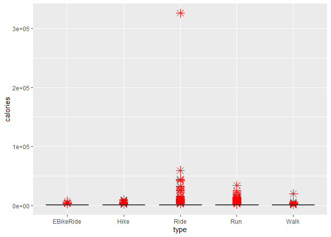
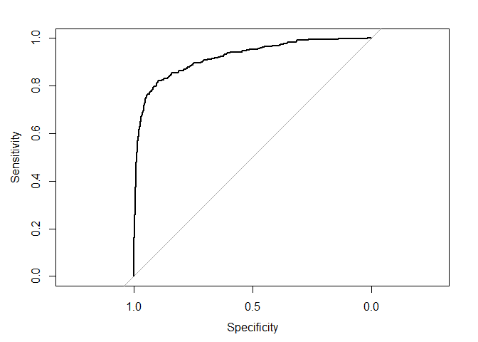
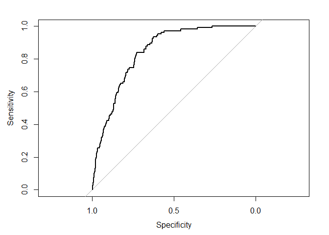

Proyecto 3
================

El trabajo se divide en la presentacion del informe, importar las
librerías, cargar los datos, limpiar los datos, diseñar una logica para
enfrentar la problematica, concluir y por ultimo, realizar el objetivo
secundario descrito.

# Objetivo

El objetivo principal de este encargo es crear un programa computacional
que permita diferenciar las actividades realizadas en bicicleta o a pie
según sus características como distancia recorrida, velocidad promedio u
otro atributo. Como objetivo secundario se espera que su programa
permita identificar aquellas actividades que fueron registradas
erróneamente por el usuario. La base de datos incluye 167.615
actividades y 17 variables.

# Importar Librerías

``` r
library(tidyverse)
library(e1071)
library(caret)
library(olsrr)
library(pROC)
library(ggplot2)
library(class)
library(tidymodels)
library(discrim) 
library(naivebayes)
```

# Cargar Datos

Se presentan dos formas de cargar los datos dado que el entregable fue
creado a lo largo del tiempo en dos equipos con diferentes sistemas
operativos y por ende, con diferentes formas de cargar los datos.

``` r
#En Windows
setwd("C:/Users/Felipe/Documents/GitHub/Entregas_mineria_de_datos/Proyecto 3")
data<- readRDS("C:/Users/Felipe/Documents/GitHub/Entregas_mineria_de_datos/Proyecto 3/endurance.rds")
#En Mac
#data = readRDS("~/Documents/GitHub/Entregas_mineria_de_datos/Proyecto 3/endurance.rds")
attach(data)
summary(data)
```

    ##        id             type              athlete            calories       
    ##  Min.   :     1   Length:167615      Min.   : 8558143   Min.   :     0.0  
    ##  1st Qu.: 41905   Class :character   1st Qu.:14204866   1st Qu.:   281.0  
    ##  Median : 83808   Mode  :character   Median :15621719   Median :   629.0  
    ##  Mean   : 83808                      Mean   :15359426   Mean   :   816.7  
    ##  3rd Qu.:125712                      3rd Qu.:16685446   3rd Qu.:  1076.8  
    ##  Max.   :167615                      Max.   :18078075   Max.   :326157.3  
    ##     distance         elev_low           records           elev_high        
    ##  Min.   :      0   Length:167615      Length:167615      Length:167615     
    ##  1st Qu.:   6159   Class :character   Class :character   Class :character  
    ##  Median :  12968   Mode  :character   Mode  :character   Mode  :character  
    ##  Mean   :  21998                                                           
    ##  3rd Qu.:  27494                                                           
    ##  Max.   :1479320                                                           
    ##   max_speed         device_name         moving_time        elapsed_time      
    ##  Length:167615      Length:167615      Min.   :       0   Min.   :        0  
    ##  Class :character   Class :character   1st Qu.:    2248   1st Qu.:     2582  
    ##  Mode  :character   Mode  :character   Median :    3853   Median :     4450  
    ##                                        Mean   :    5141   Mean   :    32102  
    ##                                        3rd Qu.:    6516   3rd Qu.:     7934  
    ##                                        Max.   :11025474   Max.   :511111044  
    ##  average_speed      has_heartrate      start_date_local             
    ##  Length:167615      Length:167615      Min.   :1999-04-25 17:36:38  
    ##  Class :character   Class :character   1st Qu.:2016-11-23 17:11:10  
    ##  Mode  :character   Mode  :character   Median :2019-01-26 13:37:56  
    ##                                        Mean   :2018-05-12 07:50:32  
    ##                                        3rd Qu.:2020-04-30 04:33:10  
    ##                                        Max.   :2021-02-02 11:37:09  
    ##  total_elevation_gain
    ##  Min.   :    0.0     
    ##  1st Qu.:   15.1     
    ##  Median :  171.0     
    ##  Mean   :  397.0     
    ##  3rd Qu.:  595.0     
    ##  Max.   :59595.0

# Limpieza de datos

La limpieza de datos consiste en las funciones realizadas sobre la data
para alivianar los datos utilizados. Se divide en la elección de
variables, busqueda y tratamiento de datos faltantes y por ultimo
busqueda y tratamiento de datos atipicos.

## Eleccion de variables

Se eliminó “start\_date\_local” y “device\_name” dado que la fecha de
incorporación o de creación del perfil no es relevante para diferenciar
las actividades realizadas en bicicleta o a pie. El valor identificador
de cada atleta no permite realizar un analisis sobre la actividad
realizada, dado que solo interesan los parametros obtenidos por la
actividad, al igual que la columna reference al “id” de la iteración.
“Records” fue eliminado dado que no es relevante saber si la iteración
grabada resultó en un record frente al resto o no. A pesar de que la
información obtenida por un “heartrate” sería relevante para formar una
relación entre el deporte realizado y el comportamiento de los sensores
recogido por el reloj, la base de datos no aporta esa información y no
es relevante para el objetivo saber si se tiene o no un “heartrate” por
lo que la variable “has\_heartrate” fue eliminada. El tiempo
transcurrido (elapsed time) tambien fue eliminado dado que es mas
detallada la información del tiempo de movimiento que del tiempo
transcurrido desde el inicio del dispositivo a la hora de categorizar
deportes.

``` r
data$start_date_local = NULL
data$device_name = NULL
data$athlete = NULL
data$id = NULL 
data$records = NULL
data$has_heartrate = NULL
data$elapsed_time = NULL
```

## Busqueda de datos faltantes

Los datos faltantes son registros en donde alguno de sus valores no fue
ingresado, es decir, valores nulos. Se eliminan porque ensucian y
modifican el comportamiento de los algoritmos.

``` r
data[data == ""] <- NA
data %>%  summarise_all(funs(sum(is.na(.))))
```

    ## Warning: `funs()` was deprecated in dplyr 0.8.0.
    ## Please use a list of either functions or lambdas: 
    ## 
    ##   # Simple named list: 
    ##   list(mean = mean, median = median)
    ## 
    ##   # Auto named with `tibble::lst()`: 
    ##   tibble::lst(mean, median)
    ## 
    ##   # Using lambdas
    ##   list(~ mean(., trim = .2), ~ median(., na.rm = TRUE))

    ##   type calories distance elev_low elev_high max_speed moving_time average_speed
    ## 1    0        0        0    13519     13519         0           0             0
    ##   total_elevation_gain
    ## 1                    0

Se demuestra la existencia de datos faltantes en la columna de
“elev\_high” y de “elev\_low” por lo cual decido eliminar las columnas
den donde se encuentren datos faltantes para no trabajar con supuestos.

``` r
data <- data %>% filter(!(is.na(data$elev_high)))
data <- data %>%  filter(!(is.na(data$elev_low)))
```

Se revisa si se eliminaron los datos faltantes.

``` r
data[data == ""] <- NA
data %>%  summarise_all(funs(sum(is.na(.))))
```

    ##   type calories distance elev_low elev_high max_speed moving_time average_speed
    ## 1    0        0        0        0         0         0           0             0
    ##   total_elevation_gain
    ## 1                    0

Se valida que no quedan datos faltantes.

## Busqueda de datos atipicos

Mediante un estudio de regresiones realizado a la data (pero omitido
para la entrega), se observó la precencia de muchos valores atipicos en
cada una de las variables, por lo cual se procede a analizarlos y
eliminarlos.

Empezando con las calorias, se observa un grafico totalmente
desproporcionado debido a la existencia de multiples datos atipicos
alejados de los valores medios. Debido a esto, se procede a eliminar
todos los valores superiores a 3000 calorias por su poca probabilidad de
ser un entrenamiento real, considerando el exceso de ejercicio cardiaco
realizado y la cantidad de tiempo que demanda quemar esa cantidad de
calorias durante un entrenamiento normal. Tambien se eliminaran los
valores que sean equivalentes a 0 porque demuestran un error en la
medición. Si van a realizar un deporte, al menos una caloria debe ser
quemada.

Se conserva la existencia de algunos datos atipicos.

``` r
ggplot(data, aes(x= type, y=calories))+ geom_boxplot(outlier.colour="red", outlier.shape=8,outlier.size=4)
```

<!-- -->

``` r
data_actualizada <- data %>% filter(data$calories < 3000)
data_actualizada <- data_actualizada %>% filter(data_actualizada$calories > 1)
ggplot(data_actualizada, aes(x= type, y=calories))+ geom_boxplot(outlier.colour="red", outlier.shape=8,outlier.size=4)
```

<!-- -->

Se observa que con el limite de calorias indicado, los datos por cada
tipo de deporte se encuentran mas compactados.

En el caso de la distancia, se limitan sus valores a 40000.

``` r
ggplot(data_actualizada, aes(x= type, y=distance))+ geom_boxplot(outlier.colour="red", outlier.shape=8,outlier.size=4)
```

<!-- -->

``` r
data_actualizada = data_actualizada[data_actualizada$distance < 40000,]
ggplot(data_actualizada, aes(x= type, y=distance))+ geom_boxplot(outlier.colour="red", outlier.shape=8,outlier.size=4)
```

<!-- -->

En el caso de la velocidad, no tiene sentido que la maxima velocidad sea
0 por lo cual se eliminan todos esos valores.

``` r
data_actualizada = data_actualizada[data_actualizada$max_speed > 1 ,]
```

En el caso de las elevaciones, se detectó la existencia de valores
negativos, los cuales no tienen sentido y se eliminaron.

``` r
data_actualizada = data_actualizada[data_actualizada$elev_low > 0,]
data_actualizada = data_actualizada[data_actualizada$elev_high > 0,]
```

Para el tiempo en movimiento, debido a la prsencia de valores atipicos
en uno de los tipos de actividades se limitó a 15000.

``` r
ggplot(data_actualizada, aes(x= type, y=moving_time))+ geom_boxplot(outlier.colour="red", outlier.shape=8,outlier.size=4)
```

<!-- -->

``` r
data_actualizada = data_actualizada[data_actualizada$moving_time < 15000,]
ggplot(data_actualizada, aes(x= type, y=moving_time))+ geom_boxplot(outlier.colour="red", outlier.shape=8,outlier.size=4)
```

<!-- -->

Con respecto a la velocidad promedio, se eliminaran los valores
inferiores a 1 dado que demuestran una velocidad de movimiento
inexplicable para un registro que pretende registrar una actividad.

``` r
data_actualizada = data_actualizada[data_actualizada$average_speed > 1 ,]
#ggplot(data_actualizada, aes(x= type, y=average_speed))+ geom_boxplot(outlier.colour="red", outlier.shape=8,outlier.size=4)
```

Por ultimo, con respecto a la total elevación ganada. Se deja en 5000
porque existe una posibilidad de elevarse en 5000 metros de altura
sabiendo que el everest tiene 8000 metros de altura.

``` r
ggplot(data_actualizada, aes(x= type, y=total_elevation_gain))+ geom_boxplot(outlier.colour="red", outlier.shape=8,outlier.size=4)
```

<!-- -->

``` r
data_actualizada = data_actualizada[data_actualizada$total_elevation_gain < 1700,]
ggplot(data_actualizada, aes(x= type, y=total_elevation_gain))+ geom_boxplot(outlier.colour="red", outlier.shape=8,outlier.size=4)
```

<!-- -->

# Lógica

La logica implica la utilizaciòn de modelos de machine lerning del tipo
supervidado (dado que intentaré predecir unos valores con los valores
pasados de ese algo), en donde se utilizaran mecanismos de clasificaciòn
dado que los valores a predecir son variables discretas, es decir, que
se mueven en un intervalo de valores conocidos. En este caso esos
valores son el 1 y el 0, a los cuales se llegará a continuación.

El objetivo del proyecto es diferenciar las actividades realizadas en
bicicleta o a pie, por lo cual se espera predecir las actividades
realizadas en bicicleta (Ride y EBikeRide) y a pie (Run,Walk y Hike),
sin omitir ninguna.

## Evaluar modelo supervisados

Para evaluar la otpimalidad de los modelos supervisados, se utilizará la
matriz de confusión, la cual permite determinar si el metodo
implementado sobre la data estimó bien los valores, dado que da la
probabilidad de falsos y verdaderos positivos o negativos a traves de
sus algoritmos internos. Para implementarla, se utilizará la curva ROC,
la cual caracteriza la compensación entre golpes positivos y falsas
alarmas trazando la tasa de verdaderos positivos en el eje Y contra la
tasa de falsos positivos en el eje X para diferente valores. Es otra
forma de ver la matriz de confusión. Una buena curva ROC se acerca mucho
al eje Y. Por ultimo, se utilizará la metrica AUC, la cual corresponde
al area bajo la curva ROC y por ende sintetiza el rendimiento del
modelo. Mientras mas area, es mejor el modelo porque predice de mejor
manera los valores a partir de la data.

# Transformación de Variables

La columna del tipo de deporte efectuado se encuentra indicando el tipo
de deporte que supuestamente realizó esa iteración. Sin embargo, dado
que es de tipo caracter y dado que dentro de esa misma columna hay 4
posibles tipos de deporte, se pretende separar esa información en
variables booleanas (representado en valores numericos enteros binarios)
en donde cada variable haga referencia a un tipo de deporte en
particular.

``` r
unique(data_actualizada$type)
```

    ## [1] "Ride"      "Run"       "Walk"      "Hike"      "EBikeRide"

``` r
data_actualizada$type_Ride <- (data_actualizada$type == "Ride") %>% as.numeric()
data_actualizada$type_Run <- (data_actualizada$type == "Run") %>% as.numeric()
data_actualizada$type_Walk <- (data_actualizada$type == "Walk") %>% as.numeric()
data_actualizada$type_Hike <- (data_actualizada$type == "Hike") %>% as.numeric()
data_actualizada$type_EBikeRide <- (data_actualizada$type == "EBikeRide") %>% as.numeric()

data_actualizada$type = NULL
```

## Muestreo aleatorio simple sin remplazo

Se agrupa el 80% de los datos almacenado con la finalidad de ser una
data de entrenamiento mientras que el 20% restante de la data será para
probar el rendimiento del modelo seleccionado.

``` r
set.seed(42)
muestra_aleatoria <- sample(1:nrow(data_actualizada), nrow(data_actualizada)*.8)

data_de_entrenamiento <- data_actualizada[muestra_aleatoria,]
data_de_prueba <- data_actualizada[-muestra_aleatoria,]
```

## Escalar datos y modificación de data a predecir

Las magnitudes de los datos son muy diferentes entre cada variable, lo
cual puede inducir efectos negativos en la creación de los modelos, por
lo cual se decide escalar la data numerica. Por otro lado, algunas de
estas variables se encuentran como valores de factores y deben ser
tratados como valores numericos en algunos algoritmos.

Se crea la data de entrenamiento 2 con la finalidad de utilizarla en un
algoritmo de clasificación en especifico, el cual será utilizado mas
adelante. Por otro lado se creará la data de objetivos secundarios para
la realización del objetivo secundario del desafío.

``` r
data_de_entrenamiento_2=data_de_entrenamiento
objetivo_secundario_entrenamiento = data_de_entrenamiento

data_de_entrenamiento$elev_low = as.numeric(data_de_entrenamiento$elev_low)
data_de_entrenamiento$elev_high = as.numeric(data_de_entrenamiento$elev_high)
data_de_entrenamiento$max_speed = as.numeric(data_de_entrenamiento$max_speed)
data_de_entrenamiento$average_speed = as.numeric(data_de_entrenamiento$average_speed)

data_de_entrenamiento_2$elev_low = as.numeric(data_de_entrenamiento_2$elev_low)
data_de_entrenamiento_2$elev_high = as.numeric(data_de_entrenamiento_2$elev_high)
data_de_entrenamiento_2$max_speed = as.numeric(data_de_entrenamiento_2$max_speed)
data_de_entrenamiento_2$average_speed = as.numeric(data_de_entrenamiento_2$average_speed)

data_de_prueba_2=data_de_prueba
objetivo_secundario_prueba = data_de_prueba

data_de_prueba$elev_low = as.numeric(data_de_prueba$elev_low)
data_de_prueba$elev_high = as.numeric(data_de_prueba$elev_high)
data_de_prueba$max_speed = as.numeric(data_de_prueba$max_speed)
data_de_prueba$average_speed = as.numeric(data_de_prueba$average_speed)

data_de_prueba_2$elev_low = as.numeric(data_de_prueba_2$elev_low)
data_de_prueba_2$elev_high = as.numeric(data_de_prueba_2$elev_high)
data_de_prueba_2$max_speed = as.numeric(data_de_prueba_2$max_speed)
data_de_prueba_2$average_speed = as.numeric(data_de_prueba_2$average_speed)

types_entrenamiento=data.frame(data_de_entrenamiento[9:13])
types_prueba=data.frame(data_de_prueba[9:13])

data_de_entrenamiento_escalada <-  scale(data_de_entrenamiento[,-c(9:13)]) %>% data.frame()
data_de_prueba_escalada <- scale(data_de_prueba[,-c(9:13)]) %>% data.frame()

data_de_entrenamiento_escalada_2 <- scale(data_de_entrenamiento_2[,-c(9:13)]) %>% data.frame()
data_de_prueba_escalada_2 <- scale(data_de_prueba_2[,-c(9:13)]) %>% data.frame()

data_de_entrenamiento_escalada = cbind.data.frame(data_de_entrenamiento_escalada,types_entrenamiento)
data_de_entrenamiento_escalada_2=cbind.data.frame(data_de_entrenamiento_escalada,types_entrenamiento)
data_de_prueba_escalada=cbind.data.frame(data_de_prueba_escalada,types_prueba)
data_de_prueba_escalada_2=cbind.data.frame(data_de_prueba_escalada,types_prueba)

objetivo_secundario_entrenamiento_escalado=data_de_entrenamiento_escalada
objetivo_secundario_prueba_escalado = data_de_prueba_escalada

data_de_prueba_escalada_2 =data_de_prueba_escalada_2[,1:13]
data_de_entrenamiento_escalada_2 = data_de_entrenamiento_escalada_2[,1:13]
```

## Metodo de clasificación sobre variables creadas

Se utilizarán cuatro algoritmos de clasificación sobre la data con la
finalidad de encontrar el mejor algoritmo para cada una de las cinco
variables a predecir.

### Regresión logistica Multiple

Es un modelo simple y liviano computacionalmente por lo cual permite
darle una caracter de introducción al estudio de las predicciones. Por
problemas de capacidad computacional, no se permite ingresar todas las
variables al modelo dado se genera un colapso de procesamiento, Para
cada uno de los tipos de actividad se calcula el modelo a traves de la
función GLM utilizando las variables de “calorias” y “distancia” de la
data de entrenamiento, las cuales fueron consideradas como las variables
mas relevantes para predecir. La función “summary” permite concluir que
las variables ingresadas son pertinentes para la variable a predecir a
traves de un indicador de asteriscos a un costado de las variables. El
resultado del modelo es almacenado en la variable
“prob\_multi\_modelo\_logistico\_(tipo de actividad)” en el dataframe de
data\_de\_prueba para luego medir su efectividad con la data de prueba
en la función “auc”. Debido a que la data va a ser utilizada en otros
algoritmos, se limpia la variable de probabilidad generada luego de
obtener los parametros del modelo y sus resultados.

#### Para el caso del tipo Ride:

``` r
modelo_logistico_1 <- glm(type_Ride ~ calories + distance, data_de_entrenamiento, family = "binomial")
summary(modelo_logistico_1)
```

    ## 
    ## Call:
    ## glm(formula = type_Ride ~ calories + distance, family = "binomial", 
    ##     data = data_de_entrenamiento)
    ## 
    ## Deviance Residuals: 
    ##     Min       1Q   Median       3Q      Max  
    ## -5.7432  -0.5965   0.0189   0.4375   6.1968  
    ## 
    ## Coefficients:
    ##               Estimate Std. Error z value Pr(>|z|)    
    ## (Intercept) -1.003e+00  1.843e-02  -54.46   <2e-16 ***
    ## calories    -7.264e-03  5.859e-05 -123.98   <2e-16 ***
    ## distance     5.326e-04  4.072e-06  130.79   <2e-16 ***
    ## ---
    ## Signif. codes:  0 '***' 0.001 '**' 0.01 '*' 0.05 '.' 0.1 ' ' 1
    ## 
    ## (Dispersion parameter for binomial family taken to be 1)
    ## 
    ##     Null deviance: 117801  on 86439  degrees of freedom
    ## Residual deviance:  59706  on 86437  degrees of freedom
    ## AIC: 59712
    ## 
    ## Number of Fisher Scoring iterations: 7

``` r
data_de_prueba$prob_multi_modelo_logistico_Ryde <- predict(modelo_logistico_1, data_de_prueba, type=c("response"))
auc(roc(type_Ride ~ prob_multi_modelo_logistico_Ryde, data = data_de_prueba))
```

    ## Setting levels: control = 0, case = 1

    ## Setting direction: controls < cases

    ## Area under the curve: 0.9296

``` r
data_de_prueba$prob_multi_modelo_logistico_Ryde = NULL 
```

#### Para el caso del tipo Run:

``` r
modelo_logistico_2 <- glm(type_Run ~ calories + distance, data_de_entrenamiento, family = "binomial")
summary(modelo_logistico_2)
```

    ## 
    ## Call:
    ## glm(formula = type_Run ~ calories + distance, family = "binomial", 
    ##     data = data_de_entrenamiento)
    ## 
    ## Deviance Residuals: 
    ##     Min       1Q   Median       3Q      Max  
    ## -5.8651  -0.5399  -0.0502   0.6353   5.4698  
    ## 
    ## Coefficients:
    ##               Estimate Std. Error z value Pr(>|z|)    
    ## (Intercept)  5.371e-01  1.744e-02   30.79   <2e-16 ***
    ## calories     6.623e-03  5.325e-05  124.36   <2e-16 ***
    ## distance    -4.739e-04  3.716e-06 -127.53   <2e-16 ***
    ## ---
    ## Signif. codes:  0 '***' 0.001 '**' 0.01 '*' 0.05 '.' 0.1 ' ' 1
    ## 
    ## (Dispersion parameter for binomial family taken to be 1)
    ## 
    ##     Null deviance: 115528  on 86439  degrees of freedom
    ## Residual deviance:  63834  on 86437  degrees of freedom
    ## AIC: 63840
    ## 
    ## Number of Fisher Scoring iterations: 7

``` r
#modelo_logistico <- glm(type_Ride ~ calories + distance + elev_high + elev_low + max_speed + moving_time + average_speed + total_elevation_gain, data_de_entrenamiento, family = "binomial")

data_de_prueba$prob_multi_modelo_logistico_Run <- predict(modelo_logistico_2, data_de_prueba, type=c("response"))
auc(roc(type_Run ~ prob_multi_modelo_logistico_Run, data = data_de_prueba))
```

    ## Setting levels: control = 0, case = 1

    ## Setting direction: controls < cases

    ## Area under the curve: 0.9138

``` r
data_de_prueba$prob_multi_modelo_logistico_Run = NULL #Para mantener orden en data_de_entrenamiento le borro esto siempre 
```

#### Para el caso del tipo Walk:

``` r
modelo_logistico_3 <- glm(type_Walk ~ calories + distance, data_de_entrenamiento, family = "binomial")
summary(modelo_logistico_3)
```

    ## 
    ## Call:
    ## glm(formula = type_Walk ~ calories + distance, family = "binomial", 
    ##     data = data_de_entrenamiento)
    ## 
    ## Deviance Residuals: 
    ##     Min       1Q   Median       3Q      Max  
    ## -1.5766  -0.2192  -0.1004  -0.0208   4.7743  
    ## 
    ## Coefficients:
    ##               Estimate Std. Error z value Pr(>|z|)    
    ## (Intercept) -1.720e+00  4.094e-02  -42.02   <2e-16 ***
    ## calories     1.441e-03  1.103e-04   13.07   <2e-16 ***
    ## distance    -3.886e-04  1.135e-05  -34.25   <2e-16 ***
    ## ---
    ## Signif. codes:  0 '***' 0.001 '**' 0.01 '*' 0.05 '.' 0.1 ' ' 1
    ## 
    ## (Dispersion parameter for binomial family taken to be 1)
    ## 
    ##     Null deviance: 17098  on 86439  degrees of freedom
    ## Residual deviance: 13769  on 86437  degrees of freedom
    ## AIC: 13775
    ## 
    ## Number of Fisher Scoring iterations: 9

``` r
#modelo_logistico <- glm(type_Ride ~ calories + distance + elev_high + elev_low + max_speed + moving_time + average_speed + total_elevation_gain, data_de_entrenamiento, family = "binomial")

data_de_prueba$prob_multi_modelo_logistico_Walk <- predict(modelo_logistico_3, data_de_prueba, type=c("response"))
auc(roc(type_Walk ~ prob_multi_modelo_logistico_Walk, data = data_de_prueba))
```

    ## Setting levels: control = 0, case = 1

    ## Setting direction: controls < cases

    ## Area under the curve: 0.873

``` r
data_de_prueba$prob_multi_modelo_logistico_Walk = NULL #Para mantener orden en data_de_entrenamiento le borro esto siempre 
```

#### Para el caso del tipo Hike:

``` r
modelo_logistico_4 <- glm(type_Hike ~ calories + distance, data_de_entrenamiento, family = "binomial")
summary(modelo_logistico_4)
```

    ## 
    ## Call:
    ## glm(formula = type_Hike ~ calories + distance, family = "binomial", 
    ##     data = data_de_entrenamiento)
    ## 
    ## Deviance Residuals: 
    ##     Min       1Q   Median       3Q      Max  
    ## -1.6909  -0.1766  -0.1022  -0.0314   4.9038  
    ## 
    ## Coefficients:
    ##               Estimate Std. Error z value Pr(>|z|)    
    ## (Intercept) -3.061e+00  5.837e-02  -52.44   <2e-16 ***
    ## calories     2.001e-03  1.149e-04   17.41   <2e-16 ***
    ## distance    -3.130e-04  1.266e-05  -24.71   <2e-16 ***
    ## ---
    ## Signif. codes:  0 '***' 0.001 '**' 0.01 '*' 0.05 '.' 0.1 ' ' 1
    ## 
    ## (Dispersion parameter for binomial family taken to be 1)
    ## 
    ##     Null deviance: 9797.2  on 86439  degrees of freedom
    ## Residual deviance: 8599.7  on 86437  degrees of freedom
    ## AIC: 8605.7
    ## 
    ## Number of Fisher Scoring iterations: 9

``` r
data_de_prueba$prob_multi_modelo_logistico_Hike <- predict(modelo_logistico_4, data_de_prueba, type=c("response"))
auc(roc(type_Hike ~ prob_multi_modelo_logistico_Hike, data = data_de_prueba))
```

    ## Setting levels: control = 0, case = 1

    ## Setting direction: controls < cases

    ## Area under the curve: 0.8058

``` r
data_de_prueba$prob_multi_modelo_logistico_Hike = NULL #Para mantener orden en data_de_entrenamiento le borro esto siempre 
```

#### Para el caso del tipo EbikeRide:

``` r
modelo_logistico_5 <- glm(type_EBikeRide ~ calories + distance, data_de_entrenamiento, family = "binomial")
summary(modelo_logistico_5)
```

    ## 
    ## Call:
    ## glm(formula = type_EBikeRide ~ calories + distance, family = "binomial", 
    ##     data = data_de_entrenamiento)
    ## 
    ## Deviance Residuals: 
    ##     Min       1Q   Median       3Q      Max  
    ## -0.2535  -0.1014  -0.0823  -0.0692   3.5744  
    ## 
    ## Coefficients:
    ##               Estimate Std. Error z value Pr(>|z|)    
    ## (Intercept) -6.470e+00  1.162e-01 -55.657  < 2e-16 ***
    ## calories     6.458e-04  1.028e-04   6.284 3.29e-10 ***
    ## distance     3.031e-05  5.819e-06   5.209 1.90e-07 ***
    ## ---
    ## Signif. codes:  0 '***' 0.001 '**' 0.01 '*' 0.05 '.' 0.1 ' ' 1
    ## 
    ## (Dispersion parameter for binomial family taken to be 1)
    ## 
    ##     Null deviance: 4752.3  on 86439  degrees of freedom
    ## Residual deviance: 4627.9  on 86437  degrees of freedom
    ## AIC: 4633.9
    ## 
    ## Number of Fisher Scoring iterations: 8

``` r
#modelo_logistico <- glm(type_Ride ~ calories + distance + elev_high + elev_low + max_speed + moving_time + average_speed + total_elevation_gain, data_de_entrenamiento, family = "binomial")

data_de_prueba$prob_multi_modelo_logistico_EBikeRide <- predict(modelo_logistico_5, data_de_prueba, type=c("response"))
auc(roc(type_EBikeRide~ prob_multi_modelo_logistico_EBikeRide, data = data_de_prueba))
```

    ## Setting levels: control = 0, case = 1

    ## Setting direction: controls < cases

    ## Area under the curve: 0.6716

``` r
data_de_prueba$prob_multi_modelo_logistico_EBikeRide = NULL #Para mantener orden en data_de_entrenamiento le borro esto siempre 
```

## Modelos Parametricos

### Modelo de Naive Bayes

Dada una distribución condicional de probabilidad, la salida del modelo
indica para un dato, si pertenece o no a una clase especificada. Se
utiliza este modelo dado que la base de datos aun cuenta con modelos
atipicos y este modelo es robusto frente a valores atipicos y datos
irrelevantes. La función para el algoritmo es “NaiveBayes” y a
diferencia del algoritmo anterior, la capacidad computacional si permite
ingresar todas las variables de la data de entrenamiento. Luego, se
utiliza la función “predict” con la data de prueba escalada y el
resultado de esta predicción se agrega en una nueva columna a la data de
prueba escalada. En la función “roc” se contrasta este resultado de
probabilidades con el valor real almacenado en la data de prueba.

#### En el caso de Ryde

``` r
modeloNB_Ryde <- naiveBayes(type_Ride ~ calories + distance + elev_high + elev_low + max_speed + moving_time + average_speed + total_elevation_gain, data = data_de_entrenamiento_escalada)
prediccion_NB_Ryde <- predict(modeloNB_Ryde, data_de_prueba_escalada, type ="raw")

data_de_prueba_escalada$prob_NB_Ryde <- prediccion_NB_Ryde[,2]
curva_roc_NB_Ryde <- roc(type_Ride ~ data_de_prueba_escalada$prob_NB_Ryde, data = data_de_prueba_escalada)
```

    ## Setting levels: control = 0, case = 1

    ## Setting direction: controls < cases

``` r
plot(curva_roc_NB_Ryde)    
```

<!-- -->

``` r
auc(curva_roc_NB_Ryde)
```

    ## Area under the curve: 0.9502

``` r
data_de_prueba_escalada$prob_NB_Ryde = NULL
```

#### En el caso de Run

``` r
modeloNB_Run <- naiveBayes(type_Run ~ calories + distance + elev_high + elev_low + max_speed + moving_time + average_speed + total_elevation_gain, data = data_de_entrenamiento_escalada)
prediccion_NB_Run  <- predict(modeloNB_Run ,data_de_prueba_escalada, type ="raw")
#modeloNB_Ryde

data_de_prueba_escalada$prob_NB_Run  <- prediccion_NB_Run[,2]
curva_roc_NB_Run  <- roc(type_Run  ~ data_de_prueba_escalada$prob_NB_Run , data = data_de_prueba_escalada)
```

    ## Setting levels: control = 0, case = 1

    ## Setting direction: controls < cases

``` r
plot(curva_roc_NB_Run )    
```

<!-- -->

``` r
auc(curva_roc_NB_Run )
```

    ## Area under the curve: 0.9332

``` r
data_de_prueba_escalada$prob_NB_Run  = NULL
```

#### En el caso de Walk

``` r
modeloNB_Walk <- naiveBayes(type_Walk ~ calories + distance + elev_high + elev_low + max_speed + moving_time + average_speed + total_elevation_gain, data = data_de_entrenamiento_escalada)
prediccion_NB_Walk <- predict(modeloNB_Walk, data_de_prueba_escalada, type ="raw")
#modeloNB_Ryde

data_de_prueba_escalada$prob_NB_Walk <- prediccion_NB_Walk[,2]
curva_roc_NB_Walk <- roc(type_Walk ~ data_de_prueba_escalada$prob_NB_Walk, data = data_de_prueba_escalada)
```

    ## Setting levels: control = 0, case = 1

    ## Setting direction: controls < cases

``` r
plot(curva_roc_NB_Walk)    
```

<!-- -->

``` r
auc(curva_roc_NB_Walk)
```

    ## Area under the curve: 0.9186

``` r
data_de_prueba_escalada$prob_NB_Walk = NULL
```

#### En el caso de Hike

``` r
modeloNB_Hike <- naiveBayes(type_Hike ~ calories + distance + elev_high + elev_low + max_speed + moving_time + average_speed + total_elevation_gain, data = data_de_entrenamiento_escalada)
prediccion_NB_Hike <- predict(modeloNB_Hike, data_de_prueba_escalada, type ="raw")
#modeloNB_Ryde

data_de_prueba_escalada$prob_NB_Hike <- prediccion_NB_Hike[,2]
curva_roc_NB_Hike <- roc(type_Hike ~ data_de_prueba_escalada$prob_NB_Hike, data = data_de_prueba_escalada)
```

    ## Setting levels: control = 0, case = 1

    ## Setting direction: controls < cases

``` r
plot(curva_roc_NB_Hike)    
```

<!-- -->

``` r
auc(curva_roc_NB_Hike)
```

    ## Area under the curve: 0.9195

``` r
data_de_prueba_escalada$prob_NB_Hike = NULL
```

#### En el caso de EBikeRide:

``` r
modeloNB_EBikeRide <- naiveBayes(type_EBikeRide ~ calories + distance + elev_high + elev_low + max_speed + moving_time + average_speed + total_elevation_gain, data = data_de_entrenamiento_escalada)
prediccion_NB_EBikeRide <- predict(modeloNB_EBikeRide, data_de_prueba_escalada, type ="raw")
#modeloNB_Ryde

data_de_prueba_escalada$prob_NB_EBikeRide <- prediccion_NB_EBikeRide[,2]
curva_roc_NB_EBikeRide <- roc(type_EBikeRide ~ data_de_prueba_escalada$prob_NB_EBikeRide, data = data_de_prueba_escalada)
```

    ## Setting levels: control = 0, case = 1

    ## Setting direction: controls < cases

``` r
plot(curva_roc_NB_EBikeRide)    
```

<!-- -->

``` r
auc(curva_roc_NB_EBikeRide)
```

    ## Area under the curve: 0.8417

``` r
data_de_prueba_escalada$prob_NB_EBikeRide = NULL
```

## Modelos no parametricos

### K vecinos mas cercanos

Busca una división en los datos a partir del concepto de vecindad.
Aprende de los datos ingresados y no de una formula matematica. En este
caso, los valores a predecir se almacenanen variables como factores dado
que es un requisito del modelo. Luego, en la función “knn” de la
librería “class” se agrega la data de entrenamiento escalada, la data de
prueba escalada y el factor de la variable a predecir en el data frame
de entrenamiento escalado para luego almacenar en “data de prueba
escalada” las probabilidades obtenidas por el modelo y el resultado de
clasificación que entrega el modelo (variable “KNN\_(tipo de
actividad)”). En la función “roc” se contrasta este valor de
clasificación obtenido por el modelo con la probabilidad arrojada por el
modelo. Por ultimo se eliminan las nuevas variables creadas dado que los
data frame que modificaron va a ser utilizado el el resto de actividades
realizadas.

#### Para Ryde:

``` r
Clase_a_predecir_entrenamiento_Ride <- factor(data_de_entrenamiento$type_Ride)
Clase_a_predecir_prueba_Ride <- factor(data_de_prueba$type_Ride)

modeloKnn_Ride <- knn(data_de_entrenamiento_escalada_2[,-c(9:13)], data_de_prueba_escalada_2[,-c(9:13)], cl = data_de_entrenamiento_escalada_2$type_Ride, k = 15, prob = TRUE)  

data_de_prueba_escalada_2$prob_knn_Ride <- modeloKnn_Ride %>% as.character() %>% as.numeric()
data_de_prueba_escalada_2$KNN_Ride <- Clase_a_predecir_prueba_Ride %>% as.character() %>% as.numeric()

objetivo_secundario_prueba_escalado$prob_knn_Ride <- modeloKnn_Ride %>% as.character() %>% as.numeric()
objetivo_secundario_prueba_escalado$KNN_Ride  <- Clase_a_predecir_prueba_Ride %>% as.character() %>% as.numeric()

curva_roc_KNN_Ride <- roc(KNN_Ride  ~ data_de_prueba_escalada_2$prob_knn_Ride, data = data_de_prueba_escalada_2)
```

    ## Setting levels: control = 0, case = 1

    ## Setting direction: controls < cases

``` r
plot(curva_roc_KNN_Ride)    
```

<!-- -->

``` r
auc(curva_roc_KNN_Ride)
```

    ## Area under the curve: 0.9671

``` r
data_de_prueba_escalada_2$prob_knn_Ride = NULL
data_de_prueba_escalada_2$KNN_Ride  = NULL
```

#### Para Run:

``` r
Clase_a_predecir_entrenamiento_Run <- factor(data_de_entrenamiento$type_Run)
Clase_a_predecir_prueba_Run <- factor(data_de_prueba$type_Run)

modeloKnn_Run <- knn(data_de_entrenamiento_escalada_2[,-c(9:13)], data_de_prueba_escalada_2[,-c(9:13)], cl = data_de_entrenamiento_escalada_2$type_Run, k = 15, prob = TRUE)    ### AQUI VA LA DUDA QUE LE PREGUNTE AL PROFE

data_de_prueba_escalada_2$prob_knn_Run <- modeloKnn_Run %>% as.character() %>% as.numeric()
data_de_prueba_escalada_2$KNN_Run <- Clase_a_predecir_prueba_Run %>% as.character() %>% as.numeric()

objetivo_secundario_prueba_escalado$prob_knn_Run <- modeloKnn_Run %>% as.character() %>% as.numeric()
objetivo_secundario_prueba_escalado$KNN_Run <- Clase_a_predecir_prueba_Run %>% as.character() %>% as.numeric()

curva_roc_KNN_Run <- roc(KNN_Run ~ data_de_prueba_escalada_2$prob_knn_Run, data = data_de_prueba_escalada_2)
```

    ## Setting levels: control = 0, case = 1

    ## Setting direction: controls < cases

``` r
plot(curva_roc_KNN_Run)    
```

<!-- -->

``` r
auc(curva_roc_KNN_Run)
```

    ## Area under the curve: 0.9612

``` r
data_de_prueba_escalada_2$prob_knn_Run = NULL
data_de_prueba_escalada_2$KNN_Run = NULL
```

#### Para Walk:

``` r
Clase_a_predecir_entrenamiento_Walk <- factor(data_de_entrenamiento$type_Walk)
Clase_a_predecir_prueba_Walk <- factor(data_de_prueba$type_Walk)

modeloKnn_Walk <- knn(data_de_entrenamiento_escalada_2[,-c(9:13)], data_de_prueba_escalada_2[,-c(9:13)], cl = data_de_entrenamiento_escalada_2$type_Walk, k = 15, prob = TRUE)    ### AQUI VA LA DUDA QUE LE PREGUNTE AL PROFE

data_de_prueba_escalada_2$prob_knn_Walk <- modeloKnn_Walk %>% as.character() %>% as.numeric()
data_de_prueba_escalada_2$KNN_Walk <- Clase_a_predecir_prueba_Walk %>% as.character() %>% as.numeric()

curva_roc_KNN_Walk <- roc(KNN_Walk ~ data_de_prueba_escalada_2$prob_knn_Walk, data = data_de_prueba_escalada_2)
```

    ## Setting levels: control = 0, case = 1

    ## Setting direction: controls < cases

``` r
plot(curva_roc_KNN_Walk)    
```

<!-- -->

``` r
auc(curva_roc_KNN_Walk)
```

    ## Area under the curve: 0.7761

``` r
data_de_prueba_escalada_2$prob_knn_Walk = NULL
data_de_prueba_escalada_2$KNN_Walk = NULL
```

#### Para Hike:

``` r
Clase_a_predecir_entrenamiento_Hike <- factor(data_de_entrenamiento$type_Hike)
Clase_a_predecir_prueba_Hike <- factor(data_de_prueba$type_Hike)

modeloKnn_Hike <- knn(data_de_entrenamiento_escalada_2[,-c(9:13)], data_de_prueba_escalada_2[,-c(9:13)], cl = data_de_entrenamiento_escalada_2$type_Hike, k = 15, prob = TRUE)    ### AQUI VA LA DUDA QUE LE PREGUNTE AL PROFE

data_de_prueba_escalada_2$prob_knn_Hike <- modeloKnn_Hike %>% as.character() %>% as.numeric()
data_de_prueba_escalada_2$KNN_Hike <- Clase_a_predecir_prueba_Hike %>% as.character() %>% as.numeric()

curva_roc_KNN_Hike <- roc(KNN_Hike ~ data_de_prueba_escalada_2$prob_knn_Hike, data = data_de_prueba_escalada_2)
```

    ## Setting levels: control = 0, case = 1

    ## Setting direction: controls < cases

``` r
plot(curva_roc_KNN_Hike)    
```

<!-- -->

``` r
auc(curva_roc_KNN_Hike)
```

    ## Area under the curve: 0.5961

``` r
data_de_prueba_escalada_2$prob_knn_Hike = NULL
data_de_prueba_escalada_2$KNN_Hike = NULL
```

#### Para EBikeRyde:

``` r
Clase_a_predecir_entrenamiento_EBikeRide <- factor(data_de_entrenamiento$type_EBikeRide)
Clase_a_predecir_prueba_EBikeRide <- factor(data_de_prueba$type_EBikeRide)

modeloKnn_EBikeRide <- knn(data_de_entrenamiento_escalada_2[,-c(9:13)], data_de_prueba_escalada_2[,-c(9:13)], cl = data_de_entrenamiento_escalada_2$type_EBikeRide, k = 15, prob = TRUE)    ### AQUI VA LA DUDA QUE LE PREGUNTE AL PROFE

data_de_prueba_escalada_2$prob_knn_EBikeRide <- modeloKnn_EBikeRide %>% as.character() %>% as.numeric()
data_de_prueba_escalada_2$KNN_EBikeRide <- Clase_a_predecir_prueba_EBikeRide %>% as.character() %>% as.numeric()

curva_roc_KNN_EBikeRide <- roc(KNN_EBikeRide ~ data_de_prueba_escalada_2$prob_knn_EBikeRide, data = data_de_prueba_escalada_2)
```

    ## Setting levels: control = 0, case = 1

    ## Setting direction: controls < cases

``` r
plot(curva_roc_KNN_EBikeRide)    
```

<!-- -->

``` r
auc(curva_roc_KNN_EBikeRide)
```

    ## Area under the curve: 0.5094

``` r
data_de_prueba_escalada_2$prob_knn_EBikeRide = NULL
data_de_prueba_escalada_2$KNN_EBikeRide = NULL
```

## Modelo arbol de decisión

En primer lugar se debe crear la “receta” del modelo, que consiste en la
relacion de “caja negra” entre las variables de entrada y las variables
de salida. En este caso, la receta será modelar el tipo de actividad en
funcion del resto de las variables presentes en el conjunto de datos.

Tambien se crea el modelo, donde se utilizará un arbol de decision con 5
capas de decision, y un minimo numero de entidades por hoja (poda) de
10. La libreria que se utiliza para calcular este modelo sera la de
rpart. Con este paso solo definimos el modelo, aun no se calcula
nada.Todo esto se realiza desde la data de entrenamiento escalada.

``` r
modelo <- decision_tree(tree_depth = 5, min_n = 10) %>% set_engine("rpart") %>% set_mode("classification")

receta_Ride <- recipe(type_Ride ~ calories + distance + elev_high + elev_low + max_speed + moving_time + average_speed + total_elevation_gain, data = data_de_entrenamiento_escalada) 

receta_Run <- recipe(type_Run ~ calories + distance + elev_high + elev_low + max_speed + moving_time + average_speed + total_elevation_gain, data = data_de_entrenamiento_escalada) 

receta_Walk <- recipe(type_Walk ~ calories + distance + elev_high + elev_low + max_speed + moving_time + average_speed + total_elevation_gain, data = data_de_entrenamiento_escalada) 

receta_Hike <- recipe(type_Hike ~ calories + distance + elev_high + elev_low + max_speed + moving_time + average_speed + total_elevation_gain, data = data_de_entrenamiento_escalada) 

receta_EBikeRide <- recipe(type_EBikeRide ~ calories + distance + elev_high + elev_low + max_speed + moving_time + average_speed + total_elevation_gain, data = data_de_entrenamiento_escalada) 
```

Luego, las variables a estimar se transforman a factor por requisito del
modelo y se crea la función “fitea” para resivir un modelo, una receta y
una variable a estimar para fabricar el modelo con la data de
entrenamiento escalada y luego predecir el modelo con la data de prueba
escalada. Por ultimo, retorna el valor del auc y el modelo.

``` r
data_de_entrenamiento_escalada$type_Ride <- factor(data_de_entrenamiento_escalada$type_Ride)
data_de_prueba_escalada$type_Ride <- factor(data_de_prueba_escalada$type_Ride)

data_de_entrenamiento_escalada$type_Run <- factor(data_de_entrenamiento_escalada$type_Run)
data_de_prueba_escalada$type_Run <- factor(data_de_prueba_escalada$type_Run)

data_de_entrenamiento_escalada$type_Walk <- factor(data_de_entrenamiento_escalada$type_Walk)
data_de_prueba_escalada$type_Walk <- factor(data_de_prueba_escalada$type_Walk)

data_de_entrenamiento_escalada$type_Hike <- factor(data_de_entrenamiento_escalada$type_Hike)
data_de_prueba_escalada$type_Hike <- factor(data_de_prueba_escalada$type_Hike)

data_de_entrenamiento_escalada$type_EBikeRide <- factor(data_de_entrenamiento_escalada$type_EBikeRide)
data_de_prueba_escalada$type_EBikeRide <- factor(data_de_prueba_escalada$type_EBikeRide)

fitea <- function(mod,receta,tipo){
  
  modelo_fit <- 
  workflow() %>% 
  add_model(mod) %>% 
  add_recipe(receta) %>% 
  fit(data = data_de_entrenamiento_escalada)

model_pred <- 
  predict(modelo_fit, data_de_prueba_escalada, type = "prob") %>% 
  bind_cols(data_de_prueba_escalada) 

return(model_pred %>% roc_auc(truth = tipo, .pred_0))
}

fitea(modelo, receta_Ride, data_de_prueba_escalada$type_Ride)
```

    ## # A tibble: 1 x 3
    ##   .metric .estimator .estimate
    ##   <chr>   <chr>          <dbl>
    ## 1 roc_auc binary         0.948

``` r
fitea(modelo, receta_Walk, data_de_prueba_escalada$type_Walk)
```

    ## # A tibble: 1 x 3
    ##   .metric .estimator .estimate
    ##   <chr>   <chr>          <dbl>
    ## 1 roc_auc binary         0.889

``` r
fitea(modelo, receta_Run, data_de_prueba_escalada$type_Run)
```

    ## # A tibble: 1 x 3
    ##   .metric .estimator .estimate
    ##   <chr>   <chr>          <dbl>
    ## 1 roc_auc binary         0.943

``` r
fitea(modelo, receta_Hike, data_de_prueba_escalada$type_Hike)
```

    ## # A tibble: 1 x 3
    ##   .metric .estimator .estimate
    ##   <chr>   <chr>          <dbl>
    ## 1 roc_auc binary         0.604

``` r
fitea(modelo, receta_EBikeRide, data_de_prueba_escalada$type_EBikeRide)
```

    ## # A tibble: 1 x 3
    ##   .metric .estimator .estimate
    ##   <chr>   <chr>          <dbl>
    ## 1 roc_auc binary           0.5

# Resultados de los modelos

A forma de sintesis, el resultado del valor AUC de los modelos fue:

-   Tipo: Regresion logica multiple - Naive Bayes - KNN - Arbol de
    decisión
-   Ride: 0.9296 - 0.9713 - 0.9671 - 0.9477
-   Run: 0.9138 - 0.9331 - 0.9612 - 0.8891
-   Walk: 0.873 - 0.9186 - 0.7761 - 0.9430
-   Hike: 0.8058 - 0.9195 - 0.5961 - 0.6043
-   EBIKE:0.6716 - 0.8417 - 0.5094 - 0.5

Por cada tipo de deporte existe un modelo que logra obtener un alto
indice de AUC (sobre 84%), es decir, logra mejores estimaciones de los
valores y logra diferenciar las actividades realizadas segun sus
caracteristicas. El modelo que mejor predice la variable Run es el
modelo KNN, en el caso de la variable Walk es el modelo de arboles de
decisión y por ultimo el modelo Naive Bayes predice de la mejor manera a
las variables Hike, Ebike y Ride Dado que el algoritmo diferencia de
manera autonoma el tipo de actividad realiado a traves de las mediciones
realizadas por los dispositivos con un indice de acertidividad bastante
alto (dado que los AUC son altos) a traves del respectivo modelo
mencionado, se concluye que el algoritmo logra el primer obejetivo.

# Objetivo Secundario

Para el segundo objetivo, se utilizará la data probabilistica recopilada
de los modelos mencionados en el parrafo anterior para cada una de las
variables o se volverá a realizar el modelo con un dataframe completo
para luego dicriminar a partir de estos valores obtenidos.

## Variable Run en modelo KNN

Para el caso de las variables calificadas con KNN. La data de prueba fue
calificada en una etapa anterior mientras que la data de entrenamiento
se va a calificar corriendo nuevamente el modelo en esta etapa y
obteniendo sus valores probabilisticos para almacenarlos en una unica
data de entrenamiento a traves de la función “rbind”.

``` r
modeloKnn_Run_2 <- knn(data_de_entrenamiento_escalada_2[,-c(9:13)], data_de_entrenamiento_escalada_2[,-c(9:13)], cl = data_de_entrenamiento_escalada_2$type_Run, k = 15, prob = TRUE)    

objetivo_secundario_entrenamiento_escalado$prob_knn_Run <- modeloKnn_Run_2 %>% as.character() %>% as.numeric()

objetivo_secundario_prueba_escalado = objetivo_secundario_prueba_escalado[,c(1:13,16),]
modeloKNN_Corregido = rbind.data.frame(objetivo_secundario_entrenamiento_escalado,objetivo_secundario_prueba_escalado)
```

Para identificar aquellas actividades que fueron registradas
erróneamente por el usuario, se almacenan todos los registros que sean
ingresados como un registro de una salida a correr (tenga un 1) pero
segun la columna generada por el modelo, tienen un 0, lo cual indica que
fue ingresado de mala manera.

``` r
registro_erroneo_Run <- modeloKNN_Corregido %>% filter(modeloKNN_Corregido$type_Run != modeloKNN_Corregido$prob_knn_Run)

registro_erroneo_Run = registro_erroneo_Run[,c(1:8,10,14)]
```

De esta manera, el siguente valor notifica de cuantos valores fueron
registrados como una salida a correr por el usuario pero segun el modelo
este registro no corresponde a un registro de una salida a correr o
todos los registros que segun el modelo deberian ser un registro de una
salida a correr pero el usuario no los registró como una salida de esta
actividad. Ademas, se muestran 10 registos obtenidos por este algoritmo
en el cual se encontró un error en el registro.

``` r
nrow(registro_erroneo_Run)
```

    ## [1] 3606

``` r
head(registro_erroneo_Run, n=10)
```

    ##           calories    distance    elev_low  elev_high  max_speed moving_time
    ## 137286 -1.05208725 -1.12934200  0.93230980  0.2692862 -1.2438415 -0.59638055
    ## 14365  -1.40464119 -1.44274899  1.52399141  0.6822918 -0.7385790 -1.54764564
    ## 83986  -0.13377813 -0.14416396  7.24971301  5.4108262  0.2719459  0.23739438
    ## 88941  -1.37084608 -1.45338151  5.25560860  3.3871679 -1.5528937 -1.54845592
    ## 118567 -1.41173399 -1.45840359  0.62567546  0.0496831 -1.3280519 -1.55372271
    ## 82344  -0.52221330 -0.77665143 -1.43760565 -1.2131210 -1.3491045 -0.03161755
    ## 43510   0.10153597 -0.34997454  0.08011166 -0.1609566  0.1456303  0.09640620
    ## 128279 -0.65363873  0.04280859 -0.34819518 -0.3678041 -0.0438431  0.28560586
    ## 103016 -0.01716414 -0.86095508 -1.03333894 -1.1122829 -0.8227894 -0.46146945
    ## 20994  -1.29991807 -1.39240215  0.01535048 -0.3691831 -1.4543675 -1.39855469
    ##        average_speed total_elevation_gain type_Run prob_knn_Run
    ## 137286   -1.23801715           -0.8928743        1            0
    ## 14365     0.02839677           -0.8993868        0            1
    ## 83986    -0.50861756            0.4667497        0            1
    ## 88941    -0.88555560           -0.8381105        0            1
    ## 118567   -1.16556672           -0.8993868        0            1
    ## 82344    -1.04367377           -0.4879177        1            0
    ## 43510    -0.62512568           -0.5767240        0            1
    ## 128279   -0.35392610           -0.3813502        1            0
    ## 103016   -0.85961052           -0.8910982        0            1
    ## 20994    -1.09213723           -0.8993868        1            0

## Variable Walk en modelo Arbol de Decisión

En este caso es necesario volver a realizar el modelo pero a diferencia
del modelo de arbol de decisión anteriormente implementado, se utilizará
solo la data escalada pero completa, por lo cual a traves de un “rbind”
se unieron la data de entrenamiento escalada y data de prueba escalada,
en donde se vuelve a modificar la variable a predecir por una variable
de tipo factor. Se vuelve a crear una receta utilizando todas las
variables del dataframe de la data escalada completa para predecir la
variable “Walk” y se vuelve a crear una función denomidada “fitea\_2”
que a traves del modelo y de la receta ingresada, predice los valores de
la variable a estimar con lo aprendido por la data escalada
completa.Para discriminar en este modelo, se crean dos columnas de
probabilidades. Si dentro de cada fila el valor .pred\_0 es mayor al
valor .pred\_1, el registro no corresponde a una actividad del tipo
Walk. Por lo tanto, si la prob\_1 es alta, el algoritmo detectó que ese
registro corresponde a una actividad de caminata. En este caso la
función almacena en la variable de “registro\_erroneo\_ArbDec\_1” todos
los registros que segun el modelo deberían ser un registro de una salida
a caminar pero estan ingresados como otra actividad y en la variable
“registro\_erroneo\_ArbDec\_2” los valores que estan registrados como
una salida a comer pero segun el modelo no son un registro de esta
actividad. Finalmente pretende imprimir una lista de 20 registros
erroneos de cada una de estas variables explicadas y retorna el numero
de valores que cada una de estas variables contiene.

``` r
data_escalada = rbind.data.frame(data_de_entrenamiento_escalada, data_de_prueba_escalada)
data_escalada$type_Walk = as.factor(data_escalada$type_Walk)

receta_Walk_2 <- recipe(type_Walk ~ calories + distance + elev_high + elev_low + max_speed + moving_time + average_speed + total_elevation_gain, data = data_escalada) 

fitea_2 <- function(mod,receta,tipo){
  
modelo_fit <- 
  workflow() %>% 
  add_model(mod) %>% 
  add_recipe(receta) %>% 
  fit(data = data_escalada)

registro_erroneo_ArbDec <- predict(modelo_fit, data_escalada, type = "prob") %>% bind_cols(data_escalada) 

registro_erroneo_ArbDec_1 = registro_erroneo_ArbDec
registro_erroneo_ArbDec_2 = registro_erroneo_ArbDec

registro_erroneo_ArbDec_1 <- registro_erroneo_ArbDec_1 %>% filter(registro_erroneo_ArbDec$.pred_1 > 0.5 & registro_erroneo_ArbDec$type_Walk == 0)
registro_erroneo_ArbDec_2 <- registro_erroneo_ArbDec_2 %>% filter(registro_erroneo_ArbDec$.pred_1 < 0.5 & registro_erroneo_ArbDec$type_Walk == 1)

head(registro_erroneo_ArbDec_1, n=20) 
head(registro_erroneo_ArbDec_2, n=20) 

return(nrow(registro_erroneo_ArbDec_1))
return(nrow(registro_erroneo_ArbDec_2))
}
```

El resultado obtenido debería ser mostrado a traves de esta función pero
debido a la implementación de R, no imprime ambos valores. Sin embargo,
si los registra y discrimina a la perfección.

``` r
fitea_2(modelo, receta_Walk_2,data_escalada$type_Walk)
```

    ## [1] 736

## Variable Ride, Hike Y EBikeRide en modelo Naive Bayes

En este caso se vuelve a formar el modelo pero ocupando toda la data
limpiada y escalada. Luego, se guardan los resultados de las
probabilidades obtenidas en el data frame “data\_escalada”. Por lo
tanto, para cada variable se vuelve a hacer el modelo prediciendo cada
una de las variables descritas a partir del resto de variables desde el
data frame “data escalada”.

``` r
modeloNB_Ride_2 <- naiveBayes(type_Ride ~ calories + distance + elev_high + elev_low + max_speed + moving_time + average_speed + total_elevation_gain, data = data_escalada)
prediccion_NB_Ride_2 <- predict(modeloNB_Ride_2, data_escalada, type ="raw")
data_escalada$prob_NB_Ride <- prediccion_NB_Ride_2[,2]

modeloNB_Hike_2 <- naiveBayes(type_Hike ~ calories + distance + elev_high + elev_low + max_speed + moving_time + average_speed + total_elevation_gain, data = data_escalada)
prediccion_NB_Hike_2 <- predict(modeloNB_Hike_2, data_escalada, type ="raw")
data_escalada$prob_NB_Hike <- prediccion_NB_Hike_2[,2]

modeloNB_EBikeRide_2 <- naiveBayes(type_EBikeRide ~ calories + distance + elev_high + elev_low + max_speed + moving_time + average_speed + total_elevation_gain, data = data_escalada)
prediccion_NB_EBikeRide_2 <- predict(modeloNB_EBikeRide_2, data_escalada, type ="raw")
data_escalada$prob_NB_EBikeRide <- prediccion_NB_EBikeRide_2[,2]
```

Luego, la data es discriminada en 2 variables por cada una de las
variables estimadas. Para cada una de ellas, la variable “registro
erroneo 1” almacena los registros ingresados a la base de datos como un
registro de otra actividad pero segun el modelo son un registro de la
actividad predecida y la variable de “registro erroneo 2” son los
registros que fueron ingresados como un registro de la actividad
predecida pero el modelo determinó que corresponden a otra actividad.
Luego a cada una de estas variable se le eliminaron algunas columnas
para mejorar su sintaxis visual.

``` r
registro_erroneo_Ride_1 <- data_escalada %>% filter(data_escalada$type_Ride == 0 & data_escalada$prob_NB_Ride > 0.9)
registro_erroneo_Ride_2 <- data_escalada %>% filter(data_escalada$type_Ride == 1 & data_escalada$prob_NB_Ride < 0.9)
registro_erroneo_Hike_1 <- data_escalada %>% filter(data_escalada$type_Hike == 0 & data_escalada$prob_NB_Hike > 0.9)
registro_erroneo_Hike_2 <- data_escalada %>% filter(data_escalada$type_Hike == 1 & data_escalada$prob_NB_Hike < 0.9)
registro_erroneo_EBikeRide_1 <- data_escalada %>% filter(data_escalada$type_EBikeRide == 0 & data_escalada$prob_NB_EBikeRide > 0.9)
registro_erroneo_EBikeRide_2 <- data_escalada %>% filter(data_escalada$type_EBikeRide == 1 & data_escalada$prob_NB_EBikeRide < 0.9)

registro_erroneo_Ride_1 = registro_erroneo_Ride_1[,c(1:9,14)]
registro_erroneo_Ride_2 = registro_erroneo_Ride_2[,c(1:9,14)]
registro_erroneo_Hike_1 = registro_erroneo_Hike_1[,c(1:8,12,15)]
registro_erroneo_Hike_2 = registro_erroneo_Hike_2[,c(1:8,12,15)]
registro_erroneo_EBikeRide_1 = registro_erroneo_EBikeRide_1[,c(1:8,13,16)]
registro_erroneo_EBikeRide_2 = registro_erroneo_EBikeRide_2[,c(1:8,13,16)]
```

En el caso de los registros ingresados a la base de datos como uotra
actividad pero que segun el modelo son un registro de “Ride” son la
cantidad presentada a continuación y se detallan de forma visual 10
registros contenidos en este error de registro:

``` r
nrow(registro_erroneo_Ride_1)
```

    ## [1] 1543

``` r
head(registro_erroneo_Ride_1, n=10)
```

    ##          calories    distance    elev_low   elev_high  max_speed moving_time
    ## 34267   0.2955449 -0.64793708  0.17602687 -0.19543121  1.0087870 -0.55100505
    ## 127566  0.4766200  1.53271583  0.82143082  2.18331531  0.7561558  1.85308653
    ## 25833   4.6075507  2.37879916 -1.43785095 -0.50259978 -0.5280530  3.50848224
    ## 72734   0.6032473 -0.40039493  0.22680552  0.07450481  0.8403662 -0.03728949
    ## 98618   1.5972825  0.03482369 -0.03935308 -0.29489039  0.8193136  0.16649515
    ## 137631  1.1005779  0.31370654  0.16842234  0.79243809  5.1350972  2.07226643
    ## 72742   1.1285318 -0.11813951  0.22680552  0.07709040  0.9877344  0.47804662
    ## 4936    0.7995510 -0.12922381 -1.00905350 -0.67979916  0.9456292  1.28184131
    ## 95959   0.3977647  1.56079953  0.74342305  1.32455334  0.5245772  1.67644616
    ## 86800  -0.2241070 -0.96990682 -0.84028196 -0.81028547  2.5877322 -0.79368298
    ##        average_speed total_elevation_gain type_Ride prob_NB_Ride
    ## 34267     -0.3739968           -0.7629211         0    0.9433627
    ## 127566    -0.2349703            2.9610218         0    0.9998944
    ## 25833     -0.4963793            2.8645190         0    0.9823216
    ## 72734     -0.5771517           -0.2809991         0    0.9009002
    ## 98618     -0.2574887           -0.4050319         0    0.9147087
    ## 137631    -0.9663280            1.5957734         0    1.0000000
    ## 72742     -0.6466650           -0.1667350         0    0.9491493
    ## 4936      -1.0040218            0.5410509         0    0.9452331
    ## 95959     -0.1287423            3.0353231         0    0.9998777
    ## 86800     -0.6843588           -0.5503781         0    0.9999711

En el caso de los registros ingresados a la base de datos como una
actividad de “Ride” pero que segun el modelo son un registro de otra
actividad son la cantidad presentada a continuación y se detallan de
forma visual 10 registros contenidos en este error de registro:

``` r
nrow(registro_erroneo_Ride_2)
```

    ## [1] 19376

``` r
head(registro_erroneo_Ride_2, n=10)
```

    ##          calories   distance    elev_low   elev_high  max_speed moving_time
    ## 93309  -1.1651548 -0.8713670  0.50424827  0.02417191 -0.1912113  -0.8564794
    ## 11629  -1.1918572 -1.0320734 -1.24602051 -1.23932171  0.2719459  -1.2608076
    ## 42610   0.1952027 -0.2274905  0.95487808  1.05720292  0.2719459   0.1713568
    ## 136708 -1.4004690 -1.0960051  0.21699322 -0.19094951 -0.1701587  -1.3175270
    ## 113502 -1.0458289 -0.8732476  0.02074725 -0.24507462 -0.6543686  -1.1068550
    ## 14365  -1.4046412 -1.4427490  1.52399141  0.68229178 -0.7385790  -1.5476456
    ## 110    -0.9993085 -0.9326195 -0.62269424 -0.75909071  0.3772090  -0.8617462
    ## 139628  0.1140527 -0.3142737  0.50596542  0.64402499  0.2087881   0.2349636
    ## 80730  -1.1793404 -0.9794782 -0.20640747 -0.49018893 -0.1280535  -1.2324479
    ## 83986  -0.1337781 -0.1441640  7.24971301  5.41082616  0.2719459   0.2373944
    ##        average_speed total_elevation_gain type_Ride prob_NB_Ride
    ## 93309    -0.31721136           -0.7975556         1 1.679409e-01
    ## 11629     0.76073355           -0.7839386         1 8.302242e-01
    ## 42610    -0.54680089            0.5520037         1 6.319334e-01
    ## 136708    0.87822073           -0.8162049         1 7.201769e-01
    ## 113502    0.52673824           -0.6714507         1 2.194040e-01
    ## 14365     0.02839677           -0.8993868         1 4.761168e-02
    ## 110      -0.46896563           -0.6297117         1 5.149075e-01
    ## 139628   -0.68484833            0.3350204         1 5.554145e-01
    ## 80730     0.83269445           -0.8111726         1 7.205549e-01
    ## 83986    -0.50861756            0.4667497         1 5.199282e-06

En el caso de los registros ingresados a la base de datos como uotra
actividad pero que segun el modelo son un registro de “Hike” son la
cantidad presentada a continuación y se detallan de forma visual 10
registros contenidos en este error de registro:

``` r
nrow(registro_erroneo_Hike_1)
```

    ## [1] 938

``` r
head(registro_erroneo_Hike_1, n=10)
```

    ##          calories   distance   elev_low elev_high  max_speed moving_time
    ## 83986  -0.1337781 -0.1441640  7.2497130  5.410826  0.2719459  0.23739438
    ## 88941  -1.3708461 -1.4533815  5.2556086  3.387168 -1.5528937 -1.54845592
    ## 134157 -0.3240321 -0.9928214  3.1400770  3.517827 -0.9069998 -0.24309982
    ## 38721  -0.2447596 -0.5858966  4.8258299  3.254441 -0.8438420 -0.02391992
    ## 35522   1.4762877  0.7428630 12.5692054  8.514918 -1.0754206  0.96137680
    ## 30032  -1.4113168 -1.4615240  8.2012607  5.477362 -1.6227883 -1.56304090
    ## 55104   0.3748174 -0.1236974  0.9710684  5.836932  0.6719454  0.22402481
    ## 51626   0.2905383 -0.5103973  4.1904836  2.880391 -0.7806842  0.76812575
    ## 26219  -0.2405874 -0.7278490  4.4944195  2.803341 -1.1175258 -0.53034298
    ## 29620  -0.8338793 -1.1078038  5.9184294  3.862228 -1.2227889 -1.02380162
    ##        average_speed total_elevation_gain type_Hike prob_NB_Hike
    ## 83986     -0.5086176            0.4667497         0    1.0000000
    ## 88941     -0.8855556           -0.8381105         0    0.9999973
    ## 134157    -1.2409543            1.9483343         0    0.9857890
    ## 38721     -0.8150633           -0.3698054         0    0.9999460
    ## 35522     -0.2413342           -0.3931910         0    1.0000000
    ## 30032     -1.0172392           -0.8993868         0    1.0000000
    ## 55104     -0.4767981            0.7050465         0    0.9934044
    ## 51626     -1.1175928            0.3883041         0    0.9987315
    ## 26219     -0.5497381           -0.7815705         0    0.9994956
    ## 29620     -0.6535184           -0.6862517         0    0.9999999

En el caso de los registros ingresados a la base de datos como una
actividad de “Hike” pero que segun el modelo son un registro de otra
actividad son la cantidad presentada a continuación y se detallan de
forma visual 10 registros contenidos en este error de registro:

``` r
nrow(registro_erroneo_Hike_2)
```

    ## [1] 991

``` r
head(registro_erroneo_Hike_2, n=10)
```

    ##           calories   distance   elev_low  elev_high  max_speed moving_time
    ## 102092 -0.17153687 -0.4839106  0.4340903  0.5144005 -1.2859467   1.7761102
    ## 98323   0.41236754 -0.4922002  0.2650735  0.3896025 -1.4964727   1.6464659
    ## 125171  1.79129151  0.1378498  0.6884742  0.3747785 -1.4543675   4.4885122
    ## 95892  -0.52221330 -1.0234581  0.9612561  0.8432881 -1.0333154  -0.2082579
    ## 75393  -0.08830076 -0.5152723 -0.4139376  0.7022870 -1.4964727   1.0460507
    ## 19176  -0.45545752 -1.2165244 -1.3269720 -1.0538484 -0.3175269  -0.6887521
    ## 137631  1.10057785  0.3137065  0.1684223  0.7924381  5.1350972   2.0722664
    ## 43008   0.38942025 -0.7949431  0.2042372  0.5657677 -1.4964727   0.4521178
    ## 114802 -0.93109241 -1.2107669  1.0373014  1.0377248 -1.3069993  -0.8341968
    ## 111843 -0.93526465 -0.7911713  1.4150749  0.8236376  0.5666824  -0.2046117
    ##        average_speed total_elevation_gain type_Hike prob_NB_Hike
    ## 102092     -1.334944            0.2065473         1 0.0926099807
    ## 98323      -1.317321            0.2225324         1 0.0671451183
    ## 125171     -1.388792            0.1189251         1 0.0637831963
    ## 95892      -1.276690            0.1372784         1 0.1094769338
    ## 75393      -1.203261           -0.6773711         1 0.0636132982
    ## 19176      -1.356973           -0.2508050         1 0.0453191550
    ## 137631     -0.966328            1.5957734         1 0.0002359059
    ## 43008      -1.262983            0.5037523         1 0.0544799352
    ## 114802     -1.237038           -0.8993868         1 0.1465272207
    ## 111843     -0.957027           -0.3251062         1 0.0433556927

En el caso de los registros ingresados a la base de datos como uotra
actividad pero que segun el modelo son un registro de “EBikeRide” son la
cantidad presentada a continuación y se detallan de forma visual 10
registros contenidos en este error de registro:

``` r
nrow(registro_erroneo_EBikeRide_1)
```

    ## [1] 1659

``` r
head(registro_erroneo_EBikeRide_1, n=10)
```

    ##          calories  distance   elev_low   elev_high  max_speed moving_time
    ## 83986  -0.1337781 -0.144164  7.2497130  5.41082616  0.2719459   0.2373944
    ## 133883  2.5777580  2.323336  0.5874075  1.42142693  0.5666824   2.7966540
    ## 35522   1.4762877  0.742863 12.5692054  8.51491799 -1.0754206   0.9613768
    ## 25833   4.6075507  2.378799 -1.4378510 -0.50259978 -0.5280530   3.5084822
    ## 72012   2.0416257  2.024816  0.5574800  2.65734088  1.1772079   1.5184422
    ## 44945   2.5193467  1.352079  0.5874075  1.45176457  1.0087870   1.7967723
    ## 133771  3.0805124  1.114213  0.6109570  1.40074218  0.7561558   1.7453197
    ## 125108  0.9902222  1.543937  0.5825013  2.46049099  0.8403662   2.3696381
    ## 33766   2.4901410  2.320446 -1.3858458  0.09898176  1.3877339   2.9080671
    ## 12475   2.3774906  0.047568  4.6016189  5.03229519 -0.3596321   4.2195002
    ##        average_speed total_elevation_gain type_EBikeRide prob_NB_EBikeRide
    ## 83986     -0.5086176            0.4667497              0         0.9999939
    ## 133883    -0.2501458            2.3450023              0         0.9231755
    ## 35522     -0.2413342           -0.3931910              0         1.0000000
    ## 25833     -0.4963793            2.8645190              0         0.9236992
    ## 72012      0.2452585            3.7422210              0         0.9911994
    ## 44945     -0.3083998            2.9696064              0         0.9599059
    ## 133771    -0.4195231            1.9394537              0         0.9071602
    ## 125108    -0.4464473            3.3189111              0         0.9640264
    ## 33766     -0.2922453            4.0678440              0         0.9739096
    ## 12475     -1.3951563            2.9488850              0         0.9998319

En el caso de los registros ingresados a la base de datos como una
actividad de “EBikeRide” pero que segun el modelo son un registro de
otra actividad son la cantidad presentada a continuación y se detallan
de forma visual 10 registros contenidos en este error de registro:

``` r
nrow(registro_erroneo_EBikeRide_2)
```

    ## [1] 425

``` r
head(registro_erroneo_EBikeRide_2, n=10)
```

    ##          calories     distance   elev_low  elev_high  max_speed moving_time
    ## 127566  0.4766200  1.532715830  0.8214308  2.1833153  0.7561558   1.8530865
    ## 41548  -0.2197262 -0.210837803 -1.4226419 -0.9645593 -0.0859483   0.3001908
    ## 95959   0.3977647  1.560799534  0.7434230  1.3245533  0.5245772   1.6764462
    ## 119983  1.1813106 -0.234760959  0.8209402  0.7238337  1.4929969  -0.2552540
    ## 35028  -0.4450269 -0.322153497  0.8557739  0.7705467 -0.1491061  -0.1235840
    ## 42117  -0.4909215 -0.018916729 -1.3932050 -0.8994023  0.7140506  -0.2321611
    ## 34573   0.9088636  1.329090585  0.8106373  2.0854075  0.3351038   2.3663969
    ## 34575   0.9839639  0.740215329  1.5784497  2.2912208  1.5351021   1.8271577
    ## 14362  -0.5597634 -0.507255895  0.7880690  0.8401854  0.3140511  -0.6441869
    ## 139294  1.3861674 -0.007685348  0.8562645  1.1137412  1.4929969   0.4419893
    ##        average_speed total_elevation_gain type_EBikeRide prob_NB_EBikeRide
    ## 127566   -0.23497033            2.9610218              1      0.8904142543
    ## 41548    -0.62218850            0.9477837              1      0.0006730083
    ## 95959    -0.12874233            3.0353231              1      0.7084976573
    ## 119983   -0.12139938            0.6271930              1      0.0232489828
    ## 35028    -0.39651520            0.9442314              1      0.0026752817
    ## 42117     0.15322691            0.8181265              1      0.0026574106
    ## 34573    -0.54826948            2.8168596              1      0.8171177959
    ## 34575    -0.66281949            2.4557141              1      0.8645367222
    ## 14362     0.06560105            0.3640304              1      0.0024994852
    ## 139294   -0.52085581            1.3364591              1      0.1170412412

De esta manera, se demuestra el correcto funcionamiento del objetivo
scundario ya que el programa permita identificar aquellas actividades
que fueron registradas erróneamente por el usuario.
