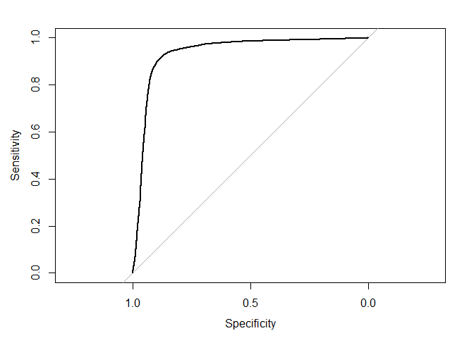
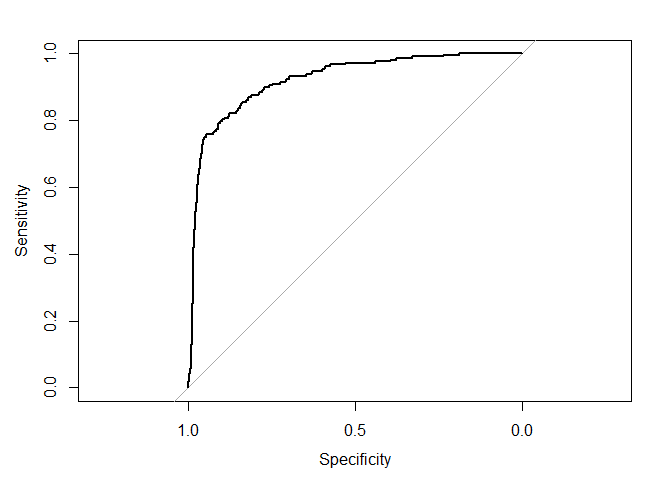

Proyecto 3
================

# Objetivo

El objetivo principal de este encargo es crear un programa computacional
que permita diferenciar las actividades realizadas en bicicleta o a pie
según sus características como distancia recorrida, velocidad promedio u
otro atributo. Como objetivo secundario se espera que su programa
permita identificar aquellas actividades que fueron registradas
erróneamente por el usuario. La base de datos incluye 167.615
actividades y 17 variables.

# Importar Librerías

``` r
library(tidyverse)
library(e1071)
library(caret)
library(olsrr)
library(pROC)
library(ggplot2)
library(class)
library(tidymodels)
library(discrim) 
#library(rstan)
#library(rstanarm)
```

# Cargar Datos

``` r
#En Windows
setwd("C:/Users/Felipe/Documents/GitHub/Entregas_mineria_de_datos/Proyecto 3")
data<- readRDS("C:/Users/Felipe/Documents/GitHub/Entregas_mineria_de_datos/Proyecto 3/endurance.rds")

#En Mac
#data = readRDS("~/Documents/GitHub/Entregas_mineria_de_datos/Proyecto 3/endurance.rds")

summary(data)
```

    ##        id             type              athlete            calories       
    ##  Min.   :     1   Length:167615      Min.   : 8558143   Min.   :     0.0  
    ##  1st Qu.: 41905   Class :character   1st Qu.:14204866   1st Qu.:   281.0  
    ##  Median : 83808   Mode  :character   Median :15621719   Median :   629.0  
    ##  Mean   : 83808                      Mean   :15359426   Mean   :   816.7  
    ##  3rd Qu.:125712                      3rd Qu.:16685446   3rd Qu.:  1076.8  
    ##  Max.   :167615                      Max.   :18078075   Max.   :326157.3  
    ##     distance         elev_low           records           elev_high        
    ##  Min.   :      0   Length:167615      Length:167615      Length:167615     
    ##  1st Qu.:   6159   Class :character   Class :character   Class :character  
    ##  Median :  12968   Mode  :character   Mode  :character   Mode  :character  
    ##  Mean   :  21998                                                           
    ##  3rd Qu.:  27494                                                           
    ##  Max.   :1479320                                                           
    ##   max_speed         device_name         moving_time        elapsed_time      
    ##  Length:167615      Length:167615      Min.   :       0   Min.   :        0  
    ##  Class :character   Class :character   1st Qu.:    2248   1st Qu.:     2582  
    ##  Mode  :character   Mode  :character   Median :    3853   Median :     4450  
    ##                                        Mean   :    5141   Mean   :    32102  
    ##                                        3rd Qu.:    6516   3rd Qu.:     7934  
    ##                                        Max.   :11025474   Max.   :511111044  
    ##  average_speed      has_heartrate      start_date_local             
    ##  Length:167615      Length:167615      Min.   :1999-04-25 17:36:38  
    ##  Class :character   Class :character   1st Qu.:2016-11-23 17:11:10  
    ##  Mode  :character   Mode  :character   Median :2019-01-26 13:37:56  
    ##                                        Mean   :2018-05-12 07:50:32  
    ##                                        3rd Qu.:2020-04-30 04:33:10  
    ##                                        Max.   :2021-02-02 11:37:09  
    ##  total_elevation_gain
    ##  Min.   :    0.0     
    ##  1st Qu.:   15.1     
    ##  Median :  171.0     
    ##  Mean   :  397.0     
    ##  3rd Qu.:  595.0     
    ##  Max.   :59595.0

``` r
attach(data)
```

# Limpieza de datos

## Eleccion de variables

Elimino “start\_date\_local” y “device\_name” dado que la fecha de
incorporación o de creación del perfil no es relevante para diferenciar
las actividades realizadas en bicicleta o a pie. El valor identificador
de cada atleta no permite realizar un analisis sobre la actividad
realizada, dado que solo interesan los parametros obtenidos por la
actividad, al igual que la columna reference al “id” de la iteración.

“Records” fue eliminado dado que no es relevante saber si la iteración
grabada resultó en un record frente al resto o no.

A pesar de que la información obtenida por un “heartrate” sería
relevante para formar una relación entre el deporte realizado y el
comportamiento del reloj, la base de datos no aporta esa información y
no es relevante para el objetivo saber si se tiene o no un “heartrate”
por lo que la variable “has\_heartrate” fue eliminada.

El tiempo transcurrido (elapsed time) tambien fue eliminado dado que es
mas detallada la información del tiempo de movimiento que del tiempo
transcurrido desde el inicio del dispositivo a la hora de categorizar
deportes.

``` r
data$start_date_local = NULL
data$device_name = NULL
data$athlete = NULL
data$id = NULL 
data$records = NULL
data$has_heartrate = NULL
data$elapsed_time = NULL
```

## Busqueda de datos faltantes

``` r
data[data == ""] <- NA
data %>%  summarise_all(funs(sum(is.na(.))))
```

    ## Warning: `funs()` was deprecated in dplyr 0.8.0.
    ## Please use a list of either functions or lambdas: 
    ## 
    ##   # Simple named list: 
    ##   list(mean = mean, median = median)
    ## 
    ##   # Auto named with `tibble::lst()`: 
    ##   tibble::lst(mean, median)
    ## 
    ##   # Using lambdas
    ##   list(~ mean(., trim = .2), ~ median(., na.rm = TRUE))

    ##   type calories distance elev_low elev_high max_speed moving_time average_speed
    ## 1    0        0        0    13519     13519         0           0             0
    ##   total_elevation_gain
    ## 1                    0

Se demuestra la existencia de datos faltantes en la columna de
“elev\_high” y de “elev\_low” por lo cual decido eliminar las columnas
den donde se encuentren datos faltantes para no trabajar con supuestos.

``` r
data <- data %>% filter(!(is.na(data$elev_high)))
data <- data %>%  filter(!(is.na(data$elev_low)))
```

Se revisa si se eliminaron los datos faltantes.

``` r
data[data == ""] <- NA
data %>%  summarise_all(funs(sum(is.na(.))))
```

    ##   type calories distance elev_low elev_high max_speed moving_time average_speed
    ## 1    0        0        0        0         0         0           0             0
    ##   total_elevation_gain
    ## 1                    0

Se valida que no quedan datos faltantes.

## Busqueda de datos atipicos

Mediante un estudio de regresiones realizado a la data pero omitido para
la entrega, se observó la precencia de muchos valores atipicos en cada
una de las variables, por lo cual se procede a analizarlos y
eliminarlos.

Empezando con las calorias, se observa un grafico totalmente
desproporcionado debido a la existencia de multiples datos atipicos
alejados de los valores medios. Debido a esto, procedo a eliminar todos
los valores superiores a 3000 calorias por su poca probabilidad de ser
un entrenamiento real, considerando el exceso de ejercicio cardiaco
realizado y la cantidad de tiempo que demanda quemar esa cantidad de
calorias durante un entrenamiento normal. Tambien se eliminaran los
valores que sean equivalentes a 0 porque demuestran un error en la
medición. Si van a realizar un deporte, al menos una caloria debe ser
quemada.

Se conserva la existencia de algunos datos atipicos.

``` r
ggplot(data, aes(x= type, y=calories))+ geom_boxplot(outlier.colour="red", outlier.shape=8,outlier.size=4)
```

<!-- -->

``` r
data_actualizada <- data %>% filter(data$calories < 3000)
data_actualizada <- data_actualizada %>% filter(data_actualizada$calories > 1)
ggplot(data_actualizada, aes(x= type, y=calories))+ geom_boxplot(outlier.colour="red", outlier.shape=8,outlier.size=4)
```

<!-- -->

``` r
ggplot(data_actualizada, aes(x= type, y=distance))+ geom_boxplot(outlier.colour="red", outlier.shape=8,outlier.size=4)
```

<!-- -->

``` r
data_actualizada = data_actualizada[data_actualizada$distance < 40000,]
ggplot(data_actualizada, aes(x= type, y=distance))+ geom_boxplot(outlier.colour="red", outlier.shape=8,outlier.size=4)
```

<!-- -->

En el caso de la velocidad, no tiene sentido que la maxima velocidad sea
0 por lo cual se eliminan todos esos valores.

``` r
data_actualizada = data_actualizada[data_actualizada$max_speed > 1 ,]
#ggplot(data_actualizada, aes(x= type, y=max_speed))+ geom_boxplot(outlier.colour="red", outlier.shape=8,outlier.size=4)
```

En el caso de las elevaciones, se detectó la existencia de valores
negativos, los cuales no tienen sentido y se eliminaron.

``` r
data_actualizada = data_actualizada[data_actualizada$elev_low > 0,]
data_actualizada = data_actualizada[data_actualizada$elev_high > 0,]
```

``` r
ggplot(data_actualizada, aes(x= type, y=moving_time))+ geom_boxplot(outlier.colour="red", outlier.shape=8,outlier.size=4)
```

<!-- -->

``` r
data_actualizada = data_actualizada[data_actualizada$moving_time < 15000,]
ggplot(data_actualizada, aes(x= type, y=moving_time))+ geom_boxplot(outlier.colour="red", outlier.shape=8,outlier.size=4)
```

<!-- -->

Con respecto a la velocidad promedio, se eliminaran los valores
inferiores a 1 dado que demuestran una velocidad de movimiento atipico.

``` r
data_actualizada = data_actualizada[data_actualizada$average_speed > 1 ,]
#ggplot(data_actualizada, aes(x= type, y=average_speed))+ geom_boxplot(outlier.colour="red", outlier.shape=8,outlier.size=4)
```

Por ultimo, con respecto a la total elevación ganada. Se deja en 5000
porque existe una posibilidad de elevarse en 5000 metros de altura
sabiendo que el everest tiene 8000 metros de altura.

``` r
ggplot(data_actualizada, aes(x= type, y=total_elevation_gain))+ geom_boxplot(outlier.colour="red", outlier.shape=8,outlier.size=4)
```

<!-- -->

``` r
data_actualizada = data_actualizada[data_actualizada$total_elevation_gain < 1700,]
ggplot(data_actualizada, aes(x= type, y=total_elevation_gain))+ geom_boxplot(outlier.colour="red", outlier.shape=8,outlier.size=4)
```

<!-- -->

# Lógica

La logica implica la utilizaciòn de modelos de machine lerning del tipo
supervidado (dado que intentaré predecir unos valores con los valores
pasados de ese algo), en donde se utilizaran mecanismos de clasificaciòn
dado que los valores a predecir son variables discretas, es decir, que
se mueven en un intervalo de valores conocidos.

El objetivo del proyecto es diferenciar las actividades realizadas en
bicicleta o a pie, por lo cual se espera predecir las actividades
realizadas en bicicleta (Ride y EBikeRide) y a pie (Run,Walk y Hike),
sin descartar ninguna.

## Evaluar modelo supervisados

### Matriz de confusión

Permite determinar si el metodo implementado sobre la data estimó bien
los valores, dado que da la posibilidad de determinar falsos o
verdaderos positivos o negativos.

### ROC

Esta curva caracteriza la compensación entre golpes positivos y falsas
alarmas trazando la tasa de verdaderos positivos en el eje Y contra la
tasa de falsos positivos en el eje X para diferente valores. Es otra
forma de ver la matriz de confusión. Una buena curva ROC se pega mucho
al eje Y.

### AUC

Corresponde al area bajo la curva ROC.Sintetiza el rendimiento del
modelo. Mientras mas area, es mejor.

# Transformación de Variables

La columna del tipo de deporte efectuado se encuentra indicando el tipo
de deporte que supuestamente realizó esa iteración. Sin embargo, dado
que es de tipo caracter y dado que dentro de esa misma columna hay 4
posibles tipos de deporte, pretendo separar esa información en variables
booleanas (representado en valores numericos enteros binarios) en donde
cada variable haga referencia a un tipo de deporte en particular.

``` r
unique(data_actualizada$type)
```

    ## [1] "Ride"      "Run"       "Walk"      "Hike"      "EBikeRide"

``` r
data_actualizada$type_Ride <- (data_actualizada$type == "Ride") %>% as.numeric()
data_actualizada$type_Run <- (data_actualizada$type == "Run") %>% as.numeric()
data_actualizada$type_Walk <- (data_actualizada$type == "Walk") %>% as.numeric()
data_actualizada$type_Hike <- (data_actualizada$type == "Hike") %>% as.numeric()
data_actualizada$type_EBikeRide <- (data_actualizada$type == "EBikeRide") %>% as.numeric()

data_actualizada$type = NULL
```

## Muestreo aleatorio simple sin remplazo

DEBERIA SER ESTRATIFICADO, ESE ES EL MEJOR ya que divide los datos en
varias particiones y se saca muestras aleatorias de cada partición.
Sacar solo con el muestreo aleatorio simple arriesga a polarizar la
muestra en caso de que sean muchos 1 o 0 en la base de datos.
Estratificado sacaria por ejemplo el 10% de los True y el 10% de los
False

Usualmente se toma un 80% de entrenamiento y 20% para la prueba, en el
cual se ve la acurracy del modelo pero las metricas se toman con el de
entrenamiento.

``` r
set.seed(42)
muestra_aleatoria <- sample(1:nrow(data_actualizada), nrow(data_actualizada)*.8)

data_de_entrenamiento <- data_actualizada[muestra_aleatoria,]
data_de_prueba <- data_actualizada[-muestra_aleatoria,]
```

## Datos a Factores

## Escalar Datos

Datos a Factores y Escalar Datos

``` r
data_de_entrenamiento_2=data_de_entrenamiento
objetivo_secundario_entrenamiento = data_de_entrenamiento

data_de_entrenamiento$elev_low = as.numeric(data_de_entrenamiento$elev_low)
data_de_entrenamiento$elev_high = as.numeric(data_de_entrenamiento$elev_high)
data_de_entrenamiento$max_speed = as.numeric(data_de_entrenamiento$max_speed)
data_de_entrenamiento$average_speed = as.numeric(data_de_entrenamiento$average_speed)

data_de_entrenamiento_2$elev_low = as.numeric(data_de_entrenamiento_2$elev_low)
data_de_entrenamiento_2$elev_high = as.numeric(data_de_entrenamiento_2$elev_high)
data_de_entrenamiento_2$max_speed = as.numeric(data_de_entrenamiento_2$max_speed)
data_de_entrenamiento_2$average_speed = as.numeric(data_de_entrenamiento_2$average_speed)

data_de_prueba_2=data_de_prueba
objetivo_secundario_prueba = data_de_prueba

data_de_prueba$elev_low = as.numeric(data_de_prueba$elev_low)
data_de_prueba$elev_high = as.numeric(data_de_prueba$elev_high)
data_de_prueba$max_speed = as.numeric(data_de_prueba$max_speed)
data_de_prueba$average_speed = as.numeric(data_de_prueba$average_speed)

data_de_prueba_2$elev_low = as.numeric(data_de_prueba_2$elev_low)
data_de_prueba_2$elev_high = as.numeric(data_de_prueba_2$elev_high)
data_de_prueba_2$max_speed = as.numeric(data_de_prueba_2$max_speed)
data_de_prueba_2$average_speed = as.numeric(data_de_prueba_2$average_speed)

types_entrenamiento=data.frame(data_de_entrenamiento[9:13])
types_prueba=data.frame(data_de_prueba[9:13])

data_de_entrenamiento_escalada <-  scale(data_de_entrenamiento[,-c(9:13)]) %>% data.frame()
data_de_prueba_escalada <- scale(data_de_prueba[,-c(9:13)]) %>% data.frame()

data_de_entrenamiento_escalada_2 <- scale(data_de_entrenamiento_2[,-c(9:13)]) %>% data.frame()
data_de_prueba_escalada_2 <- scale(data_de_prueba_2[,-c(9:13)]) %>% data.frame()

data_de_entrenamiento_escalada = cbind.data.frame(data_de_entrenamiento_escalada,types_entrenamiento)
data_de_entrenamiento_escalada_2=cbind.data.frame(data_de_entrenamiento_escalada,types_entrenamiento)
data_de_prueba_escalada=cbind.data.frame(data_de_prueba_escalada,types_prueba)
data_de_prueba_escalada_2=cbind.data.frame(data_de_prueba_escalada,types_prueba)

objetivo_secundario_entrenamiento_escalado=data_de_entrenamiento_escalada
objetivo_secundario_prueba_escalado = data_de_prueba_escalada

data_de_prueba_escalada_2 =data_de_prueba_escalada_2[,1:13]
data_de_entrenamiento_escalada_2 = data_de_entrenamiento_escalada_2[,1:13]
```

## Metodo de clasificación sobre variables creadas

### Regresión logistica Multiple

Es un modelo simple y liviano computacionalmente por lo cual permite
darle una caracter de introducción al estudio de los valores. Por
problemas de almacenamiento, no se permite ingresar mas variables al
modelo dado que colapsa computacionalmente.

Aqui no entra la data escalada porque tiene que estar con 0 o 1 en el
modelo.

Para el caso del tipo Ride

``` r
modelo_logistico_1 <- glm(type_Ride ~ calories + distance, data_de_entrenamiento, family = "binomial")
summary(modelo_logistico_1)
```

    ## 
    ## Call:
    ## glm(formula = type_Ride ~ calories + distance, family = "binomial", 
    ##     data = data_de_entrenamiento)
    ## 
    ## Deviance Residuals: 
    ##     Min       1Q   Median       3Q      Max  
    ## -5.7432  -0.5965   0.0189   0.4375   6.1968  
    ## 
    ## Coefficients:
    ##               Estimate Std. Error z value Pr(>|z|)    
    ## (Intercept) -1.003e+00  1.843e-02  -54.46   <2e-16 ***
    ## calories    -7.264e-03  5.859e-05 -123.98   <2e-16 ***
    ## distance     5.326e-04  4.072e-06  130.79   <2e-16 ***
    ## ---
    ## Signif. codes:  0 '***' 0.001 '**' 0.01 '*' 0.05 '.' 0.1 ' ' 1
    ## 
    ## (Dispersion parameter for binomial family taken to be 1)
    ## 
    ##     Null deviance: 117801  on 86439  degrees of freedom
    ## Residual deviance:  59706  on 86437  degrees of freedom
    ## AIC: 59712
    ## 
    ## Number of Fisher Scoring iterations: 7

``` r
#modelo_logistico <- glm(type_Ride ~ calories + distance + elev_high + elev_low + max_speed + moving_time + average_speed + total_elevation_gain, data_de_entrenamiento, family = "binomial")

data_de_prueba$prob_multi_modelo_logistico_Ryde <- predict(modelo_logistico_1, data_de_prueba, type=c("response"))
auc(roc(type_Ride ~ prob_multi_modelo_logistico_Ryde, data = data_de_prueba))
```

    ## Setting levels: control = 0, case = 1

    ## Setting direction: controls < cases

    ## Area under the curve: 0.9296

``` r
data_de_prueba$prob_multi_modelo_logistico_Ryde = NULL #Para mantener orden en data_de_entrenamiento le borro esto siempre 
```

Para el caso del tipo Run

``` r
modelo_logistico_2 <- glm(type_Run ~ calories + distance, data_de_entrenamiento, family = "binomial")
summary(modelo_logistico_2)
```

    ## 
    ## Call:
    ## glm(formula = type_Run ~ calories + distance, family = "binomial", 
    ##     data = data_de_entrenamiento)
    ## 
    ## Deviance Residuals: 
    ##     Min       1Q   Median       3Q      Max  
    ## -5.8651  -0.5399  -0.0502   0.6353   5.4698  
    ## 
    ## Coefficients:
    ##               Estimate Std. Error z value Pr(>|z|)    
    ## (Intercept)  5.371e-01  1.744e-02   30.79   <2e-16 ***
    ## calories     6.623e-03  5.325e-05  124.36   <2e-16 ***
    ## distance    -4.739e-04  3.716e-06 -127.53   <2e-16 ***
    ## ---
    ## Signif. codes:  0 '***' 0.001 '**' 0.01 '*' 0.05 '.' 0.1 ' ' 1
    ## 
    ## (Dispersion parameter for binomial family taken to be 1)
    ## 
    ##     Null deviance: 115528  on 86439  degrees of freedom
    ## Residual deviance:  63834  on 86437  degrees of freedom
    ## AIC: 63840
    ## 
    ## Number of Fisher Scoring iterations: 7

``` r
#modelo_logistico <- glm(type_Ride ~ calories + distance + elev_high + elev_low + max_speed + moving_time + average_speed + total_elevation_gain, data_de_entrenamiento, family = "binomial")

data_de_prueba$prob_multi_modelo_logistico_Run <- predict(modelo_logistico_2, data_de_prueba, type=c("response"))
auc(roc(type_Run ~ prob_multi_modelo_logistico_Run, data = data_de_prueba))
```

    ## Setting levels: control = 0, case = 1

    ## Setting direction: controls < cases

    ## Area under the curve: 0.9138

``` r
data_de_prueba$prob_multi_modelo_logistico_Run = NULL #Para mantener orden en data_de_entrenamiento le borro esto siempre 
```

Para el caso del tipo Walk

``` r
modelo_logistico_3 <- glm(type_Walk ~ calories + distance, data_de_entrenamiento, family = "binomial")
summary(modelo_logistico_3)
```

    ## 
    ## Call:
    ## glm(formula = type_Walk ~ calories + distance, family = "binomial", 
    ##     data = data_de_entrenamiento)
    ## 
    ## Deviance Residuals: 
    ##     Min       1Q   Median       3Q      Max  
    ## -1.5766  -0.2192  -0.1004  -0.0208   4.7743  
    ## 
    ## Coefficients:
    ##               Estimate Std. Error z value Pr(>|z|)    
    ## (Intercept) -1.720e+00  4.094e-02  -42.02   <2e-16 ***
    ## calories     1.441e-03  1.103e-04   13.07   <2e-16 ***
    ## distance    -3.886e-04  1.135e-05  -34.25   <2e-16 ***
    ## ---
    ## Signif. codes:  0 '***' 0.001 '**' 0.01 '*' 0.05 '.' 0.1 ' ' 1
    ## 
    ## (Dispersion parameter for binomial family taken to be 1)
    ## 
    ##     Null deviance: 17098  on 86439  degrees of freedom
    ## Residual deviance: 13769  on 86437  degrees of freedom
    ## AIC: 13775
    ## 
    ## Number of Fisher Scoring iterations: 9

``` r
#modelo_logistico <- glm(type_Ride ~ calories + distance + elev_high + elev_low + max_speed + moving_time + average_speed + total_elevation_gain, data_de_entrenamiento, family = "binomial")

data_de_prueba$prob_multi_modelo_logistico_Walk <- predict(modelo_logistico_3, data_de_prueba, type=c("response"))
auc(roc(type_Walk ~ prob_multi_modelo_logistico_Walk, data = data_de_prueba))
```

    ## Setting levels: control = 0, case = 1

    ## Setting direction: controls < cases

    ## Area under the curve: 0.873

``` r
data_de_prueba$prob_multi_modelo_logistico_Walk = NULL #Para mantener orden en data_de_entrenamiento le borro esto siempre 
```

Para el caso del tipo Hike

``` r
modelo_logistico_4 <- glm(type_Hike ~ calories + distance, data_de_entrenamiento, family = "binomial")
summary(modelo_logistico_4)
```

    ## 
    ## Call:
    ## glm(formula = type_Hike ~ calories + distance, family = "binomial", 
    ##     data = data_de_entrenamiento)
    ## 
    ## Deviance Residuals: 
    ##     Min       1Q   Median       3Q      Max  
    ## -1.6909  -0.1766  -0.1022  -0.0314   4.9038  
    ## 
    ## Coefficients:
    ##               Estimate Std. Error z value Pr(>|z|)    
    ## (Intercept) -3.061e+00  5.837e-02  -52.44   <2e-16 ***
    ## calories     2.001e-03  1.149e-04   17.41   <2e-16 ***
    ## distance    -3.130e-04  1.266e-05  -24.71   <2e-16 ***
    ## ---
    ## Signif. codes:  0 '***' 0.001 '**' 0.01 '*' 0.05 '.' 0.1 ' ' 1
    ## 
    ## (Dispersion parameter for binomial family taken to be 1)
    ## 
    ##     Null deviance: 9797.2  on 86439  degrees of freedom
    ## Residual deviance: 8599.7  on 86437  degrees of freedom
    ## AIC: 8605.7
    ## 
    ## Number of Fisher Scoring iterations: 9

``` r
#modelo_logistico <- glm(type_Ride ~ calories + distance + elev_high + elev_low + max_speed + moving_time + average_speed + total_elevation_gain, data_de_entrenamiento, family = "binomial")

data_de_prueba$prob_multi_modelo_logistico_Hike <- predict(modelo_logistico_4, data_de_prueba, type=c("response"))
auc(roc(type_Hike ~ prob_multi_modelo_logistico_Hike, data = data_de_prueba))
```

    ## Setting levels: control = 0, case = 1

    ## Setting direction: controls < cases

    ## Area under the curve: 0.8058

``` r
data_de_prueba$prob_multi_modelo_logistico_Hike = NULL #Para mantener orden en data_de_entrenamiento le borro esto siempre 
```

Para el caso del tipo EbikeRide

``` r
modelo_logistico_5 <- glm(type_EBikeRide ~ calories + distance, data_de_entrenamiento, family = "binomial")
summary(modelo_logistico_5)
```

    ## 
    ## Call:
    ## glm(formula = type_EBikeRide ~ calories + distance, family = "binomial", 
    ##     data = data_de_entrenamiento)
    ## 
    ## Deviance Residuals: 
    ##     Min       1Q   Median       3Q      Max  
    ## -0.2535  -0.1014  -0.0823  -0.0692   3.5744  
    ## 
    ## Coefficients:
    ##               Estimate Std. Error z value Pr(>|z|)    
    ## (Intercept) -6.470e+00  1.162e-01 -55.657  < 2e-16 ***
    ## calories     6.458e-04  1.028e-04   6.284 3.29e-10 ***
    ## distance     3.031e-05  5.819e-06   5.209 1.90e-07 ***
    ## ---
    ## Signif. codes:  0 '***' 0.001 '**' 0.01 '*' 0.05 '.' 0.1 ' ' 1
    ## 
    ## (Dispersion parameter for binomial family taken to be 1)
    ## 
    ##     Null deviance: 4752.3  on 86439  degrees of freedom
    ## Residual deviance: 4627.9  on 86437  degrees of freedom
    ## AIC: 4633.9
    ## 
    ## Number of Fisher Scoring iterations: 8

``` r
#modelo_logistico <- glm(type_Ride ~ calories + distance + elev_high + elev_low + max_speed + moving_time + average_speed + total_elevation_gain, data_de_entrenamiento, family = "binomial")

data_de_prueba$prob_multi_modelo_logistico_EBikeRide <- predict(modelo_logistico_5, data_de_prueba, type=c("response"))
auc(roc(type_EBikeRide~ prob_multi_modelo_logistico_EBikeRide, data = data_de_prueba))
```

    ## Setting levels: control = 0, case = 1

    ## Setting direction: controls < cases

    ## Area under the curve: 0.6716

``` r
data_de_prueba$prob_multi_modelo_logistico_EBikeRide = NULL #Para mantener orden en data_de_entrenamiento le borro esto siempre 
```

## Modelos Parametricos

### Modelo de Naive Bayes

Dada una distribución condicional de probabilidad, la salida del modelo
indica para un dato, si pertenee o no a una clase especificada. Se
utiliza este modelo dado que la base de datos aun cuenta con modelos
atipicos y este modelo es robusto frente a valores atipicos y datos
irrelevantes.

En el caso de Ryde

``` r
modeloNB_Ryde <- naiveBayes(type_Ride ~ calories + distance + elev_high + elev_low + max_speed + moving_time + average_speed + total_elevation_gain, data = data_de_entrenamiento_escalada)
prediccion_NB_Ryde <- predict(modeloNB_Ryde, data_de_entrenamiento_escalada, type ="raw")
#modeloNB_Ryde

data_de_entrenamiento_escalada$prob_NB_Ryde <- prediccion_NB_Ryde[,2]
curva_roc_NB_Ryde <- roc(type_Ride ~ data_de_entrenamiento_escalada$prob_NB_Ryde, data = data_de_entrenamiento)
```

    ## Setting levels: control = 0, case = 1

    ## Setting direction: controls < cases

``` r
plot(curva_roc_NB_Ryde)    
```

<!-- -->

``` r
auc(curva_roc_NB_Ryde)
```

    ## Area under the curve: 0.9552

``` r
data_de_entrenamiento_escalada$prob_NB_Ryde = NULL
```

En el caso de Run

``` r
modeloNB_Run <- naiveBayes(type_Run ~ calories + distance + elev_high + elev_low + max_speed + moving_time + average_speed + total_elevation_gain, data = data_de_entrenamiento_escalada)
prediccion_NB_Run  <- predict(modeloNB_Run , data_de_entrenamiento_escalada, type ="raw")
#modeloNB_Ryde

data_de_entrenamiento_escalada$prob_NB_Run  <- prediccion_NB_Run[,2]
curva_roc_NB_Run  <- roc(type_Run  ~ data_de_entrenamiento_escalada$prob_NB_Run , data = data_de_entrenamiento_escalada)
```

    ## Setting levels: control = 0, case = 1

    ## Setting direction: controls < cases

``` r
plot(curva_roc_NB_Run )    
```

<!-- -->

``` r
auc(curva_roc_NB_Run )
```

    ## Area under the curve: 0.9377

``` r
data_de_entrenamiento_escalada$prob_NB_Run  = NULL
```

En el caso de Walk

``` r
modeloNB_Walk <- naiveBayes(type_Walk ~ calories + distance + elev_high + elev_low + max_speed + moving_time + average_speed + total_elevation_gain, data = data_de_entrenamiento_escalada)
prediccion_NB_Walk <- predict(modeloNB_Walk, data_de_entrenamiento_escalada, type ="raw")
#modeloNB_Ryde

data_de_entrenamiento_escalada$prob_NB_Walk <- prediccion_NB_Walk[,2]
curva_roc_NB_Walk <- roc(type_Walk ~ data_de_entrenamiento_escalada$prob_NB_Walk, data = data_de_entrenamiento_escalada)
```

    ## Setting levels: control = 0, case = 1

    ## Setting direction: controls < cases

``` r
plot(curva_roc_NB_Walk)    
```

<!-- -->

``` r
auc(curva_roc_NB_Walk)
```

    ## Area under the curve: 0.9296

``` r
data_de_entrenamiento_escalada$prob_NB_Walk = NULL
```

En el caso de Hike

``` r
modeloNB_Hike <- naiveBayes(type_Hike ~ calories + distance + elev_high + elev_low + max_speed + moving_time + average_speed + total_elevation_gain, data = data_de_entrenamiento_escalada)
prediccion_NB_Hike <- predict(modeloNB_Hike, data_de_entrenamiento_escalada, type ="raw")
#modeloNB_Ryde

data_de_entrenamiento_escalada$prob_NB_Hike <- prediccion_NB_Hike[,2]
curva_roc_NB_Hike <- roc(type_Hike ~ data_de_entrenamiento_escalada$prob_NB_Hike, data = data_de_entrenamiento_escalada)
```

    ## Setting levels: control = 0, case = 1

    ## Setting direction: controls < cases

``` r
plot(curva_roc_NB_Hike)    
```

<!-- -->

``` r
auc(curva_roc_NB_Hike)
```

    ## Area under the curve: 0.9283

``` r
data_de_entrenamiento_escalada$prob_NB_Hike = NULL
```

En el caso de EBikeRide:

``` r
modeloNB_EBikeRide <- naiveBayes(type_EBikeRide ~ calories + distance + elev_high + elev_low + max_speed + moving_time + average_speed + total_elevation_gain, data = data_de_entrenamiento_escalada)
prediccion_NB_EBikeRide <- predict(modeloNB_EBikeRide, data_de_entrenamiento_escalada, type ="raw")
#modeloNB_Ryde

data_de_entrenamiento_escalada$prob_NB_EBikeRide <- prediccion_NB_EBikeRide[,2]
curva_roc_NB_EBikeRide <- roc(type_EBikeRide ~ data_de_entrenamiento_escalada$prob_NB_EBikeRide, data = data_de_entrenamiento_escalada)
```

    ## Setting levels: control = 0, case = 1

    ## Setting direction: controls < cases

``` r
plot(curva_roc_NB_EBikeRide)    
```

<!-- -->

``` r
auc(curva_roc_NB_EBikeRide)
```

    ## Area under the curve: 0.8366

``` r
data_de_entrenamiento_escalada$prob_NB_EBikeRide = NULL
```

## Modelos no parametricos

### K vecinos mas cercanos

Busca una división en los datos a partir del concepto de vecindad.
Aprende de los datos ingresados y no de una formula matematica.

Para Ryde:

``` r
Clase_a_predecir_entrenamiento_Ride <- factor(data_de_entrenamiento$type_Ride)
Clase_a_predecir_prueba_Ride <- factor(data_de_prueba$type_Ride)

modeloKnn_Ride <- knn(data_de_entrenamiento_escalada_2[,-c(9:13)], data_de_prueba_escalada_2[,-c(9:13)], cl = data_de_entrenamiento_escalada_2$type_Ride, k = 15, prob = TRUE)  

data_de_prueba_escalada_2$prob_knn_Ride <- modeloKnn_Ride %>% as.character() %>% as.numeric()
data_de_prueba_escalada_2$KNN_Ride <- Clase_a_predecir_prueba_Ride %>% as.character() %>% as.numeric()

objetivo_secundario_prueba_escalado$prob_knn_Ride <- modeloKnn_Ride %>% as.character() %>% as.numeric()
objetivo_secundario_prueba_escalado$KNN_Ride  <- Clase_a_predecir_prueba_Ride %>% as.character() %>% as.numeric()

curva_roc_KNN_Ride <- roc(KNN_Ride  ~ data_de_prueba_escalada_2$prob_knn_Ride, data = data_de_prueba_escalada_2)
```

    ## Setting levels: control = 0, case = 1

    ## Setting direction: controls < cases

``` r
plot(curva_roc_KNN_Ride)    
```

<!-- -->

``` r
auc(curva_roc_KNN_Ride)
```

    ## Area under the curve: 0.9671

``` r
data_de_prueba_escalada_2$prob_knn_Ride = NULL
data_de_prueba_escalada_2$KNN_Ride  = NULL
```

Para Run:

``` r
Clase_a_predecir_entrenamiento_Run <- factor(data_de_entrenamiento$type_Run)
Clase_a_predecir_prueba_Run <- factor(data_de_prueba$type_Run)

modeloKnn_Run <- knn(data_de_entrenamiento_escalada_2[,-c(9:13)], data_de_prueba_escalada_2[,-c(9:13)], cl = data_de_entrenamiento_escalada_2$type_Run, k = 15, prob = TRUE)    ### AQUI VA LA DUDA QUE LE PREGUNTE AL PROFE

data_de_prueba_escalada_2$prob_knn_Run <- modeloKnn_Run %>% as.character() %>% as.numeric()
data_de_prueba_escalada_2$KNN_Run <- Clase_a_predecir_prueba_Run %>% as.character() %>% as.numeric()

objetivo_secundario_prueba_escalado$prob_knn_Run <- modeloKnn_Run %>% as.character() %>% as.numeric()
objetivo_secundario_prueba_escalado$KNN_Run <- Clase_a_predecir_prueba_Run %>% as.character() %>% as.numeric()

curva_roc_KNN_Run <- roc(KNN_Run ~ data_de_prueba_escalada_2$prob_knn_Run, data = data_de_prueba_escalada_2)
```

    ## Setting levels: control = 0, case = 1

    ## Setting direction: controls < cases

``` r
plot(curva_roc_KNN_Run)    
```

<!-- -->

``` r
auc(curva_roc_KNN_Run)
```

    ## Area under the curve: 0.9612

``` r
data_de_prueba_escalada_2$prob_knn_Run = NULL
data_de_prueba_escalada_2$KNN_Run = NULL
```

Para Walk:

``` r
Clase_a_predecir_entrenamiento_Walk <- factor(data_de_entrenamiento$type_Walk)
Clase_a_predecir_prueba_Walk <- factor(data_de_prueba$type_Walk)

modeloKnn_Walk <- knn(data_de_entrenamiento_escalada_2[,-c(9:13)], data_de_prueba_escalada_2[,-c(9:13)], cl = data_de_entrenamiento_escalada_2$type_Walk, k = 15, prob = TRUE)    ### AQUI VA LA DUDA QUE LE PREGUNTE AL PROFE

data_de_prueba_escalada_2$prob_knn_Walk <- modeloKnn_Walk %>% as.character() %>% as.numeric()
data_de_prueba_escalada_2$KNN_Walk <- Clase_a_predecir_prueba_Walk %>% as.character() %>% as.numeric()

curva_roc_KNN_Walk <- roc(KNN_Walk ~ data_de_prueba_escalada_2$prob_knn_Walk, data = data_de_prueba_escalada_2)
```

    ## Setting levels: control = 0, case = 1

    ## Setting direction: controls < cases

``` r
plot(curva_roc_KNN_Walk)    
```

<!-- -->

``` r
auc(curva_roc_KNN_Walk)
```

    ## Area under the curve: 0.7761

``` r
data_de_prueba_escalada_2$prob_knn_Walk = NULL
data_de_prueba_escalada_2$KNN_Walk = NULL
```

Para Hike:

``` r
Clase_a_predecir_entrenamiento_Hike <- factor(data_de_entrenamiento$type_Hike)
Clase_a_predecir_prueba_Hike <- factor(data_de_prueba$type_Hike)

modeloKnn_Hike <- knn(data_de_entrenamiento_escalada_2[,-c(9:13)], data_de_prueba_escalada_2[,-c(9:13)], cl = data_de_entrenamiento_escalada_2$type_Hike, k = 15, prob = TRUE)    ### AQUI VA LA DUDA QUE LE PREGUNTE AL PROFE

data_de_prueba_escalada_2$prob_knn_Hike <- modeloKnn_Hike %>% as.character() %>% as.numeric()
data_de_prueba_escalada_2$KNN_Hike <- Clase_a_predecir_prueba_Hike %>% as.character() %>% as.numeric()

curva_roc_KNN_Hike <- roc(KNN_Hike ~ data_de_prueba_escalada_2$prob_knn_Hike, data = data_de_prueba_escalada_2)
```

    ## Setting levels: control = 0, case = 1

    ## Setting direction: controls < cases

``` r
plot(curva_roc_KNN_Hike)    
```

<!-- -->

``` r
auc(curva_roc_KNN_Hike)
```

    ## Area under the curve: 0.5961

``` r
data_de_prueba_escalada_2$prob_knn_Hike = NULL
data_de_prueba_escalada_2$KNN_Hike = NULL
```

Para EBikeRyde:

``` r
Clase_a_predecir_entrenamiento_EBikeRide <- factor(data_de_entrenamiento$type_EBikeRide)
Clase_a_predecir_prueba_EBikeRide <- factor(data_de_prueba$type_EBikeRide)

modeloKnn_EBikeRide <- knn(data_de_entrenamiento_escalada_2[,-c(9:13)], data_de_prueba_escalada_2[,-c(9:13)], cl = data_de_entrenamiento_escalada_2$type_EBikeRide, k = 15, prob = TRUE)    ### AQUI VA LA DUDA QUE LE PREGUNTE AL PROFE

data_de_prueba_escalada_2$prob_knn_EBikeRide <- modeloKnn_EBikeRide %>% as.character() %>% as.numeric()
data_de_prueba_escalada_2$KNN_EBikeRide <- Clase_a_predecir_prueba_EBikeRide %>% as.character() %>% as.numeric()

curva_roc_KNN_EBikeRide <- roc(KNN_EBikeRide ~ data_de_prueba_escalada_2$prob_knn_EBikeRide, data = data_de_prueba_escalada_2)
```

    ## Setting levels: control = 0, case = 1

    ## Setting direction: controls < cases

``` r
plot(curva_roc_KNN_EBikeRide)    
```

<!-- -->

``` r
auc(curva_roc_KNN_EBikeRide)
```

    ## Area under the curve: 0.5094

``` r
data_de_prueba_escalada_2$prob_knn_EBikeRide = NULL
data_de_prueba_escalada_2$KNN_EBikeRide = NULL
```

## Modelo arbol de decisión

Luego, creamos la “receta” del modelo, que consiste en la relacion de
“caja negra” entre las variables de entrada y las variables de salida.
En este caso, la receta será modelar Exited en funcion de todas las
variables presentes en el conjunto de datos.

Ahora si creamos el modelo, donde utilizaremos un arbol de decision con
5 capas de decision, y un minimo numero de entidades por hoja (poda) de
10. La libreria que se utiliza para calcular este modelo sera la de
rpart, que viene precargada en los paquetes que estamos utilizando. Con
este paso solo definimos el modelo, aun lo calculamos.

``` r
modelo <- decision_tree(tree_depth = 5, min_n = 10) %>% set_engine("rpart") %>% set_mode("classification")
#modelo

receta_Ride <- recipe(type_Ride ~ calories + distance + elev_high + elev_low + max_speed + moving_time + average_speed + total_elevation_gain, data = data_de_entrenamiento_escalada) 
#receta_Ride

receta_Run <- recipe(type_Run ~ calories + distance + elev_high + elev_low + max_speed + moving_time + average_speed + total_elevation_gain, data = data_de_entrenamiento_escalada) 
#receta_Run

receta_Walk <- recipe(type_Walk ~ calories + distance + elev_high + elev_low + max_speed + moving_time + average_speed + total_elevation_gain, data = data_de_entrenamiento_escalada) 
#receta_Walk

receta_Hike <- recipe(type_Hike ~ calories + distance + elev_high + elev_low + max_speed + moving_time + average_speed + total_elevation_gain, data = data_de_entrenamiento_escalada) 
#receta_Hike

receta_EBikeRide <- recipe(type_EBikeRide ~ calories + distance + elev_high + elev_low + max_speed + moving_time + average_speed + total_elevation_gain, data = data_de_entrenamiento_escalada) 
#receta_EBikeRide
```

``` r
data_de_entrenamiento$type_Ride <- factor(data_de_entrenamiento$type_Ride)
data_de_prueba$type_Ride <- factor(data_de_prueba$type_Ride)

data_de_entrenamiento$type_Run <- factor(data_de_entrenamiento$type_Run)
data_de_prueba$type_Run <- factor(data_de_prueba$type_Run)

data_de_entrenamiento$type_Walk <- factor(data_de_entrenamiento$type_Walk)
data_de_prueba$type_Walk <- factor(data_de_prueba$type_Walk)

data_de_entrenamiento$type_Hike <- factor(data_de_entrenamiento$type_Hike)
data_de_prueba$type_Hike <- factor(data_de_prueba$type_Hike)

data_de_entrenamiento$type_EBikeRide <- factor(data_de_entrenamiento$type_EBikeRide)
data_de_prueba$type_EBikeRide <- factor(data_de_prueba$type_EBikeRide)

fitea <- function(mod,receta,tipo){
  
  modelo_fit <- 
  workflow() %>% 
  add_model(mod) %>% 
  add_recipe(receta) %>% 
  fit(data = data_de_entrenamiento)

model_pred <- 
  predict(modelo_fit, data_de_prueba, type = "prob") %>% 
  bind_cols(data_de_prueba) 

return(model_pred %>% roc_auc(truth = tipo, .pred_0))
}

fitea(modelo, receta_Ride,data_de_prueba$type_Ride)
```

    ## # A tibble: 1 x 3
    ##   .metric .estimator .estimate
    ##   <chr>   <chr>          <dbl>
    ## 1 roc_auc binary         0.948

``` r
fitea(modelo, receta_Walk,data_de_prueba$type_Walk)
```

    ## # A tibble: 1 x 3
    ##   .metric .estimator .estimate
    ##   <chr>   <chr>          <dbl>
    ## 1 roc_auc binary         0.928

``` r
fitea(modelo, receta_Run,data_de_prueba$type_Run)
```

    ## # A tibble: 1 x 3
    ##   .metric .estimator .estimate
    ##   <chr>   <chr>          <dbl>
    ## 1 roc_auc binary         0.947

``` r
fitea(modelo, receta_Hike,data_de_prueba$type_Hike)
```

    ## # A tibble: 1 x 3
    ##   .metric .estimator .estimate
    ##   <chr>   <chr>          <dbl>
    ## 1 roc_auc binary         0.808

``` r
fitea(modelo, receta_EBikeRide,data_de_prueba$type_EBikeRide)
```

    ## # A tibble: 1 x 3
    ##   .metric .estimator .estimate
    ##   <chr>   <chr>          <dbl>
    ## 1 roc_auc binary           0.5

# Resultados de los modelos

Tipo: Regresion logica multiple - Naive Bayes - KNN - Arbol de decisión

Ryde: 0.9296 - 0.9552 - 0.9671- 0.9479 Run: 0.9138 - 0.9377- 0.9612 -
0.9284 Walk: 0.873 - 0.9296- 0.7761 - 0.9472 Hike: 0.8058 - 0.9283-
0.5961 - 0.8081 EBIKE: 0.6716 - 0.8366- 0.5094 - 0.5

Por cada tipo de deporte existe un modelo que logra obtener un alto
indice de AUC (sobre 90%), es decir, logra mejores estimaciones de los
valores y logra diferenciar las actividades realizadas segun sus
caracteristicas.

El modelo que mejor predice las variables Ride y Run es el modelo KNN,
en el caso de Walk es el modelo de arboles de decisión y por ultimo el
modelo Naive Bayes predice de la mejor manera a los tipos Hike y Ebike

Dado que el algoritmo diferencia de manera autonoma el tipo de actividad
realiado a traves de las mediciones realizadas por los dispositivos con
un indice de acertidividad bastante alto (dado que los AUC son altos) a
traves del respectivo modelo mencionado, se concluye que el algoritmo
logra el primer obejetivo.

# Objetivo Secundario

Para el segundo objetivo, se utilizará la data probabilistica recopilada
de los modelos mencionados en el parrafo anterior, para luego dicriminar
a partir de estos valores.

Para el caso de las variables calificadas con KNN. La data de prueba fue
calificada en esa etapa mientras que la data de entrenamiento se vielve
a calificar corriendo nuevamente el modelo en esta etapa y obteniendo
sus valores probabilisticos para almacenarlos en la misma data de
entrenamiento.

Data auxiliar toma los valores de probabilidades guardados durante el
codigo pero hace que calzen la cantidad de columnas con el de las que
salen de cada modelo de entrenamiento.

Para identificar aquellas actividades que fueron registradas
erróneamente por el usuario, planeo almacenar todos los registros que
sean ingresados como un registro de un tipo (tengan un 1) pero egun la
columna generada por mi modelo, tienen un 0, lo cual indica que fue
ingresado de mala manera.

``` r
modeloKnn_Ride_2 <- knn(data_de_entrenamiento_escalada_2[,-c(9:13)], data_de_entrenamiento_escalada_2[,-c(9:13)],  cl = data_de_entrenamiento_escalada_2$type_Ride, k = 15, prob = TRUE)
modeloKnn_Run_2 <- knn(data_de_entrenamiento_escalada_2[,-c(9:13)], data_de_entrenamiento_escalada_2[,-c(9:13)], cl = data_de_entrenamiento_escalada_2$type_Run, k = 15, prob = TRUE)    

objetivo_secundario_entrenamiento_escalado$prob_knn_Run <- modeloKnn_Run_2 %>% as.character() %>% as.numeric()
objetivo_secundario_entrenamiento_escalado$prob_knn_Ride <- modeloKnn_Ride_2 %>% as.character() %>% as.numeric()

data_auxiliar_1 = objetivo_secundario_prueba_escalado[,c(1:14,16),]
modeloKNN_Corregido=rbind.data.frame(objetivo_secundario_entrenamiento_escalado,data_auxiliar_1)

registro_erroneo_Ride <- modeloKNN_Corregido %>% filter(modeloKNN_Corregido$type_Ride != modeloKNN_Corregido$prob_knn_Ride)
registro_erroneo_Run <- modeloKNN_Corregido %>% filter(modeloKNN_Corregido$type_Run != modeloKNN_Corregido$prob_knn_Run)

registro_erroneo_Ride = registro_erroneo_Ride[,c(1:9,15)]
registro_erroneo_Run = registro_erroneo_Run[,c(1:8,10,14)]

head(registro_erroneo_Ride, n=10)
```

    ##          calories    distance    elev_low  elev_high  max_speed moving_time
    ## 14365  -1.4046412 -1.44274899  1.52399141  0.6822918 -0.7385790  -1.5476456
    ## 83986  -0.1337781 -0.14416396  7.24971301  5.4108262  0.2719459   0.2373944
    ## 88941  -1.3708461 -1.45338151  5.25560860  3.3871679 -1.5528937  -1.5484559
    ## 118567 -1.4117340 -1.45840359  0.62567546  0.0496831 -1.3280519  -1.5537227
    ## 43510   0.1015360 -0.34997454  0.08011166 -0.1609566  0.1456303   0.0964062
    ## 128279 -0.6536387  0.04280859 -0.34819518 -0.3678041 -0.0438431   0.2856059
    ## 78356  -1.4106909 -1.44327432 -0.87904054 -0.9993786 -0.5912108  -1.5553433
    ## 127566  0.4766200  1.53271583  0.82143082  2.1833153  0.7561558   1.8530865
    ## 79899   0.3593801 -0.58397389  0.97180430  0.5685256  0.6298402  -0.3115682
    ## 51381  -1.1353234 -0.94980801 -0.10926571 -0.4346848 -1.1596310  -0.6409458
    ##        average_speed total_elevation_gain type_Ride prob_knn_Ride
    ## 14365     0.02839677          -0.89938678         1             0
    ## 83986    -0.50861756           0.46674969         1             0
    ## 88941    -0.88555560          -0.83811045         1             0
    ## 118567   -1.16556672          -0.89938678         1             0
    ## 43510    -0.62512568          -0.57672400         1             0
    ## 128279   -0.35392610          -0.38135020         0             1
    ## 78356     1.05787821          -0.88162553         1             0
    ## 127566   -0.23497033           2.96102182         0             1
    ## 79899    -0.56638209          -0.06964019         0             1
    ## 51381    -0.84149791          -0.83899852         1             0

``` r
head(registro_erroneo_Run, n=10)
```

    ##           calories    distance    elev_low  elev_high  max_speed moving_time
    ## 137286 -1.05208725 -1.12934200  0.93230980  0.2692862 -1.2438415 -0.59638055
    ## 14365  -1.40464119 -1.44274899  1.52399141  0.6822918 -0.7385790 -1.54764564
    ## 83986  -0.13377813 -0.14416396  7.24971301  5.4108262  0.2719459  0.23739438
    ## 88941  -1.37084608 -1.45338151  5.25560860  3.3871679 -1.5528937 -1.54845592
    ## 118567 -1.41173399 -1.45840359  0.62567546  0.0496831 -1.3280519 -1.55372271
    ## 82344  -0.52221330 -0.77665143 -1.43760565 -1.2131210 -1.3491045 -0.03161755
    ## 43510   0.10153597 -0.34997454  0.08011166 -0.1609566  0.1456303  0.09640620
    ## 128279 -0.65363873  0.04280859 -0.34819518 -0.3678041 -0.0438431  0.28560586
    ## 103016 -0.01716414 -0.86095508 -1.03333894 -1.1122829 -0.8227894 -0.46146945
    ## 20994  -1.29991807 -1.39240215  0.01535048 -0.3691831 -1.4543675 -1.39855469
    ##        average_speed total_elevation_gain type_Run prob_knn_Run
    ## 137286   -1.23801715           -0.8928743        1            0
    ## 14365     0.02839677           -0.8993868        0            1
    ## 83986    -0.50861756            0.4667497        0            1
    ## 88941    -0.88555560           -0.8381105        0            1
    ## 118567   -1.16556672           -0.8993868        0            1
    ## 82344    -1.04367377           -0.4879177        1            0
    ## 43510    -0.62512568           -0.5767240        0            1
    ## 128279   -0.35392610           -0.3813502        1            0
    ## 103016   -0.85961052           -0.8910982        0            1
    ## 20994    -1.09213723           -0.8993868        1            0

El re bla bla bla

``` r
nrow(registro_erroneo_Ride)
```

    ## [1] 3141

El re bla bla bla

``` r
nrow(registro_erroneo_Run)
```

    ## [1] 3607

Para el caso de Walk es el modelo de arboles de decisión

Para discriminar en este modelo, se crean dos columnas de
probabilidades. Si dentro de cada fila el valor .pred\_0 es mayor al
valor .pred\_1, el registro no corresponde a una actividad del tipo
Walk. Por lo tanto, si la prob\_1 es alta, el algoritmo detectó que ese
registro corresponde a una actividad de caminata.

``` r
data_escalada = rbind.data.frame(data_de_entrenamiento_escalada, data_de_prueba_escalada)
data_escalada$type_Walk = as.factor(data_escalada$type_Walk)

receta_Walk_2 <- recipe(type_Walk ~ calories + distance + elev_high + elev_low + max_speed + moving_time + average_speed + total_elevation_gain, data = data_escalada) 

fitea_2 <- function(mod,receta,tipo){
  
modelo_fit <- 
  workflow() %>% 
  add_model(mod) %>% 
  add_recipe(receta) %>% 
  fit(data = data_escalada)

registro_erroneo_ArbDec <- predict(modelo_fit, data_escalada, type = "prob") %>% bind_cols(data_escalada) 

registro_erroneo_ArbDec <- registro_erroneo_ArbDec %>% filter(registro_erroneo_ArbDec$.pred_1 > 0.5 & registro_erroneo_ArbDec$type_Walk == 0)

head(registro_erroneo_ArbDec, n=20) ## ESTO NO SE ESTA IMPRIMIENDO AAAAA VER EN EL RMARKDOWN

return(nrow(registro_erroneo_ArbDec))

}
fitea_2(modelo, receta_Walk_2,data_escalada$type_Walk)
```

    ## [1] 736

Por ultimo, el modelo Naive Bayes predice de la mejor manera a los tipos
Hike y Ebike.

Se vuelve a formar el modelo pero ocupando toda la data limpiada y
escalada. Luego, se guardan los resultados de esas probabilidades en el
data frame “data\_escalada”.

``` r
modeloNB_Hike_2 <- naiveBayes(type_Hike ~ calories + distance + elev_high + elev_low + max_speed + moving_time + average_speed + total_elevation_gain, data = data_escalada)
prediccion_NB_Hike_2 <- predict(modeloNB_Hike_2, data_escalada, type ="raw")
data_escalada$prob_NB_Hike <- prediccion_NB_Hike_2[,2]

modeloNB_EBikeRide_2 <- naiveBayes(type_EBikeRide ~ calories + distance + elev_high + elev_low + max_speed + moving_time + average_speed + total_elevation_gain, data = data_escalada)
prediccion_NB_EBikeRide_2 <- predict(modeloNB_EBikeRide_2, data_escalada, type ="raw")
data_escalada$prob_NB_EBikeRide <- prediccion_NB_EBikeRide_2[,2]


registro_erroneo_Hike <- data_escalada %>% filter(data_escalada$type_Hike == 0 & data_escalada$prob_NB_Hike > 0.9)
registro_erroneo_EBikeRide <- data_escalada %>% filter(data_escalada$type_EBikeRide & data_escalada$prob_NB_EBikeRide >0.9)

registro_erroneo_Hike = registro_erroneo_Hike[,c(1:8,12,14)]
registro_erroneo_EBikeRide = registro_erroneo_EBikeRide[,c(1:8,13,15)]

head(registro_erroneo_Hike, n=10)
```

    ##          calories   distance   elev_low elev_high  max_speed moving_time
    ## 83986  -0.1337781 -0.1441640  7.2497130  5.410826  0.2719459  0.23739438
    ## 88941  -1.3708461 -1.4533815  5.2556086  3.387168 -1.5528937 -1.54845592
    ## 134157 -0.3240321 -0.9928214  3.1400770  3.517827 -0.9069998 -0.24309982
    ## 38721  -0.2447596 -0.5858966  4.8258299  3.254441 -0.8438420 -0.02391992
    ## 35522   1.4762877  0.7428630 12.5692054  8.514918 -1.0754206  0.96137680
    ## 30032  -1.4113168 -1.4615240  8.2012607  5.477362 -1.6227883 -1.56304090
    ## 55104   0.3748174 -0.1236974  0.9710684  5.836932  0.6719454  0.22402481
    ## 51626   0.2905383 -0.5103973  4.1904836  2.880391 -0.7806842  0.76812575
    ## 26219  -0.2405874 -0.7278490  4.4944195  2.803341 -1.1175258 -0.53034298
    ## 29620  -0.8338793 -1.1078038  5.9184294  3.862228 -1.2227889 -1.02380162
    ##        average_speed total_elevation_gain type_Hike prob_NB_Hike
    ## 83986     -0.5086176            0.4667497         0    1.0000000
    ## 88941     -0.8855556           -0.8381105         0    0.9999973
    ## 134157    -1.2409543            1.9483343         0    0.9857890
    ## 38721     -0.8150633           -0.3698054         0    0.9999460
    ## 35522     -0.2413342           -0.3931910         0    1.0000000
    ## 30032     -1.0172392           -0.8993868         0    1.0000000
    ## 55104     -0.4767981            0.7050465         0    0.9934044
    ## 51626     -1.1175928            0.3883041         0    0.9987315
    ## 26219     -0.5497381           -0.7815705         0    0.9994956
    ## 29620     -0.6535184           -0.6862517         0    0.9999999

``` r
head(registro_erroneo_EBikeRide, n=10)
```

    ##          calories    distance  elev_low elev_high max_speed moving_time
    ## 9492   -0.1592288 0.563392004 0.4662256 10.658548 1.1140501   0.2852007
    ## 93564   0.6055421 0.003997809 4.4097885  3.279090 1.4298391  -0.2832085
    ## 94155   1.9934363 1.216661209 4.7782403  3.241858 1.6614177   0.7596178
    ## 108270  1.5180101 1.381612261 0.8641143  2.223306 0.4193142   2.4555274
    ## 95621  -0.1659044 1.968701423 4.4556610  3.620733 0.9877344   1.4633433
    ## 94966   3.5897338 1.997646655 4.4303943  3.850679 1.6193125   1.9807051
    ## 9182    3.9650264 1.381601755 0.4588664  1.410567 0.7561558   3.7090258
    ## 35651   2.5902747 2.689411443 0.7556884  1.804440 0.5456298   2.7427706
    ## 93075   4.3451171 2.082465116 0.6605091  1.790995 1.1561553   1.5763770
    ## 131499  3.8976448 1.339838670 0.8216761  1.151836 0.7982610   1.3657050
    ##        average_speed total_elevation_gain type_EBikeRide prob_NB_EBikeRide
    ## 9492      0.17623481           -0.8768892              1         0.9999989
    ## 93564     0.26777691            0.3314681              1         0.9417360
    ## 94155     0.28539999            0.8358878              1         0.9980486
    ## 108270   -0.55316478            3.0104573              1         0.9330312
    ## 95621     0.24917477            0.8563132              1         0.9949153
    ## 94966    -0.04699084            2.1727182              1         0.9999883
    ## 9182     -0.87038018            2.3091838              1         0.9895707
    ## 35651    -0.06950921            2.8677752              1         0.9706021
    ## 93075     0.24036323            2.7292375              1         0.9977614
    ## 131499   -0.08419511            3.0974875              1         0.9941300

El re bla bla bla

``` r
nrow(registro_erroneo_Hike)
```

    ## [1] 938

El re bla bla bla

``` r
nrow(registro_erroneo_EBikeRide)
```

    ## [1] 49
